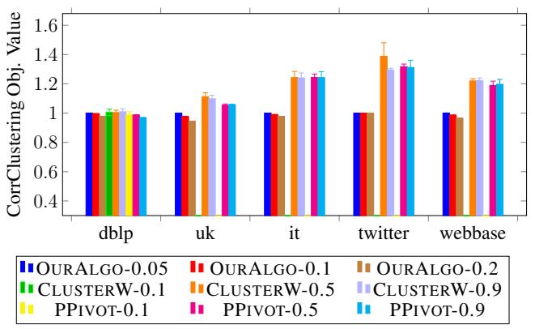
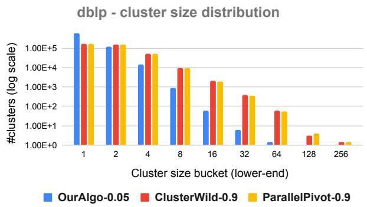
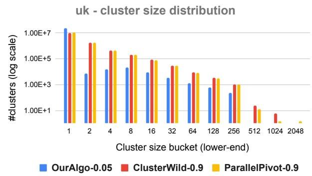
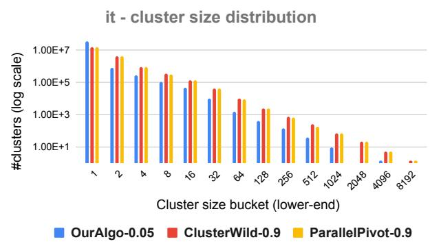
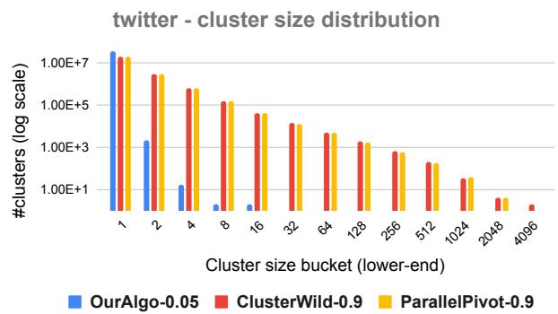
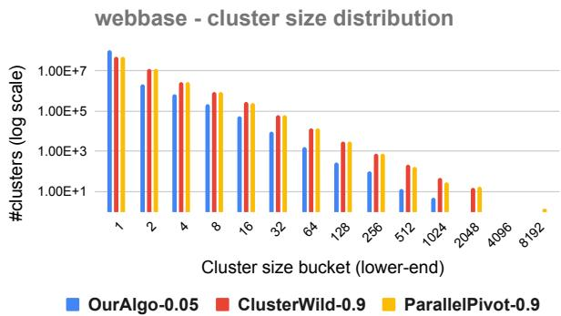

# Correlation Clustering in Constant Many Parallel Rounds

Vincent Cohen-Addad 1 Silvio Lattanzi 1 Slobodan Mitrovic´ 2 Ashkan Norouzi-Fard 1 Nikos Parotsidis 1 Jakub Tarnawski 3

# Abstract

Correlation clustering is a central topic in unsupervised learning, with many applications in ML and data mining. In correlation clustering, one receives as input a signed graph and the goal is to partition it to minimize the number of disagreements. In this work we propose a massively parallel computation (MPC) algorithm for this problem that is considerably faster than prior work. In particular, our algorithm uses machines with memory sublinear in the number of nodes in the graph and returns a constant approximation while running only for a constant number of rounds. To the best of our knowledge, our algorithm is the first that can provably approximate a clustering problem on graphs using only a constant number of MPC rounds in the sublinear memory regime. We complement our analysis with an experimental analysis of our techniques.

# 1. Introduction

Clustering is a classic problem in machine learning. The goal of clustering is to partition a given set of objects into sets so that objects in the same cluster are similar to each other while objects in different clusters are dissimilar. One of the most studied formulations of this problem is correlation clustering. Thanks to its simple and natural formulation, this clustering variant has many applications in finding clustering ensembles (Bonchi et al., 2013), in duplicate detection (Arasu et al., 2009), community detection (Chen et al., 2012), disambiguation tasks (Kalashnikov et al., 2008), and automated labelling (Agrawal et al., 2009; Chakrabarti et al., 2008).

Correlation clustering was first formulated by Bansal et al. (2004). Formally, in this problem we are given as input a weighted graph with $n$ nodes, where positive edges represent similarities between nodes and negative edges represent dissimilarities between them. We are interested in clustering the nodes to minimize the sum of the weights of the negative edges contained inside any cluster plus the sum of positive edges crossing any two clusters. The problem is known to be NP-hard, and much attention has been paid to designing approximation algorithms for the minimization version of the problem, as well as for its complementary version where one is interested in maximizing agreement. In particular, for the most studied version of the problem, where the weights are restricted to be in $\{ - 1 , + 1 \}$ , a polynomial-time approximation scheme is known for the maximization version of the problem (Bansal et al., 2004) and a 2.06-approximation algorithm is known for its minimization version (Chawla et al., 2015). Furthermore, when weights are in $\{ - 1 , + 1 \}$ and the number of clusters is upper-bounded by $k$ , a polynomial-time approximation scheme is known also for the minimization version of the problem (Giotis & Guruswami, 2005). For arbitrary weights, we know a 0.7666-approximation algorithm for the maximization version of the problem (Charikar et al., 2005; Swamy, 2004) and an $O ( \log n )$ -approximation for the minimization version of the problem (Demaine et al., 2006).

One main drawback of classic solutions for correlation clustering is that they do not scale very well to very large networks. Thus, as the magnitude of available data grows, it becomes increasingly important to design efficient parallel algorithms for this problem. Unfortunately, obtaining such algorithms is often challenging because classic solutions to graph problems are inherently sequential, e.g., the algorithm is defined iteratively and in an adaptive manner. Concretely, a well-known and widely used algorithm for the unweighted minimization version of the problem requires solving a linear program or running a so-called Pivot algorithm (Ailon et al., 2008; Chawla et al., 2015). Designing an efficient parallel linear program solver, if one exists at all, is a major challenge. The Pivot algorithm is extremely elegant and simple: it starts by selecting a node uniformly at random in the graph; then it creates a cluster by clustering together the node with all

its positive neighbors; finally the algorithm recurs on the rest of the graph. Interestingly, this simple algorithm returns a 3-approximation to the minimization version of the problem when the weights are in $\{ - 1 , + 1 \}$ . However, despite its simplicity, it is quite challenging to parallelize this algorithm efficiently. A strong step in this direction was presented by Chierichetti et al. (2014), who show how to approximately parallelize the Pivot algorithm using $\begin{array} { r } { O \left( \frac { \log ^ { 2 } n } { \epsilon } \right) } \end{array}$ parallel rounds to obtain a $( 3 + \epsilon ) -$ approximation for the problem. In a subsequent work, Ahn et al. (2015) present a nice result for the semi-streaming setting, which can be adapted to provide a 3-approximation by running $O \left( \log \log n \right)$ rounds and using ${ \tilde { O } } ( n )$ memory per machine. In another related work, Pan et al. (2015) propose a new algorithm that runs in $O \left( \frac { \log n \log \Delta } { \epsilon } \right)$ rounds (where $\Delta$ is the maximum positive degree) and obtain very nice experimental results. In a recent work, when the memory per machine is $o ( n )$ , (Cambus et al., 2021) show how to construct a 3-approximate (in expectation) correlation clustering in graphs of arboricity $\lambda$ in $O ( \log \lambda \cdot \mathrm { p o l y } ( \log \log n ) )$ rounds. A natural important question has thus been: Is it possible to approximate unweighted minimum disagreement in $o ( \log n )$ many rounds with $o ( n )$ memory per machine? In this paper we answer this question affirmatively. Moreover, we design an algorithm that requires only $O ( 1 )$ rounds, thus improving on the existing approaches in regimes of both ${ \tilde { O } } ( n )$ and $o ( n )$ memory per machine. Next, we discuss the precise model of parallelism that we use in this work.

The MPC model. We design algorithms for the massively parallel computation (MPC) model, which is a theoretical abstraction of real-world parallel systems such as MapReduce (Dean & Ghemawat, 2008), Hadoop (White, 2012), Spark (Zaharia et al., 2010) and Dryad (Isard et al., 2007). The MPC model (Karloff et al., 2010; Goodrich et al., 2011; Beame et al., 2013) is widely used as the de-facto standard theoretical model for large-scale parallel computing.

In the MPC model, computation proceeds in synchronous parallel rounds over multiple machines. Each machine has memory $S$ . At the beginning of the computation, data is arbitrarily partitioned across the machines. During each round, machines process data locally. At the end of a round, machines exchange messages, with the restriction that each machine is allowed to send messages and receive messages of total size $S$ . The efficiency of an algorithm in this model is measured by the number of rounds it takes for the algorithm to terminate and by the size $S$ of the memory of every machine. In this paper we focus on the most practical and challenging regime, also known as the sublinear regime, where each machine has memory $S = O ( n ^ { \delta } )$ where $\delta$ is an arbitrary constant smaller than 1.

Our contribution. Our main contribution is to present a constant-factor approximation algorithm for the minimization problem when the weights are in $\{ - 1 , + 1 \}$ . Our new algorithm runs using only a constant number of rounds in the sublinear regime.

Theorem 1.1. For any constant $\delta > 0$ , there exists an MPC algorithm that, given a signed graph $G = ( V , E ^ { + } )$ , where $E ^ { + }$ denotes the set of edges with weight $+ l$ , in $O ( 1 )$ rounds computes a $O ( 1 )$ -approximate correlation clustering. Letting $n = | V |$ , this algorithm succeeds with probability at least $1 - 1 / n$ and requires $O ( n ^ { \delta } )$ memory per machine. Moreover, the algorithm uses a total memory of $O ( | E ^ { + } | \cdot \log n )$ .

To the best of our knowledge, this is the first MPC graph clustering algorithm that runs in a constant number of rounds in the sublinear regime. Furthermore, we also show that our algorithms extend to the semi-streaming setting. In particular, in this setting, our algorithm outputs an $O ( 1 )$ -approximate correlation clustering in only $O ( 1 )$ passes over the stream. In terms of the number of passes, this significantly improves on the 3-approximate algorithm by (Ahn et al., 2015), which requires $O ( \log \log n )$ passes.

Theorem 1.2. There exists a semi-streaming algorithm that, given a signed graph $G = ( V , E ^ { + } )$ , where $E ^ { + }$ denotes the set of edges with weight $+ l$ , in $O ( 1 )$ passes computes a $O ( 1 )$ -approximate correlation clustering. Letting $n = | V |$ , this algorithm succeeds with probability at least $1 - 1 / n$ .

We complement our theoretical results with an empirical analysis showing that our MPC algorithm is significantly faster than previously known algorithms (Chierichetti et al., 2014; Pan et al., 2015). Furthermore, despite its theoretical approximation guarantees being inferior to previous work, in our experiments the quality of the solution is better. We explain this as follows: (1) all clusters returned by our algorithm are guaranteed to be very dense, as opposed to the pivot-based algorithms, where formed clusters might be sparse, and (2) the similarities between our algorithm and existing heuristics for clustering that are known to work very well in practice (Xu et al., 2007).

Techniques and Roadmap. In contrast to previous known parallel algorithms (Chierichetti et al., 2014; Ahn et al., 2015; Pan et al., 2015), our algorithm is not based on a parallel adaptation of the Pivot algorithm. Instead, we study structural properties of correlation clustering. We show that, up to losing a constant factor in the quality of the solution, one can simply

focus on clusters consisting of points whose neighborhoods are almost identical (up to a small multiplicative factor); we call such points “in agreement” and focus on clusters of such points. The next key idea is to trim the input graph so as to only keep edges between some specific points in agreement (intuitively, the points that are in agreement with many of their neighbors), so that clusters of points in agreement correspond to connected components in this trimmed graph. We show how all the above operations can be performed in few rounds. Finally, it remains to simply compute the connected components of the trimmed graph to obtain the final clusters. Here we prove an important feature of the trimmed graph: Each connected component has constant diameter. This ensures that this last step can indeed be performed in few parallel rounds.

In Section 3 we present our algorithm, then in Section 3.1 we present its analysis and in Section 3.2 its MPC implementation. In Section 3.3 we show how to extend these ideas to the semi-streaming setting. Finally we present our experimental results in Section 4.

# 2. Preliminaries

In this paper, we study the min-disagree variant of correlation clustering in the “complete graph case”, where we are given a complete graph and each edge is labeled with either $- 1$ or $+ 1$ : $E ^ { + }$ and $E ^ { - }$ respectively denote the set of edges labeled $+ 1$ and $- 1$ . The goal is to find a partition $C _ { 1 } , \ldots , C _ { t }$ of the vertices of the graph that minimizes the following objective:

$$
f(C_{1},\ldots ,C_{t}) = \sum_{\substack{\{u,v\} \in E^{+}:\\ u\in C_{i},v\in C_{j},i\neq j}}1 + \sum_{\substack{\{u,v\} \in E^{-}:\\ u,v\in C_{i}}}1.
$$

Notation. In our analysis and discussion, instead of working with a signed graph $( V , E ^ { + } , E ^ { - } )$ , we work with an unweighted undirected graph $G = ( V , E )$ , where $E$ refers to $E ^ { + }$ . Therefore, by this convention, $E ^ { - } = \binom { V } { 2 } \backslash E$ . In addition, when we say that two vertices $u$ and $v$ are neighbors, we mean that $\{ u , v \} \in E = E ^ { + }$ .

We use some standard notation that we briefly recall here. For a vertex $v \in V$ , we refer to its neighborhood by $N ( v )$ and to its degree by $d ( v )$ ; we further let $N ( v , H )$ denote the neighborhood of $v$ in a subgraph $H$ of $G$ . We also consider the degree of a vertex $v$ induced on an arbitrary subset $S \subseteq V$ of nodes and we denote it by $d ( v , S )$ . We also refer to the hop-distance between two vertices $u , v \in V$ by $\operatorname { d i s t } ^ { G } ( u , v )$ . We consider the hop distance also in subgraphs $\widetilde { G }$ of $G$ , in which case we denote the distance by $\mathrm { d i s t } ^ { \widetilde { G } } ( u , v )$ . Finally for any two sets $R , S$ , we denote their symmetric difference by $R \triangle S$ .

Remark 2.1. We assume that each vertex has a self-loop “+” edge. Note that this does not affect the cost of clustering, as a self-loop is never cut by a clustering. Note that this assumption implies that $v \in N ( v )$ .

# 3. Algorithm

The starting point of our approach is the notion of agreement between vertices. Informally, we say that $u$ and $v$ are in agreement when their neighborhoods significantly overlap. Intuitively, in such scenario, we expect $u$ and $v$ to be treated equally by an algorithm: either $u$ and $v$ are in the same cluster, or both of them form singleton clusters.

Our algorithms are parametrized by two constants $\beta$ , $\lambda$ that will be determined later.

Definition 3.1 (Weak Agreement). Two vertices $u$ and $v$ are in $i$ -weak agreement if $| N ( u ) \triangle N ( v ) | \quad < \quad i \beta$ · $\operatorname* { m a x } \{ | N ( u ) | , | N ( v ) | \}$ . If u and v are in 1-weak agreement, we also say that u and v are in agreement.

Having the agreement notion in hand, we provide our approach in Algorithm 1.

# Algorithm 1 Correlation-Clustering(G)

1: Discard all edges whose endpoints are not in agreement. (First compute the set of these edges. Then remove this set.)   
2: Call a vertex light if it has lost more than a $\lambda$ -fraction of its neighbors in the previous step. Otherwise call it heavy.   
3: Discard all edges between two light vertices.   
4: Call the current graph $\widetilde { G }$ , or the sparsified graph. Compute its connected components, and output them as the solution.

# 3.1. Analysis

Our analysis consists of two main parts. The first part consists of analyzing properties of $\widetilde { G }$ and, in particular, showing that each connected component of $\widetilde { G }$ has $O ( 1 )$ diameter, with all vertices being in $O ( 1 )$ -weak agreement. The second part shows that the number of edges removed in Lines 1-3 of Algorithm 1 is only a constant factor larger than the cost an optimal solution.

# 3.1.1. PROPERTIES OF $\widetilde { G }$

Our analysis hinges on several properties of vertices being in weak agreement. We start by stating those properties.

Fact 3.2. Suppose that $\beta < \frac { 1 } { 2 0 }$

(1) If u and v are in i-weak agreement, for some $1 \leq i < { \frac { 1 } { \beta } }$ , then

$$
(1 - \beta i) d (u) \leq d (v) \leq \frac {d (u)}{1 - i \beta}.
$$

(2) Let $k \in \{ 2 , 3 , 4 , 5 \}$ and $v _ { 1 } , \dotsc , v _ { k } \in V$ be a sequence of vertices such that $v _ { i }$ is in agreement with $v _ { i + 1 }$ for $i =$ $1 , \ldots , k - 1$ . Then $v _ { 1 }$ and $v _ { k }$ are in $k$ -weak agreement.   
(3) If u and v are in $i$ -weak agreement, for some $1 \leq i < { \frac { 1 } { \beta } }$ , then $| N ( v ) \cap N ( u ) | \geq ( 1 - i \beta ) d ( v ) .$ .

Proof. (1) Without loss of generality, assume that $d ( u ) \leq d ( v )$ . We have $| N ( u ) \triangle N ( v ) | \geq d ( v ) - d ( u )$ . Then, by Definition 3.1, $d ( v ) - d ( u ) \leq | N ( u ) \triangle N ( v ) | \leq i \beta \cdot d ( v )$ . This now implies $d ( u ) \geq ( 1 - i \beta ) d ( v )$ , as desired.

(2) For $i = 1 , . . . , k - 1$ we have by (1):

$$
d (v _ {i}) \leq \frac {d (v _ {i + 1})}{1 - \beta} \leq \dots \leq \frac {d (v _ {k})}{(1 - \beta) ^ {k - i}} \leq \frac {d (v _ {k})}{(1 - \beta) ^ {4}} \leq \frac {k}{k - 1} \cdot d (v _ {k}),
$$

since $\begin{array} { r } { ( 1 - \beta ) ^ { 4 } \ge ( 1 - \frac { 1 } { 2 0 } ) ^ { 4 } > \frac { 4 } { 5 } \ge \frac { k - 1 } { k } } \end{array}$ . Now we iterate the triangle inequality:

$$
\begin{array}{l} | N (v _ {1}) \triangle N (v _ {k}) | \leq \sum_ {i = 1} ^ {k - 1} | N (v _ {i}) \triangle N (v _ {i + 1}) | \\ <   \sum_ {i = 1} ^ {k - 1} \beta \cdot \max  (d (v _ {i}), d (v _ {i + 1})) \\ \leq (k - 1) \cdot \beta \cdot \frac {k}{k - 1} \cdot d \left(v _ {k}\right) \\ \leq k \cdot \beta \cdot \max  (d (v _ {1}), d (v _ {k})). \\ \end{array}
$$

(3) Without loss of generality, assume that $d ( u ) \leq d ( v )$ . Then

$$
\begin{array}{l} | N (u) \cap N (v) | = | N (v) | - | N (v) \setminus N (u) | \\ \geq | N (v) | - | N (u) \triangle N (v) | \\ \geq (1 - i \beta) d (v). \\ \end{array}
$$

By building on these claims, we are able to show that $\widetilde { G }$ has a very convenient structure: each of its connected components has diameter of only at most 4; and every two vertices (one of them being heavy) in a connected component of $\tilde { G }$ are in 4-weak agreement. More formally, we have:

Lemma 3.3. Suppose that $5 \beta + 2 \lambda < 1$ . Let CC be a connected component of $\widetilde { G }$ . Then, for every $u , v \in C C$ :

(a) if u and v are heavy, then $\mathrm { d i s t } ^ { \widetilde { G } } ( u , v ) \le 2$   
(b) $\mathrm { d i s t } ^ { \widetilde { G } } ( u , v ) \le 4 ,$

(c) $\mathrm { d i s t } ^ { G } ( u , v ) \leq 2 ,$ ,   
(d) if u or $v$ is heavy, then u and v are in 4-weak agreement.

Proof. For (a), suppose by contradiction that there are heavy $u , v \in C C$ with $\mathrm { d i s t } ^ { \widetilde { G } } ( u , v ) > 2$ ; pick such $u , v$ with minimum $\mathrm { d i s t } ^ { \widetilde { G } } ( u , v )$ . If $\mathrm { d i s t } ^ { \widetilde { G } } ( u , v ) \ge 5$ , let $P = \langle u , u ^ { \prime } , u ^ { \prime \prime } , . . . , v \rangle$ be a shortest u-v path in $\widetilde { G }$ ; since there are no edges in $\widetilde { G }$ with both endpoints being light, either $u ^ { \prime }$ or $u ^ { \prime \prime }$ must be heavy, and the pair $( u ^ { \prime } , v )$ or $( u ^ { \prime \prime } , v )$ contradicts the minimality of the path $( u , v )$ (as we have $\mathrm { d i s t } ^ { \widetilde { G } } ( u ^ { \prime \prime } , v ) > 2 )$ .

On the other hand, if $\mathrm { d i s t } ^ { \widetilde { G } } ( u , v ) \le 4$ , then by Fact 3.2 (2) $u$ and $v$ are in 5-weak agreement, and by Fact 3.2 (3) we have $| N ( u ) \cap N ( v ) | \geq ( 1 - 5 \beta ) d ( v )$ . Note that a heavy vertex can lose at most a $\lambda$ fraction of its neighbors in $G$ in Line 1 of the algorithm, and it loses no neighbors in Line 3; thus $| N ( v ) \setminus N ^ { \widetilde { G } } ( v ) | \leq \lambda d ( v )$ and similarly for $u$ . Assume without loss of generality that $d ( v ) \geq d ( u )$ . Then we have

$$
| N ^ {\widetilde {G}} (u) \cap N ^ {\widetilde {G}} (v) | \geq | N (u) \cap N (v) | - | N (u) \setminus N ^ {\widetilde {G}} (u) | - | N (v) \setminus N ^ {\widetilde {G}} (v) | \geq (1 - 5 \beta - 2 \lambda) d (v) > 0,
$$

i.e., $u$ and $v$ have a common neighbor in $\widetilde { G }$ , and thus, $\mathrm { d i s t } ^ { \widetilde { G } } ( u , v ) \le 2$ .

For (b), let $P$ be a shortest u-v path in $\widetilde { G }$ . Define the vertex $u ^ { \prime }$ to be $u$ if $u$ is heavy and to be $u$ ’s neighbor on $P$ if $u$ is light; in the latter case, $u ^ { \prime }$ is heavy since there are no edges in $\widetilde { G }$ with both endpoints being light. Define $v ^ { \prime }$ similarly. Since $u ^ { \prime }$ and $v ^ { \prime }$ are heavy, we have $\mathrm { d i s t } ^ { \tilde { G } } ( u , v ) \leq 1 + \mathrm { d i s t } ^ { \tilde { G } } ( \bar { u ^ { \prime } } , v ^ { \prime } ) + 1 \leq 4 .$

For (c), note that by (b) and Fact 3.2 (2), $u$ and $v$ are in 5-weak agreement; by Fact 3.2 (3), they have at least $( 1 - 5 \beta ) d ( v ) > 0$ common neighbors in $G$ .

To prove (d), we proceed similarly as for (b). We consider two cases: both $u$ and $v$ are heavy; only one $u$ or $v$ is heavy. In the first case, by (a) and Fact 3.2 (2) we even have that $u$ and $v$ are in 3-weak agreement. In the second case, one of the vertices is light; without loss of generality, assume $u$ is light. In that case, $u$ is adjacent to a heavy vertex $u ^ { \prime }$ , as there are no edges between light vertices. Since by (a) $v$ and $u ^ { \prime }$ are at distance 2, it implies that $v$ and $u$ are at distance 3. Since each edge $( x , y )$ in $C C$ means that $x$ and $y$ are in agreement, by Fact 3.2 (2) we have that $v$ and $u$ are in 4-weak agreement.

We now illustrate how to apply Lemma 3.3 to show further helpful properties of connected components of $\widetilde { G }$ . First, observe that a non-trivial connected component $C C$ of $\widetilde { G }$ (i.e., one consisting of at least two vertices) has at least one heavy vertex. (As a reminder, heavy vertices are defined on Line 2 of Algorithm 1.) Indeed, any edge in $\widetilde { G }$ has at least one heavy endpoint, as assured by Line 3 of Algorithm 1. Let $x$ be such a heavy vertex. Then, by Property (d) of Lemma 3.3 we have that every other vertex in $C C$ shares a large number of neighbors with $x$ . One can turn this property into a claim stating that all vertices in $C C$ have induced degree inside $C C$ very close to $| C C |$ . Formally:

Lemma 3.4. Let CC be a connected component of $\widetilde { G }$ such that $| C C | \ge 2$ . Then, for each vertex $u \in C C$ we have that

$$
d (u, C C) \geq (1 - 8 \beta - \lambda) | C C |.
$$

(Note that $d ( u , C C )$ in Lemma 3.4 is defined with respect to the edges appearing in $G$ .)

Proof. Assume that $C C$ is a non-trivial connected component, i.e., $C C$ has at least two vertices. Let $x$ be a heavy vertex in $C C$ . Observe that such a vertex $x$ always exists by the construction of our algorithm – edges having both light endpoints are removed in Line 3 of Algorithm 1.

Remark: While $C C$ refers to a connected component in the sparsified graph $\widetilde { G }$ , note that $N ( \cdot )$ and $d ( \cdot )$ refer to neighborhood and degree functions with respect to the input graph $G$ rather than with respect to $\widetilde { G }$ .

First, from Lemma 3.3 (d), we have that any two vertices in $C C$ , one of which is heavy, are in 4-weak agreement. In particular, this also holds for $x$ and any other vertex $u \in C C$ . As defined in Section 2, recall that $N ( x , C C ) \stackrel { \mathrm { d e f } } { = } N ( x ) \cap C C$ . Since $x$ is a heavy vertex, it has at most a $\lambda$ -fraction of its neighbors $N ( x )$ outside $C C$ , and so from Fact 3.2 (3) we have

$$
| N (x, C C) \cap N (u) | \geq (1 - 4 \beta) d (x) - \lambda d (x) = (1 - 4 \beta - \lambda) d (x). \tag {1}
$$

Observe that this also implies

$$
| N (u, C C) | \geq (1 - 4 \beta - \lambda) d (x). \tag {2}
$$

Next, we want to upper-bound the number of vertices in $C C \setminus N ( x )$ , which will enable us to express $| C C |$ as a function of $d ( x )$ . To that end, note that Equation (1) implies a lower bound on the number of edges between the neighbors of $x$ in $C C$ , denoted by $N ( x , C C )$ , and the vertices in $C C$ other than $N ( x )$ , denoted by $C C \setminus N ( x )$ , as follows:

$$
\left| E \left(N (x, C C), C C \setminus N (x)\right) \right| \geq \left| C C \setminus N (x) \right| \cdot (1 - 4 \beta - \lambda) d (x), \tag {3}
$$

where $E ( Y , Z )$ is the set of edges between sets $Y$ and $Z$ . On the other hand, since $\begin{array} { r } { d ( u ) \leq \frac { d ( x ) } { 1 - 4 \beta } } \end{array}$ for each $u \in C C$ by Fact 3.2 (1) and since $u$ and $x$ are in 4-weak agreement, we have that $u$ has at most $4 \beta \frac { d ( x ) } { 1 - 4 \beta }$ neighbors outside $N ( x )$ . Hence, we derive

$$
| E (N (x, C C), C C \setminus N (x)) | \leq | N (x, C C) | \cdot \frac {4 \beta d (x)}{1 - 4 \beta} \leq d (x) \cdot \frac {4 \beta d (x)}{1 - 4 \beta}.
$$

Combining the last inequality with Equation (3) yields

$$
| C C \setminus N (x)) | \leq \frac {4 \beta d (x)}{(1 - 4 \beta) \cdot (1 - 4 \beta - \lambda)} \leq \frac {4 \beta d (x)}{1 - 8 \beta - \lambda},
$$

which further implies

$$
| C C | = | C C \setminus N (x) | + | N (x, C C) | \leq \left(1 + \frac {4 \beta}{1 - 8 \beta - \lambda}\right) d (x) = \frac {1 - 4 \beta - \lambda}{1 - 8 \beta - \lambda} d (x).
$$

Now together with Equation (2), we establish

$$
| N (u, C C) | \geq (1 - 8 \beta - \lambda) | C C |,
$$

as desired.

Building on Lemma 3.4 we can now show that it is not beneficial to split a connected component into smaller clusters. Intuitively, this is the case as each vertex in a connected component $C C$ has degree almost $| C C |$ , while splitting $C C$ into at least two clusters would force the smallest cluster (that has size at most $| C C | / 2 )$ to cut too many $" + "$ edges, while in $C C$ it has relatively few “-” edges.

Lemma 3.5. Let CC be a connected component in $\widetilde { G }$ . Assume that $8 \beta + \lambda \le 1 / 4$ . Then, the cost of keeping $C C$ as a cluster in $G$ is no larger than the cost of splitting $C C$ into two or more clusters.

Proof. Towards a contradiction, consider a split of $C C$ into $k \geq 2$ clusters $C _ { 1 } , \ldots , C _ { k }$ whose cost is less than the cost of keeping $C C$ as a single cluster. Moreover, consider the cheapest such split of $C C$ . Let $\delta \stackrel { \mathrm { d e f } } { = } 8 \beta + \lambda$ . We consider two cases: when each cluster in $\{ C _ { 1 } , \ldots , C _ { k } \}$ has size at most $( 1 - 2 \delta ) | C C |$ vertices, and the complement case.

It holds that $| C _ { i } | \le ( 1 - 2 \delta ) | C C |$ for each i. By Lemma 3.4, each vertex $v \in C _ { i }$ for each cluster $C _ { i }$ has at least $( 1 - \delta ) | C C | - | C _ { i } | \geq \delta | C C |$ neighbors in  by Lemma 3. $C C \backslash C _ { i }$ . Hence,s at most $C C$ in the described way cuts at least ges. Hence, it does not cost less to $\frac { \delta | C C | ^ { 2 } } { 2 } \stackrel {  } { \cdot } + \stackrel { \prime \prime }$ $C C$ $\frac { \delta | C C | } { 2 } ^ { 2 }$ $C C$ the described way.

There exists a cluster $C ^ { \star }$ such that $| C ^ { \star } | > ( 1 - 2 \delta ) | C C |$ . Let $C _ { i } \neq C ^ { \star }$ be one of the clusters $C C$ is split into. Clearly, we have $| C _ { i } | < 2 \delta | C C |$ . Since, by Lemma 3.4, each vertex $v \in C _ { i }$ has at least $( 1 - \delta ) | C C |$ “+” edges inside $C C$ , it implies that $v$ has more than $( 1 - 3 \delta ) | C C |$ “+” edges to $C ^ { \star }$ . On the other hand, there are at most $\delta | C C |$ “-” edges from $v$ to $C ^ { \star }$ . Hence, as long as $1 - 3 \delta \geq \delta$ , it implies that it is cheaper to merge $C ^ { \star }$ with $C _ { i }$ than to keep them split. This contradicts our assumption that the split into those $k$ clusters results in the minimum cost.

Observe that the condition $1 - 3 \delta \geq \delta$ is equivalent to $8 \beta + \lambda \le 1 / 4$ , which holds by our assumption.

Lemma 3.5 implies the following key insight.

Lemma 3.6. Let $G ^ { \prime }$ be a non-complete1 graph obtained from $G$ by removing any “+” edge $\{ u , v \}$ (i.e., changing it into a “neutral” edge) where u and v belong to different connected components of $\widetilde { G }$ . Then, our algorithm outputs a solution that is optimal for the instance $G ^ { \prime }$ .

Proof. It is suboptimal for a single cluster to contain vertices from different connected components; indeed, breaking such a cluster up into connected components would improve the objective function (all edges between connected components are negative). Therefore any optimal solution must either be equal to our solution or it should split some cluster in our solution. The claim follows, by Lemma 3.5, because subdividing a connected component of $G ^ { \prime }$ (equivalently of $\widetilde { G }$ ) does not improve the objective function. □

# 3.1.2. APPROXIMATION GUARANTEE

In our analysis we will consider a fixed optimal solution (of instance $G$ ), denoted by $\mathcal { O }$ , whose cost is denoted by OPT.

Recall that our algorithm returns a clustering that is optimal for $G ^ { \prime }$ (Lemma 3.6). Therefore to bound the approximation ratio of our solution we need to bound the cost in $G$ of an optimal clustering for $G ^ { \prime }$ . To do so, it is enough to bound the number of $" + "$ edges in $G$ that are absent from $G ^ { \prime }$ – and every such edge has been deleted by our algorithm. We have the following two lemmas. The main intuition behind their proofs is that when two vertices are not in agreement, or when a vertex is light, then there are many edges (or non-edges) in the 1-hop or 2-hop vicinity that $\mathcal { O }$ pays for. We can charge the deleted edges to them.

Lemma 3.7. The number of edges deleted in Line 1 of our algorithm that are not cut in $\mathcal { O }$ is at most $\frac { 2 } { \beta } \cdot \mathrm { O P T }$ .

Proof. Our proof is based on a charging argument. Each edge as in the statement will distribute fractional debt to edges (or non-edges) that $\mathcal { O }$ pays for, in such a way that (1) each edge as in the statement distributes debt worth at least 1 unit, and (2) each edge/non-edge that $\mathcal { O }$ pays for is assigned at most $\frac { 2 } { \beta }$ units of debt, (3) edges/non-edges that $\mathcal { O }$ does not pay for are assigned no debt.

Let $( u , v )$ be an edge as in the statement (its endpoints are not in agreement). That is, we have $\left| N ( u ) \triangle N ( v ) \right| >$ $\beta \cdot \operatorname* { m a x } ( d ( u ) , d ( v ) )$ , and $u , v$ belong to the same cluster in $\mathcal { O }$ . Then, for each $w \in | N ( u ) \triangle N ( v ) |$ , $\mathcal { O }$ pays for one of the edges/non-edges $( u , w )$ , $( v , w )$ . (If $w$ is in the same cluster as $u , v$ , then $\mathcal { O }$ pays for the one of $( u , w )$ , $( v , w )$ that is a non-edge; and vice versa). So $( u , v )$ can assign $\frac { 1 } { \beta \cdot \operatorname* { m a x } ( d ( u ) , d ( v ) ) }$ units of debt to that edge/non-edge. This way, properties (1) and (3) are clear.

We verify property (2). Fix an edge/non-edge $( a , b )$ that $\mathcal { O }$ pays for. It is only charged by adjacent edges. Each edge adjacent to $a$ , of which there are $d ( a )$ many, assigns at most $\scriptstyle { \frac { 1 } { \beta \cdot d ( a ) } }$ units of debt; this gives $\frac { 1 } { \beta }$ units in total. The same holds for edges adjacent to $b$ ; together this yields $\frac { 2 } { \beta }$ units. □

Lemma 3.8. The number of edges deleted in Line 3 of our algorithm that are not cut in $\mathcal { O }$ is at most $\begin{array} { r } { \left( \frac { 1 } { \beta } + \frac { 1 } { \lambda } + \frac { 1 } { \beta \lambda } \right) . } \end{array}$ OPT.

Proof. We use a similar charging argument as in the proof of Lemma 3.7, with the difference that each edge/non-edge that $\mathcal { O }$ pays for will be assigned at most $\begin{array} { r } { \frac { 1 } { \beta } + \frac { 1 } { \lambda } + \frac { 1 } { \beta \lambda } } \end{array}$ units of debt (rather than at most $\frac { 2 } { \beta } .$ ).

Let $( u , v )$ be an edge as in the statement. For each endpoint $y \in \{ u , v \}$ , we proceed as follows. As $y$ is light, there are edges $( y , v _ { 1 } ) , . . . , ( y , v _ { \lambda \cdot d ( y ) } )$ whose endpoints are not in agreement. For each $i = 1 , . . . , \lambda \cdot d ( y )$ , proceed as follows:

• If $( y , v _ { i } )$ is not cut by $\mathcal { O }$ , then, as in the proof of Lemma 3.7, $( y , v _ { i } )$ has at least $\beta \cdot \operatorname* { m a x } ( d ( y ) , d ( v _ { i } ) )$ adjacent edges/non-edges for whom $\mathcal { O }$ pays. Each of these edges/non-edges is of the form $( v _ { i } , w )$ or $( y , w )$ . We will have the edge (u, v) charge 12βλd(vi)d(y) $( u , v )$ $\frac { 1 } { 2 \beta \lambda d ( v _ { i } ) d ( y ) }$ units of debt, which we will call blue debt, to the former ones (those of the form $( v _ { i } , w ) )$ , and $\frac { 1 } { 2 \beta \lambda d ( y ) ^ { 2 } }$ units of debt, which we will call red debt, to the latter ones (those of the form $( y , w )$ ).2   
• If $( y , v _ { i } )$ is cut by $\mathcal { O }$ , then $\mathcal { O }$ pays for $( y , v _ { i } )$ . We will have the edge $( u , v )$ charge $\frac { 1 } { 2 \lambda d ( y ) }$ units of debt, which we will call green debt, to $( y , v _ { i } )$ .

Let us verify property (1). In the first case, each of these edges/non-edges is charged at least 12βλd(y) max(d(y),d(vi)) $\frac { 1 } { 2 \beta \lambda d ( y ) \operatorname* { m a x } ( d ( y ) , d ( v _ { i } ) ) }$ units of debt, and since there are at least β · max(d(y), d(vi)) of them, the total (blue or red) debt charged is at least 12λd(y) $\beta \cdot \operatorname* { m a x } ( d ( y ) , d ( v _ { i } ) )$ $\frac { 1 } { 2 \lambda d ( y ) }$ per each $y \in \{ u , v \}$ and each $i = 1 , . . . , \lambda \cdot d ( y )$ . This much total (green) debt is also charged in the second case. Since there are 2 choices for $y$ and then $\lambda \cdot d ( y )$ choices for $i$ , in total the edge $( u , v )$ assigns at least 1 unit of debt. Property (3) is satisfied by design.

We are left with verifying property (2). Fix an edge/non-edge $( a , b )$ that $\mathcal { O }$ pays for. It can be charged by its adjacent edges (red or green debt), as well as those at distance two (blue debt). Let us consider these cases separately.

Adjacent edges (red/green debt): let us first look at edges adjacent to $a$ (we will get half of the final charge this way). That is, $a$ is serving the role of $y$ above; it can serve that role for at most $d ( a )$ debt-charging edges (serving the role of $( u , v )$ , where $a = y \in \{ u , v \} )$ .

• Red debt: each of these debt-charging edges charges $( a , b )$ at most $\lambda \cdot d ( a )$ times (once per $i = 1 , . . . , \lambda \cdot d ( y ) )$ ), and each charge is for $\frac { 1 } { 2 \beta \lambda d ( a ) ^ { 2 } }$ units of debt. This gives $\begin{array} { r } { \frac { 1 } { 2 \beta \lambda d ( a ) ^ { 2 } } \cdot \lambda d ( a ) \cdot d ( a ) = \frac { 1 } { 2 \beta } } \end{array}$ units of debt.   
• Green debt: each of these debt-charging edges charges $( a , b )$ at most once (if it happens that $( a , b ) = ( y , v _ { i } )$ for some i), and each charge is for $\frac { 1 } { 2 \lambda d ( a ) }$ units of debt. This gives $\frac { 1 } { 2 \lambda }$ units of debt.

We get the same amount from edges adjacent to $b$ $b$ serving the role of $y$ ). In total, we get a debt of $\textstyle { \frac { 1 } { \beta } } + { \frac { 1 } { \lambda } }$ .

Blue debt: $( a , b )$ is serving the role of $( v _ { i } , w )$ above. Let us first look at $a$ serving the role of $v _ { i }$ (we will get half of the final charge this way). Then a neighbor of $a$ must be serving the role of $y$ . There are at most $d ( a )$ possible $y$ ’s, and at most $d ( y )$ possible edges $( u , v )$ for each $y$ (those with $y \in \{ u , v \} )$ . Recall that each charge was for $\begin{array} { r } { \frac { 1 } { 2 \beta \lambda d ( v _ { i } ) d ( y ) } = \frac { 1 } { 2 \beta \lambda d ( a ) d ( y ) } } \end{array}$ b units of debt; per $y$ , this sums up (over edges $( u , v ) )$ to at most $\begin{array} { r } { \frac { 1 } { 2 \beta \lambda d ( a ) d ( y ) } \cdot d ( y ) = \frac { 1 } { 2 \beta \lambda d ( a ) } } \end{array}$ total units, and since there are at most $d ( a )$ many $y$ ’s, the total debt is at most $\frac { 1 } { 2 \beta \lambda }$ . We get the same amount from $b$ serving the role of $v _ { i }$ . In total, we get a debt of $\frac { 1 } { \beta \lambda }$ . □

Lemmas 3.6, 3.7, and 3.8 together imply that Algorithm 1 is a constant-factor approximation:

Theorem 3.9. Algorithm 1 is a constant-factor approximation.

Proof. Let $G ^ { \prime }$ be the (non-complete) graph as defined in Lemma 3.6. Observe that the clusters that our algorithm outputs are exactly the connected components of $G ^ { \prime }$ . Let $D = E ^ { + } ( G ) \setminus E ^ { + } ( G ^ { \prime } )$ be the set of edges in $G$ that go between different connected components of $G ^ { \prime }$ (equivalently, of $\widetilde { G }$ ). Further, recall that $\mathcal { O }$ is a fixed optimal solution for instance $G$ .

The main idea of our proof is to look at the costs of $\mathcal { O }$ and of our solution in the instance $G ^ { \prime }$ , for which our solution is optimal. The cost of any solution differs between the two instances $G$ and $G ^ { \prime }$ by at most $| D |$ , which is at most the number of edges deleted by our algorithm. So, we can pay $| D |$ to move from $G ^ { \prime }$ to $G$ . On the other hand, any solution is no more expensive in $G ^ { \prime }$ than it is in $G$ . That is, for any solution $X$ we have

$$
\operatorname {c o s t} _ {G ^ {\prime}} (X) \leq \operatorname {c o s t} _ {G} (X) \leq | D | + \operatorname {c o s t} _ {G ^ {\prime}} (X).
$$

Denote the solution returned by Algorithm 1 by OUR. Lemma 3.6 states that it is optimal for $G ^ { \prime }$ . That is, $\mathrm { c o s t } _ { G ^ { \prime } } ( \mathrm { O U R } ) \leq$ $\cos t _ { G ^ { \prime } } ( \mathcal { O } )$ . Thus we have

$$
\begin{array}{l} \operatorname {c o s t} _ {G} (\mathrm {O U R}) \leq | D | + \operatorname {c o s t} _ {G ^ {\prime}} (\mathrm {O U R}) \\ \leq | D | + \operatorname {c o s t} _ {G ^ {\prime}} (\mathcal {O}) \\ \leq | D | + \operatorname {c o s t} _ {G} (\mathcal {O}) \\ = | D | + \mathrm {O P T}. \\ \end{array}
$$

Finally, note that $| D |$ is at most the number of edges deleted by our algorithm (since any edge of $G$ that goes between different connected components of $\widetilde { G }$ must necessarily have been deleted by our algorithm). The latter can be upper-bounded, using Lemmas 3.7 and 3.8, by $\begin{array} { r } { \mathrm { O P T } + \frac { 2 } { \beta } \cdot \mathrm { O P T } + \left( \frac { 1 } { \beta } + \frac { 1 } { \lambda } + \frac { 1 } { \beta \lambda } \right) } \end{array}$ · OPT. In total, we get a $\begin{array} { r } { \left( 2 + \frac { 3 } { \beta } + \frac { 1 } { \lambda } + \frac { 1 } { \beta \lambda } \right) } \end{array}$ -approximation.

We note that in our analysis we do not optimize for a constant; nevertheless we now present a precise upper bound on the approximation ratio by providing a setting for the constants $\beta$ and $\lambda$ . We also note that despite the large theoretical approximation ratio, our algorithm works very well in practice.

Recall that Lemma 3.3 requires that $5 \beta + 2 \lambda < 1$ , and Lemma 3.5 requires $8 \beta + \lambda \leq { \frac { 1 } { 4 } }$ , the latter condition being stronger. Also, Fact 3.2 requires $\beta < \frac { 1 } { 2 0 }$ (which is also implied by the above). Thus we can set, e.g., $\beta = \lambda = \textstyle { \frac { 1 } { 3 6 } }$ . Then the above

proof of Theorem 3.9 gives a 1442-approximation guarantee. A more optimized setting of constants is $\beta \approx 0 . 0 1 7 6$ and $\lambda \approx 0 . 1 0 8 5$ , which gives an approximation ratio $\approx 7 0 1$ .

Finally, we have the following:

Remark 3.10. For fixed values of $\beta$ and $\lambda ,$ , the above analysis is tight, in the sense that the term $\frac { 1 } { \beta \lambda }$ is necessary.

Proof. Let us assume for simplicity that $\beta = \lambda$ ; otherwise the example can be adapted. Consider the following instance: two disjoint cliques $A _ { 1 }$ , $A _ { 2 }$ of size $( 1 - \beta ) d$ each, with a subset $X _ { 1 } \subseteq A _ { 1 }$ and a subset $X _ { 2 } \subseteq A _ { 2 }$ , both of size $\beta d .$ , fully connected to each other.

The optimal solution is to have two clusters ( $\cdot A _ { 1 }$ and $A _ { 2 }$ ). The cost is $( \beta d ) ^ { 2 }$ (cutting the edges between $X _ { 1 }$ and $X _ { 2 }$ ).

However, our algorithm will first delete the edges between $A _ { 1 } \setminus X _ { 1 }$ and $X _ { 1 }$ (any two vertices from these respective sets are not in agreement, as the $X _ { 1 }$ -vertex has $\beta d$ extra neighbors in $X _ { 2 }$ ), between $X _ { 1 }$ and $X _ { 2 }$ , and between $A _ { 2 } \setminus X _ { 2 }$ and $X _ { 2 }$ . 3 Then every vertex in the graph becomes light. Thus in Line 3 we delete all edges, making $\widetilde { G }$ an empty graph. Finally, we return the singleton partitioning as the solution. Its cost is $\begin{array} { r } { ( \beta d ) ^ { 2 } + 2 \cdot \binom { ( d ( 1 - \beta ) { \bar { ) } } ^ { 2 } } { 2 } \approx \biggr ( \frac { 1 } { \beta ^ { 2 } } - \frac { 2 } { \beta } + 2 \biggr ) \cdot \mathcal { C } } \end{array}$ OPT.

# 3.2. MPC Implementation of Algorithm 1

In this section we prove Theorem 1.1. The proof is divided into two parts: discussing the MPC implementation and proving the approximation ratio of the final algorithm. There are two main steps that we need to implement in the MPC model: for each edge $\{ u , v \}$ , we need to compute whether $u$ and $v$ are in an agreement (needed for Line 1); and to compute the connected components of $\widetilde { G }$ (Line 4). We separately describe how to implement these tasks. The approximation analysis is given in Section 3.2.3.

# 3.2.1. COMPUTING AGREEMENT

Let $e = \{ u , v \}$ be an edge in $G$ . To test whether $u$ and $v$ are in agreement, we need to compute how large $N ( v ) \triangle N ( u )$ (or how large $N ( u ) \cap N ( v ) )$ is (see Definition 3.1). However, it is not clear how to find $| N ( v ) \triangle N ( u ) |$ exactly for each edge $\{ u , v \} \in E$ while using total memory of $\widetilde { \mathcal { O } } ( | E | )$ . So, instead, we will approximate $| N ( v ) \triangle N ( u ) |$ and use this approximation to decide whether $u$ and $v$ are in agreement. In particular, $u$ and $v$ will sample a small fraction of their neighbors, i.e., of size $O ( ( \log n ) / \beta )$ , and then these samples will be used to approximate the similarity of their neighbourhoods. We now describe this procedure in more detail.

As the first step, we test whether $d ( u )$ and $d ( v )$ are within a factor $1 - \beta$ . If they are not, then by Fact 3.2 (1) $u$ and $v$ are not in agreement and hence we immediately remove the edge $\{ u , v \}$ from $G$ . Next, each vertex $v$ creates two vertex-samples. To do so, for each $j$ smaller or equal than $O ( ( \log n ) / \beta )$ we define the set $S ( j )$ as a subset of nodes obtained by sampling every node in the graph independently with probability mi $\mathbf { \lambda } _ { 1 } \left\{ \frac { a \log n } { \beta \cdot j } , 1 \right\}$ , where $a$ is a constant to be fixed later. Then we define $S ( v , j )$ for every node $v$ as $S ( v , j ) = S ( j ) \cap N ( v )$ and $j _ { v }$ to be the largest power of $1 / ( 1 - \beta )$ smaller or equal than $d ( v )$ . Then, each vertex $v$ keeps $S ( v , j _ { v } )$ and $S ( v , j _ { v } / ( 1 - \beta ) )$ . Note that by construction, for any two vertices $v$ and $u$ , we either have that $w \in S ( v , j )$ and $w \in S ( u , j )$ , or $w \not \in S ( v , j )$ and $w \not \in S ( u , j )$ . To implement this, each vertex $w$ will independently in parallel flip a coin to decide whether for a given $j$ it should be sampled or not.

Once we obtain the two samples, $v$ sends the samples together with information about its degree to each of its incident edges.4 After that, every edge $\{ u , v \}$ holds: $S ( v , j _ { v } )$ , $S ( v , j _ { v } / ( 1 - \beta ) )$ , $S ( u , j _ { u } )$ , and $S ( u , j _ { u } / ( 1 - \beta ) )$ . Without loss of generality assume $d ( u ) \geq d ( v )$ . Since we have that $d ( v ) / ( 1 - \beta ) \geq d ( u ) \geq d ( v )$ , then $j _ { v } = j _ { u }$ or $j _ { v } / ( 1 - \beta ) = j _ { u }$ . For the sake of brevity, let $j = j _ { u }$ . We now use $S ( v , j )$ and $S ( u , j )$ to estimate $| N ( v ) \triangle N ( u ) |$ .

Define a random variable $X _ { u , v }$ as

$$
X _ {u, v} \stackrel {\text {d e f}} {=} | S (v, j) \triangle S (u, j) |. \tag {4}
$$

In case $\begin{array} { r } { \frac { a \cdot \log n } { \beta \cdot j } \geq 1 } \end{array}$ , we have $X _ { u , v } = | N ( v ) \triangle N ( u ) |$ , which means we directly get the exact value of $| N ( v ) \triangle N ( u ) |$ . So

assume that $\begin{array} { r } { \frac { a \cdot \log n } { \beta \cdot j } < 1 } \end{array}$ . By linearity of expectation we have

$$
\mathbb {E} \left[ X _ {u, v} \right] = \frac {a \cdot \log n}{\beta \cdot j} | N (v) \triangle N (u) |.
$$

Hence, if $v$ and $u$ are in agreement, we have

$$
\mathbb {E} \left[ X _ {u, v} \right] \leq \frac {a \cdot \log n}{\beta \cdot j} \beta d (u) = \frac {a \cdot \log n}{j} d (u).
$$

Based on this, our algorithm for deciding whether $u$ and $v$ are in agreement is given as Algorithm 2.

Algorithm 2 Agreement $( u , v )$   
1: if $d(u)$ and $d(v)$ are not within factor $1 - \beta$ then  
2: Return "No"  
3: end if  
4: Let $\tau \stackrel{\mathrm{def}}{=} \frac{a \cdot \log n}{j} \cdot \max \{d(u), d(v)\}$ 5: if $X_{u,v} \leq 0.9 \cdot \tau$ then  
6: Return "Yes"  
7: end if  
8: Return "No"

We now show that with high probability for every two vertices $u$ and $v$ : if the algorithm returns “Yes”, then $u$ and $v$ are in an agreement; and, if $u$ and $v$ are in 0.8-weak agreement, then the algorithm returns “Yes”.

Lemma 3.11. For any constant $\delta > 0$ , there exists an MPC algorithm that, given a signed graph $G = ( V , E ^ { + } )$ , in $O ( 1 )$ rounds for all pairs of vertices $\{ u , v \} \in E ^ { + }$ outputs “Yes” if u and v are in 0.8-weak agreement, and outputs “No” if u and v are not in agreement. Letting $n = | V |$ , this algorithm succeeds with probability $1 - 1 / n$ , uses $n ^ { \delta }$ memory per machine, and uses a total memory of $\tilde { O } ( | E ^ { + } | )$ .

To prove Lemma 3.11, we will use the following well-known concentration inequalities.

Theorem 3.12 (Chernoff bound). Let $X _ { 1 } , \ldots , X _ { k }$ be independent random variables taking values in $[ 0 , 1 ]$ . Let $X \ { \stackrel { \mathrm { d e f } } { = } }$ $\textstyle \sum _ { i = 1 } ^ { k } X _ { i }$ . Then, the following inequalities hold:

(a) For any $\delta \in [ 0 , 1 ] i f \mathbb { E } \left[ X \right] \leq U$ $\delta \in [ 0 , 1 ]$ we have

$$
\mathbb {P} \left[ X \geq (1 + \delta) U \right] \leq \exp \left(- \delta^ {2} U / 3\right).
$$

(b) For any $\delta > 0$ if E [X ] ≥ U we have

$$
\mathbb {P} \left[ X \leq (1 - \delta) U \right] \leq \exp \left(- \delta^ {2} U / 2\right).
$$

Lemma 3.13. Let u and v be two vertices. If Algorithm 2 returns “Yes”, then for $a \geq 6 0 0$ with probability at least $\left( 1 - n ^ { - 3 } \right)$ it holds that u and v are in agreement. (Conversely, the algorithm outputs “No” with probability at least $( 1 - n ^ { - 3 } )$ if u and v are not in agreement.)

Proof. We now upper-bound the probability that $u$ and $v$ are not in agreement, but Algorithm 2 returns “Yes”.

Assume that $u$ and $v$ are not in agreement. Then

$$
\mathbb {E} \left[ X _ {u, v} \right] > \tau ,
$$

where $\tau$ is defined in Algorithm 2. (As a reminder, $X _ { u , v }$ is defined in Equation (4).) Algorithm 2 passes the test on Line 5 with probability

$$
\mathbb {P} \left[ X _ {u, v} \leq 0. 9 \tau \right] \stackrel {\text {T h e o r e m 3 . 1 2 (b)}} {\leq} \exp \left(- 1 / 1 0 0 \cdot \frac {a \cdot \log n}{2}\right),
$$

where we used that $d ( u ) / j \geq 1$ . For $a \geq 6 0 0$ , the last expression is upper-bounded by $n ^ { - 3 }$ .

Lemma 3.14. Let u and v be two vertices that are in 0.8-weak agreement. Then, for $a \geq 6 0 0$ with probability at least $( 1 - n ^ { - 3 } )$ Algorithm 2 outputs “Yes”.

Proof. We have

$$
\mathbb {E} \left[ X _ {u, v} \right] \leq 0. 8 \cdot \tau ,
$$

where $\tau$ is defined in Algorithm 2. Hence, Algorithm 2 outputs “No” with probability

$$
\mathbb {P} \left[ X _ {u, v} > 0. 9 \cdot \tau \right] \stackrel {\mathrm {T h e o r e m 3 . 1 2 (a)}} {\leq} \exp \left(- 1 / 6 4 \cdot \frac {a \cdot \log n}{3}\right),
$$

where we used that $d ( u ) / j \geq 1$ . For $a \geq 6 0 0$ , the last expression is upper-bounded by $n ^ { - 3 }$ .

Proof of Lemma 3.11. The implementation part follows by our discussion in Section 3.2 and by having $a = O ( 1 )$ . The claim on probability success follows by using Lemmas 3.13 and 3.14 and applying a union bound over all $| E ^ { + } | \le n ^ { 2 }$ pairs of vertices. □

# 3.2.2. COMPUTING CONNECTED COMPONENTS

We now turn to explaining how to compute connected components in $\widetilde { G }$ . Recall that, by Lemma 3.3, each connected component of $\widetilde { G }$ has diameter at most 4. We leverage this fact to design a simple algorithm that in $O ( 1 )$ rounds marks each connected component with a unique id, as follows.

# Algorithm 3 Connected-Components

1: Each vertex $v$ holds an $i d _ { v } ^ { i }$ , $i = 0 \dots 4$ . Let $i d _ { v } ^ { 0 } = v$   
2: for $i = 1 \dots 4$ do   
3: For each $v$ , we let $i d _ { v } ^ { i } = \operatorname* { m a x } _ { w \in N ( v ) } i d _ { w } ^ { i - 1 }$   
4: end for   
5: Return as a connected component all vertices $w$ that have the same $i d _ { w } ^ { 4 }$

Let $C C$ be a connected component of $\widetilde { G }$ , and let $v ^ { \star }$ be the vertex of $C C$ with the largest label (largest $i d ^ { 0 }$ ). Correctness of Algorithm 3 follows by simply noting that at the end of iteration $i$ all the vertices $x$ at distance at most $i$ from $v ^ { \star }$ will have $i d _ { x } ^ { i } = v ^ { \star }$ . Since $C C$ has diameter at most 4, it means all the vertices of $C C$ will have the same $i d ^ { 4 }$ .

# 3.2.3. APPROXIMATION ANALYSIS

Note that the approximation ratio is affected only by the fact that our algorithm now estimates agreement using Algorithm 2 as opposed to computing it exactly. That is, our MPC algorithm might return that two vertices are not in agreement while in fact they are. Nonetheless, it happens only for vertices which are not in 0.8-weak agreement, i.e., for vertices that are close to not being in agreement. This might only cause our algorithm to delete more edges; and the only part of our analysis that suffers from this are the approximation guarantees of Section 3.1.2. This can be easily fixed by replacing $\beta$ by $0 . 8 \cdot \beta$ . Then, Theorem 3.9 implies that using Algorithm 2 to test agreement between vertices still obtains an $O ( 1 )$ -approximation.

Now we are ready to prove our main theorem. We restate it for convenience.

Theorem 1.1. For any constant $\delta > 0$ , there exists an MPC algorithm that, given a signed graph $G = ( V , E ^ { + } )$ , where $E ^ { + }$ denotes the set of edges with weight $+ l$ , in $O ( 1 )$ rounds computes a $O ( 1 )$ -approximate correlation clustering. Letting $n = | V |$ , this algorithm succeeds with probability at least $1 - 1 / n$ and requires $O ( n ^ { \delta } )$ memory per machine. Moreover, the algorithm uses a total memory of $O ( | E ^ { + } | \cdot \log n )$ .

Proof. The bounds on the round complexity and memory usage follow directly from the reasoning in Sections 3.2.1 and 3.2.2 and by noticing that step 2 (determining which vertices are light) can be easily implemented in $O ( 1 )$ MPC rounds.

The approximation guarantees follow because even if we delete some additional edges from $\widetilde { G }$ that are in agreement but not in 0.8-weak agreement, we still obtain a constant-factor approximation as noted above. □

# 3.3. Semi-streaming Implementation

We now discuss how to implement our algorithm in the multi-pass semi-streaming setting, and effectively prove Theorem 1.2. In the classic streaming setting, edges of an input graph arrive one by one as a stream. For an $n$ -vertex graph, an algorithm in

  
Figure 1. The correlation clustering objective values for the different algorithms and configurations that we consider. The objective value of all the algorithms is normalized by dividing by the objective value of OurAlgo0.05 for the respective dataset.

this setting is allowed to use $O ( \log n ) $ memory. The semi-streaming setting is a relaxation of the streaming setting, in which an algorithm is allowed to use $O ( n \operatorname { p o l y } \log n )$ memory. We now describe how to implement each of our algorithms in the semi-streaming setting while making multiple passes over the stream. We remark that the order of edges presented in different passes can differ.

To implement Algorithm 2, we first fix $O ( \log n )$ random bits for each vertex $v$ and each relevant $j$ (recall that there are $O ( ( \log n ) / \beta )$ such $j$ values) needed to decide whether $v$ belongs to $S ( w , j _ { w } )$ , for some $w \in N ( v )$ .5 This is the same as we did in Section 3.2.1. Next, we make a single pass over the stream and collect $S ( v , j _ { v } )$ and $S ( v , j _ { v } / ( 1 - \beta ) )$ for each $v$ . After this, we are equipped with all we need to compute whether two endpoints of a given edge are in agreement or not.

Next, we make another pass and mark light vertices, where the notion of a light vertex is defined in Algorithm 1. Note that bookkeeping which vertices are light requires only $O ( n )$ space.

After these steps, in our memory we have (1) a mark for whether each vertex is light or not, and (2) a way to test whether two vertices are in agreement or not without the need to use any information from the stream. This implies that now, whenever an edge arrives on the stream, we can immediately decide whether it belongs to $\widetilde { G }$ or not. Hence, we have all the information needed to proceed to implementing Algorithm 3.

To implement Algorithm 3, we make 4 passes over the stream. In the $i$ -th pass, for each edge $\{ u , v \}$ on the stream that belongs to $\widetilde { G }$ we update $i d _ { v } ^ { i } = \operatorname* { m a x } \{ i d _ { v } ^ { i - 1 } , i d _ { u } ^ { i - 1 } \}$ and, similarly for $u$ , $i d _ { u } ^ { i } = \operatorname* { m a x } \{ i d _ { v } ^ { i - 1 } , i d _ { u } ^ { i - 1 } \}$ . Since $\widetilde { G }$ has diameter at most 4, this suffices to output the desired clusters of $\widetilde { G }$ .

This concludes our implementation of the semi-streaming algorithm.

# 4. Empirical Evaluation

Table 1. The datasets used in our experiments.   

<table><tr><td>Graph</td><td># vertices</td><td># edges</td></tr><tr><td>dblp-2011</td><td>986,324</td><td>6,707,236</td></tr><tr><td>uk-2005</td><td>39,459,925</td><td>921,345,078</td></tr><tr><td>it-2004</td><td>41,291,594</td><td>1,135,718,909</td></tr><tr><td>twitter-2010</td><td>41,652,230</td><td>1,468,365,182</td></tr><tr><td>webbase-2001</td><td>118,142,155</td><td>1,019,903,190</td></tr></table>

Datasets. To empirically analyze our algorithm compared to state-of-the-art parallel algorithms for correlation clustering, we considered a collection of two social networks and three web graphs. All our datasets were obtained from The Laboratory

Table 2. Average running times for the algorithms (with different parameters) that we consider. All times are reported relative to the execution time of OURALGO-0.05 on the dataset dblp, which is approximately 21 seconds. We use 10 machines.   

<table><tr><td></td><td colspan="3">OURALGO</td><td colspan="3">CLUSTERW</td><td colspan="3">PPIVOT</td></tr><tr><td>param. 
Dataset</td><td>0.05</td><td>0.1</td><td>0.2</td><td>0.1</td><td>0.5</td><td>0.9</td><td>0.1</td><td>0.5</td><td>0.9</td></tr><tr><td>dblp</td><td>1.0x</td><td>1.1x</td><td>1.0x</td><td>244.7x</td><td>41.2x</td><td>18.8x</td><td>1083.6x</td><td>119.5x</td><td>42.7x</td></tr><tr><td>uk</td><td>5.5x</td><td>6.5x</td><td>10.7x</td><td>-</td><td>445.5x</td><td>213.1x</td><td>-</td><td>490.8x</td><td>217.4x</td></tr><tr><td>it</td><td>10.5x</td><td>14.8x</td><td>12.4x</td><td>-</td><td>475.7x</td><td>290.8x</td><td>-</td><td>762.8x</td><td>274.9x</td></tr><tr><td>twitter</td><td>8.8x</td><td>15.5x</td><td>13.9x</td><td>-</td><td>837.5x</td><td>300.2x</td><td>-</td><td>730.2x</td><td>392.8x</td></tr><tr><td>webbase</td><td>13.0x</td><td>13.5x</td><td>14.6x</td><td>-</td><td>835.1x</td><td>436.8x</td><td>-</td><td>789.3x</td><td>458.1x</td></tr></table>

for Web Algorithmics6 (Boldi & Vigna, 2004; Boldi et al., 2011; 2004), and some of their statistics are summarized in Table 1. The dblp-2011 dataset is the DBLP co-authorship network from 2011, uk-2005 is a 2005 crawl of the .uk domain, it-2004 a 2004 crawl of the .it domain, twitter-2010 a 2010 crawl of twitter, and webbase-2001 is a 2001 crawl by the WebBase crawler. We converted all datasets to be undirected and removed parallel edges. The correlation clustering instance is formed by considering all present edges as “+” edges and all missing edges as “-” edges.

Algorithms and parameters. In our experiments we consider three algorithms: our algorithm from Section 3 (we refer to it as OURALGO), as well as the ClusterWild (CLUSTERW, in short) algorithm from Pan et al. (2015) and the ParallelPivot (PPIVOT, in short) from Chierichetti et al. (2014). CLUSTERW and PPIVOT admit a parameter $\epsilon$ , which affects the number of parallel rounds required to perform the computation, depending on the structure of the input graph. For PPIVOT,  also slightly affects the theoretical approximation guarantees (i.e., the approximation is $( 3 + \epsilon ) \ /$ ). We adopt the setting of $\epsilon$ from Pan et al. (2015), and use $\epsilon \in \{ 0 . 1 , 0 . 5 , 0 . 9 \}$ for both algorithms. Our algorithm has two parameters $\lambda , \beta$ which affect the approximation of the algorithm (see Lemma 3.7 and Lemma 3.8), but the number of rounds is independent of these parameters and is a fixed constant. For simplicity, we set $\lambda = \beta \in \{ 0 . 0 5 , 0 . 1 , 0 . 2 \}$ . To refer to an algorithm with a specific parameter, we append the parameter value to the algorithm name, e.g., we say OURALGO-0.05.

Implementation details. In all our experiments the vertices are randomly partitioned among machines (we note that no algorithm requires a fixed partitioning of the input vertices onto machines). We made a fair effort to implement all algorithms equally well, and we did not use any tricks or special data structures. For simplicity, we assume that the entire neighborhood of each vertex fits on a single machine (this is not required by any algorithm). Removing this assumption would increase the number of rounds of all algorithms by a constant factor and most likely would not significantly affect their relative running times.

Setup and methodology. We used 10 machines across all experiments (except for Section 4.3); this is enough for the machines to collectively fit the input graph in memory. We repeated all experiments 3 times, and we report relative average running times (wall-clock time), as a ratio of each measurement compared to the minimum average running time observed across our experiments. We did not use a dedicated system for our experiments. Executions that were running for an unreasonable amount of time (more than 72 hours) were stopped, and we report no data for such executions; these occurred only for CLUSTERW-0.1 and PPIVOT-0.1. We excluded the time that it takes to load the input graph into the memory, as this is unavoidable and uniform across all algorithms.

# 4.1. Results on quality

Figure 1 summarizes the results of our experiments in terms of solution quality, that is, the correlation clustering objective value of the solution computed by the algorithms that we consider. OURALGO consistently produces better solutions compared to the two competitor algorithms CLUSTERW and PPIVOT. In particular, for all datasets but dblp, CLUSTERW and PPIVOT produce solutions whose numbers of disagreements are more than $10 \%$ to $30 \%$ higher compared to the best solution produced by OURALGO. For dblp, our OURALGO is very comparable but slightly better than the baselines.

In terms of variance in the quality of the produced clustering between the different runs, OURALGO has negligible variance, which is natural given that the only source of randomness comes from identifying pairs of vertices that are in agreement. On the other hand, the behavior of CLUSTERW and PPIVOT is not as stable, in terms of the quality of the produced solution, as

Table 3. Average speedup achieved by OURALGO-0.05, for an increasing number of machines. The standard deviation of the running time, as a fraction of the running time, is presented in parentheses.   

<table><tr><td>#machines
Dataset</td><td>1</td><td>2</td><td>4</td><td>8</td><td>16</td></tr><tr><td>it</td><td>1x (±0.303)</td><td>2.392x (±0.032)</td><td>3.114x (±0.119)</td><td>4.823x (±0.266)</td><td>5.445x (±0.790)</td></tr><tr><td>twitter</td><td>1x (±0.149)</td><td>4.451x (±0.0151)</td><td>4.968x (±0.0803)</td><td>7.270x (±0.138)</td><td>5.479x (±0.338)</td></tr><tr><td>webbase</td><td>1x (±0.0618)</td><td>5.280x (±0.225)</td><td>4.441x (±0.166)</td><td>12.161x (±0.0110)</td><td>11.306x (±0.047)</td></tr></table>

demonstrated by the standard deviation illustrated in Figure 1.

Moreover, Figure 1 shows that the behavior of OURALGO is not very sensitive to the choice of the parameters $\lambda , \beta$ , as for all settings of these parameters OURALGO produces solutions that are significantly better compared to the state-of-the-art parallel algorithms for correlation clustering. Recall that the parameter  in CLUSTERW does not affect the solution quality, while it only slightly affects the theoretical guarantees of PPIVOT. In our experiments we did not observe any correlation between the choice of $\epsilon$ and the quality of the solution produced by PPIVOT.

# 4.2. Performance results

We summarize the average running times of the different algorithms in Table 2. For each algorithm, we report the ratio of its average running time to the average running time of OURALGO-0.05 on the dblp dataset, which is the fastest average running time we observed throughout our experiments, equal to roughly 21 seconds. It is evident that OURALGO (independently of its parameters) is consistently over an order of magnitude faster compared to the state-of-the-art parallel algorithms CLUSTERW and PPIVOT, and in several cases the gap increases to two orders of magnitude.

While the choice of $\lambda , \beta$ in OURALGO has no effect on the number of rounds performed by OURALGO, one can observe some deviations between the different parameter choices, which is likely due to time-specific system work-load. Nonetheless, for each algorithm its maximum running time across all runs is within a factor at most 2 of its average running time. While the same can be said for CLUSTERW and PPIVOT, throughout our experiments we did not observe any case where an execution of either of CLUSTERW or PPIVOT performed within a factor 10 of any execution of OURALGO, even for the smallest instance dblp, where the running times are expected to be the closest. On the other hand, the choice for the parameter $\epsilon$ affects the running time of CLUSTERW and PPIVOT and requires proper tuning depending on the structure of the input graph (in our graphs, the choice of $\epsilon = 0 . 9$ always results in significantly faster performance compared to other choices). The executions of CLUSTERW and PPIVOT with $\varepsilon = 0 . 1$ , on all datasets except dblp, were stopped as they did not terminate within a reasonable amount of time, and thus are not reported.

# 4.3. Speedup Evaluation

In this section we study the parallelism of OURALGO. We use a fixed parameter $\lambda = \beta = 0 . 0 5$ , as the choice of this parameter does not significantly affect the running time of the algorithm; indeed, when repeating the experiments for different parameter settings, we observed a very similar picture to the one we report below. To measure speed-up, we start from 1 machine and we double the number of machines at each step, that is, we consider 1, 2, 4, 8, and 16 machines. Each reported running time is the average time of three repetitions of the algorithm, presented relative to the average running time of OURALGO-0.05 with 1 machine. Our results are summarized in Table 3.

Across all datasets, we observe a trend of near-linear speedup as the number of machines grows from 1 to 8. There is no significant speedup in the transition from 8 to 16 (in fact, in two out of the three cases we see worse running times when using 16 machines), and this is likely because we reach a tipping point where the cost of communication between the machines is higher compared to the benefit gained by parallelism, for the specific datasets that we consider. Moreover, the speedup achieved across the three datasets is not uniform, and this is due to the fact that 1 machine might be more appropriate for some datasets but not enough for other datasets; indeed, the highest speedup is achieved for the webbase dataset, which the largest among the graphs that we consider.

Although we observe small inconsistencies in the overall picture of our experiment, which is due to high variance in the observed running times (recall that we do not use a dedicated system for our experiments), one can observe a clear trend highlighting a near-linear speedup as the number of machines increases.

# 4.4. Cluster Statistics and Number of Rounds

In this section, we provide various statistics regarding the performance and solutions produced by the algorithms. Figure 2 presents the distribution of the cluster sizes. We observe that the size of the clusters are smaller in OURALGO compared to the baselines. Evidently, this is due to the fact that OURALGO produces only dense clusters, as opposed to CLUSTERW and PPIVOT which often produce very sparse clusters. Table 4 indicates that the datasets for which the clusters produced by CLUSTERW and PPIVOT are the sparsest are the datasets for which the distributions of the cluster sizes differ the most between OURALGO and CLUSTERW (or PPIVOT).

Table 4 presents the number of MPC rounds required by each algorithm, the number of clusters in each solution and the number of existing intra-cluster edges for each solution. We observe that OURALGO requires a fixed number of MPC rounds that is significantly smaller (up to a factor 90) compared to CLUSTERW and PPIVOT. Moreover, while OURALGO produces solutions with more clusters compared to CLUSTERW and PPIVOT, the produced clusters are much denser than those produced by CLUSTERW and PPIVOT.

<table><tr><td rowspan="2"></td><td colspan="3">dblp</td><td colspan="3">uk</td><td colspan="3">it</td></tr><tr><td>#rounds</td><td>#clusters</td><td>in-edges</td><td>#rounds</td><td>#clusters</td><td>in-edges</td><td>#rounds</td><td>#clusters</td><td>in-edges</td></tr><tr><td>OURALGO-0.05</td><td>33</td><td>723,511</td><td>1.000</td><td>33</td><td>22,999,216</td><td>0.955</td><td>33</td><td>36,467,636</td><td>0.972</td></tr><tr><td>OURALGO-0.1</td><td>33</td><td>720,229</td><td>0.999</td><td>33</td><td>22,764,081</td><td>0.933</td><td>33</td><td>34,244,835</td><td>0.957</td></tr><tr><td>OURALGO-0.2</td><td>33</td><td>704,489</td><td>0.996</td><td>33</td><td>22,228,865</td><td>0.895</td><td>33</td><td>31,042,932</td><td>0.735</td></tr><tr><td>CLUSTERW-0.9</td><td>725</td><td>382,491</td><td>0.516</td><td>1441</td><td>12,778,648</td><td>0.461</td><td>1837</td><td>22,457,586</td><td>0.287</td></tr><tr><td>PPIVOT-0.9</td><td>1160</td><td>386,275</td><td>0.537</td><td>2280</td><td>12,944,056</td><td>0.452</td><td>2610</td><td>22,675,174</td><td>0.316</td></tr></table>

Table 4. This table presents the number of MPC rounds (#rounds), number of clusters (#clusters) and the fraction of intra-cluster edges found in each solution (in-edges).   

<table><tr><td rowspan="2"></td><td colspan="3">twitter</td><td colspan="3">webbase</td></tr><tr><td>#rounds</td><td>#clusters</td><td>in-edges</td><td>#rounds</td><td>#clusters</td><td>in-edges</td></tr><tr><td>OURALGO-0.05</td><td>33</td><td>34,981,120</td><td>0.990</td><td>33</td><td>106,613,511</td><td>0.988</td></tr><tr><td>OURALGO-0.1</td><td>33</td><td>34,980,638</td><td>0.990</td><td>33</td><td>103,908,793</td><td>0.957</td></tr><tr><td>OURALGO-0.2</td><td>33</td><td>34,978,139</td><td>0.973</td><td>33</td><td>99,049,622</td><td>0.866</td></tr><tr><td>CLUSTERW-0.9</td><td>1876</td><td>24,572,801</td><td>0.077</td><td>1721</td><td>68,800,036</td><td>0.346</td></tr><tr><td>PPIVOT-0.9</td><td>2580</td><td>24,701,912</td><td>0.068</td><td>2510</td><td>69,394,341</td><td>0.331</td></tr></table>

# 5. Conclusions and Future Work

We present a new parallel algorithm for correlation clustering and we prove both theoretically and experimentally that our algorithm is extremely fast and returns high-quality solutions. Interesting open problems are to improve the approximation guarantees of our algorithm and to establish a more formal connection between our results and well-known similar heuristics (Xu et al., 2007). Another direction would be to design an MPC algorithm in the sublinear regime for the weighted version of the problem.

# Acknowledgments

We thank the anonymous reviewers for their valuable comments. S. Mitrovic was supported by the Swiss NSF grant ´ No. P400P2 191122/1, MIT-IBM Watson AI Lab and research collaboration agreement No. W1771646, NSF award CCF-1733808, and FinTech@CSAIL.

# References

Agrawal, R., Halverson, A., Kenthapadi, K., Mishra, N., and Tsaparas, P. Generating labels from clicks. In Proceedings of the Second ACM International Conference on Web Search and Data Mining, pp. 172–181, 2009.   
Ahn, K., Cormode, G., Guha, S., McGregor, A., and Wirth, A. Correlation clustering in data streams. In International Conference on Machine Learning, pp. 2237–2246. PMLR, 2015.   
Ailon, N., Charikar, M., and Newman, A. Aggregating inconsistent information: ranking and clustering. Journal of the ACM (JACM), 55(5):1–27, 2008.

  
Figure 2. The cluster size distributions produced by the algorithms OURALGO-0.05, CLUSTERW-0.9, and PPIVOT-0.9 on all datasets that we considered.

Arasu, A., Re, C., and Suciu, D. Large-scale deduplication with constraints using dedupalog. In ´ 2009 IEEE 25th International Conference on Data Engineering, pp. 952–963. IEEE, 2009.   
Bansal, N., Blum, A., and Chawla, S. Correlation clustering. Machine learning, 56(1):89–113, 2004.   
Beame, P., Koutris, P., and Suciu, D. Communication steps for parallel query processing. In Proceedings of the 32nd ACM SIGMOD-SIGACT-SIGAI symposium on Principles of database systems, pp. 273–284. ACM, 2013.   
Boldi, P. and Vigna, S. The WebGraph framework I: Compression techniques. In Proc. of the Thirteenth International World Wide Web Conference (WWW 2004), pp. 595–601, Manhattan, USA, 2004. ACM Press.   
Boldi, P., Codenotti, B., Santini, M., and Vigna, S. Ubicrawler: A scalable fully distributed web crawler. Software: Practice & Experience, 34(8):711–726, 2004.

Boldi, P., Rosa, M., Santini, M., and Vigna, S. Layered label propagation: A multiresolution coordinate-free ordering for compressing social networks. In Srinivasan, S., Ramamritham, K., Kumar, A., Ravindra, M. P., Bertino, E., and Kumar, R. (eds.), Proceedings of the 20th international conference on World Wide Web, pp. 587–596. ACM Press, 2011.   
Bonchi, F., Gionis, A., and Ukkonen, A. Overlapping correlation clustering. Knowledge and information systems, 35(1): 1–32, 2013.   
Cambus, M., Choo, D., Miikonen, H., and Uitto, J. Massively parallel correlation clustering in bounded arboricity graphs. arXiv preprint arXiv:2102.11660, 2021.   
Chakrabarti, D., Kumar, R., and Punera, K. A graph-theoretic approach to webpage segmentation. In Proceedings of the 17th international conference on World Wide Web, pp. 377–386, 2008.   
Charikar, M., Guruswami, V., and Wirth, A. Clustering with qualitative information. Journal of Computer and System Sciences, 71(3):360–383, 2005.   
Chawla, S., Makarychev, K., Schramm, T., and Yaroslavtsev, G. Near optimal lp rounding algorithm for correlationclustering on complete and complete k-partite graphs. In Proceedings of the forty-seventh annual ACM symposium on Theory of computing, pp. 219–228, 2015.   
Chen, Y., Sanghavi, S., and Xu, H. Clustering sparse graphs. In Proceedings of the 25th International Conference on Neural Information Processing Systems-Volume 2, pp. 2204–2212, 2012.   
Chierichetti, F., Dalvi, N., and Kumar, R. Correlation clustering in mapreduce. In Proceedings of the 20th ACM SIGKDD international conference on Knowledge discovery and data mining, pp. 641–650, 2014.   
Czumaj, A., Łacki, J., Madry, A., Mitrovic, S., Onak, K., and Sankowski, P. Round compression for parallel matching algorithms. SIAM Journal on Computing, 49(5):STOC18–1, 2019.   
Dean, J. and Ghemawat, S. Mapreduce: simplified data processing on large clusters. Communications of the ACM, 51(1): 107–113, 2008.   
Demaine, E. D., Emanuel, D., Fiat, A., and Immorlica, N. Correlation clustering in general weighted graphs. Theoretical Computer Science, 361(2-3):172–187, 2006.   
Giotis, I. and Guruswami, V. Correlation clustering with a fixed number of clusters. arXiv preprint cs/0504023, 2005.   
Goodrich, M. T., Sitchinava, N., and Zhang, Q. Sorting, searching, and simulation in the mapreduce framework. In International Symposium on Algorithms and Computation, pp. 374–383. Springer, 2011.   
Isard, M., Budiu, M., Yu, Y., Birrell, A., and Fetterly, D. Dryad: distributed data-parallel programs from sequential building blocks. In ACM SIGOPS operating systems review, volume 41, pp. 59–72. ACM, 2007.   
Kalashnikov, D. V., Chen, Z., Mehrotra, S., and Nuray-Turan, R. Web people search via connection analysis. IEEE Transactions on Knowledge and Data Engineering, 20(11):1550–1565, 2008.   
Karloff, H., Suri, S., and Vassilvitskii, S. A model of computation for mapreduce. In Proceedings of the twenty-first annual ACM-SIAM symposium on Discrete Algorithms, pp. 938–948. SIAM, 2010.   
Pan, X., Papailiopoulos, D. S., Oymak, S., Recht, B., Ramchandran, K., and Jordan, M. I. Parallel correlation clustering on big graphs. In NIPS, 2015.   
Swamy, C. Correlation clustering: maximizing agreements via semidefinite programming. In SODA, volume 4, pp. 526–527. Citeseer, 2004.   
White, T. Hadoop: The definitive guide. ” O’Reilly Media, Inc.”, 2012.   
Xu, X., Yuruk, N., Feng, Z., and Schweiger, T. A. Scan: a structural clustering algorithm for networks. In Proceedings of the 13th ACM SIGKDD international conference on Knowledge discovery and data mining, pp. 824–833, 2007.   
Zaharia, M., Chowdhury, M., Franklin, M. J., Shenker, S., and Stoica, I. Spark: Cluster computing with working sets. HotCloud, 10(10-10):95, 2010.