# The Power of Log-Sum-Exp: Sequential Density Ratio Matrix Estimation for Speed-Accuracy Optimization

Taiki Miyagawa

NEC Corporation, Japan

miyagawataik@nec.com

Akinori F. Ebihara

NEC Corporation, Japan

aebihara@nec.com

# Abstract

We propose a model for multiclass classification of time series to make a prediction as early and as accurate as possible. The matrix sequential probability ratio test (MSPRT) is known to be asymptotically optimal for this setting, but contains a critical assumption that hinders broad real-world applications; the MSPRT requires the underlying probability density. To address this problem, we propose to solve density ratio matrix estimation (DRME), a novel type of density ratio estimation that consists of estimating matrices of multiple density ratios with constraints and thus is more challenging than the conventional density ratio estimation. We propose a log-sum-exp-type loss function (LSEL) for solving DRME and prove the following: (i) the LSEL provides the true density ratio matrix as the sample size of the training set increases (consistency); (ii) it assigns larger gradients to harder classes (hard class weighting effect); and (iii) it provides discriminative scores even on class-imbalanced datasets (guess-aversion). Our overall architecture for early classification, MSPRT-TANDEM, statistically significantly outperforms baseline models on four datasets including action recognition, especially in the early stage of sequential observations. Our code and datasets are publicly available1.

# 1 Introduction

Classifying an incoming time series as early and as accurately as possible is challenging yet crucial, especially when the sampling cost is high or when a delay results in serious consequences [89, 90, 59, 60]. Early classification of time series is a multi-objective optimization problem, and there is usually no ground truth indicating when to stop observation and classify a sequence.

The MSPRT is a provably optimal algorithm for early multiclass classification and has been developed in mathematical statistics [3, 11, 39, 49, 50, 68, 14, 69, 4, 15]. The MSPRT uses a matrix of loglikelihood ratios (LLRs), the $( k , l )$ -entry of which is the LLR of hypothesis $H _ { k }$ to hypothesis $H _ { l }$ and depends on the current time $t$ through consecutive observations of sequential data $X ^ { ( 1 , t ) }$ (Figure 1). A notable property of the MSPRT is that it is asymptotically optimal [80]: It achieves the minimum stopping time among all the algorithms with bounded error probabilities as the thresholds go to infinity, or equivalently, as the error probabilities go to zero or the stopping time goes to infinity (Appendix A). Therefore, the MSPRT is a promising approach to early multiclass classification with strong theoretical support.

However, the MSPRT has a critical drawback that hinders its real-world applications in that it requires the true LLR matrix, which is generally inaccessible. To address this problem, we propose to solve density ratio matrix estimation (DRME); i.e., we attempt to estimate the LLR matrix from a

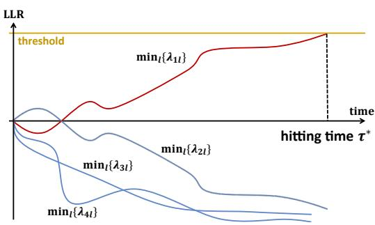

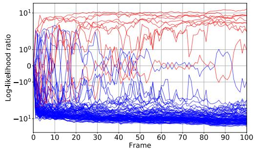  
Figure 1: Left: Early Classification of Time Series with MSPRT. The figure illustrates how the MSPRT predicts the label $y$ of an incoming time series $X ^ { ( 1 , t ) } = \{ x ^ { ( 1 ) } , x ^ { ( 2 ) } , . . . x ^ { ( t ) } \}$ . The MSPRT uses the LLR matrix denoted by $\lambda _ { k l } ( X ^ { ( 1 , t ) } ) : = \log ( p ( X ^ { ( 1 , t ) } | y = k ) / p ( X ^ { ( 1 , t ) } | y = l ) )$ , where $k , l =$ $1 , 2 , . . . , K$ . $K ( \in \mathbb { N } )$ is the number of classes. If one of min $\begin{array} { r } { \mathsf { \iota } _ { l } \lambda _ { k l } = \log p ( X ^ { ( 1 , t ) } | k ) / \mathsf { m a x } _ { l } p ( X ^ { ( 1 , t ) } | l ) } \end{array}$ $( k \in \{ 1 , 2 , . . . , K \} )$ reaches the threshold, the prediction is made; otherwise, the observation continues. In this figure, $K = 4$ , the prediction is $y = 1$ , and the hitting time is $\tau ^ { * }$ . A larger threshold leads to more accurate but delayed predictions, while a smaller threshold leads to earlier but less accurate predictions. Right: Estimated LLRs of ten sequences. (See Appendix I.6 for exact settings.)

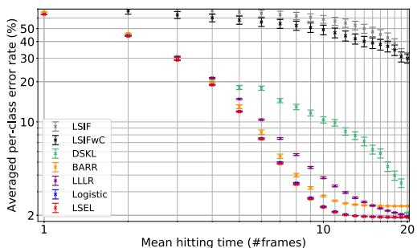

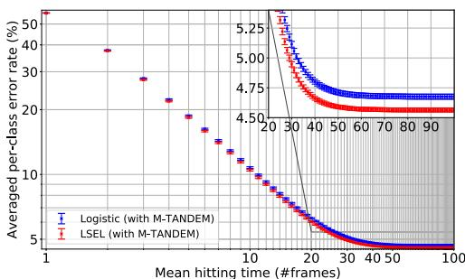  
Figure 2: LSEL v.s. Conventional Losses. The datasets (NMNSIT-H and NMNIST-100f) are introduced in Section 4. Curves in the lower left region are better. Left: LSEL v.s. Binary DREbased Losses on NMNSIT-H. The conventional losses do not generalize well in DRME. The MSPRT is run, using the LLR matrices estimated with seven different loss functions: LSIF [36] minimizes the mean squared error of $p$ and $\hat { r } q$ $( \hat { r } = \hat { p } / \hat { q } )$ ; LSIFwC stabilizes LSIF by adding a normalization constraint of $\hat { r } q$ ; DSKL [38] is based on KLIEP [76] and minimizes the Kullback-Leibler divergence between $p$ and $\hat { r } q$ ; BARR [38] stabilizes DSKL by adding the normalization constraint; LLLR [17] is similar to DSKL but is bounded above and below and is thus more stable; the logistic loss is the standard sum-log-exp-type loss; and the LSEL is our proposed loss. Their formal definitions are summarized in Appendix I.8. Only the logistic loss shows a comparable performance, but the LSEL is consistently better (Tables 35–36). Right: LSEL v.s. Logistic Loss on NMNIST-100f. The M-TANDEM approximation is used, which is introduced in Section 3.4. The error gap is statistically significant (Appendix L).

dataset. DRME has yet to be explored in the literature but can be regarded as a generalization of the conventional density ratio estimation (DRE), which usually focuses on only two densities [75]. The difficulties with DRME come from simultaneous optimization of multiple density ratios; the training easily diverges when the denominator of only one density ratio is small. In fact, a naive application of conventional binary DRE-based loss functions does not generalize well in this setting, and sometimes causes instability and divergence of the training (Figure 2 Left).

Therefore, we propose a novel loss function for solving DRME, the log-sum-exp loss (LSEL). We prove three properties of the LSEL, all of which contribute to enhancing the performance of the MSPRT. (i) The LSEL is consistent; i.e., by minimizing the LSEL, we can obtain the true LLR matrix as the sample size of the training set increases. (ii) The LSEL has the hard class weighting effect; i.e., it assigns larger gradients to harder classes, accelerating convergence of neural network training.

Our proof also explains why log-sum-exp-type losses, e.g., [73, 88, 77], have performed better than sum-log-exp-type losses. (iii) We propose the cost-sensitive LSEL for class-imbalanced datasets and prove that it is guess-averse [5]. Cost-sensitive learning [18], or loss re-weighting, is a typical and simple solution to the class imbalance problem [41, 34, 29, 8]. Although the consistency does not necessarily hold for the cost-sensitive LSEL, we show that the cost-sensitive LSEL nevertheless provides discriminative “LLRs” (scores) by proving its guess-aversion.

Along with the novel loss function, we propose the first DRE-based model for early multiclass classification in deep learning, MSPRT-TANDEM, enabling the MSPRT’s practical use on real-world datasets. MSPRT-TANDEM can be used for arbitrary sequential data and thus has a wide variety of potential applications. To test its empirical performance, we conduct experiments on four publicly available datasets. We conduct two-way analysis of variance (ANOVA) [21] followed by the Tukey-Kramer multi-comparison test [82, 40] for reproducibility and find that MSPRT-TANDEM provides statistically significantly better accuracy with a smaller number of observations than baseline models.

Our contributions are summarized as follows.

1. We formulate a novel problem setting, DRME, to enable the MSPRT on real-world datasets.   
2. We propose a loss function, LSEL, and prove its consistency, hard class weighting effect, and guess-aversion.   
3. We propose MSPRT-TANDEM: the first DRE-based model for early multiclass classification in deep learning. We show that it outperforms baseline models statistically significantly.

# 2 Related Work

Early classification of time series. Early classification of time series aims to make a prediction as early and as accurately as possible [89, 59, 61, 60]. An increasing number of real-world problems require earliness as well as accuracy, especially when a sampling cost is high or when a delay results in serious consequences; e.g., early detection of human actions for video surveillance and health care [83], early detection of patient deterioration on real-time sensor data [52], early warning of power system dynamics [92], and autonomous driving for early and safe action selection [13]. In addition, early classification saves computational costs [25].

SPRT. Sequential multihypothesis testing has been developed in [72, 3, 67, 71]. The extension of the binary SPRT to multihypothesis testing for i.i.d. data was conducted in [3, 11, 39, 49, 50, 68, 14, 69, 4, 15]. The MSPRT for non-i.i.d. distributions was discussed in [44, 80, 16, 79]. The asymptotic optimality of the MSPRT was proven in [80].

Density ratio estimation. DRE consists of estimating a ratio of two densities from their samples without separately estimating the numerator and denominator [75]. DRE has been widely used for, e.g., covariate shift adaptation [76], representation learning [66, 32], mutual information estimation [6], and off-policy reward estimation in reinforcement learning [48]. Our proof of the consistency of the LSEL is based on [27].

We provide more extensive references in Appendix B. To the best of our knowledge, only [17] and [62] combine the SPRT with DRE. Both restrict the number of classes to only two. The loss function proposed in [17] has not been proven to be unbiased; there is no guarantee for the estimated LLR to converge to the true one. [62] does not provide empirical validation for the SPRT.

# 3 Density Ratio Matrix Estimation for MSPRT

# 3.1 Log-Likelihood Ratio Matrix

Let $p$ be a probability density over $( X ^ { ( 1 , T ) } , y )$ . $X ^ { ( 1 , T ) } = \{ \pmb { x } ^ { ( t ) } \} _ { t = 1 } ^ { T } \in \mathcal { X }$ is an example of sequential data, where $T \in \mathbb { N }$ is the sequence length. $\pmb { x } ^ { ( t ) } \in \mathbb { R } ^ { d _ { x } }$ is a feature vector at timestamp $t$ ; e.g., an image at the $t$ -th frame in a video $X ^ { ( 1 , T ) }$ . $y \in \mathcal { Y } = [ K ] : = \{ 1 , 2 , . . . , K \}$ is a multiclass label, where $K \in \mathbb { N }$ is the number of classes. The LLR matrix is defined as $\lambda ( X ^ { ( 1 , t ) } ) : = ( \lambda _ { k l } ( X ^ { ( 1 , t ) } ) ) _ { k , l \in [ K ] } : = ( \log p ( X ^ { ( 1 , t ) } | y = k ) / p ( X ^ { ( 1 , t ) } | y = l ) ) _ { k , l \in [ K ] }$ , where

$p ( X ^ { ( 1 , t ) } | y )$ is a conditional probability density. $\lambda ( X ^ { ( 1 , t ) } )$ is an anti-symmetric matrix by definition; thus the diagonal entries are 0. Also, $\lambda$ satisfies $\lambda _ { k l } + \lambda _ { l m } = \dot { \lambda } _ { k m } ( \forall k , l , m \in [ \dot { K } ] )$ . Let $\hat { \lambda } ( X ^ { ( 1 , t ) } ; \pmb \theta ) : = ( \hat { \lambda } _ { k l } ( X ^ { ( 1 , t ) } ; \pmb \theta ) ) _ { k , l \in [ K ] } : = ( \log \hat { p } _ { \pmb \theta } ( X ^ { ( 1 , t ) } | \pmb y = k ) / \hat { p } _ { \pmb \theta } ( X ^ { ( 1 , t ) } | \pmb y = l ) ) _ { k , l \in [ K ] }$ be an estimator of the true LLR matrix $\lambda ( X ^ { ( 1 , t ) } )$ , where $\pmb { \theta } \in \mathbb { R } ^ { d _ { \theta } }$ ( $d _ { \theta } \in \mathbb { N } )$ denotes trainable parameters, e.g., weight parameters of a neural network. We use the hat symbol (ˆ·) to highlight that the quantity is an estimated value. The $\hat { \lambda }$ should be anti-symmetric and satisfy $\hat { \lambda } _ { k l } + \hat { \lambda } _ { l m } = \hat { \lambda } _ { k m } ( \forall k , l , m \in [ \bar { K } ] )$ . To satisfy these constraints, one may introduce additional regularization terms to the objective loss function, which can cause learning instability. Instead, we use specific combinations of the posterior density ratios $\hat { p } _ { \pmb { \theta } } ( y = k | X ^ { ( 1 , t ) } ) / \hat { p } _ { \pmb { \theta } } ( y = l | X ^ { ( 1 , t ) } )$ , which explicitly satisfy the aforementioned constraints (see the following M-TANDEM and M-TANDEMwO formulae).

# 3.2 MSPRT

Formally, the MSPRT is defined as follows (see Appendix A for more details):

Definition 3.1 (Matrix sequential probability ratio test). Let $P$ and $P _ { k }$ $( k \in [ K ] )$ be probability distributions. Define a threshold matrix $a _ { k l } \in \mathbb { R }$ $' k , l \in [ K ] )$ , where the diagonal elements are immaterial and arbitrary, e.g., 0. The MSPRT of multihypothesis $H _ { k } : P = P _ { k }$ $( k \in \ [ K ] )$ is defined as $\delta ^ { * } : = ( d ^ { * } , \tau ^ { * } )$ , where $d ^ { * } : = k$ if $\tau ^ { * } = \tau _ { k }$ $\mathit { \Delta } ^ { \prime } k \in \mathit { \Delta } [ K ] )$ , $\tau ^ { * } : = \operatorname* { m i n } \{ \tau _ { k } | k \in [ K ] \}$ , and $\tau _ { k } : = \operatorname* { i n f } \{ t \geq 1 | \operatorname* { m i n } _ { l ( \neq k ) \in [ K ] } \{ \lambda _ { k l } ( X ^ { ( 1 , t ) } ) - a _ { l k } \} \geq 0 \}$ .

In other words, the MSPRT terminates at the smallest timestamp $t$ such that for a class of $k \in [ K ]$ , $\lambda _ { k l } ( t )$ is greater than or equal to the threshold $a _ { l k }$ for all $l ( \neq k )$ (Figure 1). By definition, we must know the true LLR matrix $\lambda ( X ^ { ( 1 , t ) } )$ of the incoming time series $X ^ { ( 1 , t ) }$ ; therefore, we estimate $\lambda$ with the help of the LSEL defined in the next section. For simplicity, we use single-valued threshold matrices ( $\dot { a } _ { k l } = a _ { k ^ { \prime } l ^ { \prime } }$ for all $k , l , k ^ { \prime } , l ^ { \prime } \in [ K ] )$ in our experiment.

# 3.3 LSEL for DRME

To estimate the LLR matrix, we propose the log-sum-exp loss (LSEL):

$$
L _ {\mathrm {L S E L}} [ \tilde {\lambda} ] := \frac {1}{K T} \sum_ {k \in [ K ]} \sum_ {t \in [ T ]} \int d X ^ {(1, t)} p \left(X ^ {(1, t)} \mid k\right) \log \left(1 + \sum_ {l (\neq k)} e ^ {- \tilde {\lambda} _ {k l} \left(X ^ {(1, t)}\right)}\right). \tag {1}
$$

Let S := {(X (1,T )i , $S : = \{ ( X _ { i } ^ { ( 1 , T ) } , y _ { i } ) \} _ { i = 1 } ^ { M } \sim p ( X ^ { ( 1 , T ) } , y ) ^ { M }$ be a training dataset, where $M \in \mathbb { N }$ is the sample size. The empirical approximation of the LSEL is

$$
\hat {L} _ {\mathrm {L S E L}} (\boldsymbol {\theta}; S) := \frac {1}{K T} \sum_ {k \in [ K ]} \sum_ {t \in [ T ]} \frac {1}{M _ {k}} \sum_ {i \in I _ {k}} \log \left(1 + \sum_ {l (\neq k)} e ^ {- \hat {\lambda} _ {k l} \left(X _ {i} ^ {(1, t)}; \boldsymbol {\theta}\right)}\right). \tag {2}
$$

$M _ { k }$ and $I _ { k }$ denote the sample size and index set of class $k$ , respectively; i.e., $M _ { k } = | \{ i \in [ M ] | y _ { i } =$ $k \} | = | I _ { k } |$ and $\begin{array} { r } { \sum _ { k } M _ { k } = \mathbf { \bar { M } } } \end{array}$ .

# 3.3.1 Consistency

A crucial property of the LSEL is consistency; therefore, by minimizing (2), the estimated LLR matrix $\hat { \lambda }$ approaches the true LLR matrix $\lambda$ as the sample size increases. The formal statement is given as follows:

Theorem 3.1 (Consistency of the LSEL). Let $L ( \theta )$ and $\hat { L } _ { S } ( \pmb { \theta } )$ denote $L _ { L S E L } [ \hat { \lambda } ( \cdot ; \pmb { \theta } ) ]$ and $\hat { L } _ { L S E L } ( \pmb { \theta } ; S )$ respectively. Let ${ \hat { \theta } } _ { S }$ be the empirical risk minimizer of $\hat { L } _ { S }$ ; namely, $\hat { \pmb \theta } _ { S } : = \mathrm { a r g m i n } _ { \pmb \theta } \hat { L } _ { S } ( \pmb \theta )$ . Let $\Theta ^ { \ast } : = \{ \pmb { \theta } ^ { \ast } \in \mathbb { R } ^ { d _ { \theta } } | \hat { \lambda } ( X ^ { ( 1 , t ) } ; \pmb { \theta } ^ { \ast } ) = \lambda ( X ^ { ( 1 , t ) } ) \ ( \forall t \in [ T ] ) \}$ $( \forall t \in [ T ] ) \}$ be the target parameter set. Assume, for simplicity of proof, that each $\pmb { \theta } ^ { * }$ is separated in $\Theta ^ { * }$ ; i.e., $\exists \delta > 0$ such that $B ( \pmb \theta ^ { * } ; \delta ) \cap B ( \pmb \theta ^ { * \prime } ; \delta ) \doteq \emptyset$ for arbitrary $\pmb { \theta } ^ { * }$ and $\pmb { \theta } ^ { * \prime } \in \Theta ^ { * }$ , where $B ( \theta ; \delta )$ denotes an open ball at center $\pmb { \theta }$ with radius $\delta$ . Assume the following three conditions:

(a) $\begin{array} { r } { { \forall } k , l \in [ K ] , \forall t \in [ T ] , p ( X ^ { ( 1 , t ) } | k ) = 0 \Longleftrightarrow p ( X ^ { ( 1 , t ) } | l ) = 0 . } \end{array}$   
$\begin{array} { r } { ( b ) \ \operatorname* { s u p } _ { \pmb { \theta } } | \hat { L } _ { S } ( \pmb { \theta } ) - L ( \pmb { \theta } ) | \ \xrightarrow [ M  \infty ] { P } 0 } \end{array}$ ; i.e., $\hat { L } _ { S } ( \pmb { \theta } )$ converges in probability uniformly over $\pmb \theta$ to $L ( \theta )$ .

(c) For all $\theta ^ { * } \in \Theta ^ { * }$ , there exist $t \in [ T ]$ , $k \in [ K ]$ and $l \in [ K ]$ , such that the following $d _ { \theta } \times d _ { \theta }$ matrix is full-rank:

$$
\int d X ^ {(1, t)} p \left(X ^ {(1, t)} \mid k\right) \nabla_ {\boldsymbol {\theta} ^ {*}} \hat {\lambda} _ {k l} \left(X ^ {(1, t)}; \boldsymbol {\theta} ^ {*}\right) \nabla_ {\boldsymbol {\theta} ^ {*}} \hat {\lambda} _ {k l} \left(X ^ {(1, t)}; \boldsymbol {\theta} ^ {*}\right) ^ {\top}. \tag {3}
$$

Then, $\begin{array} { r } { P ( \hat { \pmb { \theta } } _ { S } \notin \Theta ^ { * } ) \xrightarrow { M  \infty } 0 , } \end{array}$ ; i.e., ${ \hat { \theta } } _ { S }$ converges in probability into $\Theta ^ { * }$

Assumption (a) ensures that $\lambda ( X ^ { ( 1 , t ) } )$ exists and is finite. Assumption (b) can be satisfied under the standard assumptions of the uniform law of large numbers (compactness, continuity, measurability, and dominance) [35, 63]. Assumption (c) is a technical requirement, often assumed in the literature [27]. The complete proof is given in Appendix C.

The critical hurdle of the MSPRT to practical applications (availability to the true LLR matrix) is now relaxed by virtue of the LSEL, which is provably consistent and enables a precise estimation of the LLR matrix. We emphasize that the MSPRT is the earliest and most accurate algorithm for early classification of time series, at least asymptotically (Theorem A.1, A.2, and A.3).

# 3.3.2 Hard Class Weighting Effect

We further discuss the LSEL by focusing on a connection with hard negative mining [73]. It is empirically known that designing a loss function to emphasize hard classes improves model performance [47]. The LSEL has this mechanism.

Let us consider a multiclass classification problem to obtain a high-performance discriminative model. To emphasize hard classes, let us minimize $\hat { L } \quad : =$ $\begin{array} { r } { \frac { 1 } { K T } \sum _ { k \in [ K ] } \sum _ { t \in [ T ] } \frac { 1 } { M _ { k } } \sum _ { i \in I _ { k } } \operatorname* { m a x } _ { l ( \neq y _ { i } ) } \{ e ^ { - \hat { \lambda } _ { y _ { i } l } ( X _ { i } ^ { ( 1 , t ) } ; \pmb \theta ) } \} } \end{array}$ ; however, mining the single hardest class with the max function induces a bias and causes the network to converge to a bad local minimum. Instead of $\hat { L }$ , we can use the LSEL because it is not only provably consistent but is a smooth upper bound of $\hat { L }$ : Because $\begin{array} { r } { \operatorname* { m a x } _ { l ( \neq y _ { i } ) } \{ e ^ { - \hat { \lambda } _ { y _ { i } l } ( X _ { i } ^ { ( 1 , t ) } ; \pmb \theta ) } \} < \sum _ { l ( \neq y _ { i } ) } e ^ { - \hat { \lambda } _ { y _ { i } l } ( X _ { i } ^ { ( 1 , t ) } ; \pmb \theta ) } } \end{array}$ , we obtain $\hat { L } < \hat { L } _ { \mathrm { L S E L } }$ by summing up both sides with respect to $i \in I _ { k }$ and then $k \in [ K ]$ and $t \in [ T ]$ . Therefore, a small $\hat { L } _ { \mathrm { L S E L } }$ indicates a small $\hat { L }$ . In addition, the gradients of the LSEL are dominated by the hardest class $k ^ { * } \in \mathrm { a r g m a x } _ { k ( \neq y ) } \{ e ^ { - \hat { \lambda } _ { y k } ( X ^ { ( 1 , T ) } ; \pmb \theta ) } \}$ , because

$$
\left| \frac {\partial \hat {L} _ {\mathrm {L S E L}}}{\partial \hat {\lambda} _ {y k}} \right| \propto \frac {e ^ {- \hat {\lambda} _ {y k}}}{\sum_ {l \in [ K ]} e ^ {- \hat {\lambda} _ {y l}}} <   \frac {e ^ {- \hat {\lambda} _ {y k ^ {*}}}}{\sum_ {l \in [ K ]} e ^ {- \hat {\lambda} _ {y l}}} \propto \left| \frac {\partial \hat {L} _ {\mathrm {L S E L}}}{\partial \hat {\lambda} _ {y k ^ {*}}} \right| (\forall k (\neq y, k ^ {*})),
$$

meaning that the LSEL assigns large gradients to the hardest class during training, which accelerates convergence.

Let us compare the hard class weighting effect of the LSEL with that of the logistic loss (a sumlog-exp-type loss extensively used in machine learning). For notational convenience, let us define $\begin{array} { r } { \ell _ { \mathrm { L S E L } } : = \log ( 1 + \sum _ { k ( \neq y ) } e ^ { a _ { k } } ) } \end{array}$ and $\begin{array} { r } { \ell _ { \mathrm { l o g i s t i c } } : = \sum _ { k ( \neq y ) } \log ( 1 + e ^ { a _ { k } } ) } \end{array}$ , where $a _ { k } : = - \hat { \lambda } _ { y k } ( X ^ { ( 1 , t ) } ; \pmb \theta )$ , and compare their gradient scales. The gradients for $k \neq y$ are:

$$
\frac {\partial \ell_ {\text {l o g i s t i c}}}{\partial \hat {\lambda} _ {y k}} = - \frac {e ^ {- \hat {\lambda} _ {y k}}}{1 + e ^ {- \hat {\lambda} _ {y k}}} =: b _ {k} \quad \text {a n d} \quad \frac {\partial \ell_ {\text {L S E L}}}{\partial \hat {\lambda} _ {y k}} = - \frac {e ^ {- \hat {\lambda} _ {y k}}}{\sum_ {l \in [ K ]} e ^ {- \hat {\lambda} _ {y l}}} =: c _ {k}.
$$

The relative gradient scales of the hardest class to the easiest class are:

$$
R _ {\mathrm {l o g i s t i c}} := \frac {\max _ {k (\neq y)} \{b _ {k} \}}{\min _ {k (\neq y)} \{b _ {k} \}} = \frac {e ^ {a _ {k ^ {*}}}}{e ^ {a _ {k _ {*}}}} \frac {e ^ {1 + a _ {k _ {*}}}}{e ^ {1 + a _ {k ^ {*}}}}, R _ {\mathrm {L S E L}} := \frac {\max _ {k (\neq y)} \{c _ {k} \}}{\min _ {k (\neq y)} \{c _ {k} \}} = \frac {e ^ {a _ {k ^ {*}}}}{e ^ {a _ {k _ {*}}}},
$$

where $k _ { * } : = \mathrm { a r g m i n } _ { k ( \neq y ) } \{ a _ { k } \}$ . Since $R _ { \mathrm { l o g i s t i c } } \leq R _ { \mathrm { L S E L } }$ , we conclude that the LSEL weighs hard classes more than the logistic loss. Note that our discussion above also explains why log-sum-exptype losses (e.g., [73, 88, 77]) perform better than sum-log-exp-type losses. In addition, Figure 2 (Left and Right) shows that the LSEL performs better than the logistic loss—a result that supports the discussion above. See Appendix E for more empirical results.

# 3.3.3 Cost-Sensitive LSEL and Guess-Aversion

Furthermore, we prove that the cost-sensitive LSEL provides discriminative scores even on imbalanced datasets. Conventional research for cost-sensitive learning has been mainly focused on binary classification problems [19, 18, 84, 54]. However, in multiclass cost-sensitive learning, [5] proved that random score functions (a “random guess”) can lead to even smaller values of the loss function. Therefore, we should investigate whether our loss function is averse (robust) to such random guesses, i.e., guess-averse.

Definitions Let $s : \mathcal { X } \to \mathbb { R } ^ { K }$ be a score vector function; i.e., $s _ { k } ( X ^ { ( 1 , t ) } )$ represents how likely it is that $X ^ { ( 1 , t ) }$ is sampled from class $k$ . In the LSEL, we can regard $\log \hat { p } _ { \pmb { \theta } } ( X ^ { ( 1 , t ) } | k )$ as $s _ { k } ( X ^ { ( 1 , t ) } )$ . A cost matrix $C$ is a matrix on $\mathbb { R } ^ { K \times K }$ such that $C _ { k l } \ge 0 ( \forall k , l \in [ K ] )$ , $C _ { k k } = 0$ b $\forall k \in [ K ] )$ , $\textstyle \sum _ { l \in [ K ] } C _ { k l } \neq 0 ( \forall k \in [ K ] )$ $( \forall k \in [ K ] )$ . $C _ { k l }$ represents a misclassification cost, or a weight for the loss function, when the true label is $k$ and the prediction is $l$ . The support set of class $k$ is defined as $S _ { k } : = \{ \pmb { v } \in \mathbb { R } ^ { K } | \forall l ( \neq k ) , v _ { k } > \cdot$ $v _ { k } > v _ { l } \}$ . Ideally, discriminative score vectors should be in $S _ { k }$ when the label is $k$ . In contrast, the arbitrary guess set is defined as $\mathcal { A } : = \{ \pmb { v } \in \mathbb { R } ^ { K } | v _ { 1 } = v _ { 2 } = . . . = v _ { K } \}$ . If $\pmb { s } ( X _ { i } ^ { ( 1 , t ) } ) \in \mathcal { A }$ , we cannot gain any information from $X _ { i } ^ { ( 1 , t ) }$ ; therefore, well-trained discriminative models should avoid such an arbitrary guess of $\pmb { s }$ . We consider a class of loss functions such that $\ell ( s ( X ^ { ( 1 , t ) } ) , y ; C )$ : It depends on $X ^ { ( 1 , t ) }$ through the score function $\pmb { s }$ . The loss $\ell ( s ( X ^ { ( 1 , t ) } ) , y ; C )$ is guess-averse, if for any $k \in [ K ]$ , any $\boldsymbol { s } \in \boldsymbol { S } _ { k }$ , any $s ^ { \prime } \in { \mathcal { A } }$ , and any cost matrix C, $\ell ( s , k ; C ) <$ $\ell ( s ^ { \prime } , k ; C )$ ; thus, the guess-averse loss can provide discriminative scores by minimizing it. The empirical loss Lˆ = 1MT PMi=1 PTt= $\begin{array} { r } { \hat { L } = \frac { 1 } { M T } \sum _ { i = 1 } ^ { M } \sum _ { t = 1 } ^ { T } \ell ( s ( X _ { i } ^ { ( 1 , t ) } ) , y _ { i } ; C ) } \end{array}$ 1 1 `(s(X(1,t)i ), yi; C) is said to be guess-averse, if ` is guess- $\ell$ averse. The guess-aversion trivially holds for most binary and multiclass loss functions but does not generally hold for cost-sensitive multiclass loss functions due to the complexity of multiclass decision boundaries [5].

Cost-sensitive LSEL is guess-averse. We define a cost-sensitive LSEL:

$$
\hat {L} _ {\mathrm {C L S E L}} (\boldsymbol {\theta}, C; S) := \frac {1}{M T} \sum_ {i = 1} ^ {M} \sum_ {t = 1} ^ {T} C _ {y _ {i}} \log \left(1 + \sum_ {l (\neq y _ {i})} e ^ {- \hat {\lambda} _ {y _ {i} l} \left(X _ {i} ^ {(1, t)}; \boldsymbol {\theta}\right)}\right), \tag {4}
$$

where $C _ { k l } = C _ { k }$ $( \forall k , l \in [ K ] )$ . Note that $\hat { \lambda }$ is no longer an unbiased estimator of the true LLR matrix; i.e., $\hat { \lambda }$ does not necessarily converge to $\lambda$ as $M \to \infty$ , except when $C _ { k } = M / M _ { k } ( K - 1 )$ $( \hat { L } _ { \mathrm { C L S E L } }$ reduces to $\hat { L } _ { \mathrm { L S E L } }$ ). Nonetheless, the following theorem shows that $\scriptstyle { \hat { L } } _ { \mathrm { C L S E L } }$ is guess-averse. The proof is given in Appendix G.1.

Theorem 3.2. LˆCLSEL is guess-averse, provided that the log-likelihood vector

$$
\left(\log \hat {p} _ {\boldsymbol {\theta}} (X ^ {(1, t)} | y = 1), \log \hat {p} _ {\boldsymbol {\theta}} (X ^ {(1, t)} | y = 2), \dots , \log \hat {p} _ {\boldsymbol {\theta}} (X ^ {(1, t)} | y = K))\right) ^ {\top} \in \mathbb {R} ^ {K}
$$

is regarded as the score vector $s ( X ^ { ( 1 , t ) } )$ .

Figure 3 illustrates the risk of non-guess-averse losses. We define the non-guess-averse LSEL (NGA-LSEL) as $\begin{array} { r } { \ell ( \pmb { \mathscr { s } } , y ; C ) = \sum _ { k ( \neq y ) } \bar { C } _ { y , l } \log ( 1 + \sum _ { l ( \neq k ) } e ^ { s _ { l } - s _ { k } } ) } \end{array}$ . It is inspired by a variant of an exponential loss $\begin{array} { r } { \ell ( \pmb { \mathscr { s } } , y ; C ) = \sum _ { k , l \in [ K ] } C _ { y , l } e ^ { s _ { l } - s _ { k } } } \end{array}$ , which is proven to be classification calibrated but is not guess-averse [5]. The NGA-LSEL benefits from the log-sum-exp structure but is not guess-averse (Appendix G.2), unlike the LSEL.

# 3.4 MSPRT-TANDEM

Although the LSEL alone works well, we further combine the LSEL with a DRE-based model, SPRT-TANDEM, recently proposed in [17]. Specifically, we use the TANDEM formula and multiplet loss to accelerate the convergence. The TANDEM formula transforms the output of the network $( \hat { p } ( \boldsymbol { y } | \boldsymbol { X } ^ { ( 1 , t ) } ) )$ to the likelihood $\hat { p } ( X ^ { ( 1 , t ) } | y )$ under the $N$ -th order Markov approximation, which avoids the gradient vanishing of recurrent neural networks [17]:

$$
\hat {\lambda} _ {k l} \left(X ^ {(1, t)}\right) \doteq \sum_ {s = N + 1} ^ {t} \log \left(\frac {\hat {p} _ {\boldsymbol {\theta}} (k \mid X ^ {(s - N , s)})}{\hat {p} _ {\boldsymbol {\theta}} (l \mid X ^ {(s - N , s)})}\right) - \sum_ {s = N + 2} ^ {t} \log \left(\frac {\hat {p} _ {\boldsymbol {\theta}} (k \mid X ^ {(s - N , s - 1)})}{\hat {p} _ {\boldsymbol {\theta}} (l \mid X ^ {(s - N , s - 1)})}\right), \tag {5}
$$

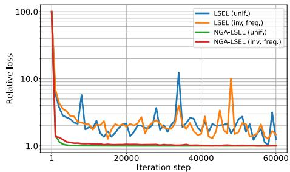

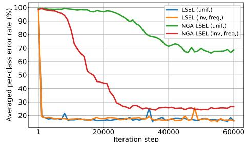

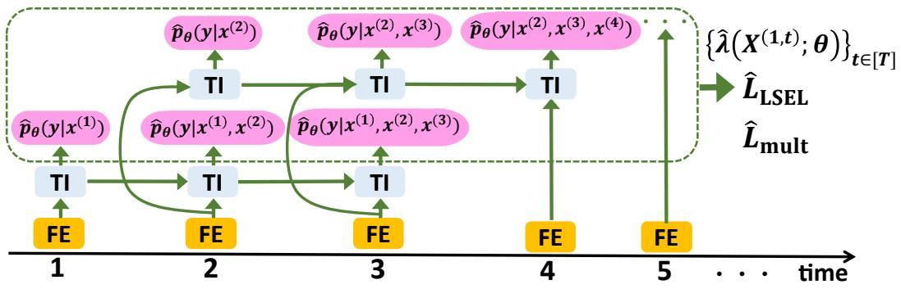  
Figure 3: Left: Relative Loss v.s. Training Iteration of LSEL and NGA-LSEL with Two Cost Matrices for Each. Right: Averaged Per-Class Error Rate of Last Frame v.s. Training Iteration. Although all the loss curves decrease and converge (left), the error rates of the NGA-LSEL converge slowly and show a large gap depending on the cost matrix, while the error rates of the LSEL converge rapidly, and the gap is small (right). “unif.” means $C _ { k l } = 1$ and “inv. freq.” means $C _ { k l } = 1 / M _ { k }$ . The dataset is UCF101 [74].   
Figure 4: MSPRT-TANDEM ( $N = 2$ ). $x ^ { ( t ) }$ is an input vector; e.g., a video frame. FE is a feature extractor. TI is a temporal integrator, which allows two inputs: the feature vector and a hidden state vector, which encodes the information of the past frames. We use ResNet and LSTM for FE and TI, respectively, but are not limited to them in general. The output posterior densities are highlighted with pink circles. By aggregating the posterior densities, the multiplet loss is calculated. Also, the estimated LLR matrix $\hat { \lambda }$ is constructed using the M-TANDEM or M-TANDEMwO formulae. Finally, $\hat { \lambda }$ is input to the LSEL. $\hat { L } _ { \mathrm { L S E L } } + \hat { L } _ { \mathrm { m u l t } }$ is optimized with gradient descent. In the test phase, $\hat { \lambda } ( X ^ { ( 1 , t ) } )$ is used to execute the MSPRT (Figure 1 and Definition 3.1).

where we do not use the prior ratio term $- \log ( \hat { p } ( k ) / \hat { p } ( l ) ) = - \log ( M _ { k } / M _ { l } )$ in our experiments because it plays a similar role to the cost matrix [58]. Note that (5) is a generalization of the original to DRME, and thus we call it the M-TANDEM formula.

However, we find that the M-TANDEM formula contains contradictory gradient updates caused by the middle minus sign. Let us consider an example $z _ { i } : = ( X _ { i } ^ { ( 1 , t ) } , y _ { i } )$ . The posterior $\hat { p } _ { \pmb { \theta } } ( y =$ $y _ { i } | X _ { i } ^ { ( s - N , s - 1 ) } )$ (appears in (5)) should take a large value for $z _ { i }$ because the posterior density represents the probability that the label is $y _ { i }$ . For the same reason, $\hat { \lambda } _ { y _ { i } l } \big ( X ^ { ( 1 , t ) } \big )$ should take a high value; thus $\hat { p } _ { \pmb { \theta } } ( y = y _ { i } | x ^ { ( s - N ) } , . . . , x ^ { ( s - 1 ) } )$ should take a small value in accordance with (5) — an apparent contradiction. These contradictory updates may cause a conflict of gradients and slow the convergence of training, leading to performance deterioration. Therefore, in the experiments, we use either (5) or another approximation formula: $\hat { \lambda } _ { k l } \big ( X ^ { ( 1 , t ) } ; \pmb { \theta } \big ) \mathrel { \mathop : } = \log \big ( \hat { p } _ { \pmb { \theta } } \big ( k \big | X ^ { ( t - N , t ) } \big ) \big / \hat { p } _ { \pmb { \theta } } \big ( l \big | X ^ { ( t - N , t ) } \big ) \big )$ , which we call the M-TANDEM with Oblivion (M-TANDEMwO) formula. Clearly, the gradient does not conflict. Note that both the M-TANDEM and M-TANDEMwO formulae are anti-symmetric and do not violate the constraint $\hat { \lambda } _ { k l } + \hat { \lambda } _ { l m } = \hat { \lambda } _ { k m } ( \forall k , l , m \in [ K ] )$ . See Appendix F for a more detailed empirical comparison. Finally, the multiplet loss is a cross-entropy loss combined with the $N$ -th

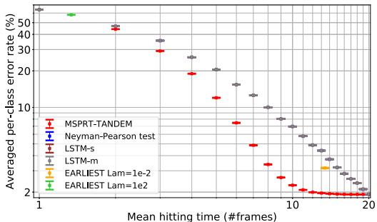

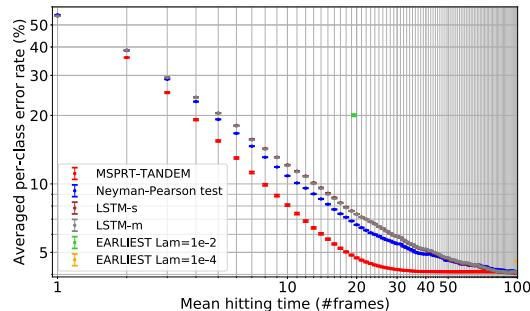

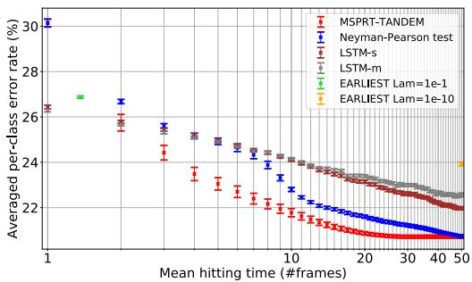

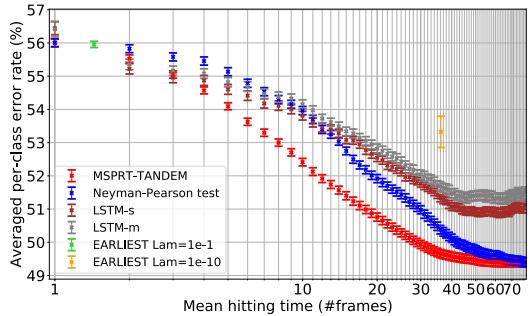  
Figure 5: Speed-Accuracy Tradeoff (SAT) Curves. The vertical axis represents the averaged perclass error rate, and the horizontal axis represents the mean hitting time. Early and accurate models come in the lower-left area. The vertical error bars are the standard error of mean (SEM); however, some of the error bars are too small and are collapsed. Upper left: NMNIST-H. The Neyman-Pearson test, LSTM-s, and LSTM-m almost completely overlap. Upper right: NMNIST-100f. LSTM-s and LSTM-m completely overlap. Lower left: UCF101. Lower right: HMDB51.

order approximation: $\begin{array} { r } { \hat { L } _ { \mathrm { m u l t } } ( \pmb { \theta } ; S ) : = \frac { 1 } { M } \sum _ { i = 1 } ^ { M } \sum _ { k = 1 } ^ { N + 1 } \sum _ { t = k } ^ { T - ( N + 1 - k ) } ( - \log \hat { p } _ { \pmb { \theta } } ( y _ { i } | X _ { i } ^ { ( t - k + 1 , t ) } ) ) } \end{array}$ . An ablation study of the multiplet loss and the LSEL is provided in Appendix H.

The overall architecture, MSPRT-TANDEM, is illustrated in Figure 4. MSPRT-TANDEM can be used for arbitrary sequential data and thus has a wide variety of potential applications, such as computer vision, natural language processing, and signal processing. We focus on vision tasks in our experiments.

Note that in the training phase, MSPRT-TANDEM does not require a hyperparameter that controls the speed-accuracy tradeoff. A common strategy in early classification of time series is to construct a model that optimizes two cost functions: one for earliness and the other for accuracy [12, 59, 81, 60, 53]. This approach typically requires a hyperparameter that controls earliness and accuracy [1]. The tradeoff hyperparameter is determined by heuristics and cannot be changed after training. However, MSPRT-TANDEM does not require such a hyperparameter and enables us to control the speed-accuracy tradeoff after training because we can change the threshold of MSPRT-TANDEM without retraining. This flexibility is an advantage for efficient deployment [10].

# 4 Experiment

To evaluate the performance of MSPRT-TANDEM, we use averaged per-class error rate and mean hitting time: Both measures are necessary because early classification of time series is a multiobjective optimization problem. The averaged per-class error rate, or balanced error, is defined as 1 − 1K $\begin{array} { r } { 1 - \frac { 1 } { K } \bar { \sum _ { k = 1 } ^ { K } } \frac { | \{ i \in [ M ] \bar { | } h _ { i } = y _ { i } = k \} | } { | \{ i \in [ M ] | y _ { i } = k \} | } } \end{array}$ PKk=1 |{i∈[M]|hi=yi=k}||{i∈[M]|yi=k}| , where hi ∈ [K] is the prediction of the model for i ∈ [M ] in $h _ { i } \in [ K ]$ $i \in [ M ]$ the dataset. The mean hitting time is defined as the arithmetic mean of the stopping times of all sequences.

We use four datasets: two are new simulated datasets made from MNIST [45] (NMNIST-H and NMNIST-100f), and two real-world public datasets for multiclass action recognition (UCF101 [74] and HMDB51 [42]). A sequence in NMNIST-H consists of 20 frames of an MNIST image filled with dense random noise, which is gradually removed (10 pixels per frame), while a sequence in NMNIST-100f consists of 100 frames of an MNIST image filled with random noise that is so dense that humans cannot classify any video (Appendix K); only 15 of $2 8 \times 2 8$ pixels maintain the original image. The noise changes temporally and randomly and is not removed, unlike in NMNIST-H.

# 4.1 Models

We compare the performance of MSPRT-TANDEM with four other models: LSTM-s, LSTM-m [51], EARLIEST [28], and the Neyman-Pearson (NP) test [64]. LSTM-s and LSTM-m, proposed in a pioneering work in deep learning-based early detection of human action [51], use loss functions that enhance monotonicity of class probabilities (LSTM-s) and margins of class probabilities (LSTM-m). Note that LSTM- $s / \mathrm { m }$ support only the fixed-length test; i.e., the stopping time is fixed, unlike MSPRT-TANDEM. EARLIEST is a reinforcement learning algorithm based on recurrent neural networks (RNNs). The base RNN of EARLIEST calculates a current state vector from an incoming time series. The state vector is then used to generate a stopping probability in accordance with the binary action sampled: Halt or Continue. EARLIEST has two objective functions in the total loss: one for classification error and one for earliness. The balance between them cannot change after training. The NP test is known to be the most powerful, Bayes optimal, and minimax optimal test [7, 46]. The NP test uses the LLR to make a decision in a similar manner to the MSPRT, but the decision time is fixed. The decision rule is dNP(X(1,t)) := argmaxk∈[K] $\begin{array} { r } { d ^ { \mathrm { N P } } ( X ^ { ( 1 , t ) } ) : = \mathrm { a r g m a x } _ { k \in [ K ] } \operatorname* { m i n } _ { l \in [ K ] } \lambda _ { k l } ( X ^ { ( 1 , t ) } ) } \end{array}$ with a fixed $t \in [ T ]$ . In summary, LSTM- $s / \mathrm { m }$ have different loss functions from MSPRT-TANDEM, and the stopping time is fixed. EARLIEST is based on reinforcement learning, and its stopping rule is stochastic. The only difference between the NP test and MSPRT-TANDEM is whether the stopping time is fixed.

We first train the feature extractor (ResNet [30, 31]) by solving multiclass classification with the softmax loss and extract the bottleneck features, which are then used to train LSTM- $s / \mathrm { m }$ , EARLIEST, and the temporal integrator for MSPRT-TANDEM and NP test. Note that all models use the same feature vectors for the training. For a fair comparison, hyperparameter tuning is carried out with the default algorithm of Optuna [2] with an equal number of tuning trials for all models. Also, all models have the same order of trainable parameters. After fixing the hyperparameters, we repeatedly train the models with different random seeds to consider statistical fluctuation due to random initialization and stochastic optimizers. Finally, we test the statistical significance of the models with the two-way ANOVA followed by the Tukey-Kramer multi-comparison test. More detailed settings are given in Appendix I.

# 4.2 Results

The performances of all the models are summarized in Figure 5 (The lower left area is preferable). We can see that MSPRT-TANDEM outperforms all the other models by a large margin, especially in the early stage of sequential observations. We confirm that the results have statistical significance; i.e., our results are reproducible (Appendix L). The loss functions of LSTM- $s / \mathrm { m }$ force the prediction score to be monotonic, even when noisy data are temporally observed, leading to a suboptimal prediction. In addition, LSTM- $s / \mathrm { m }$ have to make a decision, even when the prediction score is too small to make a confident prediction. However, MSPRT-TANDEM can wait until a sufficient amount of evidence is accumulated. A potential weakness of EARLIEST is that reinforcement learning is generally unstable during training, as pointed out in [65, 43]. The NP test requires more observations to attain a comparable error rate to that of MSPRT-TANDEM, as expected from the theoretical perspective [79]: In fact, the SPRT was originally developed to outperform the NP test in sequential testing [85, 86].

# 5 Conclusion

We propose the LSEL for DRME, which has yet to be explored in the literature. The LSEL relaxes the crucial assumption of the MSPRT and enables its real-world applications. We prove that the LSEL has a theoretically strong background: consistency, hard class weighting, and guess-aversion. We also propose MSPRT-TANDEM, the first DRE-based model for early multiclass classification

in deep learning. The experiment shows that the LSEL and MSPRT-TANDEM outperform other baseline models statistically significantly.

# Acknowledgments

The authors thank the anonymous reviewers for their careful reading to improve the manuscript. We would like to thank Jiro Abe, Genki Kusano, Yuta Hatakeyama, Kazuma Shimizu, and Natsuhiko Sato for helpful comments on the proof of the LSEL’s consistency.

# References

[1] Y. Achenchabe, A. Bondu, A. Cornuéjols, and A. Dachraoui. Early classification of time series. cost-based optimization criterion and algorithms. arXiv preprint arXiv:2005.09945, 2020.   
[2] T. Akiba, S. Sano, T. Yanase, T. Ohta, and M. Koyama. Optuna: A next-generation hyperparameter optimization framework. In Proceedings of the 25th ACM SIGKDD International Conference on Knowledge Discovery and Data Mining, KDD ’19, page 2623–2631, New York, NY, USA, 2019. Association for Computing Machinery. License: MIT License.   
[3] P. Armitage. Sequential analysis with more than two alternative hypotheses, and its relation to discriminant function analysis. Journal of the Royal Statistical Society. Series B (Methodological), 12(1):137–144, 1950.   
[4] C. W. Baum and V. V. Veeravalli. A sequential procedure for multihypothesis testing. IEEE Transactions on Information Theory, 40(6):1994–2007, Nov 1994.   
[5] O. Beijbom, M. Saberian, D. Kriegman, and N. Vasconcelos. Guess-averse loss functions for cost-sensitive multiclass boosting. In International Conference on Machine Learning, pages 586–594, 2014.   
[6] M. I. Belghazi, A. Baratin, S. Rajeshwar, S. Ozair, Y. Bengio, A. Courville, and D. Hjelm. Mutual information neural estimation. In International Conference on Machine Learning, pages 531–540, 2018.   
[7] A. Borovkov. Mathematical Statistics. Gordon and Breach Science Publishers, 1998.   
[8] M. Buda, A. Maki, and M. A. Mazurowski. A systematic study of the class imbalance problem in convolutional neural networks. Neural Networks, 106:249–259, 2018.   
[9] D. L. Burkholder and R. A. Wijsman. Optimum properties and admissibility of sequential tests. The Annals of Mathematical Statistics, 34(1):1–17, 1963.   
[10] H. Cai, C. Gan, T. Wang, Z. Zhang, and S. Han. Once-for-all: Train one network and specialize it for efficient deployment. In International Conference on Learning Representations, 2020.   
[11] H. Chernoff. Sequential design of experiments. The Annals of Mathematical Statistics, 30(3):755–770, 1959.   
[12] A. Dachraoui, A. Bondu, and A. Cornuéjols. Early classification of time series as a non myopic sequential decision making problem. In A. Appice, P. P. Rodrigues, V. Santos Costa, C. Soares, J. Gama, and A. Jorge, editors, Machine Learning and Knowledge Discovery in Databases, pages 433–447, Cham, 2015. Springer International Publishing.   
[13] R. Doná, G. P. R. Papini, and G. Valenti. MSPRT action selection model for bio-inspired autonomous driving and intention prediction. In 2019 IEEE/RSJ International Conference on Intelligent Robots and Systems (IROS) Workshop, 2019.   
[14] V. Dragalin. Asymptotic solution of a problem of detecting a signal from $k$ channels. Russian Mathematical Surveys, 42(3):213, 1987.   
[15] V. Dragalin and A. Novikov. Adaptive sequential tests for composite hypotheses. Survey of Applied and Industrial Mathematics, 6:387–398, 1999.   
[16] V. P. Dragalin, A. G. Tartakovsky, and V. V. Veeravalli. Multihypothesis sequential probability ratio tests. i. asymptotic optimality. IEEE Transactions on Information Theory, 45(7):2448–2461, November 1999.   
[17] A. F. Ebihara, T. Miyagawa, K. Sakurai, and H. Imaoka. Sequential density ratio estimation for simultaneous optimization of speed and accuracy. In International Conference on Learning Representations, 2021.

[18] C. Elkan. The foundations of cost-sensitive learning. In International joint conference on artificial intelligence, volume 17, pages 973–978. Lawrence Erlbaum Associates Ltd, 2001.   
[19] W. Fan, S. J. Stolfo, J. Zhang, and P. K. Chan. Adacost: Misclassification cost-sensitive boosting. In Proceedings of the Sixteenth International Conference on Machine Learning, ICML ’99, page 97–105, San Francisco, CA, USA, 1999. Morgan Kaufmann Publishers Inc.   
[20] T. S. Ferguson. Mathematical statistics: A decision theoretic approach, volume 1. Academic press, 2014.   
[21] R. Fisher. Statistical methods for research workers. Edinburgh Oliver & Boyd, 1925.   
[22] M. F. Ghalwash and Z. Obradovic. Early classification of multivariate temporal observations by extraction of interpretable shapelets. BMC bioinformatics, 13(1):195, 2012.   
[23] M. F. Ghalwash, V. Radosavljevic, and Z. Obradovic. Extraction of interpretable multivariate patterns for early diagnostics. In 2013 IEEE 13th International Conference on Data Mining, pages 201–210, 2013.   
[24] M. F. Ghalwash, V. Radosavljevic, and Z. Obradovic. Utilizing temporal patterns for estimating uncertainty in interpretable early decision making. In Proceedings of the 20th ACM SIGKDD International Conference on Knowledge Discovery and Data Mining, KDD ’14, page 402–411, New York, NY, USA, 2014. Association for Computing Machinery.   
[25] A. Ghodrati, B. E. Bejnordi, and A. Habibian. FrameExit: Conditional early exiting for efficient video recognition. In IEEE/CVF Conference on Computer Vision and Pattern Recognition (CVPR), June 2021.   
[26] M. Gutmann and J.-i. Hirayama. Bregman divergence as general framework to estimate unnormalized statistical models. arXiv preprint arXiv:1202.3727, 2012.   
[27] M. U. Gutmann and A. Hyvärinen. Noise-contrastive estimation of unnormalized statistical models, with applications to natural image statistics. The journal of machine learning research, 13(1):307–361, 2012.   
[28] T. Hartvigsen, C. Sen, X. Kong, and E. Rundensteiner. Adaptive-halting policy network for early classification. In Proceedings of the 25th ACM SIGKDD International Conference on Knowledge Discovery & Data Mining, KDD ’19, pages 101–110, New York, NY, USA, 2019. ACM.   
[29] H. He and E. A. Garcia. Learning from imbalanced data. IEEE Transactions on Knowledge and Data Engineering, 21(9):1263–1284, 2009.   
[30] K. He, X. Zhang, S. Ren, and J. Sun. Deep residual learning for image recognition. 2016 IEEE Conference on Computer Vision and Pattern Recognition (CVPR), pages 770–778, 2016.   
[31] K. He, X. Zhang, S. Ren, and J. Sun. Identity mappings in deep residual networks. In Computer Vision - ECCV 2016 - 14th European Conference, Amsterdam, The Netherlands, October 11-14, 2016, Proceedings, Part IV, pages 630–645, 2016.   
[32] R. D. Hjelm, A. Fedorov, S. Lavoie-Marchildon, K. Grewal, P. Bachman, A. Trischler, and Y. Bengio. Learning deep representations by mutual information estimation and maximization. In International Conference on Learning Representations, 2019.   
[33] S. Hochreiter, Y. Bengio, P. Frasconi, and J. Schmidhuber. Gradient flow in recurrent nets: the difficulty of learning long-term dependencies. In S. C. Kremer and J. F. Kolen, editors, A Field Guide to Dynamical Recurrent Neural Networks. IEEE Press, 2001.   
[34] N. Japkowicz and S. Stephen. The class imbalance problem: A systematic study. Intell. Data Anal., 6(5):429–449, Oct. 2002.   
[35] R. I. Jennrich. Asymptotic properties of non-linear least squares estimators. Ann. Math. Statist., 40(2):633– 643, 04 1969.   
[36] T. Kanamori, S. Hido, and M. Sugiyama. A least-squares approach to direct importance estimation. Journal of Machine Learning Research, 10(Jul):1391–1445, 2009.   
[37] F. Karim, H. Darabi, S. Harford, S. Chen, and A. Sharabiani. A framework for accurate time series classification based on partial observation. In 2019 IEEE 15th International Conference on Automation Science and Engineering (CASE), pages 634–639, 2019.   
[38] H. Khan, L. Marcuse, and B. Yener. Deep density ratio estimation for change point detection. arXiv preprint arXiv:1905.09876, 2019.

[39] J. Kiefer and J. Sacks. Asymptotically optimum sequential inference and design. The Annals of Mathematical Statistics, pages 705–750, 1963.   
[40] C. Y. Kramer. Extension of multiple range tests to group means with unequal numbers of replications. Biometrics, 12(3):307–310, 1956.   
[41] M. Kubat and S. Matwin. Addressing the curse of imbalanced training sets: One-sided selection. In In Proceedings of the Fourteenth International Conference on Machine Learning, pages 179–186. Morgan Kaufmann, 1997.   
[42] H. Kuehne, H. Jhuang, E. Garrote, T. Poggio, and T. Serre. HMDB: a large video database for human motion recognition. In Proceedings of the International Conference on Computer Vision (ICCV), 2011. License: Creative Commons Attribution 4.0 International License.   
[43] A. Kumar, A. Gupta, and S. Levine. DisCor: Corrective feedback in reinforcement learning via distribution correction. In Proceedings of the 33rd International Conference on Neural Information Processing Systems, 2020.   
[44] T. L. Lai. Asymptotic optimality of invariant sequential probability ratio tests. The Annals of Statistics, pages 318–333, 1981.   
[45] Y. LeCun, C. Cortes, and C. Burges. Mnist handwritten digit database. ATT Labs [Online]. Available: http://yann. lecun. com/exdb/mnist, 2, 2010. License: Creative Commons Attribution-Share Alike 3.0 license.   
[46] E. L. Lehmann and J. P. Romano. Testing statistical hypotheses. Springer Science & Business Media, 2006.   
[47] T. Lin, P. Goyal, R. Girshick, K. He, and P. Dollár. Focal loss for dense object detection. In 2017 IEEE International Conference on Computer Vision (ICCV), pages 2999–3007, 2017.   
[48] Q. Liu, L. Li, Z. Tang, and D. Zhou. Breaking the curse of horizon: Infinite-horizon off-policy estimation. In Advances in Neural Information Processing Systems, pages 5356–5366, 2018.   
[49] G. Lorden. Integrated risk of asymptotically bayes sequential tests. The Annals of Mathematical Statistics, 38(5):1399–1422, 1967.   
[50] G. Lorden. Nearly-optimal sequential tests for finitely many parameter values. Annals of Statistics, 5:1–21, 01 1977.   
[51] S. Ma, L. Sigal, and S. Sclaroff. Learning activity progression in lstms for activity detection and early detection. In 2016 IEEE Conference on Computer Vision and Pattern Recognition (CVPR), pages 1942– 1950, 2016.   
[52] Y. Mao, W. Chen, Y. Chen, C. Lu, M. Kollef, and T. Bailey. An integrated data mining approach to real-time clinical monitoring and deterioration warning. In Proceedings of the 18th ACM SIGKDD international conference on Knowledge discovery and data mining, pages 1140–1148, 2012.   
[53] C. Martinez, E. Ramasso, G. Perrin, and M. Rombaut. Adaptive early classification of temporal sequences using deep reinforcement learning. Knowledge-Based Systems, 190:105290, February 2020.   
[54] H. Masnadi-Shirazi and N. Vasconcelos. Cost-sensitive boosting. IEEE Transactions on pattern analysis and machine intelligence, 33(2):294–309, 2010.   
[55] T. K. Matches. On the optimality of sequential probability ratio tests. The Annals of Mathematical Statistics, 34:18, 1963.   
[56] A. McGovern, D. H. Rosendahl, R. A. Brown, and K. K. Droegemeier. Identifying predictive multidimensional time series motifs: an application to severe weather prediction. Data Mining and Knowledge Discovery, 22(1-2):232–258, 2011.   
[57] A. Menon and C. S. Ong. Linking losses for density ratio and class-probability estimation. In International Conference on Machine Learning, pages 304–313, 2016.   
[58] A. K. Menon, S. Jayasumana, A. S. Rawat, H. Jain, A. Veit, and S. Kumar. Long-tail learning via logit adjustment. In International Conference on Learning Representations, 2021.   
[59] U. Mori, A. Mendiburu, S. Dasgupta, and J. A. Lozano. Early classification of time series from a cost minimization point of view. In Proceedings of the NIPS Time Series Workshop, 2015.

[60] U. Mori, A. Mendiburu, S. Dasgupta, and J. A. Lozano. Early classification of time series by simultaneously optimizing the accuracy and earliness. IEEE Transactions on Neural Networks and Learning Systems, 29(10):4569–4578, Oct 2018.   
[61] U. Mori, A. Mendiburu, E. J. Keogh, and J. A. Lozano. Reliable early classification of time series based on discriminating the classes over time. Data Mining and Knowledge Discovery, 31:233–263, 04 2016.   
[62] G. V. Moustakides and K. Basioti. Training neural networks for likelihood/density ratio estimation. arXiv preprint arXiv:1911.00405, 2019.   
[63] W. Newey and D. McFadden. Large sample estimation and hypothesis testing. In R. F. Engle and D. McFadden, editors, Handbook of Econometrics, volume 4, chapter 36, pages 2111–2245. Elsevier, 1 edition, 1986.   
[64] J. Neyman and E. S. Pearson. On the problem of the most efficient tests of statistical hypotheses. Philosophical Transactions of the Royal Society of London. Series A, Containing Papers of a Mathematical or Physical Character, 231:289–337, 1933.   
[65] E. Nikishin, P. Izmailov, B. Athiwaratkun, D. Podoprikhin, T. Garipov, P. Shvechikov, D. Vetrov, and A. G. Wilson. Improving stability in deep reinforcement learning with weight averaging. In Uncertainty in artificial intelligence workshop on uncertainty in Deep learning, 2018.   
[66] A. v. d. Oord, Y. Li, and O. Vinyals. Representation learning with contrastive predictive coding. arXiv preprint arXiv:1807.03748, 2018.   
[67] E. Paulson. A sequential decision procedure for choosing one of $k$ hypotheses concerning the unknown mean of a normal distribution. The Annals of Mathematical Statistics, pages 549–554, 1963.   
[68] I. Pavlov. Sequential decision rule for the case of many complex hypotheses. ENG. CYBER., (6):19–22, 1984.   
[69] I. V. Pavlov. Sequential procedure of testing composite hypotheses with applications to the kiefer–weiss problem. Theory of Probability & Its Applications, 35(2):280–292, 1991.   
[70] A. N. Shiryaev. Optimal stopping rules, volume 8. Springer Science & Business Media, 2007.   
[71] G. Simons. Lower bounds for average sample number of sequential multihypothesis tests. The Annals of Mathematical Statistics, pages 1343–1364, 1967.   
[72] M. Sobel and A. Wald. A sequential decision procedure for choosing one of three hypotheses concerning the unknown mean of a normal distribution. Ann. Math. Statist., 20(4):502–522, 12 1949.   
[73] H. O. Song, Y. Xiang, S. Jegelka, and S. Savarese. Deep metric learning via lifted structured feature embedding. In 2016 IEEE Conference on Computer Vision and Pattern Recognition (CVPR), pages 4004–4012, 2016.   
[74] K. Soomro, A. R. Zamir, and M. Shah. UCF101: A dataset of 101 human actions classes from videos in the wild. arXiv preprint arXiv:1212.0402, 2012. License: Unknown.   
[75] M. Sugiyama, T. Suzuki, and T. Kanamori. Density Ratio Estimation in Machine Learning. Cambridge University Press, 2012.   
[76] M. Sugiyama, T. Suzuki, S. Nakajima, H. Kashima, P. von Bünau, and M. Kawanabe. Direct importance estimation for covariate shift adaptation. Annals of the Institute of Statistical Mathematics, 60(4):699–746, 2008.   
[77] Y. Sun, C. Cheng, Y. Zhang, C. Zhang, L. Zheng, Z. Wang, and Y. Wei. Circle loss: A unified perspective of pair similarity optimization. In IEEE/CVF Conference on Computer Vision and Pattern Recognition (CVPR), June 2020.   
[78] A. Tartakovsky. Sequential methods in the theory of information systems, 1991.   
[79] A. Tartakovsky, I. Nikiforov, and M. Basseville. Sequential Analysis: Hypothesis Testing and Changepoint Detection. Chapman & Hall/CRC, 1st edition, 2014.   
[80] A. G. Tartakovsky. Asymptotic optimality of certain multihypothesis sequential tests: Non-i.i.d. case. Statistical Inference for Stochastic Processes, 1(3):265–295, 1998.   
[81] R. Tavenard and S. Malinowski. Cost-aware early classification of time series. In Joint European Conference on Machine Learning and Knowledge Discovery in Databases, pages 632–647. Springer, 2016.

[82] J. W. Tukey. Comparing individual means in the analysis of variance. Biometrics, 5 2:99–114, 1949.   
[83] E. Vats and C. S. Chan. Early detection of human actions—a hybrid approach. Applied Soft Computing, 46:953 – 966, 2016.   
[84] P. Viola and M. Jones. Fast and robust classification using asymmetric adaboost and a detector cascade. In T. Dietterich, S. Becker, and Z. Ghahramani, editors, Advances in Neural Information Processing Systems, volume 14, pages 1311–1318. MIT Press, 2002.   
[85] A. Wald. Sequential tests of statistical hypotheses. Ann. Math. Statist., 16(2):117–186, 06 1945.   
[86] A. Wald. Sequential Analysis. John Wiley and Sons, 1st edition, 1947.   
[87] A. Wald and J. Wolfowitz. Optimum character of the sequential probability ratio test. Ann. Math. Statist., 19(3):326–339, 09 1948.   
[88] X. Wang, X. Han, W. Huang, D. Dong, and M. R. Scott. Multi-similarity loss with general pair weighting for deep metric learning. In Proceedings of the IEEE/CVF Conference on Computer Vision and Pattern Recognition (CVPR), June 2019.   
[89] Z. Xing, J. Pei, and P. S. Yu. Early prediction on time series: A nearest neighbor approach. In Proceedings of the 21st International Jont Conference on Artifical Intelligence, IJCAI’09, page 1297–1302, San Francisco, CA, USA, 2009. Morgan Kaufmann Publishers Inc.   
[90] Z. Xing, J. Pei, and P. S. Yu. Early classification on time series. Knowledge and Information Systems, 31(1):105–127, Apr. 2012.   
[91] Z. Xing, J. Pei, P. S. Yu, and K. Wang. Extracting interpretable features for early classification on time series. In Proceedings of the 11th SIAM International Conference on Data Mining, SDM 2011, pages 247–258. SIAM, 2011.   
[92] Y. Zhang, Y. Xu, Z. Y. Dong, Z. Xu, and K. P. Wong. Intelligent early warning of power system dynamic insecurity risk: Toward optimal accuracy-earliness tradeoff. IEEE Transactions on Industrial Informatics, 13(5):2544–2554, 2017.

# Appendix

# A Asymptotic Optimality of MSPRT

In this appendix, we review the asymptotic optimality of the matrix sequential probability ratio test (MSPRT). The whole statements here are primarily based on [79] and references therein. We here provide theorems without proofs, which are given in [79].

# A.1 Notation and Basic Assumptions

First, we introduce mathematical notation and several basic assumptions. Let $X ^ { ( 0 , T ) } : = \{ x ^ { ( t ) } \} _ { 0 \leq t \leq T }$ be a stochastic process. We assume that $K ( \in \mathbb { N } )$ densities $p _ { k } ( X ^ { ( 0 , T ) } )$ ( $k \in [ K ] : = \{ 1 , 2 , . . . , K \} )$ are distinct. Let $y ( \in \mathcal { y } : = [ K ] )$ be a parameter of the densities. Our task is to test $K$ hypotheses $H _ { k } : y = k ( k \in [ \dot { K } ] )$ ; i.e., to identify which of the $K$ densities $p _ { k }$ is the true one through consecutive observations of $x ( t )$ .

Let $( \Omega , \mathcal { F } , \{ \mathcal { F } _ { t } \} _ { t \ge 0 } , P )$ for $t \in \mathbb { Z } _ { \geq 0 } : = \{ 0 , 1 , 2 , \ldots \}$ or $t \in \mathbb { R } _ { \geq 0 } : = [ 0 , \infty )$ be a filtered probability space. The sub- $\sigma$ -algebra $\mathcal { F } _ { t }$ of $\mathcal { F }$ is assumed to be generated by $X ^ { ( 0 , t ) }$ . Our target hypotheses are $H _ { k } : P = P _ { k } \left( k \in \left[ K \right] \right)$ $k \in [ K ] )$ where $P _ { k }$ are probability measures that are assumed to be locally mutually absolutely continuous. Let $\mathbb { E } _ { k }$ denote the expectation under $H _ { k }$ $( k \in [ K ] )$ ; e.g., $\mathbb { E } _ { k } [ f ( X ^ { ( 0 , t ) } ] =$ $\begin{array} { r l } { \int f ( X ^ { ( 0 , t ) } ) d P _ { k } ( X ^ { ( 0 , t ) } ) } \end{array}$ for a function $f$ . We define the likelihood ratio matrix as

$$
\Lambda_ {k l} (t) := \frac {d P _ {k} ^ {t}}{d P _ {l} ^ {t}} \left(X ^ {(0, t)}\right) \quad (t \geq 0), \tag {6}
$$

where $\Lambda _ { k l } ( 0 ) = 1 \ : P _ { k }$ -a.s. and $P _ { k } ^ { t }$ is the restriction of $P _ { k }$ to $\mathcal { F } _ { t }$ . Therefore, the LLR matrix is defined as

$$
\lambda_ {k l} (t) := \log \Lambda_ {k l} (t) \quad (t \geq 0), \tag {7}
$$

where $\lambda _ { k l } ( 0 ) = 0$ $P _ { k }$ -a.s. The LLR matrix plays a crucial role in the MSPRT, as seen in the main text and in the following.

We define a multihypothesis sequential test as $\delta : = ( d , \tau )$ . $d : = d ( X ^ { ( 0 , t ) } )$ is an $\mathcal { F } _ { t }$ -measurable terminal decision function that takes values in $[ K ]$ . $\tau$ is a stopping time with respect to $\{ \mathcal { F } _ { t } \} _ { t \ge 0 }$ and takes values in $[ 0 , \infty )$ . Therefore, $\{ \omega \in \Omega | \bar { d } \stackrel { \cdot } { = } k \} = \{ \omega \in \Omega | \tau < \infty , \delta$ accepts $H _ { k } \}$ . In the following, we solely consider statistical tests with $\mathbb { E } _ { k } [ \tau ] < \infty ( k \in [ K ] )$ .

Error probabilities. We define three types of error probabilities:

$$
\alpha_ {k l} (\delta) := P _ {k} (d = l) \quad (k \neq l, \quad k, l \in [ K ]),
$$

$$
\alpha_ {k} (\delta) := P _ {k} (d \neq k) = \sum_ {l (\neq k)} \alpha_ {k l} (\delta) \quad (k \in [ K ]),
$$

$$
\beta_ {l} (\delta) := \sum_ {k \in [ K ]} w _ {k l} P _ {k} (d = l) \quad (l \in [ K ]), \tag {8}
$$

where $w _ { k l } > 0$ except for the zero diagonal entries. We further define $\alpha _ { \operatorname* { m a x } } : = \operatorname* { m a x } _ { k , l } \alpha _ { k l } .$ . Whenever $\alpha _ { \mathrm { m a x } }  0$ , we hereafter assume that for all $k , l , m , n \in [ K ]$ (k 6= l, m 6= n),

$$
\lim_{\alpha_{\max}\to 0}\frac{\log\alpha_{kl}}{\log\alpha_{mn}} = c_{klmn},
$$

where $0 < c _ { k l m n } < \infty$ . This technical assumption means that $\alpha _ { k l }$ does not go to zero at an exponentially faster or slower rate than the others.

Classes of tests. We define the corresponding sets of statistical tests with bounded error probabilities.

$$
C (\{\alpha \}): := \left\{\delta \mid \alpha_ {k l} (\delta) \leq \alpha_ {k l}, k \neq l, k, l \in [ K ] \right\},
$$

$$
C (\boldsymbol {\alpha}) := \left\{\delta \mid \alpha_ {k} (\delta) \leq \alpha_ {k}, k \in [ K ] \right\},
$$

$$
C (\beta) := \left\{\delta \mid \beta_ {l} (\delta) \leq \beta_ {l}, l \in [ K ] \right\}. \tag {9}
$$

Convergence of random variables. We introduce the following two types of convergence for later convenience.

Definition A.1 (Almost sure convergence (convergence with probability one)). Let $\{ x ^ { ( t ) } \} _ { t \geq 0 }$ denote a stochastic process. We say that stochastic process $\{ x ^ { ( t ) } \} _ { t \geq 0 }$ converges to a constant c almost surely as $t \to \infty$ (symbolically, $x ^ { ( t ) } \xrightarrow { P - a . s . } c )$ , if

$$
P \left(\lim  _ {t \rightarrow \infty} x ^ {(t)} = c\right) = 1.
$$

Definition A.2 $r$ -quick convergence). Let $\{ x ^ { ( t ) } \} _ { t \geq 0 }$ be a stochastic process. Let ${ \mathcal { T } } _ { \epsilon } ( \{ x ^ { ( t ) } \} _ { t \geq 0 } ) b e$ the last entry time of $\{ x ^ { ( t ) } \} _ { t \geq 0 }$ into the region $( - \infty , - \epsilon ) \cup ( \epsilon , \infty )$ ; i.e.,

$$
\mathcal {T} _ {\epsilon} \left(\left\{x ^ {(t)} \right\} _ {t \geq 0}\right) = \sup  _ {t \geq 0} \left\{t \mid | x ^ {(t)} | > \epsilon \right\}, \quad \sup  \{\emptyset \} := 0. \tag {10}
$$

Then, we say that stochastic process $\{ x ^ { ( t ) } \} _ { t \geq 0 }$ converges to zero r-quickly, or

$$
x ^ {(t)} \xrightarrow [ t \rightarrow \infty ]{r - \text {q u i c k l y}} 0, \tag {11}
$$

for some $r > 0 _ { : }$ , if

$$
\mathbb {E} \left[ \left(\mathcal {T} _ {\epsilon} \left(\left\{x ^ {(t)} \right\} _ {t \geq 0}\right)\right) ^ {r} \right] <   \infty \quad f o r a l l \epsilon > 0. \tag {12}
$$

$r$ -quick convergence ensures that the last entry time into the large-deviation region $( T _ { \epsilon } ( \{ x ^ { ( t ) } \} _ { t \ge 0 } ) )$ is finite in expectation.

# A.2 MSPRT: Matrix Sequential Probability Ratio Test

Formally, the MSPRT is defined as follows:

Definition A.3 (Matrix sequential probability ratio test). Define a threshold matrix $a _ { k l } \ \in \ \mathbb { R }$ $( k , l \in [ K ] )$ , where the diagonal elements are immaterial and arbitrary, e.g., 0. The MSPRT $\delta ^ { * }$ of multihypothesis $H _ { k } : P = P _ { k }$ $k \in [ K ] ,$ is defined as

$$
\delta^ {*} := (d ^ {*}, \tau^ {*})
$$

$$
\tau^ {*} := \min  \left\{\tau_ {k} | k \in [ K ] \right\}
$$

$$
d ^ {*} := k \quad i f \quad \tau^ {*} = \tau_ {k}
$$

$$
\tau_{k}:= \inf \bigl\{t\geq 0\big|\min_{\substack{l\in [K]\\ l(\neq k)}}\bigl\{\lambda_{kl}(t) - a_{lk}\bigr \} \geq 0\bigr \} (k\in [K]).
$$

In other words, the MSPRT stops at the smallest $t$ such that for a number of $k \in [ K ]$ , $\lambda _ { k l } ( t ) \geq a _ { l k }$ for all $l ( \neq k )$ . Note that the uniqueness of such $k$ is ensured by the anti-symmetry of $\lambda _ { k l }$ . In our experiment, we use a single-valued threshold for simplicity. A general threshold matrix may improve performance, especially when the dataset is class-imbalanced [135, 96, 125]. We occasionally use $A _ { l k } : = e ^ { a _ { l k } }$ in the following.

The following lemma determines the relationship between the thresholds and error probabilities.

Lemma A.1 (General error bounds of the MSPRT [80]). The following inequalities hold:

1. $\alpha _ { k l } ^ { * } \leq e ^ { - a _ { k l } }$ for $k , l \in [ K ] ( k \neq l ) ,$   
2. $\begin{array} { r } { \alpha _ { k } ^ { * } \leq \sum _ { l ( \neq k ) } e ^ { - a _ { k l } } } \end{array}$ for $k \in [ K ] ,$ ,   
3. $\begin{array} { r } { \beta _ { l } ^ { * } \le \sum _ { k ( \neq l ) } w _ { k l } e ^ { - a _ { k l } } } \end{array}$ for $l \in [ K ] .$

Therefore,

$$
\begin{array}{l} a _ {l k} \geq \log \left(\frac {1}{\alpha_ {l k}}\right) \Longrightarrow \delta^ {*} \in C (\{\alpha \}), \\ a _ {l k} \geq a _ {l} = \log \left(\frac {K - 1}{\alpha_ {l k}}\right) \Longrightarrow \delta^ {*} \in C (\boldsymbol {\alpha}), \\ a _ {l k} \geq a _ {k} = \log \left(\frac {\sum_ {m (\neq k)} w _ {m k}}{\beta_ {k}}\right) \Longrightarrow \delta^ {*} \in C (\beta). \\ \end{array}
$$

# A.3 Asymptotic Optimality of MSPRT in I.I.D. Cases

# A.3.1 Under First Moment Condition

Given the true distribution, one can derive a dynamic programming recursion; its solution is the optimal stopping time. However, that recursion formula is intractable in general due to its composite integrals to calculate expectation values[79]. Thus, we cannot avoid several approximations unless the true distribution is extremely simple.

To avoid the complications above, we focus on the asymptotic behavior of the MSPRT, where the error probabilities go to zero. In this region, the stopping time and thresholds typically approach infinity because more evidence is needed to make such careful, perfect decisions.

First, we provide the lower bound of the stopping time. Let us define the first moment of the LLR: $I _ { k l } : = \mathbb { E } _ { k } \mathbf { \bar { [ } } \lambda _ { k l } ( 1 ) \mathbf { ] }$ . Note that $I _ { k l }$ is the Kullback-Leibler divergence and hence $I _ { k l } \ge 0$ .

Lemma A.2 (Lower bound of the stopping time [79]). Assume that $I _ { l k }$ is positive and finite for all $k , l \in [ K ] ( k \neq l )$ . If $\begin{array} { r } { \sum _ { k \in [ K ] } \alpha _ { k } \leq 1 } \end{array}$ , then for all $k \in [ K ]$ ,

$$
\inf  _ {\delta \in C (\{\alpha \})} \mathbb {E} _ {k} [ \tau ] \geq \max  \left[ \frac {1}{I _ {k l}} \sum_ {m \in [ K ]} \alpha_ {k m} \log \left(\frac {\alpha_ {k m}}{\alpha_ {l m}}\right) \right].
$$

The proof follows from Jensen’s inequality and Wald’s identity $\mathbb { E } _ { k } [ \lambda _ { k l } ( \tau ) ] = I _ { k l } \mathbb { E } _ { k } [ \tau ]$ . However, the lower bound is unattainable in general2. In the following, we show that the MSPRT asymptotically satisfies the lower bound.

Lemma A.3 (Asymptotic lower bounds (i.i.d. case) [80]). Assume the first moment condition $0 < I _ { k l } < \infty$ for all $\mathbf { \bar { \boldsymbol { k } } } , l \in \left[ K \right] ( k \neq l ) .$ . The following inequalities hold for all $m > 0$ and $k \in [ K ]$ ,

1. As $\alpha _ { \mathrm { m a x } }  0$ ,

$$
\inf _ {\delta \in C (\{\alpha \})} \mathbb {E} _ {k} [ \tau ] ^ {m} \geq \max _ {l (\neq k)} \left[ \frac {| \log \alpha_ {l k} |}{I _ {k l}} \right] ^ {m} (1 + o (1)).
$$

2. As maxk αk → 0,

$$
\inf  _ {\delta \in C (\alpha)} \mathbb {E} _ {k} [ \tau ] ^ {m} \geq \max  _ {l (\neq k)} \left[ \frac {| \log \alpha_ {l} |}{I _ {k l}} \right] ^ {m} (1 + o (1)).
$$

3. As maxk βk → 0,

$$
\inf  _ {\delta \in C (\boldsymbol {\beta})} \mathbb {E} _ {k} [ \tau ] ^ {m} \geq \max  _ {l (\neq k)} \left[ \frac {| \log \beta_ {k} |}{I _ {k l}} \right] ^ {m} (1 + o (1)).
$$

Theorem A.1 (Asymptotic optimality of the MSPRT with the first moment condition (i.i.d. case) [80, 16, 79]). Assume the first moment condition $0 < I _ { k l } < \infty$ for all $k , l \in [ K ] ( k \neq l )$ .

1. If $\begin{array} { r } { a _ { l k } = \log ( \frac { 1 } { \alpha _ { l k } } ) } \end{array}$ for $k . l \in [ K ] ( k \neq l ) ,$ , then $\delta ^ { * } \in C ( \{ \alpha \} )$ , and for all $m > 0$ and $k \in [ K ]$ ,

$$
\inf  _ {\delta \in C (\{\alpha \})} \mathbb {E} _ {k} [ \tau ] ^ {m} \sim \mathbb {E} _ {k} [ \tau^ {*} ] ^ {m} \sim \max  _ {\substack {l \in [ K ] \\ l (\neq k)}} \left[ \frac {| \log \alpha_ {l k} |}{I _ {k l}} \right] ^ {m} \tag{13}
$$

as $\alpha _ { \mathrm { m a x } }  0 .$ . If $\begin{array} { r } { a _ { l k } \neq \log ( \frac { 1 } { \alpha _ { l k } } ) } \end{array}$ , the above inequality holds when $\begin{array} { r } { a _ { l k } \sim \log ( \frac { 1 } { \alpha _ { l k } } ) } \end{array}$ and αkl(δ∗) ≤ αkl.3

2. If $\begin{array} { r } { a _ { l k } = \log ( \frac { K - 1 } { \alpha _ { l } } ) } \end{array}$ for $k . l \in [ K ] ( k \neq l )$ , then $\delta ^ { * } \in C ( \alpha )$ , and for all $m > 0$ and $k \in [ K ]$ ,

$$
\inf  _ {\delta \in C (\boldsymbol {\alpha})} \mathbb {E} _ {k} [ \tau ] ^ {m} \sim \mathbb {E} _ {k} [ \tau^ {*} ] ^ {m} \sim \max  _ { \begin{array}{l} l \in [ K ] \\ l (\neq k) \end{array} } \left[ \frac {| \log \alpha_ {l} |}{I _ {k l}} \right] ^ {m} \tag {14}
$$

$a s \operatorname* { m a x } _ { k } \alpha _ { k }  0 .$ . If $\begin{array} { r } { a _ { l } \neq \log ( \frac { K - 1 } { \alpha _ { l } } ) } \end{array}$ , the above inequality holds when $\begin{array} { r } { a _ { l k } \sim \log ( \frac { K - 1 } { \alpha _ { l } } ) } \end{array}$ and $\alpha _ { l } ( \delta ^ { * } ) \leq \alpha _ { l }$ .

3. If $\begin{array} { r } { a _ { l k } = \log ( \frac { \sum _ { n ( \neq k ) } w _ { n k } } { \beta _ { k } } ) } \end{array}$ for k.l ∈ [K ] $( k \neq l )$ , then $\delta ^ { * } \in C ( \beta )$ , and for all $m > 0$ and $k \in [ K ]$ ,

$$
\inf  _ {\delta \in C (\boldsymbol {\beta})} \mathbb {E} _ {k} [ \tau ] ^ {m} \sim \mathbb {E} _ {k} [ \tau^ {*} ] ^ {m} \sim \max  _ {\substack {l \in [ K ] \\ l (\neq k)}} \left[ \frac {| \log \beta_ {k} |}{I _ {k l}} \right] ^ {m} \tag{15}
$$

$a s \operatorname* { m a x } _ { k } \beta _ { k } \to 0$ . If $\begin{array} { r } { a _ { l k } \neq \log \left( \frac { 1 } { \beta _ { k } } \right) } \end{array}$ , the above inequality holds when $\begin{array} { r } { a _ { l k } \sim \log \left( \frac { 1 } { \beta _ { k } } \right) } \end{array}$ and $\beta _ { k } ( \delta ^ { * } ) \le \beta _ { k }$ .

Therefore, we conclude that the MSPRT asymptotically minimizes all positive moments of the stopping time including $m = 1$ ; i.e., asymptotically, the MSPRT makes the quickest decision in expectation among all the algorithms with bounded error probabilities.

# A.3.2 Under Second Moment Condition

The second moment condition

$$
\mathbb {E} _ {k} \left[ \lambda_ {k l} (1) \right] ^ {2} <   \infty \quad (k, l \in [ K ]) \tag {16}
$$

strengthens the optimality. We define the cumulative flaw matrix as

$$
\Upsilon_ {k l} := \exp \left(- \sum_ {t = 1} ^ {\infty} \frac {1}{t} \left[ P _ {l} \left(\lambda_ {k l} (t) > 0\right) + P _ {k} \left(\lambda_ {k l} (t) \leq 0\right) \right]\right) \tag {17}
$$

$( k , l \in [ K ] , k \neq l )$ . Note that $0 < \Upsilon _ { k l } = \Upsilon _ { l k } \leq 1$ .

Theorem A.2 (Asymptotic optimality of the MSPRT with the second moment condition (i.i.d. case) [50, 79]). Assume that the threshold $A _ { k l } = A _ { k l } ( c )$ is a function of a small parameter $c > 0$ . Then, the error probabilities of the MSPRT are also functions of c; i.e., $\alpha _ { k l } ( \delta ^ { * } ) = : \alpha _ { k l } ^ { * } ( c )$ , $\alpha _ { k } ( \delta ^ { * } ) \stackrel { } { = : } \alpha _ { k } ^ { * } ( c )$ , and $\beta _ { k } ( \delta ^ { * } ) \stackrel { } { = } : \beta _ { k } ^ { * } ( c )$ , and $A _ { l k } ( c ) \xrightarrow { c  0 } \infty$ indicates $\alpha _ { k l } ^ { * } ( c ) , \alpha _ { k } ^ { * } ( c ) , \beta _ { k } ^ { * } ( c ) \xrightarrow { c  0 } 0 ,$ .

1. Let $A _ { l k } = B _ { l k } / c$ for any $B _ { k l } > 0 ( k \neq l )$ . Then, as $c \to 0$ ,

$$
\mathbb {E} _ {k} \tau^ {*} (c) = \inf  _ {\delta \in C (\{\alpha^ {*} (c) \})} \mathbb {E} _ {k} \tau + o (1) \tag {18}
$$

$$
\mathbb {E} _ {k} \tau^ {*} (c) = \inf  _ {\delta \in C \left(\boldsymbol {\alpha} ^ {*} (c)\right)} \mathbb {E} _ {k} \tau + o (1) \tag {19}
$$

for all $k \in [ K ]$ , where $\pmb { \alpha } ^ { \ast } ( c ) : = ( \alpha _ { 1 } ^ { \ast } ( c ) , . . . , \alpha _ { K } ^ { \ast } ( c ) )$ .

2. Let $A _ { l k } ( c ) = w _ { l k } \Upsilon _ { k l } / c$ . Then, as $c \to 0$ ,

$$
\mathbb {E} _ {k} \tau^ {*} (c) = \inf  _ {\delta \in C (\{\boldsymbol {\beta} ^ {*} (c) \})} \mathbb {E} _ {k} \tau + o (1) \tag {20}
$$

for all $k \in [ K ]$ , where $\beta ^ { * } ( c ) : = ( \beta _ { 1 } ^ { * } ( c ) , . . . , \beta _ { K } ^ { * } ( c ) ) .$ .

Therefore, the MSPRT $\delta ^ { * }$ asymptotically minimizes the expected stopping time among all tests whose error probabilities are less than or equal to those of $\delta ^ { * }$ . We can further generalize Theorem A.2 by introducing different costs $c _ { k }$ for each hypothesis $H _ { k }$ to allow different rates (see [79]).

# A.4 Asymptotic Optimality of MSPRT in General Non-I.I.D. Cases

Lemma A.4 (Asymptotic lower bounds [80]). Assume that there exists a non-negative increasing function $\psi ( t ) ( \psi ( t ) \xrightarrow { t  \infty } \infty )$ $\psi ( t )$ and positive finite constants $I _ { l k }$ $\vert k , l \in [ K ]$ , $k \neq l ,$ ) such that for all $\epsilon > 0$ and $k , l \in \left[ K \right] ( k \neq l ) ,$ ,

$$
\lim  _ {T \rightarrow \infty} P _ {k} \left(\sup  _ {0 \leq t \leq T} \frac {\lambda_ {k l} (t)}{\psi (T)} \geq (1 + \epsilon) I _ {k l}\right) = 1. \tag {21}
$$

Then, for all $m > 0$ and $k \in [ K ]$ ,

$$
\inf  _ {\delta \in C (\{\alpha \})} \mathbb {E} _ {k} [ \tau ] ^ {m} \geq \Psi \left( \right.\max  _ {\substack {l \in [ K ]\\l (\neq k)}} \frac {| \log \alpha_ {l k} |}{I _ {k l}}\right) ^ {m} (1 + o (1)) \quad a s \alpha_ {\max } \rightarrow 0, \tag{22}
$$

$$
\inf  _ {\delta \in C (\boldsymbol {\alpha})} \mathbb {E} _ {k} [ \tau ] ^ {m} \geq \Psi \left( \right.\max  _ {\substack {l \in [ K ]\\l (\neq k)}} \frac {| \log \alpha_ {l} |}{I _ {k l}}\right) ^ {m} (1 + o (1)) \quad a s \quad \max  _ {n} \alpha_ {n} \rightarrow 0, \tag{23}
$$

$$
\inf  _ {\delta \in C (\beta)} \mathbb {E} _ {k} [ \tau ] ^ {m} \geq \Psi \left( \right.\max  _ {\substack {l \in [ K ]\\l (\neq k)}} \frac {| \log \beta_ {k} |}{I _ {k l}}\right) ^ {m} (1 + o (1)) \quad a s \quad \max  _ {n} \beta_ {n} \rightarrow 0. \tag{24}
$$

where $\Psi$ is the inverse function of $\psi$ .

Note that if for all $0 < T < \infty$

$$
P _ {k} \left(\sup  _ {0 \leq t \leq T} \left| \lambda_ {k l} (t) \right| <   \infty\right) = 1 \tag {25}
$$

and if

$$
\frac {\lambda_ {k l} (t)}{\psi (t)} \xrightarrow [ t \rightarrow \infty ]{P _ {k} - a . s .} I _ {k l} \quad (k, l \in [ K ], k \neq l), \tag {26}
$$

then (21) holds.

Theorem A.3 (Asymptotic optimality of the MSPRT [80]). Assume that that there exists a nonnegative increasing function $\psi ( t ) ~ ( \psi ( t ) ~ { \xrightarrow { \ t \to \infty } } ~ \infty )$ t→∞ −−−→ ∞) and positive finite constants Ikl (k, l ∈ [K], $I _ { k l }$ $( k , l \in [ K ]$ $k \neq l$ ) such that for some $r > 0$ ,

$$
\frac {\lambda_ {k l} (t)}{\psi (t)} \xrightarrow [ t \rightarrow \infty ]{P _ {k} - r - q u i c k l y} I _ {k l} \tag {27}
$$

for all $k , l \in [ K ] ( k \neq l )$ . Let $\Psi$ be the inverse function of $\psi$ . Then,

1. If $a _ { l k } \sim \log ( 1 / \alpha _ { l k } )$ and $\alpha _ { k l } ( \delta ^ { * } ) \leq \alpha _ { k l } ( k , l \in [ K ] , k \neq l ) ^ { 4 }$ $\alpha _ { k l } ( \delta ^ { * } ) \leq \alpha _ { k l }$ , then for all $m \in ( 0 , r ]$ and $k \in [ K ]$ ,

$$
\inf  _ {\delta \in C (\{\alpha \})} \mathbb {E} _ {k} [ \tau ] ^ {m} \sim \mathbb {E} _ {k} [ \tau^ {*} ] ^ {m} \sim \Psi \left( \right.\max  _ {\substack {l \in [ K ]\\l (\neq k)}} \frac {\left| \log \alpha_ {l k} \right|}{I _ {k l}}\right) ^ {m} \quad a s \quad \alpha_ {\max } \rightarrow 0. \tag{28}
$$

2. If $a _ { l k } \sim \log ( ( K - 1 ) / \alpha _ { l } )$ and $\alpha _ { k } ( \delta ^ { * } ) \le \alpha _ { k } ( k , l \in [ K ] , k \neq l )$ , then for all $m \in ( 0 , r ]$ and $k \in [ K ]$ ,

$$
\inf  _ {\delta \in C (\boldsymbol {\alpha})} \mathbb {E} _ {k} [ \tau ] ^ {m} \sim \mathbb {E} _ {k} [ \tau^ {*} ] ^ {m} \sim \Psi \left(\max  _ {\begin{array}{l}l \in [ K ]\\l (\neq k)\end{array}} \frac {| \log \alpha_ {l} |}{I _ {k l}}\right) ^ {m} \quad a s \quad \max  _ {k} \alpha_ {k} \rightarrow 0. \tag {29}
$$

3. If $\begin{array} { r } { a _ { l k } \sim \log ( \sum _ { n ( \neq k ) } w _ { n k } / \beta _ { k } ) } \end{array}$ and $\beta _ { k } \mathopen { } \mathclose \bgroup \left( \delta ^ { * } \aftergroup \egroup \right) \leq \beta _ { k } \mathopen { } \mathclose \bgroup \left( k , l \in [ K ] , k \neq l \aftergroup \egroup \right)$ , then for all $m \in ( 0 , r ]$ and $k \in [ K ]$ ,

$$
\inf  _ {\delta \in C (\beta)} \mathbb {E} _ {k} [ \tau ] ^ {m} \sim \mathbb {E} _ {k} [ \tau^ {*} ] ^ {m} \sim \Psi \left( \right.\max  _ {\substack {l \in [ K ]\\l (\neq k)}} \frac {| \log \beta_ {k} |}{I _ {k l}}\right) ^ {m} \quad a s \quad \max  _ {k} \beta_ {k} \rightarrow 0. \tag{30}
$$

Therefore, combining Lemma A.4 and Theorem A.3, we conclude that the MSPRT asymptotically minimizes the moments of the stopping time; i.e., asymptotically, the MSPRT makes the quickest decision in expectation among all the algorithms with bounded error probabilities, even without the i.i.d. assumption.

# B Supplementary Related Work

We provide additional references. Our work is an interdisciplinary study and potentially bridges various research areas, such as early classification of time series, sequential hypothesis testing, sequential decision making, classification with abstention, and DRE.

Early classification of time series. Many methods have been proposed for early classification of time series: non-deep models are [91, 56, 90, 22, 23, 24, 61, 37, 149]; deep models are [51, 163, 151, 148]; reinforcement learning-based models are [28, 53, 162]. There is a wide variety of real-world applications of such models: length adaptive text classification [126], early text classification for sexual predator detection and depression detection on social media documents [136], early detection of thermoacoustic instability from high-speed videos taken from a combustor [108], and early river classification through real-time monitoring of water quality [117].

Early exit problem. The overthinking problem [129] occurs when a DNN can reach correct predictions before its final layer. Early exit from forward propagation mitigates wasteful computation and circumvents overfitting. [129] proposes the Shallow-Deep Networks, which is equipped with internal layerwise classifiers and observes internal layerwise predictions to trigger an early exit. The early exit mechanism has been applied to Transformer [158] and BERT [103]; e.g., see [102, 166]. Owing to early exiting, [25] sets a new state of the art for efficient video understanding on the HVU benchmark. However, early exit algorithms are typically given by heuristics. MSPRT-TANDEM can be both the internal classifier and early exit algorithm itself with the theoretically sound background.

Classification with a reject option. Classification with a reject option is also referred to as classification with an abstain option, classification with abstention, classification with rejection, and selective classification. Sequential classification with a reject option (to postpone the classification) can be regarded as early classification of time series [121].

SPRT. The SPRT for two-hypothesis testing (“binary SPRT”) is optimal for i.i.d. distributions [87, 79]. There are many different proofs: e.g., [9, 55, 78, 46, 70, 20]. The Bayes optimality of the binary SPRT for i.i.d. distributions is proved in [97, 20]. The generalization of the i.i.d. MSPRT to non-stationary processes with independent increments is made in [152, 114, 78, 159, 154].

Density ratio estimation. A common method of estimating the density ratio is to train a machine learning model to classify two types of examples in a training dataset and extract the density ratio from the optimal classifier [75, 26, 57].

# C Proof of Theorem 3.1

In this appendix, we provide the proof of Theorem 3.1.

We define the target parameter set as $\Theta ^ { \ast } : = \{ \pmb { \theta } ^ { \ast } \in \mathbb { R } ^ { d _ { \theta } } | \hat { \lambda } ( X ^ { ( 1 , t ) } ; \pmb { \theta } ^ { \ast } ) = \lambda ( X ^ { ( 1 , t ) } ) \ ( \forall t \in [ T ] ) \}$ $( \forall t \in [ T ] ) \}$ , and we assume $\Theta ^ { * } \neq \varnothing$ throughout this paper. For instance, sufficiently large neural networks can satisfy this assumption. We additionally assume that each $\pmb { \theta } ^ { * }$ is separated in $\Theta ^ { * }$ ; i.e., $\exists \delta > 0$ such that $B ( \pmb \theta ^ { * } ; \delta ) \cap B ( \pmb \theta _ { - } ^ { * \prime } ; \delta ) = \emptyset$ for arbitrary $\theta ^ { \ast } , \theta ^ { \ast \prime } \in \Theta ^ { \ast }$ , where $B ( \theta ; \delta )$ denotes the open ball at center $\pmb \theta$ with radius $\delta$ . 5

Theorem C.1 (Consistency of the LSEL). Let $L ( \theta )$ and $\hat { L } _ { S } ( \pmb { \theta } )$ denote $L _ { L S E L } [ \hat { \lambda } ]$ and $\hat { L } _ { L S E L } ( \pmb { \theta } ; S )$ , respectively. Assume the following three conditions:

(a) $\forall k , l \in [ K ] , \forall t \in [ T ] , p ( X ^ { ( 1 , t ) } | k ) = 0 \Longleftrightarrow p ( X ^ { ( 1 , t ) } | l ) = 0 .$   
(b) supθ|LˆS(θ) − L(θ)| P−−−−→ 0; i.e., LˆS(θ) converges in probability uniformly over θ to $\hat { L } _ { S } ( \pmb { \theta } )$ $\pmb \theta$ M→∞ L(θ).6   
(c) For all $\theta ^ { * } \in \Theta ^ { * }$ , there exist $t \in [ T ] , k \in [ K ]$ $t \in [ T ]$ and $l \in [ K ]$ , such that the following $d _ { \theta } \times d _ { \theta }$ matrix is full-rank:

$$
\int d X ^ {(1, t)} p \left(X ^ {(1, t)} \mid k\right) \nabla_ {\boldsymbol {\theta} ^ {*}} \hat {\lambda} _ {k l} \left(X ^ {(1, t)}; \boldsymbol {\theta} ^ {*}\right) \nabla_ {\boldsymbol {\theta} ^ {*}} \hat {\lambda} _ {k l} \left(X ^ {(1, t)}; \boldsymbol {\theta} ^ {*}\right) ^ {\top}. \tag {31}
$$

Then, $\begin{array} { r } { P ( \hat { \pmb { \theta } } _ { S } \notin \Theta ^ { * } ) \xrightarrow { M  \infty } 0 , } \end{array}$ ; i.e., ${ \hat { \theta } } _ { S }$ converges in probability into $\Theta ^ { * }$

First, we prove Lemma C.1, which is then used in Lemma C.2. Using Lemma C.2, we prove Theorem 3.1. Our proofs are partly inspired by [27]. Note that for simplicity, we prove all the statements only for an arbitrary $t \in [ T ]$ . The result can be straightforwardly generalized to the sum of the losses with respect to $t \in [ T ]$ . Therefore, we omit $\textstyle { \frac { 1 } { T } } \sum _ { t \in [ T ] }$ from $L$ and $\hat { L } _ { S }$ in the following.

Lemma C.1 (Non-parametric estimation). Assume that for all $k , l \in [ K ]$ , $p ( X ^ { ( 1 , t ) } | k ) = 0 \Longleftrightarrow$ $p ( X ^ { ( 1 , t ) } | l ) = 0$ . Then, $L [ \tilde { \lambda } ]$ attains the unique minimum at $\tilde { \lambda } = \lambda .$ .

Proof. Let $\phi ( X ^ { ( 1 , t ) } ) = ( \phi _ { k l } ( X ^ { ( 1 , t ) } ) ) _ { k . l \in [ K ] }$ be an arbitrary perturbation function to λ˜. $\phi _ { k l }$ satisfies $\phi _ { k l } = - \phi _ { l k }$ and is not identically zero if $\dot { k } \dot { \neq } l$ . For an arbitrarily small $\epsilon > 0$ ,

$$
\begin{array}{l} L [ \tilde {\lambda} + \epsilon \phi ] = L [ \tilde {\lambda} ] + \frac {1}{K} \sum_ {k \in [ K ]} \int d X ^ {(1, t)} p (X ^ {(1, t)} | k) \left[ \epsilon \frac {- \sum_ {l (\neq k)} e ^ {- \tilde {\lambda} _ {k l} (X ^ {(1 , t)})} \phi_ {k l} (X ^ {(1 , t)})}{\sum_ {m \in [ K ]} e ^ {- \tilde {\lambda} _ {k m} (X ^ {(1 , t)})}} \right. \\ + \frac {\epsilon^ {2}}{2 \left(\sum_ {m \in [ K ]} e ^ {- \tilde {\lambda} _ {k m} (X ^ {(1 , t)})}\right) ^ {2}} \\ \times \left\{\sum_ {m \in [ K ]} e ^ {- \tilde {\lambda} _ {k m} (X ^ {(1, t)})} \sum_ {l (\neq k)} e ^ {- \tilde {\lambda} _ {k l} (X ^ {(1, t)})} \phi_ {k l} ^ {2} (X ^ {(1, t)}) - \left(\sum_ {l (\neq k)} e ^ {- \tilde {\lambda} _ {k l} (X ^ {(1, t)})} \phi_ {k l} (X ^ {(1, t)})\right) ^ {2} \right\} \\ + \mathcal {O} \left(\epsilon^ {3}\right). \tag {32} \\ \end{array}
$$

A necessary condition for the optimality is that the first order terms vanish for arbitrary $\phi$ . Because

$$
\begin{array}{l} (\text {f i r s t o r d e r}) = - \frac {\epsilon}{K} \int d X ^ {(1, t)} \sum_ {k > l} \phi_ {k l} (X ^ {(1, t)}) \\ \times \left[ \frac {p (X | k)}{\sum_ {m \in [ K ]} e ^ {- \tilde {\lambda} _ {k m} (X ^ {(1 , t)})}} e ^ {- \tilde {\lambda} _ {k l} (X ^ {(1, t)})} - \frac {p (X | l)}{\sum_ {m \in [ K ]} e ^ {- \tilde {\lambda} _ {l m} (X ^ {(1 , t)})}} e ^ {- \tilde {\lambda} _ {l k} (X ^ {(1, t)})} \right], \tag {33} \\ \end{array}
$$

and $p ( X ^ { ( 1 , t ) } | k ) = 0 \Leftrightarrow p ( X ^ { ( 1 , t ) } | l ) = 0$ , the following equality holds at the unique extremum:

$$
\begin{array}{l} \frac {p (X | k)}{\sum_ {m \in [ K ]} e ^ {- \tilde {\lambda} _ {k m} (X ^ {(1 , t)})}} e ^ {- \tilde {\lambda} _ {k l} (X ^ {(1, t)})} = \frac {p (X | l)}{\sum_ {m \in [ K ]} e ^ {- \tilde {\lambda} _ {l m} (X ^ {(1 , t)})}} e ^ {- \tilde {\lambda} _ {l k} (X ^ {(1, t)})} \\ \Longleftrightarrow e ^ {\lambda_ {k l}} \sum_ {m \in [ K ]} \tilde {\Lambda} _ {m l} = \tilde {\Lambda} _ {k l} ^ {2} \sum_ {m \in [ K ]} \tilde {\Lambda} _ {m k} \\ \left(= \tilde {\Lambda} _ {k l} \sum_ {m \in [ K ]} \tilde {\Lambda} _ {m k} \tilde {\Lambda} _ {k l} = \tilde {\Lambda} _ {k l} \sum_ {m \in [ K ]} \tilde {\Lambda} _ {m l}\right) \\ \Longleftrightarrow e ^ {\lambda_ {k l}} = \tilde {\Lambda} _ {k l} \\ \Longleftrightarrow \tilde {\lambda} _ {k l} (X ^ {(1, t)}) = \lambda_ {k l} (X ^ {(1, t)}), \\ \end{array}
$$

where we defined $\tilde { \Lambda } _ { k l } : = e ^ { \tilde { \lambda } _ { k l } }$ and used $\tilde { \Lambda } _ { m k } \tilde { \Lambda } _ { k l } = \tilde { \Lambda } _ { m l }$ . Next, we prove that $\tilde { \lambda } _ { k l } = \lambda _ { k l }$ is the minimum by showing that the second order of (32) is positive-definite:

$$
\begin{array}{l} \text{(second order)} = \frac{\epsilon^{2}}{2}\frac{1}{K}\sum_{k\in [K]}\int dX^{(1,t)}\frac{p(X^{(1,t)}|k)}{(\sum_{m\in[K]}e^{-\tilde{\lambda}_{km}(X^{(1,t)})})^{2}} \\ \times \left\{\sum_ {m \in [ K ]} e ^ {- \tilde {\lambda} _ {k m} (X ^ {(1, t)})} \sum_ {l (\neq k)} \phi_ {k l} ^ {2} (X ^ {(1, t)}) e ^ {- \tilde {\lambda} _ {k l} (X ^ {(1, t)})} - \left(\sum_ {m (\neq k)} \phi_ {k m} (X ^ {(1, t)}) e ^ {- \tilde {\lambda} _ {k m} (X ^ {(1, t)})}\right) ^ {2} \right\} \\ = \frac {\epsilon^ {2}}{2} \frac {1}{K} \sum_ {k \in [ K ]} \int d X ^ {(1, t)} \frac {p (X ^ {(1 , t)} | k)}{(\sum_ {m \in [ K ]} e ^ {- \bar {\lambda} _ {k m} (X ^ {(1 , t)})}) ^ {2}} \\ \times \left\{\sum_ {l (\neq k)} \phi_ {k l} ^ {2} (X ^ {(1, t)}) e ^ {- \tilde {\lambda} _ {k l} (X ^ {(1, t)})} \right. \\ \left. + \sum_{\substack{m > n\\ m,n\neq k}}(\phi_{km}(X^{(1,t)}) - \phi_{kn}(X^{(1,t)}))^{2}e^{-\tilde{\lambda}_{km}(X^{(1,t)})}e^{-\tilde{\lambda}_{kn}(X^{(1,t)})}\right\} \\ > 0. \\ \end{array}
$$

Lemma C.2 ( $\Theta ^ { * }$ minimizes $L$ ). Assume that for all $\theta ^ { \ast } \in \Theta ^ { \ast }$ , there exist $k ^ { * } \in [ K ]$ and $l ^ { * } \in [ K ]$ such that the following $d _ { \theta } \times d _ { \theta }$ matrix is full-rank:

$$
\int d X ^ {(1, t)} p \left(X ^ {(1, t)} \mid k ^ {*}\right) \nabla_ {\boldsymbol {\theta} ^ {*}} \hat {\lambda} _ {k ^ {*} l ^ {*}} \left(X ^ {(1, t)}; \boldsymbol {\theta} ^ {*}\right) \nabla_ {\boldsymbol {\theta} ^ {*}} \hat {\lambda} _ {k ^ {*} l ^ {*}} \left(X ^ {(1, t)}; \boldsymbol {\theta} ^ {*}\right) ^ {\top}. \tag {34}
$$

Then, for any $\theta \not \in \Theta ^ { * }$

$$
L (\boldsymbol {\theta}) > L \left(\boldsymbol {\theta} ^ {*}\right) \quad \left(\forall \boldsymbol {\theta} ^ {*} \in \Theta^ {*}\right),
$$

meaning that $\Theta ^ { * } = \mathrm { a r g m i n } _ { \theta } L ( \theta )$ .

Proof. Let $\pmb { \theta } ^ { * }$ be an arbitrary element in $\Theta ^ { * }$ . For an arbitrarily small $\epsilon > 0$ , let $\varphi \in \mathbb { R } ^ { d _ { \theta } }$ be an arbitrary vector such that $\varphi \neq \mathbf { 0 }$ . Then, in a neighborhood of $\pmb { \theta } ^ { * }$ ,

$$
\begin{array}{l} L [ \hat {\lambda} (X ^ {(1, t)}; \boldsymbol {\theta} ^ {*} + \epsilon \varphi) ] = L [ \hat {\lambda} (X ^ {(1, t)}; \boldsymbol {\theta} ^ {*}) ] \\ + \frac {1}{K} \sum_ {k \in [ K ]} \int d X ^ {(1, t)} p (X ^ {(1, t)} | k) \left[ \epsilon \frac {- \sum_ {l (\neq k)} e ^ {- \hat {\lambda} _ {k l} (X ^ {(1 , t)} ; \boldsymbol {\theta} ^ {*})} \rho_ {k l} (X ^ {(1 , t)})}{\sum_ {m \in [ K ]} e ^ {- \hat {\lambda} _ {k m} (X ^ {(1 , t)} ; \boldsymbol {\theta} ^ {*})}} \right. \\ + \frac {\epsilon^ {2}}{2 \left(\sum_ {m \in [ K ]} e ^ {- \hat {\lambda} _ {k m} (X ^ {(1 , t)} ; \boldsymbol {\theta} ^ {*})}\right) ^ {2}} \Big \{- \sum_ {m \in [ K ]} e ^ {- \hat {\lambda} _ {k m} (X ^ {(1, t)}; \boldsymbol {\theta} ^ {*})} \sum_ {l (\neq k)} e ^ {- \hat {\lambda} _ {k l} (X ^ {(1, t)}; \boldsymbol {\theta} ^ {*})} \omega_ {k l} (X ^ {(1, t)}) \\ \left. \left. + \sum_ {m \in [ K ]} e ^ {- \hat {\lambda} _ {k m} (X ^ {(1, t)}; \boldsymbol {\theta} ^ {*})} \sum_ {l (\neq k)} e ^ {- \hat {\lambda} _ {k l} (X ^ {(1, t)}; \boldsymbol {\theta} ^ {*})} \rho_ {k l} ^ {2} (X ^ {(1, t)}) - \left(\sum_ {l (\neq k)} e ^ {- \hat {\lambda} _ {k l} (X ^ {(1, t)}; \boldsymbol {\theta} ^ {*})} \rho_ {k l} (X ^ {(1, t}))\right) ^ {2} \right\} \right] \\ + \mathcal {O} \left(\epsilon^ {3}\right), \tag {35} \\ \end{array}
$$

where $\rho _ { k l } ( X ^ { ( 1 , t ) } ) : = \varphi ^ { \top } \cdot \nabla _ { \pmb { \theta } } \hat { \lambda } _ { k l } ( X ^ { ( 1 , t ) } ; \pmb { \theta } ^ { * } )$ and $\omega _ { k l } ( X ^ { ( 1 , t ) } ) : = \varphi ^ { \top } \cdot \nabla _ { \theta } ^ { 2 } \hat { \lambda } _ { k l } ( X ^ { ( 1 , t ) } ; \pmb { \theta } ^ { * } ) \cdot \pmb { \varphi } .$ . By definition of $\Theta ^ { * }$ , $\hat { \lambda } _ { k l } ( X ^ { ( 1 , t ) } ; \pmb { \theta } ^ { * } ) = \lambda _ { k l } ( X ^ { ( 1 , t ) } ) = \log ( p ( X ^ { ( 1 , t ) } | k ) / p ( X ^ { ( 1 , t ) } | l ) ) .$ Substituting this into (35), we can see that the first order terms and the second order terms that contain $\omega _ { k l }$ are identically zero because of the asymmetry of $\hat { \lambda } _ { k l }$ . Therefore,

$$
\begin{array}{l} L \left[ \hat {\lambda} \left(X ^ {(1, t)}; \boldsymbol {\theta} ^ {*} + \epsilon \boldsymbol {\varphi}\right) \right] = L \left[ \hat {\lambda} \left(X ^ {(1, t)}; \boldsymbol {\theta} ^ {*}\right) \right] \\ + \frac {1}{K} \sum_ {k \in [ K ]} \int d X ^ {(1, t)} p (X ^ {(1, t)} | k) \frac {\epsilon^ {2}}{2 \left(\sum_ {m \in [ K ]} e ^ {- \hat {\lambda} _ {k m} (X ^ {(1 , t)} ; \boldsymbol {\theta} ^ {*})}\right) ^ {2}} \\ \times \left\{\sum_ {m \in [ K ]} e ^ {- \hat {\lambda} _ {k m} (X ^ {(1, t)}; \boldsymbol {\theta} ^ {*})} \sum_ {l (\neq k)} e ^ {- \hat {\lambda} _ {k l} (X ^ {(1, t)}; \boldsymbol {\theta} ^ {*})} \rho_ {k l} ^ {2} (X ^ {(1, t)}) - \left(\sum_ {l (\neq k)} e ^ {- \hat {\lambda} _ {k l} (X ^ {(1, t)}; \boldsymbol {\theta} ^ {*})} \rho_ {k l} (X ^ {(1, t)})\right) ^ {2} \right\} \\ + \mathcal {O} \left(\epsilon^ {3}\right). \tag {36} \\ \end{array}
$$

Next, we define

$$
I _ {k} := \sum_ {m \in [ K ]} e ^ {- \hat {\lambda} _ {k m} (X ^ {(1, t)}; \boldsymbol {\theta} ^ {*})} \sum_ {l (\neq k)} e ^ {- \hat {\lambda} _ {k l} (X ^ {(1, t)}; \boldsymbol {\theta} ^ {*})} \rho_ {k l} ^ {2} (X ^ {(1, t)}) - \left(\sum_ {l (\neq k)} e ^ {- \hat {\lambda} _ {k l} (X ^ {(1, t)}; \boldsymbol {\theta} ^ {*})} \rho_ {k l} (X ^ {(1, t)})\right) ^ {2}, \tag {37}
$$

so that

$$
\begin{array}{l} L [ \hat {\lambda} (X ^ {(1, t)}; \boldsymbol {\theta} ^ {*} + \epsilon \varphi) ] \\ = L [ \hat {\lambda} (X ^ {(1, t)}; \boldsymbol {\theta} ^ {*}) ] + \frac {\epsilon^ {2}}{2} \frac {1}{K} \sum_ {k \in [ K ]} \int d X ^ {(1, t)} p (X ^ {(1, t)} | k) \frac {I _ {k}}{(\sum_ {m \in [ K ]} e ^ {- \hat {\lambda} _ {k m} (X ^ {(1 , t)} ; \boldsymbol {\theta} ^ {*})}) ^ {2}} + \mathcal {O} (\epsilon^ {3}) \\ =: L \left[ \hat {\lambda} \left(X ^ {(1, t)}; \boldsymbol {\theta} ^ {*}\right) \right] + \frac {\epsilon^ {2}}{2} J \left[ \hat {\lambda} \left(X ^ {(1, t)}; \boldsymbol {\theta} ^ {*}\right) \right] + \mathcal {O} \left(\epsilon^ {3}\right). \tag {38} \\ \end{array}
$$

Here, we defined

$$
J \left[ \hat {\lambda} \left(X ^ {(1, t)}; \boldsymbol {\theta} ^ {*}\right) \right] := \frac {1}{K} \sum_ {k \in [ K ]} \int d X ^ {(1, t)} p \left(X ^ {(1, t)} \mid k\right) \frac {I _ {k}}{\left(\sum_ {m \in [ K ]} e ^ {- \bar {\lambda} _ {k m} \left(X ^ {(1 , t)} ; \boldsymbol {\theta} ^ {*}\right)}\right) ^ {2}}. \tag {39}
$$

In the following, we show that $J$ is positive to obtain $L [ \hat { \lambda } ( X ^ { ( 1 , t ) } ; \pmb { \theta } ^ { \ast } + \epsilon \varphi ) ] > L [ \hat { \lambda } ( X ^ { ( 1 , t ) } ; \pmb { \theta } ^ { \ast } ) ]$ . We first see that $J$ is non-negative. Because

$$
\begin{array}{l} I _ {k} = \sum_ {l (\neq k)} \left(\boldsymbol {\varphi} ^ {\top} \cdot \nabla_ {\boldsymbol {\theta}} \hat {\lambda} _ {k l} \left(X ^ {(1, t)}; \boldsymbol {\theta} ^ {*}\right)\right) ^ {2} e ^ {- \hat {\lambda} _ {k l} \left(X ^ {(1, t)}; \boldsymbol {\theta} ^ {*}\right)} \\ +\left\{\boldsymbol{\varphi}^{\top}\cdot (\nabla_{\boldsymbol{\theta}}\hat{\lambda}_{kl}(X^{(1,t)};\boldsymbol{\theta}^{*}) - \nabla_{\boldsymbol{\theta}}\hat{\lambda}_{kl^{\prime}}(X^{(1,t)};\boldsymbol{\theta}^{*}))\right\}^{2}\sum_{\substack{l > l^{\prime}\\ l,l^{\prime}\neq k}}e^{-\hat{\lambda}_{kl}(X^{(1,t)};\boldsymbol{\theta}^{*})}e^{-\hat{\lambda}_{kl^{\prime}}(X^{(1,t)};\boldsymbol{\theta}^{*})} \\ \geq \sum_ {l (\neq k)} \left(\varphi^ {\top} \cdot \nabla_ {\boldsymbol {\theta}} \hat {\lambda} _ {k l} \left(X ^ {(1, t)}; \boldsymbol {\theta} ^ {*}\right)\right) ^ {2} e ^ {- \hat {\lambda} _ {k l} \left(X ^ {(1, t)}; \boldsymbol {\theta} ^ {*}\right)}, \tag {40} \\ \end{array}
$$

we can bound $J$ from below:

$$
\begin{array}{l} J [ \hat {\lambda} (X ^ {(1, t)}; \boldsymbol {\theta} ^ {*}) ] \\ \geq \frac {1}{K} \sum_ {k \in [ K ]} \sum_ {l (\neq k)} \int d X ^ {(1, t)} p \left(X ^ {(1, t)} \mid k\right) \frac {e ^ {- \hat {\lambda} _ {k l} \left(X ^ {(1 , t)} ; \boldsymbol {\theta} ^ {*}\right)}}{\left(\sum_ {m \in [ K ]} e ^ {- \hat {\lambda} _ {k m} \left(X ^ {(1 , t)} ; \boldsymbol {\theta} ^ {*}\right)}\right) ^ {2}} \left(\varphi^ {\top} \cdot \nabla_ {\boldsymbol {\theta}} \hat {\lambda} _ {k l} \left(X ^ {(1, t)}; \boldsymbol {\theta} ^ {*}\right)\right) ^ {2} \tag {41} \\ (\geq 0). \\ \end{array}
$$

Note that each term in (41) is non-negative; therefore, $J$ is non-negative. We next show that $J$ is non-zero to prove that $J > 0$ . By assumption, $\exists k ^ { * } , l ^ { * } \in [ K ]$ such that $\forall \varphi \neq \mathbf { 0 }$ ,

$$
\begin{array}{l} \varphi^ {\top} \cdot \int d X ^ {(1, t)} p \left(X ^ {(1, t)} \mid k ^ {*}\right) \nabla_ {\boldsymbol {\theta} ^ {*}} \hat {\lambda} _ {k ^ {*} l ^ {*}} \left(X ^ {(1, t)}; \boldsymbol {\theta} ^ {*}\right) \nabla_ {\boldsymbol {\theta} ^ {*}} \hat {\lambda} _ {k ^ {*} l ^ {*}} \left(X ^ {(1, t)}; \boldsymbol {\theta} ^ {*}\right) ^ {\top} \cdot \varphi \\ = \int d X ^ {(1, t)} p \left(X ^ {(1, t)} \mid k ^ {*}\right) \left(\varphi^ {\top} \cdot \nabla_ {\boldsymbol {\theta} ^ {*}} \hat {\lambda} _ {k ^ {*} l ^ {*}} \left(X ^ {(1, t)}; \boldsymbol {\theta} ^ {*}\right)\right) ^ {2} \neq 0. \\ \end{array}
$$

$$
\therefore \int d X ^ {(1, t)} p \left(X ^ {(1, t)} \mid k ^ {*}\right) \frac {e ^ {- \hat {\lambda} _ {k ^ {*} l ^ {*}} \left(X ^ {(1 , t)} ; \boldsymbol {\theta} ^ {*}\right)}}{\left(\sum_ {m \in [ K ]} e ^ {- \hat {\lambda} _ {k ^ {*} m} \left(X ^ {(1 , t)} ; \boldsymbol {\theta} ^ {*}\right)}\right) ^ {2}} \left(\varphi^ {\top} \cdot \nabla_ {\boldsymbol {\theta}} \hat {\lambda} _ {k ^ {*} l ^ {*}} \left(X ^ {(1, t)}; \boldsymbol {\theta} ^ {*}\right)\right) ^ {2} \neq 0, \tag {42}
$$

because

$$
\frac {e ^ {- \hat {\lambda} _ {k ^ {*} l ^ {*}} (X ^ {(1 , t)} ; \boldsymbol {\theta} ^ {*})}}{(\sum_ {m \in [ K ]} e ^ {- \hat {\lambda} _ {k ^ {*} m} (X ^ {(1 , t)} ; \boldsymbol {\theta} ^ {*})}) ^ {2}} > 0.
$$

Therefore, at least one term in (41) is non-zero, meaning $( 4 1 ) \neq 0$ and $J [ \hat { \lambda } ( X ^ { ( 1 , t ) } ; \pmb { \theta } ^ { \ast } ) ] > 0$ . Thus, we conclude that $L [ \hat { \lambda } ( X ^ { ( 1 , t ) } ; \pmb { \theta } ^ { \ast } + \epsilon \varphi ) ] > L [ \hat { \lambda } ( X ^ { ( 1 , t ) } ; \pmb { \theta } ^ { \ast } ) ]$ via (38).

Now, we have proven that $L ( \theta ) > L ( \theta ^ { * } )$ in the vicinity of $\pmb { \theta } ^ { * }$ . For the other $\pmb \theta ( \notin \Theta ^ { * } )$ , the inequality $L ( \theta ) > L ( \theta ^ { * } )$ immediately follows from Lemma C.1 because $\hat { \lambda }$ is not equal to $\lambda$ for such $\pmb { \theta } \notin \Theta ^ { * }$ and $\lambda$ is the unique minimum of $L [ \hat { \lambda } ]$ . This concludes the proof. □

Finally, we prove Theorem 3.1 with the help of Lemma C.2.

Proof. To prove the consistency, we show that $P ( \hat { \pmb \theta } _ { S } \notin \Theta ^ { \ast } ) ( = P ( \{ \omega \in \Omega | \hat { \pmb \theta } _ { S } ( \omega ) \notin \Theta ^ { \ast } \} )$ ) M→∞ 0, where ${ \hat { \pmb { \theta } } } _ { S }$ is the empirical risk minimizer, $M$ is the sample size, $P$ is the probability measure, and $\Omega$ is the sample space of the underlying probability space. By Lemma C.2, if $\pmb { \theta } \notin \Theta ^ { * }$ , then there exists $\delta > 0$ such that $L ( \pmb \theta ) > L ( \pmb \theta ^ { * } ) + \bar { \delta ( \pmb \theta ) }$ . Therefore,

$$
\begin{array}{l} \{\omega \in \Omega | \hat {\boldsymbol {\theta}} _ {S} (\omega) \notin \Theta^ {*} \} \subset \{\omega \in \Omega | L (\hat {\boldsymbol {\theta}} _ {S} (\omega)) > L (\boldsymbol {\theta} ^ {*}) + \delta (\hat {\boldsymbol {\theta}} _ {S}) \} \\ \therefore P \left(\hat {\boldsymbol {\theta}} _ {S} \notin \Theta^ {*}\right) \leq P \left(L \left(\hat {\boldsymbol {\theta}} _ {S}\right) > L \left(\boldsymbol {\theta} ^ {*}\right) + \delta \left(\hat {\boldsymbol {\theta}} _ {S}\right)\right). \tag {43} \\ \end{array}
$$

We bound the right-hand side in the following.

$$
\begin{array}{l} L \left(\hat {\boldsymbol {\theta}} _ {S}\right) - L \left(\boldsymbol {\theta} ^ {*}\right) = L \left(\hat {\boldsymbol {\theta}} _ {S}\right) - \hat {L} _ {S} \left(\boldsymbol {\theta} ^ {*}\right) + \hat {L} _ {S} \left(\boldsymbol {\theta} ^ {*}\right) - L \left(\boldsymbol {\theta} ^ {*}\right) \\ \leq L \left(\hat {\boldsymbol {\theta}} _ {S}\right) - \hat {L} _ {S} \left(\hat {\boldsymbol {\theta}} _ {S}\right) + \hat {L} _ {S} \left(\boldsymbol {\theta} ^ {*}\right) - L \left(\boldsymbol {\theta} ^ {*}\right). \\ \end{array}
$$

Therefore,

$$
\begin{array}{l} L \left(\hat {\boldsymbol {\theta}} _ {S}\right) - L \left(\boldsymbol {\theta} ^ {*}\right) = \left| L \left(\hat {\boldsymbol {\theta}} _ {S}\right) - L \left(\boldsymbol {\theta} ^ {*}\right) \right| \\ \leq \left| L \left(\hat {\boldsymbol {\theta}} _ {S}\right) - \hat {L} _ {S} \left(\hat {\boldsymbol {\theta}} _ {S}\right) \right| + \left| \hat {L} _ {S} \left(\boldsymbol {\theta} ^ {*}\right) - L \left(\boldsymbol {\theta} ^ {*}\right) \right| \\ \leq 2 \sup  _ {\boldsymbol {\theta}} \left| L (\boldsymbol {\theta}) - \hat {L} _ {S} (\boldsymbol {\theta}) \right|. \\ \end{array}
$$

Thus,

$$
\delta (\hat {\boldsymbol {\theta}} _ {S}) <   L (\hat {\boldsymbol {\theta}} _ {S}) - L (\boldsymbol {\theta} ^ {*}) \Longrightarrow \delta (\hat {\boldsymbol {\theta}} _ {S}) <   2 \sup  _ {\boldsymbol {\theta}} \left| L (\boldsymbol {\theta}) - \hat {L} _ {S} (\boldsymbol {\theta}) \right|.
$$

Hence,

$$
P \left(L (\hat {\boldsymbol {\theta}} _ {S}) > L (\boldsymbol {\theta} ^ {*}) + \delta (\hat {\boldsymbol {\theta}} _ {S})\right) \leq P \left(\delta (\hat {\boldsymbol {\theta}} _ {S}) <   2 \sup  _ {\boldsymbol {\theta}} \left| L (\boldsymbol {\theta}) - \hat {L} _ {S} (\boldsymbol {\theta}) \right|\right).
$$

By the assumption that $\hat { L } _ { S } ( \pmb { \theta } )$ converges in probability uniformly over $\pmb \theta$ to $L ( \pmb \theta )$ , the right-hand side is bounded above by an arbitrarily small $\epsilon > 0$ for sufficiently large $M$ :

$$
P \left(\delta (\hat {\boldsymbol {\theta}} _ {S}) <   2 \sup  _ {\boldsymbol {\theta}} \left| L (\boldsymbol {\theta}) - \hat {L} _ {S} (\boldsymbol {\theta}) \right|\right) <   \epsilon . \tag {44}
$$

Combining (43) and (44), we conclude that $\forall \epsilon > 0 , \exists n \in \mathbb { N }$ s.t. $\forall M > n , P ( \hat { \pmb { \theta } } _ { S } \notin \Theta ^ { * } ) < \epsilon$ .

# D Modified LSEL and Logistic Loss

In this appendix, we first discuss the effect of the prior ratio term $\log ( \hat { p } ( y = k ) / \hat { p } ( y = l ) ) = : \log \hat { \nu } _ { k l }$ in the M-TANDEM and M-TANDEMwO formula (Appendix D.1). We then define the logistic loss used in the main text (Appendix D.2).

# D.1 Modified LSEL and Consistency

In the main text, we ignore the prior ratio term $\log \hat { \nu } _ { k l }$ (Section 3.4). Strictly speaking, this is equivalent to the definition of the following modified LSEL (modLSEL):

$$
\begin{array}{l} L_{\mathrm{modLSEL}}[\tilde{\lambda} ]:= \frac{1}{T}\sum_{t\in [T]}\mathbb{E}_{\substack{(X^{(1,t)},y)\\ \sim P(X^{(1,t)},y)}}\Bigg[\log (1 + \sum_{k(\neq y)}\nu_{yk}^{-1}e^{-\tilde{\lambda}_{yk}(X^{(1,t)})})\Bigg] \\ = \frac {1}{T} \sum_ {t \in [ T ]} \sum_ {y \in [ K ]} \int d X ^ {(1, t)} p \left(X ^ {(1, t)} \mid y\right) p (y) \log \left(1 + \sum_ {k (\neq y)} \nu_ {y k} ^ {- 1} e ^ {- \tilde {\lambda} _ {y k} \left(X ^ {(1, t)}\right)}\right) \tag {45} \\ \end{array}
$$

where $\nu _ { k l } = p ( y = k ) / p ( y = l ) ( k , l \in [ K ] )$ $( k , l \in [ K ] )$ is the prior ratio matrix. The empirical approximation of $L _ { \mathrm { m o d L S E L } }$ is

$$
\hat {L} _ {\text {m o d L S E L}} (\boldsymbol {\theta}; S) := \frac {1}{M T} \sum_ {i \in [ M ]} \sum_ {t \in [ T ]} \log \left(1 + \sum_ {k (\neq y _ {i})} \hat {\nu} _ {y _ {i} k} ^ {- 1} e ^ {- \hat {\lambda} _ {y _ {i} k} \left(X _ {i} ^ {(1, t)}; \boldsymbol {\theta}\right)}\right). \tag {46}
$$

where $\hat { \nu } _ { k l } : = { M _ { k } } / { M _ { l } }$ $( k , l \in [ K ] )$ . $M _ { k }$ denotes the sample size of class $k$ , i.e., $M _ { k } : = | \{ i \in$ $[ M ] | y _ { i } = k \} |$ . (45) is a generalization of the logit adjustment [58] to the LSEL and helps us to train neural networks on imbalanced datasets.

We can prove the consistency even for the modified LSEL, given an additional assumption (d):

Theorem D.1 (Consistency of the modLSEL). Let $L ( \theta )$ and $\hat { L } _ { S } ( \pmb { \theta } )$ denote $L _ { m o d L S E L } [ \hat { \lambda } ( \cdot ; \pmb { \theta } ) ]$ and $\hat { L } _ { m o d L S E L } ( \pmb { \theta } ; S )$ , respectively. Let ${ \hat { \theta } } _ { S }$ be the empirical risk minimizer of $\hat { L } _ { S }$ ; namely, $\hat { \theta } _ { S } \ : = $ $\mathrm { a r g m i n } _ { \pmb { \theta } } \hat { L } _ { S } ( \pmb { \theta } )$ . Let $\Theta ^ { * } : = \{ \pmb { \theta } ^ { * } \in \mathbb { R } ^ { d _ { \theta } } | \hat { \lambda } ( X ^ { ( 1 , t ) } ; \pmb { \theta } ^ { * } ) = \lambda ( X ^ { ( 1 , t ) } ) \left( \forall t \in [ T ] \right) \}$ $( \forall t \in [ T ] ) \}$ be the target parameter set. Assume, for simplicity of proof, that each $\pmb { \theta } ^ { * }$ is separated in $\Theta ^ { * }$ ; i.e., $\exists \delta > 0$ such that $B ( \pmb \theta ^ { * } ; \delta ) \cap B ( \pmb \theta ^ { * \prime } ; \delta ) = \emptyset$ for arbitrary $\pmb { \theta } ^ { * }$ and $\pmb { \theta } ^ { * \prime } \in \Theta ^ { * }$ , where $B ( \pmb \theta ; \delta )$ denotes an open ball at center $\pmb \theta$ with radius δ. Define

$$
\hat {L} _ {S} ^ {\prime} (\boldsymbol {\theta}) := \frac {1}{M T} \sum_ {i \in [ M ]} \sum_ {t \in [ T ]} \log \left(1 + \sum_ {k (\neq y _ {i})} \nu_ {y _ {i} k} ^ {- 1} e ^ {- \hat {\lambda} _ {y _ {i}} k (X _ {i} ^ {(1, t)}; \boldsymbol {\theta})}\right) \tag {47}
$$

( $\hat { \nu }$ is replaced by $\nu$ in $\hat { L } _ { S }$ ). Assume the following three conditions:

(a) $\forall k , l \in [ K ] , \forall t \in [ T ] , p ( X ^ { ( 1 , t ) } | k ) = 0 \Longleftrightarrow p ( X ^ { ( 1 , t ) } | l ) = 0 .$   
(b0) supθ|Lˆ0S(θ) − L(θ)| P−−−−→M→∞ 0; i.e., $\hat { L } _ { S } ^ { \prime } ( \pmb { \theta } )$ converges in probability uniformly over θ to L(θ).7   
(c) For all $\theta ^ { * } \in \Theta ^ { * }$ , there exist t ∈ [T ], $k \in [ K ]$ and $l \in [ K ]$ , such that the following $d _ { \theta } \times d _ { \theta }$ matrix is full-rank:

$$
\int d X ^ {(1, t)} p \left(X ^ {(1, t)} \mid k\right) \nabla_ {\boldsymbol {\theta} ^ {*}} \hat {\lambda} _ {k l} \left(X ^ {(1, t)}; \boldsymbol {\theta} ^ {*}\right) \nabla_ {\boldsymbol {\theta} ^ {*}} \hat {\lambda} _ {k l} \left(X ^ {(1, t)}; \boldsymbol {\theta} ^ {*}\right) ^ {\top}. \tag {48}
$$

$\begin{array} { r } { ( d ) \ \operatorname* { s u p } _ { \pmb { \theta } } | \hat { L } _ { S } ^ { \prime } ( \pmb { \theta } ) - \hat { L } _ { S } ( \pmb { \theta } ) | \ \xrightarrow [ M  \infty ] { P } 0 . } \end{array}$

Then, $P ( \hat { \pmb \theta } _ { S } \not \in \Theta ^ { * } ) \xrightarrow { M  \infty } 0$ ; i.e., $\hat { \pmb { \theta } } _ { S }$ converges in probability into $\Theta ^ { * }$

(b) is now modified to $( \mathsf { b } ^ { \prime } )$ and (d) is added to the assumptions of Theorem 3.1. $( \mathsf { b } ^ { \prime } )$ can be satisfied under the standard assumptions of the uniform law of large numbers. (d) may be proven under some appropriate assumptions, but we simply accept it here.

Proof. We prove all the statements only for an arbitrary $t \in [ T ]$ and omit $\textstyle { \frac { 1 } { T } } \sum _ { t \in [ T ] }$ from $L$ and $\hat { L } _ { S }$ , as is done in the proof of Theorem 3.1. In the same way as Appendix C, we first provide two lemmas:

Lemma D.1 (Non-parametric estimation). Assume that for all $k , l \in [ K ]$ , $p ( X ^ { ( 1 , t ) } | k ) = 0 \Longleftrightarrow$ $p ( X ^ { ( 1 , t ) } | l ) = 0$ . Then, $L [ \tilde { \lambda } ]$ attains the unique minimum at $\tilde { \lambda } = \lambda$ .

Lemma D.2 $\Theta ^ { * }$ minimizes $L$ ). Assume that for all $\theta ^ { * } \in \Theta ^ { * }$ , there exist $k ^ { * } \in [ K ]$ and $l ^ { * } \in [ K ]$ such that the following $d _ { \theta } \times d _ { \theta }$ matrix is full-rank:

$$
\int d X ^ {(1, t)} p \left(X ^ {(1, t)} \mid k ^ {*}\right) \nabla_ {\boldsymbol {\theta} ^ {*}} \hat {\lambda} _ {k ^ {*} l ^ {*}} \left(X ^ {(1, t)}; \boldsymbol {\theta} ^ {*}\right) \nabla_ {\boldsymbol {\theta} ^ {*}} \hat {\lambda} _ {k ^ {*} l ^ {*}} \left(X ^ {(1, t)}; \boldsymbol {\theta} ^ {*}\right) ^ {\top}. \tag {49}
$$

Then, for any $\theta \not \in \Theta ^ { * }$

$$
L (\boldsymbol {\theta}) > L \left(\boldsymbol {\theta} ^ {*}\right) \quad \left(\forall \boldsymbol {\theta} ^ {*} \in \Theta^ {*}\right),
$$

meaning that $\Theta ^ { * } = \mathrm { a r g m i n } _ { \theta } L ( \theta )$ .

We skip the proofs because they are completely parallel to the proof of Lemma C.1 and Lemma C.2.

To prove the consistency, we show that $P ( \hat { \pmb \theta } _ { S } \not \in \Theta ^ { * } ) ( = P ( \{ \omega \in \Omega | \hat { \pmb \theta } _ { S } ( \omega ) \not \in \Theta ^ { * } \} ) )$ ) $\xrightarrow { M  \infty } \mathrm { ~ 0 ~ }$ where ${ \hat { \theta } } _ { S }$ is the empirical risk minimizer on the random training set $S$ , $M$ is the sample size, $P$ is the probability measure, and $\Omega$ is the sample space of the underlying probability space. By Lemma D.2, if $\theta \not \in \Theta ^ { * }$ , then there exists $\delta > 0$ such that $L ( \pmb \theta ) > L ( \pmb \theta ^ { * } ) \dot { + } \delta ( \mathbf { \bar { \pmb \theta } } )$ . Therefore,

$$
\{\omega \in \Omega | \hat {\boldsymbol {\theta}} _ {S} (\omega) \notin \Theta^ {*} \} \subset \{\omega \in \Omega | L (\hat {\boldsymbol {\theta}} _ {S} (\omega)) > L (\boldsymbol {\theta} ^ {*}) + \delta (\hat {\boldsymbol {\theta}} _ {S}) \}
$$

$$
\therefore P \left(\hat {\boldsymbol {\theta}} _ {S} \notin \Theta^ {*}\right) \leq P \left(L \left(\hat {\boldsymbol {\theta}} _ {S}\right) > L \left(\boldsymbol {\theta} ^ {*}\right) + \delta \left(\hat {\boldsymbol {\theta}} _ {S}\right)\right). \tag {50}
$$

We bound the right-hand side in the following.

$$
\begin{array}{l} L (\hat {\boldsymbol {\theta}} _ {S}) - L (\boldsymbol {\theta} ^ {*}) = L (\hat {\boldsymbol {\theta}} _ {S}) - \hat {L} _ {S} (\boldsymbol {\theta} ^ {*}) + \hat {L} _ {S} (\boldsymbol {\theta} ^ {*}) - L (\boldsymbol {\theta} ^ {*}) \\ \leq L \left(\hat {\boldsymbol {\theta}} _ {S}\right) - \hat {L} _ {S} \left(\hat {\boldsymbol {\theta}} _ {S}\right) + \hat {L} _ {S} \left(\boldsymbol {\theta} ^ {*}\right) - L \left(\boldsymbol {\theta} ^ {*}\right) \\ = L \left(\hat {\boldsymbol {\theta}} _ {S}\right) - \hat {L} _ {S} ^ {\prime} \left(\hat {\boldsymbol {\theta}} _ {S}\right) + \hat {L} _ {S} ^ {\prime} \left(\hat {\boldsymbol {\theta}} _ {S}\right) - \hat {L} _ {S} \left(\hat {\boldsymbol {\theta}} _ {S}\right) \\ + \hat {L} _ {S} (\pmb {\theta} ^ {*}) - \hat {L} _ {S} ^ {\prime} (\pmb {\theta} ^ {*}) + \hat {L} _ {S} ^ {\prime} (\pmb {\theta} ^ {*}) - L (\pmb {\theta} ^ {*}). \\ \end{array}
$$

Therefore,

$$
\begin{array}{l} L \left(\hat {\boldsymbol {\theta}} _ {S}\right) - L \left(\boldsymbol {\theta} ^ {*}\right) = \left| L \left(\hat {\boldsymbol {\theta}} _ {S}\right) - L \left(\boldsymbol {\theta} ^ {*}\right) \right| \\ \leq \left| L \left(\hat {\boldsymbol {\theta}} _ {S}\right) - \hat {L} _ {S} ^ {\prime} \left(\hat {\boldsymbol {\theta}} _ {S}\right) \right| + \left| \hat {L} _ {S} ^ {\prime} \left(\hat {\boldsymbol {\theta}} _ {S}\right) - \hat {L} _ {S} \left(\hat {\boldsymbol {\theta}} _ {S}\right) \right| \\ + \left| \hat {L} _ {S} \left(\boldsymbol {\theta} ^ {*}\right) - \hat {L} _ {S} ^ {\prime} \left(\boldsymbol {\theta} ^ {*}\right) \right| + \left| \hat {L} _ {S} ^ {\prime} \left(\boldsymbol {\theta} ^ {*}\right) - L \left(\boldsymbol {\theta} ^ {*}\right) \right| \\ \leq 2 \sup  _ {\boldsymbol {\theta}} \left| L (\boldsymbol {\theta}) - \hat {L} _ {S} (\boldsymbol {\theta}) \right| + 2 \sup  _ {\boldsymbol {\theta}} \left| \hat {L} _ {S} ^ {\prime} (\boldsymbol {\theta}) - \hat {L} _ {S} (\boldsymbol {\theta}) \right|. \\ \end{array}
$$

Thus,

$$
\delta (\hat {\boldsymbol {\theta}} _ {S}) <   L (\hat {\boldsymbol {\theta}} _ {S}) - L (\boldsymbol {\theta} ^ {*}) \Longrightarrow \delta (\hat {\boldsymbol {\theta}} _ {S}) <   2 \sup  _ {\boldsymbol {\theta}} \left| L (\boldsymbol {\theta}) - \hat {L} _ {S} (\boldsymbol {\theta}) \right| + 2 \sup  _ {\boldsymbol {\theta}} \left| \hat {L} _ {S} ^ {\prime} (\boldsymbol {\theta}) - \hat {L} _ {S} (\boldsymbol {\theta}) \right|.
$$

Hence,

$$
P \left(L \left(\hat {\boldsymbol {\theta}} _ {S}\right) > L \left(\boldsymbol {\theta} ^ {*}\right) + \delta \left(\hat {\boldsymbol {\theta}} _ {S}\right)\right) \leq P \left(\delta \left(\hat {\boldsymbol {\theta}} _ {S}\right) <   2 \sup  _ {\boldsymbol {\theta}} \left| L (\boldsymbol {\theta}) - \hat {L} _ {S} (\boldsymbol {\theta}) \right| + 2 \sup  _ {\boldsymbol {\theta}} \left| \hat {L} _ {S} ^ {\prime} (\boldsymbol {\theta}) - \hat {L} _ {S} (\boldsymbol {\theta}) \right|\right).
$$

Recall that by assumption, $2 \operatorname* { s u p } _ { \pmb { \theta } } \left| L ( \pmb { \theta } ) - \hat { L } _ { S } ( \pmb { \theta } ) \right|$ and $\mathrm { 2 s u p } _ { \pmb { \theta } } \left| \hat { L } _ { S } ^ { \prime } ( \pmb { \theta } ) - \hat { L } _ { S } ( \pmb { \theta } ) \right|$ converge in probability to zero; hence, $2 \operatorname* { s u p } _ { \pmb { \theta } } \Big | L ( \pmb { \theta } ) - \hat { L } _ { S } ( \pmb { \theta } ) \Big | + 2 \operatorname* { s u p } _ { \pmb { \theta } } \Big | \hat { L } _ { S } ^ { \prime } ( \pmb { \theta } ) - \hat { L } _ { S } ( \pmb { \theta } ) \Big |$ converge in probability to zero because in general,

$$
a _ {n} \xrightarrow [ n \to \infty ]{P} 0 \text {a n d} b _ {n} \xrightarrow [ n \to \infty ]{P} 0 \Longrightarrow a _ {n} + b _ {n} \xrightarrow [ n \to \infty ]{P} 0,
$$

where $\left\{ a _ { n } \right\}$ and $\left\{ b _ { n } \right\}$ are sequences of random variables. By definition of convergence in probability, for sufficiently large sample sizes $M$ ,

$$
P \left(\delta (\hat {\boldsymbol {\theta}} _ {S}) <   2 \sup  _ {\boldsymbol {\theta}} \left| L (\boldsymbol {\theta}) - \hat {L} _ {S} (\boldsymbol {\theta}) \right| + 2 \sup  _ {\boldsymbol {\theta}} \left| \hat {L} _ {S} ^ {\prime} (\boldsymbol {\theta}) - \hat {L} _ {S} (\boldsymbol {\theta}) \right|\right) <   \epsilon . \tag {51}
$$

Combining (50) and (51), we conclude that $\forall \epsilon > 0 , \exists n \in \mathbb { N }$ s.t. $\forall M > n , P ( \hat { \pmb { \theta } } _ { S } \notin \Theta ^ { * } ) < \epsilon$ .

# D.2 Logistic Loss and Consistency

We use the following logistic loss for DRME in the main text:

$$
\hat {L} _ {\text {l o g i s t i c}} (\boldsymbol {\theta}; S) := \frac {1}{K T} \sum_ {k \in [ K ]} \sum_ {t \in [ T ]} \frac {1}{M _ {k}} \sum_ {i \in I _ {k}} \frac {1}{K - 1} \sum_ {l (\neq k)} \log \left(1 + e ^ {- \hat {\lambda} _ {k l} \left(X _ {i} ^ {(1, t)}; \boldsymbol {\theta}\right)}\right). \tag {52}
$$

Note that $\hat { L } _ { \mathrm { l o g i s t i c } }$ resembles the LSEL but is defined as the sum of the logarithm of the exponential (sum-log-exp), not log-sum-exp. We can prove the consistency and the proof is completely parallel to, and even simpler than, that of Theorem 3.1; therefore, we omit the proof to avoid redundancy. $\hat { L } _ { \mathrm { l o g i s t i c } }$ approaches

$$
L _ {\text {l o g i s t i c}} [ \lambda ] = \frac {1}{K T} \sum_ {k \in [ K ]} \sum_ {t \in [ T ]} \underset {X ^ {(1, t)} \sim p (X ^ {(1, t)} | y = k)} {\mathbb {E}} \left[ \frac {1}{K - 1} \sum_ {l (\neq k)} \log \left(1 + e ^ {- \lambda_ {k l} (X ^ {(1, t)})}\right) \right] \tag {53}
$$

as $M \to \infty$ .

Additionally, we can define the modified logistic loss as

$$
\hat {L} _ {\text {m o d l o g i s t i c}} (\boldsymbol {\theta}; S) = \frac {1}{M T} \sum_ {i \in [ M ]} \sum_ {t \in [ T ]} \frac {1}{K - 1} \sum_ {l (\neq y _ {i})} \log \left(1 + \hat {\nu} _ {y _ {i} l} ^ {- 1} e ^ {- \hat {\lambda} _ {y _ {i} l} \left(X _ {i} ^ {(1, t)}; \boldsymbol {\theta}\right)}\right) \tag {54}
$$

We can prove the consistency in a similar way to Theorem D.1. Lˆmodlogistic approaches

$$
L _ {\text {m o d l o g i s t i c}} [ \lambda ] = \frac {1}{T} \sum_ {t \in [ T ]} \underset {(X ^ {(1, t)}, y) \sim p (X ^ {(1, t)}, y)} {\mathbb {E}} \left[ \frac {1}{K - 1} \sum_ {l (\neq y)} \log \left(1 + \nu_ {y l} ^ {- 1} e ^ {- \lambda_ {y l} (X ^ {(1, t)})}\right) \right]. \tag {55}
$$

as $M \to \infty$ .

Our empirical study shows that the LSEL is better than the logistic loss (Figure 2 and Appendix E), potentially because the LSEL weighs hard classes more than the logistic loss (Section 3.3.2).

# E Performance Comparison of LSEL and Logistic Loss

Figure 6 provides the performance comparison of the LSEL (2) and the logistic loss (52). The LSEL is consistently better than or comparable with the logistic loss, which is potentially because of the hard class weighting effect.

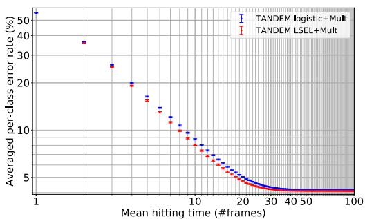

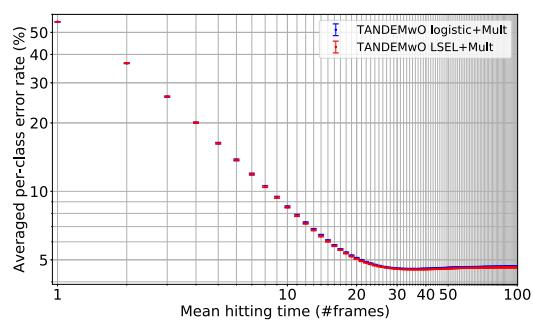

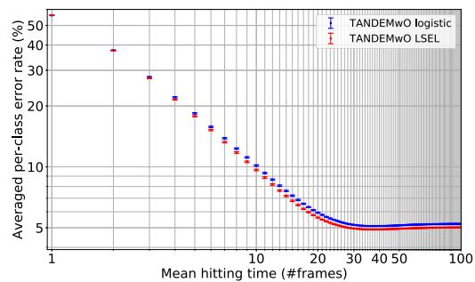

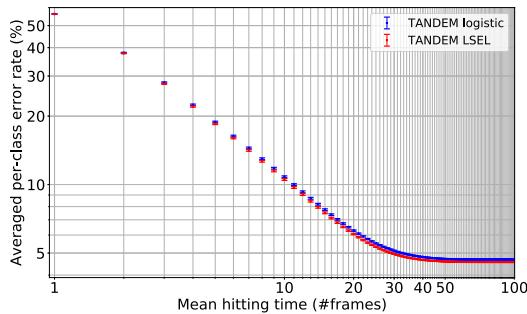  
Figure 6: LSEL v.s. Logistic Loss. The LSEL is consistently better than or at least comparable with the logistic loss. The dataset is NMNIST-100f. The error bar is the SEM. “TANDEM” means that the model is trained with the M-TANDEM formula, “TANDEMwO” means that the model is trained with the M-TANDEMwO formula, and “Mult” means that the multiplet loss is simultaneously used.

# F M-TANDEM vs. M-TANDEMwO Formulae

The M-TANDEM and M-TANDEMwO formulae enable to efficiently train RNNs on long sequences, which often cause vanishing gradients [33]. In addition, if a class signature is localized within a short temporal interval, not all frames can be informative [91, 56, 22, 23, 24, 37]. The M-TANDEM and M-TANDEMwO formulae alleviate these problems.

Figure 7 highlights the differences between the M-TANDEM and M-TANDEMwO formulae. The M-TANDEM formula covers all the timestamps, while the M-TANDEMwO formula only covers the last $N + 1$ timestamps. In two-hypothesis testing, the M-TANDEM formula is the canonical $N = 0$ (i.i.d.), the M-TANis used in the classic rmula reduces toT [85], while the $\begin{array} { r } { \hat { \lambda } _ { 1 , 2 } ( X ^ { ( 1 , T ) } ) = \sum _ { t = 1 } ^ { T } \log ( p ( x ^ { ( t ) } | 1 ) / p ( x ^ { ( t ) } | 2 ) ) } \end{array}$ M-TANDEMwO formula reduces to a sum of frame-by-frame scores when $N = 0$ .

Figure 8 compares the performance of the M-TANDEM and M-TANDEMwO formulae on three datasets: NMNIST, NMNIST-H, and NMNIST-100f. NMNIST [17] is similar to NMNIST-H but has much weaker noise. On relatively short sequences (NMNIST and NMNIST-H), the M-TANDEMwO formula is slightly better than or much the same as the M-TANDEM formula. On longer sequences (NMNIST-100f), the M-TANDEM formula outperforms the M-TANDEMwO formula; the latter slightly and gradually increases the error rate in the latter half of the sequences. In summary, the performance of the M-TANDEM and M-TANDEMwO formulae depends on the sequence length of the training datasets, and we recommend using the M-TANDEM formula as the first choice for long sequences $\gtrsim 1 0 0$ frames) and the M-TANDEM formula for short sequences $\sim 1 0$ frames).

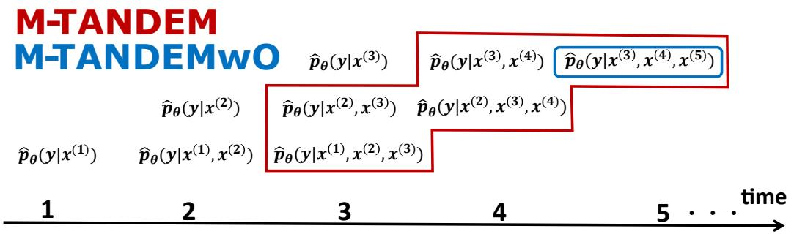  
Figure 7: M-TANDEM v.s. M-TANDEMwO with $N = 2$ . The posterior densities encircled in red and blue are used in the M-TANDEM and M-TANDEMwO formulae, respectively. We can see that the M-TANDEM formula covers all the frames, while the M-TANDEMwO formula covers only the last $N + 1$ frames.

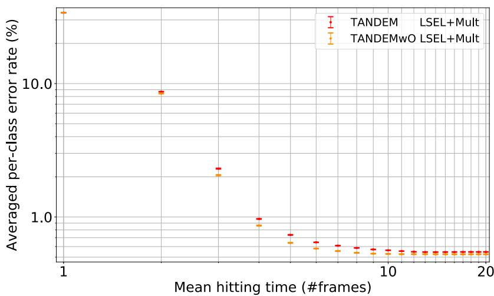

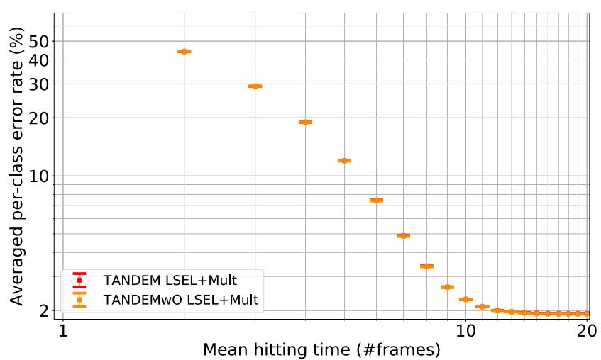

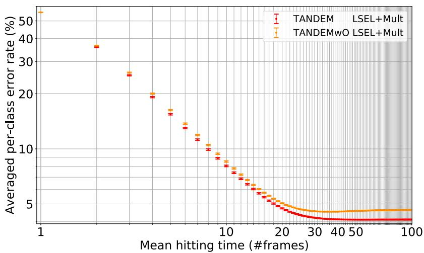  
Figure 8: M-TANDEM vs. M-TANDEMwO. Top: NMNIST. Middle: NMNIST-H. Bottom: NMNIST-100f. TANDEM and TANDEMwO means that the model is trained with the M-TANDEM and M-TANDEMwO formulae, respectively. Mult means that the multiplet loss is simultaneously used.

# G Proofs Related to Guess-Aversion

# G.1 Proof of Theorem 3.2

Proof. For any $k , l \in [ K ]$ $( k \neq l )$ ) and any $s \in S _ { k }$ , $e ^ { - ( s _ { k } - s _ { l } ) }$ is less than 1 by definition of $S _ { k }$ . Therefore, for any $k \in [ K ]$ , any $\boldsymbol { s } \in S _ { k }$ , any $s ^ { \prime } \in { \mathcal { A } }$ , and any cost matrix $C$ ,

$$
\ell (\boldsymbol {s}, k; C) := C _ {k} \log (1 + \sum_ {l (\neq k)} e ^ {- (s _ {k} - s _ {l})}) <   C _ {k} \log (1 + \sum_ {l (\neq k)} 1) = \ell (\boldsymbol {s} ^ {\prime}, k; C).
$$

# G.2 NGA-LSEL Is Not Guess-Averse

The NGA-LSEL is $\begin{array} { r } { \ell ( \pmb { \mathscr { s } } , y ; C ) = \sum _ { k ( \neq y ) } C _ { y , l } \log \bigr ( 1 + \sum _ { l ( \neq k ) } e ^ { s _ { l } - s _ { k } } \bigr ) } \end{array}$ (Section 3.3.3). We prove that the NGA-LSEL is not guess-averse by providing a counter example.

Proof. Assume that $K = 3$ , $C _ { k l } = 1 ( k \neq l )$ , $\pmb { \mathscr { s } } ( X _ { i } ^ { ( 1 , t ) } ) = ( 3 , 2 , - 1 0 0 ) ^ { \top }$ , and $y _ { i } = 1$ . Then,

$$
\begin{array}{l} \ell \left(\boldsymbol {s} \left(X _ {i} ^ {(1, t)}\right), y _ {i}; C\right) = \log \left(1 + e ^ {s _ {1} - s _ {2}} + e ^ {s _ {3} - s _ {2}}\right) + \log \left(1 + e ^ {s _ {1} - s _ {3}} + e ^ {s _ {2} - s _ {3}}\right) \\ = \log (1 + e ^ {1} + e ^ {- 1 0 2}) + \log (1 + e ^ {1 0 3} + e ^ {1 0 2}) \\ > \log (3) + \log (3) = \ell (\mathbf {0}, y _ {i}; C). \\ \end{array}
$$

# G.3 Another cost-sensitive LSEL

Alternatively to $\hat { L } _ { \mathrm { C L S E L } }$ , we can define

$$
\hat {L} _ {\mathrm {L S C E L}} (\boldsymbol {\theta}, C; S) := \frac {1}{M T} \sum_ {i = 1} ^ {M} \sum_ {t = 1} ^ {T} \log \left(1 + \sum_ {l (\neq y _ {i})} C _ {y _ {i} l} e ^ {- \hat {\lambda} _ {y _ {i} l} \left(X _ {i} ^ {(1, t)}; \boldsymbol {\theta}\right)}\right). \tag {56}
$$

$\hat { L } _ { \mathrm { L S C E L } }$ reduces to $\hat { L } _ { \mathrm { m o d L S E L } }$ when $C _ { k l } = \hat { \nu } _ { k l } ^ { - 1 }$ . The following theorem shows that $\hat { L } _ { \mathrm { L S C E L } }$ is guessaverse:

Theorem G.1. LˆLSCEL is guess-averse, provided that the log-likelihood vector

$$
\left(\log \hat {p} _ {\boldsymbol {\theta}} (X ^ {(1, t)} | y = 1), \log \hat {p} _ {\boldsymbol {\theta}} (X ^ {(1, t)} | y = 2), \dots , \log \hat {p} _ {\boldsymbol {\theta}} (X ^ {(1, t)} | y = K))\right) ^ {\top} \in \mathbb {R} ^ {K}
$$

is regarded as the score vector $s ( X ^ { ( 1 , t ) } )$ .

Proof. We use Lemma 1 in [5]:

Lemma G.1 (Lemma 1 in [5]). Let $\begin{array} { r } { \ell ( \pmb { \mathscr { s } } , y ; C ) = \gamma ( \sum _ { k \in [ K ] } C _ { y k } \phi ( \mathscr { s } _ { y } - \mathscr { s } _ { k } ) ) } \end{array}$ , where $\gamma : \mathbb { R }  \mathbb { R }$ is a monotonically increasing function and $\phi : \mathbb { R }  \mathbb { R }$ is a function such that for any $v > 0$ , $\phi ( v ) < \phi ( 0 )$ . Then, ` is guess-averse.

The statement of Theorem G.1 immediately follows by substituting $\gamma ( v ) = \log ( 1 + v )$ and $\phi ( v ) =$ $e ^ { - v }$ into Lemma G.1.

# G.4 Cost-Sensitive Logistic Losses Are Guess-Averse

We additionally prove that the cost-sensitive logistic losses defined below are also guess-averse, which may be of independent interest. We define a cost-sensitive logistic loss as

$$
\hat {L} _ {\mathrm {C} - \text {l o g i s t i c}} (\boldsymbol {\theta}, C; S) := \frac {1}{M T} \sum_ {i = 1} ^ {M} \sum_ {t = 1} ^ {T} \frac {1}{K - 1} \sum_ {l (\neq y _ {i})} C _ {y _ {i} l} \log \left(1 + e ^ {- \hat {\lambda} _ {y _ {i} l} \left(X _ {i} ^ {(1, t)}; \boldsymbol {\theta}\right)}\right) \tag {57}
$$

$\hat { L } _ { \mathrm { C } } .$ -logistic reduces to $\hat { L } _ { \mathrm { l o g i s t i c } }$ (defined in Appendix D.2) if $C _ { k l } = C _ { k } = M / K M _ { k }$ . $\hat { L } _ { \mathrm { C - l o g i s t i c } }$ is guess-averse:

Theorem G.2. $\hat { L } _ { C }$ -logistic is guess-averse, provided that the log-likelihood vector

$$
\left(\log \hat {p} \left(X ^ {(1, t)} \mid y = 1\right), \log \hat {p} \left(X ^ {(1, t)} \mid y = 2\right), \dots , \log \hat {p} \left(X ^ {(1, t)} \mid y = K\right)\right) ^ {\top} \in \mathbb {R} ^ {K} \tag {58}
$$

is regarded as the score vector $s ( X ^ { ( 1 , t ) } )$ .

Proof. The proof is parallel to that of Theorem 3.2. For any $k , l \in [ K ]$ $k \neq l )$ and any $s \in S _ { k }$ , $e ^ { - ( s _ { k } - s _ { l } ) }$ is less than 1 by definition of $S _ { k }$ . Therefore, for any $k , l \in [ K ]$ , any $\boldsymbol { s } \in \boldsymbol { S } _ { k }$ , any $s ^ { \prime } \in { \mathcal { A } }$ , and any cost matrix $C$ ,

$$
\ell (\boldsymbol {s}, k; C) := \frac {1}{K - 1} \sum_ {l (\neq k)} \log (1 + e ^ {- (s _ {k} - s _ {l})}) ^ {C _ {k l}} <   \frac {1}{K - 1} \sum_ {l (\neq k)} \log (1 + 1) ^ {C _ {k l}} = \ell (\boldsymbol {s} ^ {\prime}, k; C).
$$

We also define

$$
\hat {L} _ {\text {l o g i s t i c - C}} (\boldsymbol {\theta}, C; S) := \frac {1}{M T} \sum_ {i = 1} ^ {M} \sum_ {t = 1} ^ {T} \frac {1}{K - 1} \sum_ {l (\neq y _ {i})} \log \left(1 + C _ {y _ {i} l} e ^ {- \hat {\lambda} _ {y _ {i} l} \left(X _ {i} ^ {(1, t)}; \boldsymbol {\theta}\right)}\right). \tag {59}
$$

$\hat { L } _ { \mathrm { l o g i s t i c - C } }$ reduces to $\hat { L } _ { \mathrm { m o d l o g i s t i c } }$ if $C _ { k l } = \hat { \nu } _ { k l } ^ { - 1 }$ . $\hat { L } _ { \mathrm { l o g i s t i c - C } }$ is guess-averse:

Theorem G.3. $\hat { L } _ { l o g i s t i c - C }$ is guess-averse, provided that the log-likelihood vector

$$
\left(\log \hat {p} \left(X ^ {(1, t)} \mid y = 1\right), \log \hat {p} \left(X ^ {(1, t)} \mid y = 2\right), \dots , \log \hat {p} \left(X ^ {(1, t)} \mid y = K\right)\right) \top \in \mathbb {R} ^ {K} \tag {60}
$$

is regarded as the score vector $s ( X ^ { ( 1 , t ) } )$ .

To prove Theorem G.3, we first show the following lemma:

Lemma G.2. Let

$$
\ell (s, k,; C) = \gamma \Big (\prod_ {l \in [ K ]} \left(1 + C _ {k l} \phi \left(s _ {k} - s _ {l}\right)\right) \Big),
$$

where $\gamma : \mathbb { R }  \mathbb { R }$ is a monotonically increasing function and $\phi : \mathbb { R }  \mathbb { R }$ is a function such that for any $v > 0$ , $\phi ( v ) < \phi ( 0 )$ . Then, $\ell$ is guess-averse.

Proof. For any $\boldsymbol { s } \in S _ { k }$ and $l \in [ K ]$ ,

$$
\phi \left(s _ {k} - s _ {l}\right) <   \phi (0),
$$

because $\phi ( v ) < \phi ( 0 )$ and $s _ { k } > s _ { l }$ for all $v > 0$ and $l \in \left[ K \right] ( l \neq k )$ . Therefore,

$$
\prod_ {l \in [ K ]} (1 + C _ {k l} \phi (s _ {k} - s _ {l})) <   \prod_ {l \in [ K ]} (1 + C _ {k l} \phi (0)),
$$

because $C _ { k l } \geq 0$ for all $k , l \in [ K ]$ and $C _ { k l } \neq 0$ for at least one $l ( \neq k )$ . Hence, for any $k \in [ K ]$ , any $\boldsymbol { s } \in S _ { k }$ , any $s ^ { \prime } \in { \mathcal { A } }$ , and any cost matrix $C$ , the monotonicity of $\gamma$ shows that

$$
\ell (\boldsymbol {s}, k; C) = \gamma \left(\prod_ {k \in [ K ]} (1 + C _ {y k} \phi (s _ {y} - s _ {k}))\right) <   \gamma \left(\prod_ {k \in [ K ]} (1 + C _ {y k} \phi (0))\right) = \ell (\boldsymbol {s} ^ {\prime}, k; C).
$$

Proof of Theorem G.3. The statement immediately follows from Lemma G.2 by substituting $\gamma ( v ) =$ $\log ( v )$ and $\phi ( v ) = e ^ { - v }$ .

# H Ablation Study of Multiplet Loss and LSEL

Figure 9 shows the ablation study comparing the LSEL and the multiplet loss. The combination of the LSEL and the multiplet loss is statistically significantly better than either of the two losses (Appendix L). The multiplet loss also performs better than the LSEL. However, the independent use of the multiplet loss has drawbacks: The multiplet loss optimizes all the posterior densities output from the temporal integrator (magenta circles in Figure 4), while the LSEL uses the minimum posterior densities required to calculate the LLR matrix via the M-TANDEM or M-TANDEMwO formula. Therefore, the multiplet loss can lead to a suboptimal minimum for estimating the LLR matrix. In addition, the multiplet loss tends to suffer from the overconfidence problem [116], causing extreme values of LLRs.

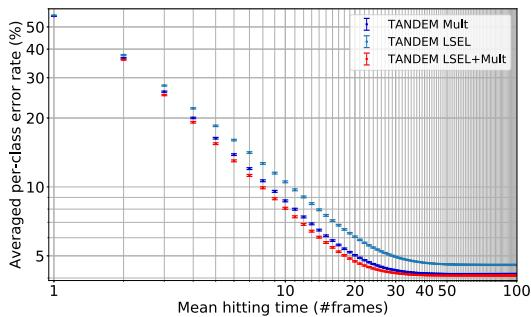  
Figure 9: Ablation Study of LSEL and Multiplet Loss on NMNIST-100f. The error bars show SEM. The combination of the LSEL with the multiplet loss gives the best result. The other two curves represent the models trained with the LSEL only and the multiplet loss only. Details of the experiment and the statistical tests are given in Appendices I and L.

# I Details of Experiment and More Results

Our computational infrastructure is DGX-1. The fundamental libraries used in the experiment are Numpy [119], Scipy [160], Tensorflow 2.0.0 [94] and PyTorch 1.2 [145].

The train/test splitting of NMNIST-H and NMNIST-100f follows the standard one of MNIST [45]. The validation set is separated from the last 10,000 examples in the training set. The train/test splitting of UCF101 and HMDB51 follows the official splitting #1. The validation set is separated from the training set, keeping the class frequency. All the videos in UCF101 and HMDB51 are clipped or repeated to make their temporal length equal (50 and 79, respectively). See also our official code. All the pixel values are divided by 127.5 and then subtracted by 1 before training the feature extractor.

Hyperparameter tuning is performed with the TPE algorithm [98], the default algorithm of Optuna [2]. For optimizers, we use Adam, Momentum, [138] or RMSprop [115]. Note that Adam and Momentum are not the originals ([131] and [147]), but AdamW and SGDW [138], which have a decoupled weight decay from the learning rate.

To obtain arbitrary points of the SAT curve, we compute the thresholds of MSPRT-TANDEM as follows. First, we compute all the LLR trajectories of the test examples. Second, we compute the maximum and minimum values of $| \hat { \lambda } ( X _ { i } ^ { ( 1 , t ) } ) |$ with respect to $i \in [ M ]$ and $t \in [ T ]$ . Third, we generate the thresholds between the maximum and minimum. The thresholds are linearly uniformly separated. Forth, we run the MSPRT and obtain a two-dimensional point for each threshold $x =$ mean hitting time, $y =$ averaged per-class error rate). Finally, we plot them on the speed-accuracy plane and linearly interpolate between two points with neighboring mean hitting times. If all the frames in a sequence are observed, the threshold of MSPRT-TANDEM is immediately collapsed to zero to force a decision.

# I.1 Common Feature Extractor

NMNIST-H and NMNIST-100f We first train the feature extractor to extract the bottleneck features, which are then used to train the temporal integrator, LSTM- $s / \mathrm { m }$ , and EARLIEST. Therefore, all the models in Figure 5 (MSPRT-TANDEM, NP test, LSTM-s/m, and EARLIEST) share exactly the same feature extractor, ResNet-110 [30, 31] with the bottleneck feature dimensions set to 128. The total number of trainable parameters is 6,904,608.

Tables 1 and 2 show the search spaces of hyperparameters. The batch sizes are 64 and 50 for NMNIST-H and NMNIST-100f, respectively. The numbers of training iterations are 6,200 and 40,000 for NMNIST-H and NMNIST-100f, respectively. For each tuning trial, we train ResNet and evaluate its averaged per-class accuracy on the validation set per 200 training steps, and after all training iterations, we save the best averaged per-class accuracy in that tuning trial. After all tuning trials, we choose the best hyperparameter combination, which is shown in cyan letters in Tables 1 and 2. We train ResNet with those hyperparameters to extract 128-dimensional bottleneck features, which are then used for the temporal integrator, LSTM- $s / \mathrm { m }$ , and EARLIEST. The averaged per-class accuracies of the feature extractors trained on NMNIST-H and on NMNIST-100f are $\sim 8 \hat { 4 } \%$ and $4 3 \%$ , respectively. The approximated runtime of a single tuning trial is 4.5 and 35 hours for NMNIST-H and NMNIST-100f, respectively, and the GPU consumption is 31 GBs for both datasets.

UCF101 and HMDB51 We use a pre-trained model without fine-tuning (Microsoft Vision ResNet-50 version 1.0.5 [93]). The final feature dimensions are 2048.

Table 1: Hyperparameter Search Space of Feature Extractor in Figure 5: NMNIST-H. The best hyperparameter combination is highlighted in cyan.   

<table><tr><td>LEARNING RATE</td><td>{10-2,5*10-3,10-3,5*10-4,10-4}</td></tr><tr><td>WEIGHT DECAY</td><td>{10-3,10-4,10-5}</td></tr><tr><td>OPTIMIZER</td><td>{ADAM,MOMENTUM,RMSPROP}</td></tr><tr><td># TUNING TRIALS</td><td>96</td></tr></table>

Table 2: Hyperparameter Search Space of Feature Extractor in Figure 5: NMNIST-100f. The best hyperparameter combination is highlighted in cyan.   

<table><tr><td>LEARNING RATE</td><td>{10-2, 5*10-3, 10-3, 5*10-4, 10-4, 10-5}</td></tr><tr><td>WEIGHT DECAY</td><td>{10-3, 10-4, 10-5}</td></tr><tr><td>OPTIMIZER</td><td>{ADAM, MOMENTUM, RMSPROP}</td></tr><tr><td># TUNING TRIALS</td><td>7</td></tr></table>

# I.2 Figure 5: NMNIST-H

MSPRT-TANDEM and NP test The approximation formula is the M-TANDEMwO formula. The loss function consists of the LSEL and the multiplet loss. The temporal integrator is Peephole LSTM [109] with the hidden state dimensions set to 128 followed by a fully-connected layer to output logits for classification. The temporal integrator has 133,760 trainable parameters. The batch size is fixed to 500. The number of training iterations is 5,000.

Table 3 shows the search space of hyperparameters. For each tuning trial, we train the temporal integrator and evaluate its mean averaged per-class accuracy8 per every 50 training iterations. After all training iterations, we save the best mean averaged per-class accuracy. After all tuning trials, we select the best combination of the hyperparameters, which is shown in Table 3 in cyan letters.

After fixing the hyperparameters, we then train LSTM arbitrary times. During each statistics trial, we train LSTM with the best fixed hyperparameters and evaluate its mean averaged per-class accuracy at every 50 training iterations. After all training iterations, we save the best weight parameters in terms of the mean averaged per-class accuracy. After all statistics trials, we can plot the SAT “points” with integer hitting times. The approximated runtime of one statistic trial is 3.5 hours, and the GPU consumption is 1.0 GB.

Table 3: Hyperparameter Search Space of MSPRT-TANDEM in Figure 5: NMNIST-H. The best hyperparameter combination is highlighted in cyan. $\gamma$ is defined as $L _ { \mathrm { t o t a l } } = L _ { \mathrm { m u l t } } + \gamma L _ { \mathrm { L S E L } }$ .   

<table><tr><td>ORDER</td><td>{0,1,5,10,15,19}</td></tr><tr><td>LEARNING RATE</td><td>{10-2, 10-3, 10-4}</td></tr><tr><td>WEIGHT DECAY</td><td>{10-3, 10-4, 10-5}</td></tr><tr><td>γ</td><td>{10-1, 1, 10, 102, 103}</td></tr><tr><td>OPTIMIZER</td><td>{ADAM, RMSPROP}</td></tr><tr><td># TUNING TRIALS</td><td>500</td></tr></table>

LSTM- $\mathbf { \nabla } \cdot \mathbf { s } / \mathbf { m }$ The backbone model is Peephole LSTM with the hidden state dimensions set to 128 followed by a fully-connected layer to output logits for classification. LSTM has 133,760 trainable parameters. The batch size is fixed to 500. The number of training iterations is 5,000.

Tables 4 and 5 show the search spaces of hyperparameters. For each tuning trial, we train LSTM and evaluate its mean averaged per-class accuracy per every 50 training iterations. After all training iterations, we save the best mean averaged per-class accuracy. After all tuning trials, we select the best combination of the hyperparameters, which is shown in Tables 4 and 5 in cyan letters.

After fixing the hyperparameters, we then train LSTM arbitrary times. During each statistics trial, we train LSTM with the best fixed hyperparameters and evaluate its mean averaged per-class accuracy per every 50 training iterations. After all training iterations, we save the best weight parameters in terms of the mean averaged per-class accuracy. After all statistics trials, we can plot the SAT “points” with integer hitting times. The approximated runtime of one statistics trial is 3.5 hours, and the GPU consumption is 1.0 GB.

Table 4: Hyperparameter Search Space of LSTM-s in Figure 5: NMNIST-H. The best hyperparameter combination is highlighted in cyan. $\gamma$ controls the strength of monotonicity and is defined as $L _ { \mathrm { t o t a l } } = L _ { \mathrm { c r o s s - e n t r o p y } } + \gamma L _ { \mathrm { r a n k i n g } }$ $+ \gamma L _ { \mathrm { r a n k i n g } }$ [51].   

<table><tr><td>LEARNING RATE</td><td>{10-2, 10-3, 10-4, 10-5}</td></tr><tr><td>WEIGHT DECAY</td><td>{10-3, 10-4, 10-5}</td></tr><tr><td>γ</td><td>{10-2, 10-1, 1, 10, 102}</td></tr><tr><td>OPTIMIZER</td><td>{ADAM, RMSPROP}</td></tr><tr><td># TUNING TRIALS</td><td>500</td></tr></table>

Table 5: Hyperparameter Search Space of LSTM-m in Figure 5: NMNIST-H. The best hyperparameter combination is highlighted in cyan. $\gamma$ controls the strength of monotonicity and is defined as $L _ { \mathrm { t o t a l } } = L _ { \mathrm { c r o s s - e n t r o p y } } + \dot { \gamma } L _ { \mathrm { r a n k i n g } }$ [51].   

<table><tr><td>LEARNING RATE</td><td>{10-2, 10-3, 10-4, 10-5}</td></tr><tr><td>WEIGHT DECAY</td><td>{10-3, 10-4, 10-5}</td></tr><tr><td>γ</td><td>{10-2, 10-1, 1, 10, 102}</td></tr><tr><td>OPTIMIZER</td><td>{ADAM, RMSPROP}</td></tr><tr><td># TUNING TRIALS</td><td>500</td></tr></table>

EARLIEST The main backbone is LSTM [124] with the hidden state dimensions set to 128. The whole architecture has 133,646 trainable parameters. The batch size is 1000. The number of training iterations is 20,000. EARLIEST has a parameter $\lambda$ (Not to be confused with the LLR matrix) that controls the speed-accuracy tradeoff. A larger $\lambda$ gives faster and less accurate decisions, and a smaller $\lambda$ gives slower and more accurate decisions. We train EARLIEST with two different λ’s: $1 0 ^ { - 2 }$ and $1 0 ^ { \overline { { 2 } } }$ .

Tables 6 and 7 show the search spaces of hyperparameters. For each tuning trial, we train EARLIEST and evaluate its averaged per-class accuracy per every 500 training iterations. After all training iterations, we save the best averaged per-class accuracy. After all tuning trials, we select the best combination of the hyperparameters, which is shown in Tables 6 and 7 in cyan letters.

After fixing the hyperparameters, we then train EARLIEST arbitrary times. During each statistics trial, we train EARLIEST with the best fixed hyperparameters and evaluate its mean averaged per-class accuracy per every 500 training iterations. After all training iterations, we save the best weight parameters in terms of the mean averaged per-class accuracy. After all statistics trials, we can plot the SAT “points.” Note that EARLIEST cannot change the decision policy after training, and thus one statistics trial gives only one point on the SAT graph; therefore, several statistics trials give only one point with an error bar. The approximated runtime of one statistics trial is 12 hours, and the GPU consumption is 1.4 GBs.

Table 6: Hyperparameter Search Space of EARLIEST with $\lambda = { \bf 1 0 ^ { - 2 } }$ in Figure 5: NMNIST-H. The best hyperparameter combination is highlighted in cyan.   

<table><tr><td>LEARNING RATE</td><td>{10-1, 10-2, 10-3, 10-4, 10-5}</td></tr><tr><td>WEIGHT DECAY</td><td>{10-3, 10-4, 10-5}</td></tr><tr><td>OPTIMIZER</td><td>{ADAM, RMSPROP}</td></tr><tr><td># TUNING TRIALS</td><td>500</td></tr></table>

# I.3 Figure 5: NMNIST-100f

MSPRT-TANDEM and NP test The approximation formula is the M-TANDEM formula. The loss function consists of the LSEL and the multiplet loss. The temporal integrator is Peephole LSTM [109] with the hidden state dimensions set to 128 followed by a fully-connected layer to output logits

Table 7: Hyperparameter Search Space of EARLIEST with $\lambda = 1 0 ^ { 2 }$ in Figure 5: NMNIST-H. The best hyperparameter combination is highlighted in cyan.   

<table><tr><td>LEARNING RATE</td><td>{10-1, 10-2, 10-3, 10-4, 10-5}</td></tr><tr><td>WEIGHT DECAY</td><td>{10-3, 10-4, 10-5}</td></tr><tr><td>OPTIMIZER</td><td>{ADAM, RMSPROP}</td></tr><tr><td># TUNING TRIALS</td><td>500</td></tr></table>

for classification. The temporal integrator has 133,760 trainable parameters. The batch size is fixed to 100. The number of training iterations is 5,000.

Table 8 shows the search space of hyperparameters. For each tuning trial, we train the temporal integrator and evaluate its mean averaged per-class accuracy per every 200 training iterations. After all training iterations, we save the best mean averaged per-class accuracy. After all tuning trials, we select the best combination of the hyperparameters, which is shown in Table 8 in cyan letters. The approximated runtime of one statistics trial is 1 hour, and the GPU consumption is 8.7 GBs.

Table 8: Hyperparameter Search Space of MSPRT-TANDEM in Figure 5: NMNIST-100f. The best hyperparameter combination is highlighted in cyan. $\gamma$ is defined as $L _ { \mathrm { t o t a l } } = L _ { \mathrm { m u l t } } + \gamma L _ { \mathrm { L S E L } }$ .   

<table><tr><td>ORDER</td><td>{0,25,50,75,99}</td></tr><tr><td>LEARNING RATE</td><td>{10-2,10-3,10-4}</td></tr><tr><td>WEIGHT DECAY</td><td>{10-3,10-4,10-5}</td></tr><tr><td>γ</td><td>{10-1,1,10,102,103}</td></tr><tr><td>OPTIMIZER</td><td>{ADAM,RMSPROP}</td></tr><tr><td># TUNING TRIALS</td><td>200</td></tr></table>

LSTM-s/m The backbone model is Peephole LSTM with the hidden state dimensions set to 128 followed by a fully-connected layer to output logits for classification. LSTM has 133,760 trainable parameters. The batch size is fixed to 500. The number of training iterations is 5,000.

Tables 9 and 10 show the search spaces of hyperparameters. For each tuning trial, we train LSTM and evaluate its mean averaged per-class accuracy per every 100 training iterations. After all training iterations, we save the best mean averaged per-class accuracy. After all tuning trials, we select the best combination of the hyperparameters, which is shown in Tables 9 and 10 in cyan letters.

The approximated runtime of one statistics trial is 5 hours, and the GPU consumption is 2.6 GBs.

Table 9: Hyperparameter Search Space of LSTM-s in Figure 5: NMNIST-100f. The best hyperparameter combination is highlighted in cyan. $\gamma$ controls the strength of monotonicity and is defined as $L _ { \mathrm { t o t a l } } = L _ { \mathrm { c r o s s - e n t r o p y } } + \gamma L _ { \mathrm { r a n k i n g } }$ [51].   

<table><tr><td>LEARNING RATE</td><td>{10-2, 10-3, 10-4, 10-5}</td></tr><tr><td>WEIGHT DECAY</td><td>{10-3, 10-4, 10-5}</td></tr><tr><td>γ</td><td>{10-2, 10-1, 1, 10, 102}</td></tr><tr><td>OPTIMIZER</td><td>{ADAM, RMSPROP}</td></tr><tr><td># TUNING TRIALS</td><td>200</td></tr></table>

EARLIEST The main backbone is LSTM [124] with the hidden state dimensions set to 128. The whole architecture has 133,646 trainable parameters. The batch size is 1000. The number of training iterations is 20,000. We train EARLIEST with two different $\lambda$ ’s: $1 0 ^ { - 2 }$ and $1 0 ^ { - 4 }$ .

Tables 11 and 12 show the search spaces of hyperparameters. For each tuning trial, we train EARLIEST and evaluate its averaged per-class accuracy per every 500 training iterations. After all training iterations, we save the best averaged per-class accuracy. After all tuning trials, we select the

Table 10: Hyperparameter Search Space of LSTM-m in Figure 5: NMNIST-100f. The best hyperparameter combination is highlighted in cyan. $\gamma$ controls the strength of monotonicity and is defined as $L _ { \mathrm { t o t a l } } = L _ { \mathrm { c r o s s - e n t r o p y } } + \gamma L _ { \mathrm { r a n k i n g } }$ [51].   

<table><tr><td>LEARNING RATE</td><td>{10-2, 10-3, 10-4, 10-5}</td></tr><tr><td>WEIGHT DECAY</td><td>{10-3, 10-4, 10-5}</td></tr><tr><td>γ</td><td>{10-2, 10-1, 1, 10, 102}</td></tr><tr><td>OPTIMIZER</td><td>{ADAM, RMSPROP}</td></tr><tr><td># TUNING TRIALS</td><td>200</td></tr></table>

best combination of the hyperparameters, which is shown in Tables 11 and 12 in cyan letters. The approximated runtime of a single tuning trial is 14 hours, and the GPU consumption is 2.0 GBs.

Table 11: Hyperparameter Search Space of EARLIEST with $\lambda = 1 0 ^ { - 2 }$ in Figure 5: NMNIST-100f. The best hyperparameter combination is highlighted in cyan.   

<table><tr><td>LEARNING RATE</td><td>{10-1, 10-2, 10-3, 10-4, 10-5}</td></tr><tr><td>WEIGHT DECAY</td><td>{10-3, 10-4, 10-5}</td></tr><tr><td>OPTIMIZER</td><td>{ADAM, RMSPROP}</td></tr><tr><td># TUNING TRIALS</td><td>200</td></tr></table>

Table 12: Hyperparameter Search Space of EARLIEST with $\lambda = 1 0 ^ { - 4 }$ in Figure 5: NMNIST-100f. The best hyperparameter combination is highlighted in cyan.   

<table><tr><td>LEARNING RATE</td><td>{10-1, 10-2, 10-3, 10-4, 10-5}</td></tr><tr><td>WEIGHT DECAY</td><td>{10-3, 10-4, 10-5}</td></tr><tr><td>OPTIMIZER</td><td>{ADAM, RMSPROP}</td></tr><tr><td># TUNING TRIALS</td><td>200</td></tr></table>

# I.4 Figure 5: UCF101

MSPRT-TANDEM and NP test The approximation formula is the M-TANDEM formula. The loss function consists of the LSEL and the multiplet loss. The temporal integrator is Peephole LSTM [109] with the hidden state dimensions set to 256 followed by a fully-connected layer to output logits for classification. The temporal integrator has 2,387,456 trainable parameters. The batch size is fixed to 256. The number of training iterations is 10,000. We use the effective number [101] as the cost matrix of the LSEL, instead of $1 / M _ { k }$ , to avoid over-emphasizing the minority class and to simplify the parameter tuning (only one extra parameter $\beta$ is introduced).

Table 13 shows the search space of hyperparameters. For each tuning trial, we train the temporal integrator and evaluate its mean averaged per-class accuracy per every 200 training iterations. After all training iterations, we save the best mean averaged per-class accuracy. After all tuning trials, we select the best combination of the hyperparameters, which is shown in Table 13 in cyan letters. The approximated runtime of one statistics trial is 8 hours, and the GPU consumption is 16–32 GBs.

LSTM- $\mathbf { \nabla } \cdot \mathbf { s } / \mathbf { m }$ The backbone model is Peephole LSTM with the hidden state dimensions set to 256 followed by a fully-connected layer to output logits for classification. LSTM has 2,387,456 trainable parameters. The batch size is fixed to 256. The number of training iterations is 5,000.

Tables 14 and 15 show the search spaces of hyperparameters. For each tuning trial, we train LSTM and evaluate its mean averaged per-class accuracy per every 200 training iterations. After all training iterations, we save the best mean averaged per-class accuracy. After all tuning trials, we select the best combination of the hyperparameters, which is shown in Tables 14 and 15 in cyan letters. The approximated runtime of one statistics trial is 3 hours, and the GPU consumption is 2.6 GBs.

Table 13: Hyperparameter Search Space of MSPRT-TANDEM in Figure 5: UCF101. The best hyperparameter combination is highlighted in cyan. $\gamma$ is defined as $L _ { \mathrm { t o t a l } } = L _ { \mathrm { m u l t } } + \gamma L _ { \mathrm { L S E L } }$ . $\beta$ controls the cost matrix [101].   

<table><tr><td>ORDER</td><td>{0,10,25,40,49}</td></tr><tr><td>LEARNING RATE</td><td>{10-3, 10-4, 10-5}</td></tr><tr><td>WEIGHT DECAY</td><td>{10-3, 10-4, 10-5}</td></tr><tr><td>γ</td><td>{10-1, 1, 10, 102}</td></tr><tr><td>OPTIMIZER</td><td>{ADAM, RMSPROP}</td></tr><tr><td>β</td><td>{0.99, 0.999, 0.9999, 0.99999, 1.}</td></tr><tr><td># TUNING TRIALS</td><td>100</td></tr></table>

Table 14: Hyperparameter Search Space of LSTM-s in Figure 5: UCF101. The best hyperparameter combination is highlighted in cyan. $\gamma$ controls the strength of monotonicity and is defined as $L _ { \mathrm { t o t a l } } = L _ { \mathrm { c r o s s - e n t r o p y } } + \gamma L _ { \mathrm { r a n k i n g } }$ [51].   

<table><tr><td>LEARNING RATE</td><td>{10-2, 10-3, 10-4, 10-5}</td></tr><tr><td>WEIGHT DECAY</td><td>{10-3, 10-4, 10-5}</td></tr><tr><td>γ</td><td>{10-2, 10-1, 1, 10, 102}</td></tr><tr><td>OPTIMIZER</td><td>{ADAM, RMSPROP}</td></tr><tr><td># TUNING TRIALS</td><td>100</td></tr></table>

EARLIEST The main backbone is LSTM [124] with the hidden state dimensions set to 256. The whole architecture has 2,387,817 trainable parameters. The batch size is 256. The number of training iterations is 5,000. We train EARLIEST with two different $\lambda$ ’s: $1 0 ^ { - 1 }$ and $1 0 ^ { - 1 0 }$ .

Tables 16 and 17 show the search spaces of hyperparameters. For each tuning trial, we train EARLIEST and evaluate its averaged per-class accuracy per every 500 training iterations. After all training iterations, we save the best averaged per-class accuracy. After all tuning trials, we select the best combination of the hyperparameters, which is shown in Tables 16 and 17 in cyan letters. The approximated runtime of a single tuning trial is 0.5 hours, and the GPU consumption is 2.0 GBs.

# I.5 Figure 5: HMDB51

MSPRT-TANDEM and NP test The approximation formula is the M-TANDEM formula. The loss function consists of the LSEL and the multiplet loss. The temporal integrator is Peephole LSTM [109] with the hidden state dimensions set to 256 followed by a fully-connected layer to output logits for classification. The temporal integrator has 2,374,656 trainable parameters. The batch size is fixed to 128. The number of training iterations is 10,000. We use the effective number [101] as the cost matrix of the LSEL, instead of $1 / M _ { k }$ , to avoid over-emphasising the minority class and to simplify the parameter tuning (only one extra parameter $\beta$ is introduced).

Table 18 shows the search space of hyperparameters. For each tuning trial, we train the temporal integrator and evaluate its mean averaged per-class accuracy per every 200 training iterations. After

Table 15: Hyperparameter Search Space of LSTM-m in Figure 5: UCF101. The best hyperparameter combination is highlighted in cyan. $\gamma$ controls the strength of monotonicity and is defined as $L _ { \mathrm { t o t a l } } = L _ { \mathrm { c r o s s - e n t r o p y } } + \gamma L _ { \mathrm { r a n k i n g } }$ $+ \gamma L _ { \mathrm { r a n k i n g } }$ [51].   

<table><tr><td>LEARNING RATE</td><td>{10-2, 10-3, 10-4, 10-5}</td></tr><tr><td>WEIGHT DECAY</td><td>{10-3, 10-4, 10-5}</td></tr><tr><td>γ</td><td>{10-2, 10-1, 1, 10, 102}</td></tr><tr><td>OPTIMIZER</td><td>{ADAM, RMSPROP}</td></tr><tr><td># TUNING TRIALS</td><td>100</td></tr></table>

Table 16: Hyperparameter Search Space of EARLIEST with $\lambda = 1 0 ^ { - 1 }$ in Figure 5: UCF101. The best hyperparameter combination is highlighted in cyan.   

<table><tr><td>LEARNING RATE</td><td>{10-1, 10-2, 10-3, 10-4, 10-5}</td></tr><tr><td>WEIGHT DECAY</td><td>{10-3, 10-4, 10-5}</td></tr><tr><td>OPTIMIZER</td><td>{ADAM, RMSPROP}</td></tr><tr><td># TUNING TRIALS</td><td>100</td></tr></table>

Table 17: Hyperparameter Search Space of EARLIEST with $\lambda = 1 0 ^ { - 1 0 }$ in Figure 5: UCF101. The best hyperparameter combination is highlighted in cyan.   

<table><tr><td>LEARNING RATE</td><td>{10-1, 10-2, 10-3, 10-4, 10-5}</td></tr><tr><td>WEIGHT DECAY</td><td>{10-3, 10-4, 10-5}</td></tr><tr><td>OPTIMIZER</td><td>{ADAM, RMSPROP}</td></tr><tr><td># TUNING TRIALS</td><td>100</td></tr></table>

all training iterations, we save the best mean averaged per-class accuracy. After all tuning trials, we select the best combination of the hyperparameters, which is shown in Table 18 in cyan letters. The approximated runtime of one statistics trial is 8 hours, and the GPU consumption is 16–32 GBs.

Table 18: Hyperparameter Search Space of MSPRT-TANDEM in Figure 5: HMDB51. The best hyperparameter combination is highlighted in cyan. $\gamma$ is defined as $L _ { \mathrm { t o t a l } } = L _ { \mathrm { m u l t } } + \gamma L _ { \mathrm { L S E L } }$ . $\beta$ controls the cost matrix [101].   

<table><tr><td>ORDER</td><td>{0,10,40,60,78}</td></tr><tr><td>LEARNING RATE</td><td>{10-3, 10-4, 10-5}</td></tr><tr><td>WEIGHT DECAY</td><td>{10-3, 10-4, 10-5}</td></tr><tr><td>γ</td><td>{10-1, 1, 10, 102}</td></tr><tr><td>OPTIMIZER</td><td>{ADAM, RMSPROP}</td></tr><tr><td>β</td><td>{0.99, 0.999, 0.9999, 0.99999, 1.}</td></tr><tr><td># TUNING TRIALS</td><td>100</td></tr></table>

LSTM- $\mathbf { \nabla } \cdot \mathbf { s } / \mathbf { m }$ The backbone model is Peephole LSTM with the hidden state dimensions set to 256 followed by a fully-connected layer to output logits for classification. LSTM has 2,374,656 trainable parameters. The batch size is fixed to 128. The number of training iterations is 10,000.

Tables 19 and 20 show the search spaces of hyperparameters. For each tuning trial, we train LSTM and evaluate its mean averaged per-class accuracy per every 200 training iterations. After all training iterations, we save the best mean averaged per-class accuracy. After all tuning trials, we select the best combination of the hyperparameters, which is shown in Tables 19 and 20 in cyan letters. The approximated runtime of one statistics trial is 3 hours, and the GPU consumption is 2.6 GBs.

EARLIEST The main backbone is LSTM [124] with the hidden state dimensions set to 256. The whole architecture has 2,374,967 trainable parameters. The batch size is 256. The number of training iterations is 5,000. We train EARLIEST with two different $\lambda$ ’s: $1 0 ^ { - 1 }$ and $1 0 ^ { - 1 0 }$ .

Tables 21 and 22 show the search spaces of hyperparameters. For each tuning trial, we train EARLIEST and evaluate its averaged per-class accuracy per every 500 training iterations. After all training iterations, we save the best averaged per-class accuracy. After all tuning trials, we select the best combination of the hyperparameters, which is shown in Tables 21 and 22 in cyan letters. The approximated runtime of a single tuning trial is 0.5 hours, and the GPU consumption is 2.0 GBs.

Table 19: Hyperparameter Search Space of LSTM-s in Figure 5: HMDB51. The best hyperparameter combination is highlighted in cyan. $\gamma$ controls the strength of monotonicity and is defined as $L _ { \mathrm { t o t a l } } = L _ { \mathrm { c r o s s - e n t r o p y } } + \gamma L _ { \mathrm { r a n k i n g } }$ $+ \gamma L _ { \mathrm { r a n k i n g } }$ [51].   

<table><tr><td>LEARNING RATE</td><td>{10-2, 10-3, 10-4, 10-5}</td></tr><tr><td>WEIGHT DECAY</td><td>{10-3, 10-4, 10-5}</td></tr><tr><td>γ</td><td>{10-2, 10-1, 1, 10, 102}</td></tr><tr><td>OPTIMIZER</td><td>{RMSPROP}</td></tr><tr><td># TUNING TRIALS</td><td>100</td></tr></table>

Table 20: Hyperparameter Search Space of LSTM-m in Figure 5: HMDB51. The best hyperparameter combination is highlighted in cyan. $\gamma$ controls the strength of monotonicity and is defined as $L _ { \mathrm { t o t a l } } = L _ { \mathrm { c r o s s - e n t r o p y } } + \gamma L _ { \mathrm { r a n k i n g } }$ $+ \gamma L _ { \mathrm { r a n k i n g } }$ [51].   

<table><tr><td>LEARNING RATE</td><td>{10-2, 10-3, 10-4, 10-5}</td></tr><tr><td>WEIGHT DECAY</td><td>{10-3, 10-4, 10-5}</td></tr><tr><td>γ</td><td>{10-2, 10-1, 1, 10, 102}</td></tr><tr><td>OPTIMIZER</td><td>{ADAM, RMSPROP}</td></tr><tr><td># TUNING TRIALS</td><td>100</td></tr></table>

# I.6 Figure 1: LLR Trajectories

We plot ten different $i$ ’s randomly selected from the validation set of NMNIST-100f. The base temporal integrator is selected from the models used for NMNIST-100f in Figure 5. More example trajectories are shown in Figure 10 in Appendix J.

# I.7 Figure 9: Ablation Study of LSEL and Multiplet Loss

The training procedure is totally similar to that of Figure 5. Tables 23 and 24 show the search spaces of hyperparameters. “TANDEM LSEL+Mult” is the same model as “MSPRT-TANDEM” in Figure 5 (NMNIST-100f).

Table 21: Hyperparameter Search Space of EARLIEST with $\lambda = 1 0 ^ { - 1 }$ in Figure 5: HMDB51. The best hyperparameter combination is highlighted in cyan.   

<table><tr><td>LEARNING RATE</td><td>{10-1, 10-2, 10-3, 10-4, 10-5}</td></tr><tr><td>WEIGHT DECAY</td><td>{10-3, 10-4, 10-5}</td></tr><tr><td>OPTIMIZER</td><td>{ADAM, RMSPROP}</td></tr><tr><td># TUNING TRIALS</td><td>100</td></tr></table>

Table 22: Hyperparameter Search Space of EARLIEST with $\lambda = 1 0 ^ { - 1 0 }$ in Figure 5: HMDB51. The best hyperparameter combination is highlighted in cyan.   

<table><tr><td>LEARNING RATE</td><td>{10-1, 10-2, 10-3, 10-4, 10-5}</td></tr><tr><td>WEIGHT DECAY</td><td>{10-3, 10-4, 10-5}</td></tr><tr><td>OPTIMIZER</td><td>{ADAM, RMSPROP}</td></tr><tr><td># TUNING TRIALS</td><td>100</td></tr></table>

Table 23: Hyperparameter Search Space of “TANDEM Mult” in Figure 9. The best hyperparameter combination is highlighted in cyan.   

<table><tr><td>ORDER</td><td>{0,25,50,75,99}</td></tr><tr><td>LEARNING RATE</td><td>{10-2,10-3,10-4}</td></tr><tr><td>WEIGHT DECAY</td><td>{10-3,10-4,10-5}</td></tr><tr><td>γ</td><td>N/A</td></tr><tr><td>OPTIMIZER</td><td>{ADAM,RMSPROP}</td></tr><tr><td># TUNING TRIALS</td><td>200</td></tr></table>

Table 24: Hyperparameter Search Space of “TANDEM LSEL” in Figure 9. The best hyperparameter combination is highlighted in cyan.   

<table><tr><td>ORDER</td><td>{0,25,50,75,99}</td></tr><tr><td>LEARNING RATE</td><td>{10-2,10-3,10-4}</td></tr><tr><td>WEIGHT DECAY</td><td>{10-3,10-4,10-5}</td></tr><tr><td>γ</td><td>{10-1,1,10,102,103}</td></tr><tr><td>OPTIMIZER</td><td>{ADAM,RMSPROP}</td></tr><tr><td># TUNING TRIALS</td><td>200</td></tr></table>

# I.8 Figure 2 Left: LSEL v.s. Conventional DRE Losses

We define the loss functions used in Figure 2. Conventional DRE losses are often biased (LLLR), unbounded (LSIF and DSKL), or numerically unstable (LSIF, LSIFwC, and BARR), especially when applied to multiclass classification, leading to suboptimal performances (Figure 2).) Because conventional DRE losses are restricted to binary DRE, we modify two LSIF-based and three KLIEPbased loss functions for DRME. The logistic loss we use is introduced in Appendix D.

The original LSIF [36] is based on a kernel method and estimates density ratios via minimizing the mean squared error between $p$ and $\hat { r } q$ ( $\hat { r } : = \hat { p } / \hat { q }$ ). We define a variant of LSIF for DRME as

$$
\hat {L} _ {\mathrm {L S I F}} := \sum_ {t \in [ T ]} \sum_ {\substack {k, l \in [ K ] \\ (k \neq l)}} \left[ \frac {1}{M _ {l}} \sum_ {i \in I _ {l}} \hat {\Lambda} _ {k l} ^ {2} \left(X _ {i} ^ {(1, t)}\right) - \frac {1}{M _ {k}} \sum_ {i \in I _ {k}} \hat {\Lambda} _ {k l} \left(X _ {i} ^ {(1, t)}\right) \right], \tag{61}
$$

where the likelihood ratio is denoted by $\hat { \Lambda } ( X ) : = e ^ { \hat { \lambda } ( X ) } = \hat { p } ( X | k ) / \hat { p } ( X | l )$ . Because of the $k , l$ - summation, $\hat { L } _ { \mathrm { L S I F } }$ is symmetric with respect to the denominator and numerator, unlike the original LSIF. Therefore, we can expect that $\bar { L } _ { \mathrm { L S I F } }$ is more stable than the original one. However, $\hat { L } _ { \mathrm { L S I F } }$ inherits the problems of the original LSIF; it is unbounded and numerically unstable. The latter is due to dealing with $\hat { \Lambda }$ directly, which easily explodes when the denominator is small. This instability is not negligible, especially when LSIF is used with DNNs. The following LSIF with Constraint (LSIFwC)9 avoids the explosion by adding a constraint:

$$
\begin{array}{l} \hat{L}_{\mathrm{LSIFwC}}:= \sum_{t\in [T]}\sum_{\substack{k,l\in [K]\\ (k\neq l)}}\Bigg[\frac{1}{M_{l}}\sum_{i\in I_{l}}\hat{\Lambda}_{kl}^{2}(X_{i}^{(1,t)}) - \frac{1}{M_{k}}\sum_{i\in I_{k}}\hat{\Lambda}_{kl}(X_{i}^{(1,t)}) \\ + \gamma \left| \frac {1}{M _ {l}} \sum_ {i \in I _ {l}} \hat {\Lambda} _ {k l} \left(X _ {i} ^ {(1, t)}\right) - 1 \right|, \tag {62} \\ \end{array}
$$

where $\gamma > 0$ is a hyperparameter. $\hat { L } _ { L S I F w C }$ is symmetric and bounded for sufficiently large $\gamma$ . However, it is still numerically unstable due to $\hat { \Lambda }$ . Note that the constraint term is equivalent to the probability normalization $\textstyle \int d { \dot { x } } p ( x | l ) ( { \hat { p } } ( x | k ) / { \hat { p } } ( x | l ) ) = 1$ .

DSKL [38], BARR [38], and LLLR [17] are based on KLIEP [76], which estimates density ratios via minimizing the Kullback-Leibler divergence [133] between $p$ and rqˆ ( $\hat { r } : = \hat { p } / \hat { q }$ ). We define a variant of DSKL for DRME as

$$
\hat {L} _ {\mathrm {D S K L}} := \sum_ {t \in [ T ]} \sum_ {\substack {k, l \in [ K ] \\ (k \neq l)}} \left[ \frac {1}{M _ {l}} \sum_ {i \in I _ {l}} \hat {\lambda} _ {k l} \left(X _ {i} ^ {(1, t)}\right) - \frac {1}{M _ {k}} \sum_ {i \in I _ {k}} \hat {\lambda} _ {k l} \left(X _ {i} ^ {(1, t)}\right) \right] \tag{63}
$$

The original DSKL is symmetric, and the same is true for $\hat { L } _ { \mathrm { B A R R } }$ , while the original KLIEP is not. $\hat { L } _ { \mathrm { B A R R } }$ is relatively stable compared with $\hat { L } _ { \mathrm { L S I F } }$ and $\hat { L } _ { \mathrm { L S I F w C } }$ because it does not include $\hat { \Lambda }$ but $\hat { \lambda }$ ; still, $\hat { L } _ { \mathrm { D S K L } }$ is unbounded and can diverge. BARR for DRME is

$$
\hat {L} _ {\text {B A R R}} := \sum_ {t \in [ T ]} \sum_ {\substack {k, l \in [ K ] \\ (k \neq l)}} \left[ - \frac {1}{M _ {k}} \sum_ {i \in I _ {k}} \hat {\lambda} _ {k l} \left(X _ {i} ^ {(1, t)}\right) + \gamma \left| \frac {1}{M _ {l}} \sum_ {i \in I _ {l}} \hat {\Lambda} _ {k l} \left(X _ {i} ^ {(1, t)}\right) - 1 \right| \right], \tag{64}
$$

where $\gamma > 0$ is a hyperparameter. $\hat { L } _ { \mathrm { B A R R } }$ is symmetric and bounded because of the second term but is numerically unstable because of $\hat { \Lambda }$ . LLLR for DRME is

$$
\hat {L} _ {\text {L L L R}} := \sum_ {t \in [ T ]} \sum_ {\substack {k, l \in [ K ] \\ (k \neq l)}} \frac {1}{M _ {k} + M _ {l}} \left[ \sum_ {i \in I _ {l}} \sigma \left(\hat {\lambda} _ {k l} \left(X _ {i} ^ {(1, t)}\right)\right) + \sum_ {i \in I _ {k}} \left(1 - \sigma \left(\hat {\lambda} _ {k l} \left(X _ {i} ^ {(1, t)}\right)\right)\right) \right], \tag{65}
$$

where $\sigma$ is the sigmoid function. LLLR is symmetric, bounded, and numerically stable but is biased in the sense that it does not necessarily converge to the optimal solution $\lambda$ ; i.e., the probability normalization constraint, which is explicitly included in the original KLIEP, cannot be exactly satisfied. Finally, the logistic loss is defined as (52).

All the models share the same feature extractor (Appendix I.1) and temporal integrator (Appendix I.2) without the M-TANDEM(wO) approximation or multiplet loss. The search spaces of hyperparameters are given in Tables 25–31. The other setting follows Appendix I.2.

Table 25: Hyperparameter Search Space of LSIF in Figure 2 Left. The best hyperparameter combination is highlighted in cyan.   

<table><tr><td>LEARNING RATE</td><td>{10-3, 10-4, 10-5, 10-6}</td></tr><tr><td>WEIGHT DECAY</td><td>{10-2, 10-3, 10-4, 10-5}</td></tr><tr><td>OPTIMIZER</td><td>{ADAM, RMSPROP, MOMENTUM}</td></tr><tr><td># TUNING TRIALS</td><td>150</td></tr></table>

Table 26: Hyperparameter Search Space of LSIFwC in Figure 2 Left. The best hyperparameter combination is highlighted in cyan.   

<table><tr><td>LEARNING RATE</td><td>{10-3, 10-4, 10-5, 10-6}</td></tr><tr><td>WEIGHT DECAY</td><td>{10-2, 10-3, 10-4, 10-5}</td></tr><tr><td>γ</td><td>{10-4, 10-3, 10-2, 1, 10}</td></tr><tr><td>OPTIMIZER</td><td>{ADAM, RMSPROP, MOMENTUM}</td></tr><tr><td># TUNING TRIALS</td><td>150</td></tr></table>

Table 27: Hyperparameter Search Space of DSKL in Figure 2 Left. The best hyperparameter combination is highlighted in cyan.   

<table><tr><td>LEARNING RATE</td><td>{10-3, 10-4, 10-5, 10-6}</td></tr><tr><td>WEIGHT DECAY</td><td>{10-2, 10-3, 10-4, 10-5}</td></tr><tr><td>OPTIMIZER</td><td>{ADAM, RMSPROP, MOMENTUM}</td></tr><tr><td># TUNING TRIALS</td><td>150</td></tr></table>

# I.9 Figure 2 Right: LSEL v.s. Logistic Loss

The experimental condition follows that of Appendix I.3. The logistic loss is defined as (52). The hyperparameters are given in Tables 32 and 33.

Table 28: Hyperparameter Search Space of BARR in Figure 2 Left. The best hyperparameter combination is highlighted in cyan.   

<table><tr><td>LEARNING RATE</td><td>{10-3, 10-4, 10-5, 10-6}</td></tr><tr><td>WEIGHT DECAY</td><td>{10-2, 10-3, 10-4, 10-5}</td></tr><tr><td>γ</td><td>{10-4, 10-3, 10-2, 1, 10}</td></tr><tr><td>OPTIMIZER</td><td>{ADAM, RMSPROP, MOMENTUM}</td></tr><tr><td># TUNING TRIALS</td><td>150</td></tr></table>

Table 29: Hyperparameter Search Space of LLLR in Figure 2 Left. The best hyperparameter combination is highlighted in cyan.   

<table><tr><td>LEARNING RATE</td><td>{10-3, 10-4, 10-5, 10-6}</td></tr><tr><td>WEIGHT DECAY</td><td>{10-2, 10-3, 10-4, 10-5}</td></tr><tr><td>OPTIMIZER</td><td>{ADAM, RMSPROP, MOMENTUM}</td></tr><tr><td># TUNING TRIALS</td><td>150</td></tr></table>

Table 30: Hyperparameter Search Space of Logistic Loss in Figure 2 Left. The best hyperparameter combination is highlighted in cyan.   

<table><tr><td>LEARNING RATE</td><td>{10-3, 10-4, 10-5, 10-6}</td></tr><tr><td>WEIGHT DECAY</td><td>{10-2, 10-3, 10-4, 10-5}</td></tr><tr><td>OPTIMIZER</td><td>{ADAM, RMSPROP, MOMENTUM}</td></tr><tr><td># TUNING TRIALS</td><td>150</td></tr></table>

Table 31: Hyperparameter Search Space of LSEL in Figure 2 Left. The best hyperparameter combination is highlighted in cyan.   

<table><tr><td>LEARNING RATE</td><td>{10-3, 10-4, 10-5, 10-6}</td></tr><tr><td>WEIGHT DECAY</td><td>{10-2, 10-3, 10-4, 10-5}</td></tr><tr><td>OPTIMIZER</td><td>{ADAM, RMSPROP, MOMENTUM}</td></tr><tr><td># TUNING TRIALS</td><td>150</td></tr></table>

Table 32: Hyperparameter Search Space of Logistic Loss in Figure 2 Right. The best hyperparameter combination is highlighted in cyan.   

<table><tr><td>ORDER</td><td>{ 0, 25, 50, 75, 99}</td></tr><tr><td>LEARNING RATE</td><td>{ 10-2, 10-3, 10-4}</td></tr><tr><td>WEIGHT DECAY</td><td>{ 10-3, 10-4, 10-5}</td></tr><tr><td>γ</td><td>{ 10-1, 1, 10, 102, 103}</td></tr><tr><td>OPTIMIZER</td><td>{ ADAM, RMSPROP}</td></tr><tr><td># TUNING TRIALS</td><td>300</td></tr></table>

Table 33: Hyperparameter Search Space of LSEL in Figure 2 Right. The best hyperparameter combination is highlighted in cyan.   

<table><tr><td>ORDER</td><td>{0,25,50,75,99}</td></tr><tr><td>LEARNING RATE</td><td>{10-2,10-3,10-4}</td></tr><tr><td>WEIGHT DECAY</td><td>{10-3,10-4,10-5}</td></tr><tr><td>γ</td><td>{10-1,1,10,102,103}</td></tr><tr><td>OPTIMIZER</td><td>{ADAM,RMSPROP}</td></tr><tr><td># TUNING TRIALS</td><td>300</td></tr></table>

# I.10 Exact Error Rates in Figures 5 and 9

Tables 34–41 show the averaged per-class error rates plotted in the figures in Section 4.

Table 34: Averaged Per-Class Error Rates $( \% )$ and SEM of Figure 2 (Left: NMNIST-H). Blanks mean N/A.   

<table><tr><td>TIME</td><td>LSIF</td><td>LSIFwC</td><td>DSKL</td><td>BARR</td></tr><tr><td>1.00</td><td>83.822 ± 2.142</td><td>81.585 ± 2.908</td><td></td><td>66.579 ± 0.108</td></tr><tr><td>2.00</td><td>73.330 ± 2.142</td><td>67.749 ± 2.908</td><td>45.145 ± 0.170</td><td>45.902 ± 0.108</td></tr><tr><td>3.00</td><td>70.492 ± 2.142</td><td>63.237 ± 2.908</td><td>30.719 ± 0.170</td><td>30.698 ± 0.108</td></tr><tr><td>4.00</td><td>68.258 ± 2.142</td><td>60.061 ± 2.908</td><td>20.409 ± 0.170</td><td>20.172 ± 0.108</td></tr><tr><td>5.00</td><td>66.485 ± 2.142</td><td>57.860 ± 2.908</td><td>18.102 ± 0.170</td><td>12.990 ± 0.108</td></tr><tr><td>6.00</td><td>64.975 ± 2.142</td><td>55.939 ± 2.908</td><td>17.899 ± 0.170</td><td>8.374 ± 0.108</td></tr><tr><td>7.00</td><td>63.549 ± 2.142</td><td>54.317 ± 2.908</td><td>14.442 ± 0.170</td><td>5.529 ± 0.108</td></tr><tr><td>8.00</td><td>62.137 ± 2.142</td><td>52.635 ± 2.908</td><td>12.942 ± 0.170</td><td>3.993 ± 0.108</td></tr><tr><td>9.00</td><td>60.551 ± 2.142</td><td>50.886 ± 2.908</td><td>11.681 ± 0.170</td><td>3.202 ± 0.108</td></tr><tr><td>10.00</td><td>58.657 ± 2.142</td><td>48.947 ± 2.908</td><td>10.368 ± 0.170</td><td>2.787 ± 0.108</td></tr><tr><td>11.00</td><td>56.716 ± 2.142</td><td>46.501 ± 2.908</td><td>9.858 ± 0.170</td><td>2.563 ± 0.108</td></tr><tr><td>12.00</td><td>54.976 ± 2.142</td><td>44.114 ± 2.908</td><td>8.493 ± 0.170</td><td>2.457 ± 0.108</td></tr><tr><td>13.00</td><td>52.800 ± 2.142</td><td>41.901 ± 2.908</td><td>7.909 ± 0.170</td><td>2.404 ± 0.108</td></tr><tr><td>14.00</td><td>49.940 ± 2.142</td><td>40.073 ± 2.908</td><td>7.151 ± 0.170</td><td>2.376 ± 0.108</td></tr><tr><td>15.00</td><td>47.293 ± 2.142</td><td>38.990 ± 2.908</td><td>6.216 ± 0.170</td><td>2.359 ± 0.108</td></tr><tr><td>16.00</td><td>45.203 ± 2.142</td><td>38.013 ± 2.908</td><td>5.821 ± 0.170</td><td>2.352 ± 0.108</td></tr><tr><td>17.00</td><td>42.664 ± 2.142</td><td>36.799 ± 2.908</td><td>4.632 ± 0.170</td><td>2.348 ± 0.108</td></tr><tr><td>18.00</td><td>38.406 ± 2.142</td><td>34.540 ± 2.908</td><td>3.971 ± 0.170</td><td>2.345 ± 0.108</td></tr><tr><td>19.00</td><td>32.666 ± 2.142</td><td>30.737 ± 2.908</td><td>3.484 ± 0.170</td><td>2.343 ± 0.108</td></tr><tr><td>20.00</td><td>30.511 ± 2.142</td><td>29.880 ± 2.908</td><td>2.088 ± 0.170</td><td>2.343 ± 0.108</td></tr><tr><td>TRIALS</td><td>40</td><td>40</td><td>60</td><td>40</td></tr></table>

<table><tr><td>TIME</td><td>LLL R</td><td>LOGISTIC</td><td>LSEL</td></tr><tr><td>1.00</td><td>63.930 ± 0.026</td><td></td><td>63.956 ± 0.020</td></tr><tr><td>2.00</td><td>44.250 ± 0.026</td><td>43.873 ± 0.097</td><td>43.918 ± 0.020</td></tr><tr><td>3.00</td><td>30.693 ± 0.026</td><td>29.058 ± 0.097</td><td>28.957 ± 0.020</td></tr><tr><td>4.00</td><td>21.370 ± 0.026</td><td>18.973 ± 0.097</td><td>18.865 ± 0.020</td></tr><tr><td>5.00</td><td>14.834 ± 0.026</td><td>11.992 ± 0.097</td><td>11.910 ± 0.020</td></tr><tr><td>6.00</td><td>10.386 ± 0.026</td><td>7.522 ± 0.097</td><td>7.444 ± 0.020</td></tr><tr><td>7.00</td><td>7.516 ± 0.026</td><td>4.970 ± 0.097</td><td>4.877 ± 0.020</td></tr><tr><td>8.00</td><td>5.693 ± 0.026</td><td>3.485 ± 0.097</td><td>3.403 ± 0.020</td></tr><tr><td>9.00</td><td>4.563 ± 0.026</td><td>2.702 ± 0.097</td><td>2.647 ± 0.020</td></tr><tr><td>10.00</td><td>3.818 ± 0.026</td><td>2.326 ± 0.097</td><td>2.288 ± 0.020</td></tr><tr><td>11.00</td><td>3.316 ± 0.026</td><td>2.133 ± 0.097</td><td>2.103 ± 0.020</td></tr><tr><td>12.00</td><td>2.961 ± 0.026</td><td>2.030 ± 0.097</td><td>2.010 ± 0.020</td></tr><tr><td>13.00</td><td>2.705 ± 0.026</td><td>1.985 ± 0.097</td><td>1.977 ± 0.020</td></tr><tr><td>14.00</td><td>2.516 ± 0.026</td><td>1.964 ± 0.097</td><td>1.956 ± 0.020</td></tr><tr><td>15.00</td><td>2.365 ± 0.026</td><td>1.951 ± 0.097</td><td>1.941 ± 0.020</td></tr><tr><td>16.00</td><td>2.254 ± 0.026</td><td>1.943 ± 0.097</td><td>1.934 ± 0.020</td></tr><tr><td>17.00</td><td>2.163 ± 0.026</td><td>1.938 ± 0.097</td><td>1.932 ± 0.020</td></tr><tr><td>18.00</td><td>2.094 ± 0.026</td><td>1.937 ± 0.097</td><td>1.932 ± 0.020</td></tr><tr><td>19.00</td><td>2.036 ± 0.026</td><td>1.937 ± 0.097</td><td>1.932 ± 0.020</td></tr><tr><td>20.00</td><td>1.968 ± 0.026</td><td>1.937 ± 0.097</td><td>1.932 ± 0.020</td></tr><tr><td>TRIALS</td><td>80</td><td>80</td><td>80</td></tr></table>

Table 35: Averaged Per-Class Error Rates $( \% )$ and SEM of Figure 2 (Right: NMNIST-100f). Frames 1–50. Blanks mean N/A.   

<table><tr><td>TIME</td><td>LOGISTIC (WITH M-TANDEM)</td><td>LSEL (WITH M-TANDEM)</td></tr><tr><td>1.00</td><td>56.273 ± 0.045</td><td>56.196 ± 0.044</td></tr><tr><td>2.00</td><td>37.772 ± 0.045</td><td>37.492 ± 0.044</td></tr><tr><td>3.00</td><td>27.922 ± 0.045</td><td>27.520 ± 0.044</td></tr><tr><td>4.00</td><td>22.282 ± 0.045</td><td>21.889 ± 0.044</td></tr><tr><td>5.00</td><td>18.725 ± 0.045</td><td>18.369 ± 0.044</td></tr><tr><td>6.00</td><td>16.251 ± 0.045</td><td>15.901 ± 0.044</td></tr><tr><td>7.00</td><td>14.383 ± 0.045</td><td>14.035 ± 0.044</td></tr><tr><td>8.00</td><td>12.898 ± 0.045</td><td>12.590 ± 0.044</td></tr><tr><td>9.00</td><td>11.730 ± 0.045</td><td>11.421 ± 0.044</td></tr><tr><td>10.00</td><td>10.758 ± 0.045</td><td>10.468 ± 0.044</td></tr><tr><td>11.00</td><td>9.943 ± 0.045</td><td>9.659 ± 0.044</td></tr><tr><td>12.00</td><td>9.245 ± 0.045</td><td>8.992 ± 0.044</td></tr><tr><td>13.00</td><td>8.663 ± 0.045</td><td>8.410 ± 0.044</td></tr><tr><td>14.00</td><td>8.158 ± 0.045</td><td>7.907 ± 0.044</td></tr><tr><td>15.00</td><td>7.721 ± 0.045</td><td>7.472 ± 0.044</td></tr><tr><td>16.00</td><td>7.341 ± 0.045</td><td>7.096 ± 0.044</td></tr><tr><td>17.00</td><td>7.006 ± 0.045</td><td>6.776 ± 0.044</td></tr><tr><td>18.00</td><td>6.717 ± 0.045</td><td>6.498 ± 0.044</td></tr><tr><td>19.00</td><td>6.476 ± 0.045</td><td>6.257 ± 0.044</td></tr><tr><td>20.00</td><td>6.258 ± 0.045</td><td>6.041 ± 0.044</td></tr><tr><td>21.00</td><td>6.069 ± 0.045</td><td>5.851 ± 0.044</td></tr><tr><td>22.00</td><td>5.900 ± 0.045</td><td>5.686 ± 0.044</td></tr><tr><td>23.00</td><td>5.748 ± 0.045</td><td>5.545 ± 0.044</td></tr><tr><td>24.00</td><td>5.615 ± 0.045</td><td>5.423 ± 0.044</td></tr><tr><td>25.00</td><td>5.502 ± 0.045</td><td>5.317 ± 0.044</td></tr><tr><td>26.00</td><td>5.406 ± 0.045</td><td>5.221 ± 0.044</td></tr><tr><td>27.00</td><td>5.318 ± 0.045</td><td>5.136 ± 0.044</td></tr><tr><td>28.00</td><td>5.246 ± 0.045</td><td>5.064 ± 0.044</td></tr><tr><td>29.00</td><td>5.175 ± 0.045</td><td>5.001 ± 0.044</td></tr><tr><td>30.00</td><td>5.114 ± 0.045</td><td>4.947 ± 0.044</td></tr><tr><td>31.00</td><td>5.057 ± 0.045</td><td>4.898 ± 0.044</td></tr><tr><td>32.00</td><td>5.011 ± 0.045</td><td>4.854 ± 0.044</td></tr><tr><td>33.00</td><td>4.974 ± 0.045</td><td>4.816 ± 0.044</td></tr><tr><td>34.00</td><td>4.939 ± 0.045</td><td>4.784 ± 0.044</td></tr><tr><td>35.00</td><td>4.908 ± 0.045</td><td>4.757 ± 0.044</td></tr><tr><td>36.00</td><td>4.882 ± 0.045</td><td>4.733 ± 0.044</td></tr><tr><td>37.00</td><td>4.858 ± 0.045</td><td>4.713 ± 0.044</td></tr><tr><td>38.00</td><td>4.837 ± 0.045</td><td>4.694 ± 0.044</td></tr><tr><td>39.00</td><td>4.818 ± 0.045</td><td>4.676 ± 0.044</td></tr><tr><td>40.00</td><td>4.801 ± 0.045</td><td>4.661 ± 0.044</td></tr><tr><td>41.00</td><td>4.786 ± 0.045</td><td>4.649 ± 0.044</td></tr><tr><td>42.00</td><td>4.773 ± 0.045</td><td>4.639 ± 0.044</td></tr><tr><td>43.00</td><td>4.761 ± 0.045</td><td>4.630 ± 0.044</td></tr><tr><td>44.00</td><td>4.751 ± 0.045</td><td>4.623 ± 0.044</td></tr><tr><td>45.00</td><td>4.742 ± 0.045</td><td>4.615 ± 0.044</td></tr><tr><td>46.00</td><td>4.735 ± 0.045</td><td>4.608 ± 0.044</td></tr><tr><td>47.00</td><td>4.727 ± 0.045</td><td>4.604 ± 0.044</td></tr><tr><td>48.00</td><td>4.722 ± 0.045</td><td>4.598 ± 0.044</td></tr><tr><td>49.00</td><td>4.716 ± 0.045</td><td>4.594 ± 0.044</td></tr><tr><td>50.00</td><td>4.711 ± 0.045</td><td>4.590 ± 0.044</td></tr><tr><td>TRIALS</td><td>150</td><td>150</td></tr></table>

Table 36: Averaged Per-Class Error Rates $( \% )$ and SEM of Figure 2 (Right: NMNIST-100f). Frames 51–100. Blanks mean N/A.   

<table><tr><td>TIME</td><td>LOGISTIC (WITH M-TANDEM)</td><td>LSEL (WITH M-TANDEM)</td></tr><tr><td>51.00</td><td>4.706 ± 0.045</td><td>4.587 ± 0.044</td></tr><tr><td>52.00</td><td>4.703 ± 0.045</td><td>4.586 ± 0.044</td></tr><tr><td>53.00</td><td>4.700 ± 0.045</td><td>4.584 ± 0.044</td></tr><tr><td>54.00</td><td>4.697 ± 0.045</td><td>4.580 ± 0.044</td></tr><tr><td>55.00</td><td>4.694 ± 0.045</td><td>4.577 ± 0.044</td></tr><tr><td>56.00</td><td>4.692 ± 0.045</td><td>4.576 ± 0.044</td></tr><tr><td>57.00</td><td>4.690 ± 0.045</td><td>4.575 ± 0.044</td></tr><tr><td>58.00</td><td>4.688 ± 0.045</td><td>4.573 ± 0.044</td></tr><tr><td>59.00</td><td>4.687 ± 0.045</td><td>4.572 ± 0.044</td></tr><tr><td>60.00</td><td>4.686 ± 0.045</td><td>4.572 ± 0.044</td></tr><tr><td>61.00</td><td>4.685 ± 0.045</td><td>4.571 ± 0.044</td></tr><tr><td>62.00</td><td>4.684 ± 0.045</td><td>4.570 ± 0.044</td></tr><tr><td>63.00</td><td>4.683 ± 0.045</td><td>4.569 ± 0.044</td></tr><tr><td>64.00</td><td>4.683 ± 0.045</td><td>4.569 ± 0.044</td></tr><tr><td>65.00</td><td>4.682 ± 0.045</td><td>4.569 ± 0.044</td></tr><tr><td>66.00</td><td>4.681 ± 0.045</td><td>4.568 ± 0.044</td></tr><tr><td>67.00</td><td>4.681 ± 0.045</td><td>4.568 ± 0.044</td></tr><tr><td>68.00</td><td>4.680 ± 0.045</td><td>4.567 ± 0.044</td></tr><tr><td>69.00</td><td>4.679 ± 0.045</td><td>4.567 ± 0.044</td></tr><tr><td>70.00</td><td>4.678 ± 0.045</td><td>4.567 ± 0.044</td></tr><tr><td>71.00</td><td>4.678 ± 0.045</td><td>4.566 ± 0.044</td></tr><tr><td>72.00</td><td>4.678 ± 0.045</td><td>4.566 ± 0.044</td></tr><tr><td>73.00</td><td>4.678 ± 0.045</td><td>4.565 ± 0.044</td></tr><tr><td>74.00</td><td>4.678 ± 0.045</td><td>4.565 ± 0.044</td></tr><tr><td>75.00</td><td>4.678 ± 0.045</td><td>4.565 ± 0.044</td></tr><tr><td>76.00</td><td>4.678 ± 0.045</td><td>4.565 ± 0.044</td></tr><tr><td>77.00</td><td>4.678 ± 0.045</td><td>4.565 ± 0.044</td></tr><tr><td>78.00</td><td>4.677 ± 0.045</td><td>4.565 ± 0.044</td></tr><tr><td>79.00</td><td>4.677 ± 0.045</td><td>4.564 ± 0.044</td></tr><tr><td>80.00</td><td>4.676 ± 0.045</td><td>4.565 ± 0.044</td></tr><tr><td>81.00</td><td>4.676 ± 0.045</td><td>4.564 ± 0.044</td></tr><tr><td>82.00</td><td>4.676 ± 0.045</td><td>4.564 ± 0.044</td></tr><tr><td>83.00</td><td>4.676 ± 0.045</td><td>4.564 ± 0.044</td></tr><tr><td>84.00</td><td>4.676 ± 0.045</td><td>4.564 ± 0.044</td></tr><tr><td>85.00</td><td>4.676 ± 0.045</td><td>4.564 ± 0.044</td></tr><tr><td>86.00</td><td>4.676 ± 0.045</td><td>4.564 ± 0.044</td></tr><tr><td>87.00</td><td>4.676 ± 0.045</td><td>4.564 ± 0.044</td></tr><tr><td>88.00</td><td>4.676 ± 0.045</td><td>4.564 ± 0.044</td></tr><tr><td>89.00</td><td>4.676 ± 0.045</td><td>4.564 ± 0.044</td></tr><tr><td>90.00</td><td>4.676 ± 0.045</td><td>4.564 ± 0.044</td></tr><tr><td>91.00</td><td>4.676 ± 0.045</td><td>4.564 ± 0.044</td></tr><tr><td>92.00</td><td>4.676 ± 0.045</td><td>4.564 ± 0.044</td></tr><tr><td>93.00</td><td>4.676 ± 0.045</td><td>4.564 ± 0.044</td></tr><tr><td>94.00</td><td>4.676 ± 0.045</td><td>4.564 ± 0.044</td></tr><tr><td>95.00</td><td>4.676 ± 0.045</td><td>4.564 ± 0.044</td></tr><tr><td>96.00</td><td>4.676 ± 0.045</td><td>4.564 ± 0.044</td></tr><tr><td>97.00</td><td>4.676 ± 0.045</td><td>4.564 ± 0.044</td></tr><tr><td>98.00</td><td>4.676 ± 0.045</td><td>4.564 ± 0.044</td></tr><tr><td>99.00</td><td>4.676 ± 0.045</td><td>4.564 ± 0.044</td></tr><tr><td>100.00</td><td>4.676 ± 0.045</td><td>4.564 ± 0.044</td></tr><tr><td>TRIALS</td><td>150</td><td>150</td></tr></table>

Table 37: Averaged Per-Class Error Rates $( \% )$ and SEM of Figure 5 (NMNIST-H). Blanks mean N/A.   

<table><tr><td>TIME</td><td>MSPRT-TANDEM</td><td>LSTM-S</td><td>LSTM-M</td><td>EARLIEST 10-2</td><td>EARLIEST 102</td></tr><tr><td>1.00</td><td></td><td>64.003 ± 0.010</td><td>64.009 ± 0.011</td><td></td><td></td></tr><tr><td>1.34</td><td></td><td></td><td></td><td></td><td>57.973 ± 0.066</td></tr><tr><td>2.00</td><td>44.172 ± 0.046</td><td>46.676 ± 0.008</td><td>46.697 ± 0.008</td><td></td><td></td></tr><tr><td>3.00</td><td>29.190 ± 0.046</td><td>35.517 ± 0.007</td><td>35.536 ± 0.008</td><td></td><td></td></tr><tr><td>4.00</td><td>18.964 ± 0.046</td><td>25.936 ± 0.007</td><td>25.940 ± 0.007</td><td></td><td></td></tr><tr><td>5.00</td><td>11.994 ± 0.046</td><td>20.510 ± 0.007</td><td>20.512 ± 0.006</td><td></td><td></td></tr><tr><td>6.00</td><td>7.449 ± 0.046</td><td>15.393 ± 0.007</td><td>15.404 ± 0.006</td><td></td><td></td></tr><tr><td>7.00</td><td>4.870 ± 0.046</td><td>12.603 ± 0.005</td><td>12.614 ± 0.005</td><td></td><td></td></tr><tr><td>8.00</td><td>3.383 ± 0.046</td><td>10.025 ± 0.005</td><td>10.018 ± 0.005</td><td></td><td></td></tr><tr><td>9.00</td><td>2.639 ± 0.046</td><td>8.036 ± 0.005</td><td>8.033 ± 0.005</td><td></td><td></td></tr><tr><td>10.00</td><td>2.281 ± 0.046</td><td>6.963 ± 0.005</td><td>6.958 ± 0.005</td><td></td><td></td></tr><tr><td>11.00</td><td>2.087 ± 0.046</td><td>5.788 ± 0.005</td><td>5.801 ± 0.005</td><td></td><td></td></tr><tr><td>12.00</td><td>1.996 ± 0.046</td><td>4.886 ± 0.003</td><td>4.892 ± 0.004</td><td></td><td></td></tr><tr><td>13.00</td><td>1.963 ± 0.046</td><td>4.398 ± 0.003</td><td>4.400 ± 0.003</td><td></td><td></td></tr><tr><td>13.41</td><td></td><td></td><td></td><td>3.162 ± 0.027</td><td></td></tr><tr><td>14.00</td><td>1.942 ± 0.046</td><td>3.735 ± 0.003</td><td>3.737 ± 0.003</td><td></td><td></td></tr><tr><td>15.00</td><td>1.926 ± 0.046</td><td>3.190 ± 0.003</td><td>3.198 ± 0.003</td><td></td><td></td></tr><tr><td>16.00</td><td>1.919 ± 0.046</td><td>2.841 ± 0.003</td><td>2.850 ± 0.003</td><td></td><td></td></tr><tr><td>17.00</td><td>1.917 ± 0.046</td><td>2.576 ± 0.003</td><td>2.576 ± 0.003</td><td></td><td></td></tr><tr><td>18.00</td><td>1.916 ± 0.046</td><td>2.376 ± 0.003</td><td>2.374 ± 0.003</td><td></td><td></td></tr><tr><td>19.00</td><td>1.916 ± 0.046</td><td>2.118 ± 0.003</td><td>2.119 ± 0.003</td><td></td><td></td></tr><tr><td>20.00</td><td>1.916 ± 0.046</td><td>1.923 ± 0.003</td><td>1.921 ± 0.003</td><td></td><td></td></tr><tr><td>TRIALS</td><td>300</td><td>300</td><td>300</td><td>50</td><td>45</td></tr></table>

Table 38: Averaged Per-Class Error Rates (%) and SEM of Figure 5 (NMNIST-100f). Frames 1–50. Blanks mean N/A.   

<table><tr><td>TIME</td><td>MSPRT-TANDEM</td><td>LSTM-s</td><td>LSTM-M</td><td>EARLIEST LAM1E-2</td><td>EARLIEST LAM1E-4</td></tr><tr><td>1.00</td><td></td><td>54.677 ± 0.016</td><td>54.696 ± 0.016</td><td></td><td></td></tr><tr><td>2.00</td><td>35.942 ± 0.148</td><td>38.748 ± 0.014</td><td>38.677 ± 0.015</td><td></td><td></td></tr><tr><td>3.00</td><td>25.203 ± 0.148</td><td>29.348 ± 0.014</td><td>29.350 ± 0.014</td><td></td><td></td></tr><tr><td>4.00</td><td>19.167 ± 0.148</td><td>24.048 ± 0.014</td><td>23.981 ± 0.015</td><td></td><td></td></tr><tr><td>5.00</td><td>15.450 ± 0.148</td><td>20.490 ± 0.014</td><td>20.422 ± 0.014</td><td></td><td></td></tr><tr><td>6.00</td><td>12.997 ± 0.148</td><td>18.065 ± 0.014</td><td>17.959 ± 0.015</td><td></td><td></td></tr><tr><td>7.00</td><td>11.224 ± 0.148</td><td>15.715 ± 0.014</td><td>15.606 ± 0.015</td><td></td><td></td></tr><tr><td>8.00</td><td>9.912 ± 0.148</td><td>14.306 ± 0.014</td><td>14.215 ± 0.014</td><td></td><td></td></tr><tr><td>9.00</td><td>8.880 ± 0.148</td><td>13.124 ± 0.014</td><td>13.046 ± 0.013</td><td></td><td></td></tr><tr><td>10.00</td><td>8.068 ± 0.148</td><td>12.129 ± 0.012</td><td>12.038 ± 0.012</td><td></td><td></td></tr><tr><td>11.00</td><td>7.405 ± 0.148</td><td>11.386 ± 0.013</td><td>11.302 ± 0.013</td><td></td><td></td></tr><tr><td>12.00</td><td>6.862 ± 0.148</td><td>10.838 ± 0.012</td><td>10.767 ± 0.013</td><td></td><td></td></tr><tr><td>13.00</td><td>6.409 ± 0.148</td><td>10.121 ± 0.012</td><td>10.034 ± 0.012</td><td></td><td></td></tr><tr><td>14.00</td><td>6.032 ± 0.148</td><td>9.626 ± 0.013</td><td>9.555 ± 0.013</td><td></td><td></td></tr><tr><td>15.00</td><td>5.715 ± 0.148</td><td>9.102 ± 0.012</td><td>9.007 ± 0.012</td><td></td><td></td></tr><tr><td>16.00</td><td>5.444 ± 0.148</td><td>8.710 ± 0.013</td><td>8.625 ± 0.013</td><td></td><td></td></tr><tr><td>17.00</td><td>5.212 ± 0.148</td><td>8.268 ± 0.011</td><td>8.235 ± 0.012</td><td></td><td></td></tr><tr><td>18.00</td><td>5.025 ± 0.148</td><td>7.903 ± 0.012</td><td>7.852 ± 0.012</td><td></td><td></td></tr><tr><td>19.00</td><td>4.865 ± 0.148</td><td>7.613 ± 0.012</td><td>7.586 ± 0.011</td><td></td><td></td></tr><tr><td>19.46</td><td></td><td></td><td></td><td>20.044 ± 0.229</td><td></td></tr><tr><td>20.00</td><td>4.730 ± 0.148</td><td>7.366 ± 0.012</td><td>7.354 ± 0.011</td><td></td><td></td></tr><tr><td>21.00</td><td>4.623 ± 0.148</td><td>7.150 ± 0.012</td><td>7.150 ± 0.011</td><td></td><td></td></tr><tr><td>22.00</td><td>4.536 ± 0.148</td><td>6.998 ± 0.011</td><td>7.006 ± 0.011</td><td></td><td></td></tr><tr><td>23.00</td><td>4.464 ± 0.148</td><td>6.816 ± 0.011</td><td>6.821 ± 0.011</td><td></td><td></td></tr><tr><td>24.00</td><td>4.401 ± 0.148</td><td>6.674 ± 0.011</td><td>6.655 ± 0.011</td><td></td><td></td></tr><tr><td>25.00</td><td>4.353 ± 0.148</td><td>6.491 ± 0.012</td><td>6.502 ± 0.013</td><td></td><td></td></tr><tr><td>26.00</td><td>4.310 ± 0.148</td><td>6.351 ± 0.011</td><td>6.373 ± 0.012</td><td></td><td></td></tr><tr><td>27.00</td><td>4.275 ± 0.148</td><td>6.200 ± 0.011</td><td>6.200 ± 0.013</td><td></td><td></td></tr><tr><td>28.00</td><td>4.246 ± 0.148</td><td>6.061 ± 0.011</td><td>6.077 ± 0.013</td><td></td><td></td></tr><tr><td>29.00</td><td>4.222 ± 0.148</td><td>5.935 ± 0.011</td><td>5.948 ± 0.012</td><td></td><td></td></tr><tr><td>30.00</td><td>4.203 ± 0.148</td><td>5.876 ± 0.012</td><td>5.870 ± 0.011</td><td></td><td></td></tr><tr><td>31.00</td><td>4.186 ± 0.148</td><td>5.811 ± 0.011</td><td>5.823 ± 0.012</td><td></td><td></td></tr><tr><td>32.00</td><td>4.171 ± 0.148</td><td>5.658 ± 0.011</td><td>5.676 ± 0.012</td><td></td><td></td></tr><tr><td>33.00</td><td>4.160 ± 0.148</td><td>5.552 ± 0.011</td><td>5.566 ± 0.012</td><td></td><td></td></tr><tr><td>34.00</td><td>4.147 ± 0.148</td><td>5.456 ± 0.012</td><td>5.474 ± 0.012</td><td></td><td></td></tr><tr><td>35.00</td><td>4.139 ± 0.148</td><td>5.395 ± 0.011</td><td>5.412 ± 0.012</td><td></td><td></td></tr><tr><td>36.00</td><td>4.133 ± 0.148</td><td>5.307 ± 0.011</td><td>5.319 ± 0.012</td><td></td><td></td></tr><tr><td>37.00</td><td>4.126 ± 0.148</td><td>5.231 ± 0.011</td><td>5.249 ± 0.012</td><td></td><td></td></tr><tr><td>38.00</td><td>4.121 ± 0.148</td><td>5.183 ± 0.011</td><td>5.211 ± 0.012</td><td></td><td></td></tr><tr><td>39.00</td><td>4.118 ± 0.148</td><td>5.148 ± 0.011</td><td>5.182 ± 0.011</td><td></td><td></td></tr><tr><td>40.00</td><td>4.116 ± 0.148</td><td>5.121 ± 0.011</td><td>5.168 ± 0.012</td><td></td><td></td></tr><tr><td>41.00</td><td>4.113 ± 0.148</td><td>5.055 ± 0.011</td><td>5.098 ± 0.012</td><td></td><td></td></tr><tr><td>42.00</td><td>4.112 ± 0.148</td><td>5.057 ± 0.012</td><td>5.091 ± 0.013</td><td></td><td></td></tr><tr><td>43.00</td><td>4.110 ± 0.148</td><td>4.980 ± 0.012</td><td>5.017 ± 0.012</td><td></td><td></td></tr><tr><td>44.00</td><td>4.109 ± 0.148</td><td>4.940 ± 0.011</td><td>4.976 ± 0.013</td><td></td><td></td></tr><tr><td>45.00</td><td>4.109 ± 0.148</td><td>4.892 ± 0.012</td><td>4.921 ± 0.013</td><td></td><td></td></tr><tr><td>46.00</td><td>4.108 ± 0.148</td><td>4.825 ± 0.012</td><td>4.865 ± 0.013</td><td></td><td></td></tr><tr><td>47.00</td><td>4.108 ± 0.148</td><td>4.780 ± 0.012</td><td>4.795 ± 0.013</td><td></td><td></td></tr><tr><td>48.00</td><td>4.108 ± 0.148</td><td>4.730 ± 0.012</td><td>4.767 ± 0.013</td><td></td><td></td></tr><tr><td>49.00</td><td>4.107 ± 0.148</td><td>4.709 ± 0.012</td><td>4.742 ± 0.013</td><td></td><td></td></tr><tr><td>50.00</td><td>4.107 ± 0.148</td><td>4.690 ± 0.012</td><td>4.731 ± 0.013</td><td></td><td></td></tr><tr><td>TRIALS</td><td>150</td><td>150</td><td>150</td><td>50</td><td>60</td></tr></table>

Table 39: Averaged Per-Class Error Rates $( \% )$ ) and SEM of Figure 5 (NMNIST-100f). Frames 51–100. Blanks mean N/A.   

<table><tr><td>TIME</td><td>MSPRT-TANDEM</td><td>LSTM-s</td><td>LSTM-M</td><td>EARLIEST 10-2</td><td>EARLIEST 10-4</td></tr><tr><td>51.00</td><td>4.107 ± 0.148</td><td>4.620 ± 0.012</td><td>4.661 ± 0.014</td><td></td><td></td></tr><tr><td>52.00</td><td>4.107 ± 0.148</td><td>4.588 ± 0.012</td><td>4.637 ± 0.014</td><td></td><td></td></tr><tr><td>53.00</td><td>4.107 ± 0.148</td><td>4.595 ± 0.011</td><td>4.634 ± 0.013</td><td></td><td></td></tr><tr><td>54.00</td><td>4.106 ± 0.148</td><td>4.538 ± 0.011</td><td>4.580 ± 0.013</td><td></td><td></td></tr><tr><td>55.00</td><td>4.107 ± 0.148</td><td>4.526 ± 0.010</td><td>4.566 ± 0.013</td><td></td><td></td></tr><tr><td>56.00</td><td>4.107 ± 0.148</td><td>4.531 ± 0.012</td><td>4.555 ± 0.013</td><td></td><td></td></tr><tr><td>57.00</td><td>4.107 ± 0.148</td><td>4.470 ± 0.011</td><td>4.509 ± 0.012</td><td></td><td></td></tr><tr><td>58.00</td><td>4.107 ± 0.148</td><td>4.444 ± 0.011</td><td>4.489 ± 0.012</td><td></td><td></td></tr><tr><td>59.00</td><td>4.108 ± 0.148</td><td>4.449 ± 0.011</td><td>4.496 ± 0.012</td><td></td><td></td></tr><tr><td>60.00</td><td>4.108 ± 0.148</td><td>4.447 ± 0.011</td><td>4.494 ± 0.013</td><td></td><td></td></tr><tr><td>61.00</td><td>4.108 ± 0.148</td><td>4.459 ± 0.011</td><td>4.484 ± 0.012</td><td></td><td></td></tr><tr><td>62.00</td><td>4.108 ± 0.148</td><td>4.408 ± 0.011</td><td>4.447 ± 0.012</td><td></td><td></td></tr><tr><td>63.00</td><td>4.108 ± 0.148</td><td>4.391 ± 0.011</td><td>4.429 ± 0.013</td><td></td><td></td></tr><tr><td>64.00</td><td>4.108 ± 0.148</td><td>4.377 ± 0.011</td><td>4.412 ± 0.013</td><td></td><td></td></tr><tr><td>65.00</td><td>4.108 ± 0.148</td><td>4.370 ± 0.011</td><td>4.397 ± 0.013</td><td></td><td></td></tr><tr><td>66.00</td><td>4.109 ± 0.148</td><td>4.378 ± 0.011</td><td>4.405 ± 0.013</td><td></td><td></td></tr><tr><td>67.00</td><td>4.109 ± 0.148</td><td>4.394 ± 0.011</td><td>4.422 ± 0.012</td><td></td><td></td></tr><tr><td>68.00</td><td>4.109 ± 0.148</td><td>4.360 ± 0.011</td><td>4.386 ± 0.012</td><td></td><td></td></tr><tr><td>69.00</td><td>4.109 ± 0.148</td><td>4.307 ± 0.012</td><td>4.324 ± 0.012</td><td></td><td></td></tr><tr><td>70.00</td><td>4.109 ± 0.148</td><td>4.277 ± 0.011</td><td>4.315 ± 0.012</td><td></td><td></td></tr><tr><td>71.00</td><td>4.109 ± 0.148</td><td>4.268 ± 0.012</td><td>4.312 ± 0.012</td><td></td><td></td></tr><tr><td>72.00</td><td>4.109 ± 0.148</td><td>4.252 ± 0.012</td><td>4.286 ± 0.011</td><td></td><td></td></tr><tr><td>73.00</td><td>4.109 ± 0.148</td><td>4.247 ± 0.011</td><td>4.278 ± 0.012</td><td></td><td></td></tr><tr><td>74.00</td><td>4.109 ± 0.148</td><td>4.203 ± 0.011</td><td>4.221 ± 0.012</td><td></td><td></td></tr><tr><td>75.00</td><td>4.109 ± 0.148</td><td>4.207 ± 0.011</td><td>4.234 ± 0.012</td><td></td><td></td></tr><tr><td>76.00</td><td>4.109 ± 0.148</td><td>4.203 ± 0.011</td><td>4.217 ± 0.011</td><td></td><td></td></tr><tr><td>77.00</td><td>4.109 ± 0.148</td><td>4.171 ± 0.011</td><td>4.191 ± 0.012</td><td></td><td></td></tr><tr><td>78.00</td><td>4.109 ± 0.148</td><td>4.154 ± 0.011</td><td>4.182 ± 0.012</td><td></td><td></td></tr><tr><td>79.00</td><td>4.109 ± 0.148</td><td>4.155 ± 0.010</td><td>4.179 ± 0.012</td><td></td><td></td></tr><tr><td>80.00</td><td>4.109 ± 0.148</td><td>4.129 ± 0.010</td><td>4.144 ± 0.012</td><td></td><td></td></tr><tr><td>81.00</td><td>4.109 ± 0.148</td><td>4.134 ± 0.011</td><td>4.138 ± 0.012</td><td></td><td></td></tr><tr><td>82.00</td><td>4.109 ± 0.148</td><td>4.113 ± 0.011</td><td>4.126 ± 0.013</td><td></td><td></td></tr><tr><td>83.00</td><td>4.109 ± 0.148</td><td>4.117 ± 0.011</td><td>4.135 ± 0.013</td><td></td><td></td></tr><tr><td>84.00</td><td>4.109 ± 0.148</td><td>4.093 ± 0.011</td><td>4.105 ± 0.012</td><td></td><td></td></tr><tr><td>85.00</td><td>4.109 ± 0.148</td><td>4.096 ± 0.012</td><td>4.113 ± 0.012</td><td></td><td></td></tr><tr><td>86.00</td><td>4.109 ± 0.148</td><td>4.106 ± 0.012</td><td>4.112 ± 0.012</td><td></td><td></td></tr><tr><td>87.00</td><td>4.109 ± 0.148</td><td>4.099 ± 0.011</td><td>4.110 ± 0.013</td><td></td><td></td></tr><tr><td>88.00</td><td>4.109 ± 0.148</td><td>4.093 ± 0.011</td><td>4.101 ± 0.012</td><td></td><td></td></tr><tr><td>89.00</td><td>4.109 ± 0.148</td><td>4.072 ± 0.011</td><td>4.094 ± 0.013</td><td></td><td></td></tr><tr><td>90.00</td><td>4.109 ± 0.148</td><td>4.077 ± 0.011</td><td>4.095 ± 0.013</td><td></td><td></td></tr><tr><td>91.00</td><td>4.109 ± 0.148</td><td>4.063 ± 0.011</td><td>4.086 ± 0.013</td><td></td><td></td></tr><tr><td>92.00</td><td>4.109 ± 0.148</td><td>4.069 ± 0.011</td><td>4.083 ± 0.013</td><td></td><td></td></tr><tr><td>93.00</td><td>4.109 ± 0.148</td><td>4.073 ± 0.011</td><td>4.096 ± 0.013</td><td></td><td></td></tr><tr><td>94.00</td><td>4.109 ± 0.148</td><td>4.069 ± 0.011</td><td>4.105 ± 0.013</td><td></td><td></td></tr><tr><td>95.00</td><td>4.109 ± 0.148</td><td>4.062 ± 0.011</td><td>4.101 ± 0.013</td><td></td><td></td></tr><tr><td>96.00</td><td>4.109 ± 0.148</td><td>4.076 ± 0.012</td><td>4.109 ± 0.013</td><td></td><td></td></tr><tr><td>97.00</td><td>4.109 ± 0.148</td><td>4.056 ± 0.011</td><td>4.098 ± 0.012</td><td></td><td></td></tr><tr><td>98.00</td><td>4.109 ± 0.148</td><td>4.063 ± 0.011</td><td>4.104 ± 0.012</td><td></td><td></td></tr><tr><td>99.00</td><td>4.109 ± 0.148</td><td>4.066 ± 0.011</td><td>4.100 ± 0.012</td><td></td><td></td></tr><tr><td>99.99</td><td></td><td></td><td></td><td></td><td>4.586 ± 0.020</td></tr><tr><td>100.00</td><td>4.109 ± 0.148</td><td>4.057 ± 0.011</td><td>4.097 ± 0.012</td><td></td><td></td></tr><tr><td>TRIALS</td><td>150</td><td>150</td><td>150</td><td>50</td><td>60</td></tr></table>

Table 40: Averaged Per-Class Error Rates $( \% )$ and SEM of Figure 9. Frames 1–50. Blanks mean N/A.   

<table><tr><td>TIME</td><td>TANDEM LSEL</td><td>TANDEM MULT</td><td>TANDEM LSEL+MULT</td></tr><tr><td>1.00</td><td>56.196 ± 0.044</td><td>55.705 ± 0.036</td><td></td></tr><tr><td>2.00</td><td>37.742 ± 0.044</td><td>36.650 ± 0.036</td><td>35.942 ± 0.148</td></tr><tr><td>3.00</td><td>27.721 ± 0.044</td><td>26.072 ± 0.036</td><td>25.203 ± 0.148</td></tr><tr><td>4.00</td><td>22.037 ± 0.044</td><td>20.019 ± 0.036</td><td>19.167 ± 0.148</td></tr><tr><td>5.00</td><td>18.486 ± 0.044</td><td>16.320 ± 0.036</td><td>15.450 ± 0.148</td></tr><tr><td>6.00</td><td>16.015 ± 0.044</td><td>13.842 ± 0.036</td><td>12.997 ± 0.148</td></tr><tr><td>7.00</td><td>14.127 ± 0.044</td><td>12.028 ± 0.036</td><td>11.224 ± 0.148</td></tr><tr><td>8.00</td><td>12.664 ± 0.044</td><td>10.636 ± 0.036</td><td>9.912 ± 0.148</td></tr><tr><td>9.00</td><td>11.487 ± 0.044</td><td>9.564 ± 0.036</td><td>8.880 ± 0.148</td></tr><tr><td>10.00</td><td>10.526 ± 0.044</td><td>8.692 ± 0.036</td><td>8.068 ± 0.148</td></tr><tr><td>11.00</td><td>9.711 ± 0.044</td><td>7.989 ± 0.036</td><td>7.405 ± 0.148</td></tr><tr><td>12.00</td><td>9.042 ± 0.044</td><td>7.393 ± 0.036</td><td>6.862 ± 0.148</td></tr><tr><td>13.00</td><td>8.454 ± 0.044</td><td>6.897 ± 0.036</td><td>6.409 ± 0.148</td></tr><tr><td>14.00</td><td>7.945 ± 0.044</td><td>6.477 ± 0.036</td><td>6.032 ± 0.148</td></tr><tr><td>15.00</td><td>7.510 ± 0.044</td><td>6.119 ± 0.036</td><td>5.715 ± 0.148</td></tr><tr><td>16.00</td><td>7.124 ± 0.044</td><td>5.830 ± 0.036</td><td>5.444 ± 0.148</td></tr><tr><td>17.00</td><td>6.803 ± 0.044</td><td>5.579 ± 0.036</td><td>5.212 ± 0.148</td></tr><tr><td>18.00</td><td>6.519 ± 0.044</td><td>5.370 ± 0.036</td><td>5.025 ± 0.148</td></tr><tr><td>19.00</td><td>6.276 ± 0.044</td><td>5.188 ± 0.036</td><td>4.865 ± 0.148</td></tr><tr><td>20.00</td><td>6.060 ± 0.044</td><td>5.032 ± 0.036</td><td>4.730 ± 0.148</td></tr><tr><td>21.00</td><td>5.869 ± 0.044</td><td>4.899 ± 0.036</td><td>4.623 ± 0.148</td></tr><tr><td>22.00</td><td>5.700 ± 0.044</td><td>4.785 ± 0.036</td><td>4.536 ± 0.148</td></tr><tr><td>23.00</td><td>5.556 ± 0.044</td><td>4.687 ± 0.036</td><td>4.464 ± 0.148</td></tr><tr><td>24.00</td><td>5.434 ± 0.044</td><td>4.604 ± 0.036</td><td>4.401 ± 0.148</td></tr><tr><td>25.00</td><td>5.327 ± 0.044</td><td>4.537 ± 0.036</td><td>4.353 ± 0.148</td></tr><tr><td>26.00</td><td>5.229 ± 0.044</td><td>4.477 ± 0.036</td><td>4.310 ± 0.148</td></tr><tr><td>27.00</td><td>5.143 ± 0.044</td><td>4.426 ± 0.036</td><td>4.275 ± 0.148</td></tr><tr><td>28.00</td><td>5.070 ± 0.044</td><td>4.383 ± 0.036</td><td>4.246 ± 0.148</td></tr><tr><td>29.00</td><td>5.006 ± 0.044</td><td>4.353 ± 0.036</td><td>4.222 ± 0.148</td></tr><tr><td>30.00</td><td>4.952 ± 0.044</td><td>4.325 ± 0.036</td><td>4.203 ± 0.148</td></tr><tr><td>31.00</td><td>4.903 ± 0.044</td><td>4.299 ± 0.036</td><td>4.186 ± 0.148</td></tr><tr><td>32.00</td><td>4.858 ± 0.044</td><td>4.279 ± 0.036</td><td>4.171 ± 0.148</td></tr><tr><td>33.00</td><td>4.820 ± 0.044</td><td>4.261 ± 0.036</td><td>4.160 ± 0.148</td></tr><tr><td>34.00</td><td>4.787 ± 0.044</td><td>4.246 ± 0.036</td><td>4.147 ± 0.148</td></tr><tr><td>35.00</td><td>4.760 ± 0.044</td><td>4.234 ± 0.036</td><td>4.139 ± 0.148</td></tr><tr><td>36.00</td><td>4.736 ± 0.044</td><td>4.222 ± 0.036</td><td>4.133 ± 0.148</td></tr><tr><td>37.00</td><td>4.715 ± 0.044</td><td>4.211 ± 0.036</td><td>4.126 ± 0.148</td></tr><tr><td>38.00</td><td>4.697 ± 0.044</td><td>4.204 ± 0.036</td><td>4.121 ± 0.148</td></tr><tr><td>39.00</td><td>4.679 ± 0.044</td><td>4.197 ± 0.036</td><td>4.118 ± 0.148</td></tr><tr><td>40.00</td><td>4.662 ± 0.044</td><td>4.193 ± 0.036</td><td>4.116 ± 0.148</td></tr><tr><td>41.00</td><td>4.651 ± 0.044</td><td>4.188 ± 0.036</td><td>4.113 ± 0.148</td></tr><tr><td>42.00</td><td>4.640 ± 0.044</td><td>4.183 ± 0.036</td><td>4.112 ± 0.148</td></tr><tr><td>43.00</td><td>4.631 ± 0.044</td><td>4.180 ± 0.036</td><td>4.110 ± 0.148</td></tr><tr><td>44.00</td><td>4.624 ± 0.044</td><td>4.176 ± 0.036</td><td>4.109 ± 0.148</td></tr><tr><td>45.00</td><td>4.615 ± 0.044</td><td>4.174 ± 0.036</td><td>4.109 ± 0.148</td></tr><tr><td>46.00</td><td>4.609 ± 0.044</td><td>4.172 ± 0.036</td><td>4.108 ± 0.148</td></tr><tr><td>47.00</td><td>4.604 ± 0.044</td><td>4.170 ± 0.036</td><td>4.108 ± 0.148</td></tr><tr><td>48.00</td><td>4.599 ± 0.044</td><td>4.168 ± 0.036</td><td>4.108 ± 0.148</td></tr><tr><td>49.00</td><td>4.594 ± 0.044</td><td>4.167 ± 0.036</td><td>4.107 ± 0.148</td></tr><tr><td>50.00</td><td>4.591 ± 0.044</td><td>4.166 ± 0.036</td><td>4.107 ± 0.148</td></tr><tr><td>TRIALS</td><td>150</td><td>150</td><td>150</td></tr></table>

Table 41: Averaged Per-Class Error Rates $( \% )$ ) and SEM of Figure 9. Frames 51–100. Blanks mean N/A.   

<table><tr><td>TIME</td><td>TANDEM LSEL</td><td>TANDEM MULT</td><td>TANDEM LSEL+MULT</td></tr><tr><td>51.00</td><td>4.588 ± 0.044</td><td>4.165 ± 0.036</td><td>4.107 ± 0.148</td></tr><tr><td>52.00</td><td>4.586 ± 0.044</td><td>4.164 ± 0.036</td><td>4.107 ± 0.148</td></tr><tr><td>53.00</td><td>4.584 ± 0.044</td><td>4.164 ± 0.036</td><td>4.107 ± 0.148</td></tr><tr><td>54.00</td><td>4.580 ± 0.044</td><td>4.163 ± 0.036</td><td>4.106 ± 0.148</td></tr><tr><td>55.00</td><td>4.577 ± 0.044</td><td>4.163 ± 0.036</td><td>4.107 ± 0.148</td></tr><tr><td>56.00</td><td>4.576 ± 0.044</td><td>4.163 ± 0.036</td><td>4.107 ± 0.148</td></tr><tr><td>57.00</td><td>4.575 ± 0.044</td><td>4.163 ± 0.036</td><td>4.107 ± 0.148</td></tr><tr><td>58.00</td><td>4.573 ± 0.044</td><td>4.162 ± 0.036</td><td>4.107 ± 0.148</td></tr><tr><td>59.00</td><td>4.572 ± 0.044</td><td>4.163 ± 0.036</td><td>4.108 ± 0.148</td></tr><tr><td>60.00</td><td>4.572 ± 0.044</td><td>4.163 ± 0.036</td><td>4.108 ± 0.148</td></tr><tr><td>61.00</td><td>4.571 ± 0.044</td><td>4.163 ± 0.036</td><td>4.108 ± 0.148</td></tr><tr><td>62.00</td><td>4.570 ± 0.044</td><td>4.164 ± 0.036</td><td>4.108 ± 0.148</td></tr><tr><td>63.00</td><td>4.570 ± 0.044</td><td>4.163 ± 0.036</td><td>4.108 ± 0.148</td></tr><tr><td>64.00</td><td>4.569 ± 0.044</td><td>4.163 ± 0.036</td><td>4.108 ± 0.148</td></tr><tr><td>65.00</td><td>4.569 ± 0.044</td><td>4.163 ± 0.036</td><td>4.108 ± 0.148</td></tr><tr><td>66.00</td><td>4.568 ± 0.044</td><td>4.164 ± 0.036</td><td>4.109 ± 0.148</td></tr><tr><td>67.00</td><td>4.568 ± 0.044</td><td>4.164 ± 0.036</td><td>4.109 ± 0.148</td></tr><tr><td>68.00</td><td>4.567 ± 0.044</td><td>4.164 ± 0.036</td><td>4.109 ± 0.148</td></tr><tr><td>69.00</td><td>4.567 ± 0.044</td><td>4.163 ± 0.036</td><td>4.109 ± 0.148</td></tr><tr><td>70.00</td><td>4.567 ± 0.044</td><td>4.164 ± 0.036</td><td>4.109 ± 0.148</td></tr><tr><td>71.00</td><td>4.566 ± 0.044</td><td>4.164 ± 0.036</td><td>4.109 ± 0.148</td></tr><tr><td>72.00</td><td>4.566 ± 0.044</td><td>4.164 ± 0.036</td><td>4.109 ± 0.148</td></tr><tr><td>73.00</td><td>4.565 ± 0.044</td><td>4.164 ± 0.036</td><td>4.109 ± 0.148</td></tr><tr><td>74.00</td><td>4.565 ± 0.044</td><td>4.164 ± 0.036</td><td>4.109 ± 0.148</td></tr><tr><td>75.00</td><td>4.565 ± 0.044</td><td>4.164 ± 0.036</td><td>4.109 ± 0.148</td></tr><tr><td>76.00</td><td>4.565 ± 0.044</td><td>4.165 ± 0.036</td><td>4.109 ± 0.148</td></tr><tr><td>77.00</td><td>4.565 ± 0.044</td><td>4.165 ± 0.036</td><td>4.109 ± 0.148</td></tr><tr><td>78.00</td><td>4.565 ± 0.044</td><td>4.165 ± 0.036</td><td>4.109 ± 0.148</td></tr><tr><td>79.00</td><td>4.564 ± 0.044</td><td>4.165 ± 0.036</td><td>4.109 ± 0.148</td></tr><tr><td>80.00</td><td>4.565 ± 0.044</td><td>4.165 ± 0.036</td><td>4.109 ± 0.148</td></tr><tr><td>81.00</td><td>4.564 ± 0.044</td><td>4.165 ± 0.036</td><td>4.109 ± 0.148</td></tr><tr><td>82.00</td><td>4.564 ± 0.044</td><td>4.165 ± 0.036</td><td>4.109 ± 0.148</td></tr><tr><td>83.00</td><td>4.564 ± 0.044</td><td>4.165 ± 0.036</td><td>4.109 ± 0.148</td></tr><tr><td>84.00</td><td>4.564 ± 0.044</td><td>4.165 ± 0.036</td><td>4.109 ± 0.148</td></tr><tr><td>85.00</td><td>4.564 ± 0.044</td><td>4.165 ± 0.036</td><td>4.109 ± 0.148</td></tr><tr><td>86.00</td><td>4.564 ± 0.044</td><td>4.165 ± 0.036</td><td>4.109 ± 0.148</td></tr><tr><td>87.00</td><td>4.564 ± 0.044</td><td>4.165 ± 0.036</td><td>4.109 ± 0.148</td></tr><tr><td>88.00</td><td>4.564 ± 0.044</td><td>4.165 ± 0.036</td><td>4.109 ± 0.148</td></tr><tr><td>89.00</td><td>4.564 ± 0.044</td><td>4.165 ± 0.036</td><td>4.109 ± 0.148</td></tr><tr><td>90.00</td><td>4.564 ± 0.044</td><td>4.165 ± 0.036</td><td>4.109 ± 0.148</td></tr><tr><td>91.00</td><td>4.564 ± 0.044</td><td>4.165 ± 0.036</td><td>4.109 ± 0.148</td></tr><tr><td>92.00</td><td>4.564 ± 0.044</td><td>4.166 ± 0.036</td><td>4.109 ± 0.148</td></tr><tr><td>93.00</td><td>4.564 ± 0.044</td><td>4.166 ± 0.036</td><td>4.109 ± 0.148</td></tr><tr><td>94.00</td><td>4.564 ± 0.044</td><td>4.166 ± 0.036</td><td>4.109 ± 0.148</td></tr><tr><td>95.00</td><td>4.564 ± 0.044</td><td>4.166 ± 0.036</td><td>4.109 ± 0.148</td></tr><tr><td>96.00</td><td>4.564 ± 0.044</td><td>4.166 ± 0.036</td><td>4.109 ± 0.148</td></tr><tr><td>97.00</td><td>4.564 ± 0.044</td><td>4.166 ± 0.036</td><td>4.109 ± 0.148</td></tr><tr><td>98.00</td><td>4.564 ± 0.044</td><td>4.166 ± 0.036</td><td>4.109 ± 0.148</td></tr><tr><td>99.00</td><td>4.564 ± 0.044</td><td>4.166 ± 0.036</td><td>4.109 ± 0.148</td></tr><tr><td>100.00</td><td>4.564 ± 0.044</td><td>4.166 ± 0.036</td><td>4.109 ± 0.148</td></tr><tr><td>TRIALS</td><td>150</td><td>150</td><td>150</td></tr></table>

# J LLR Trajectories

Figures 10 and 11 show the LLR trajectories of NMNIST-H, NMNIST-100f, UCF101, and HMDB51. The base models are the same as those in Figure 5.

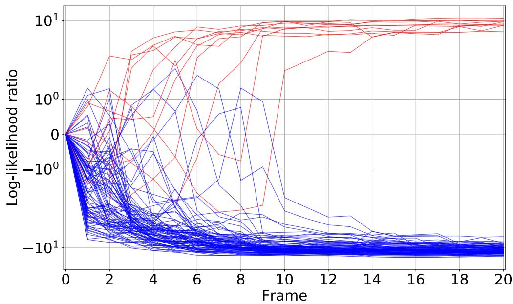

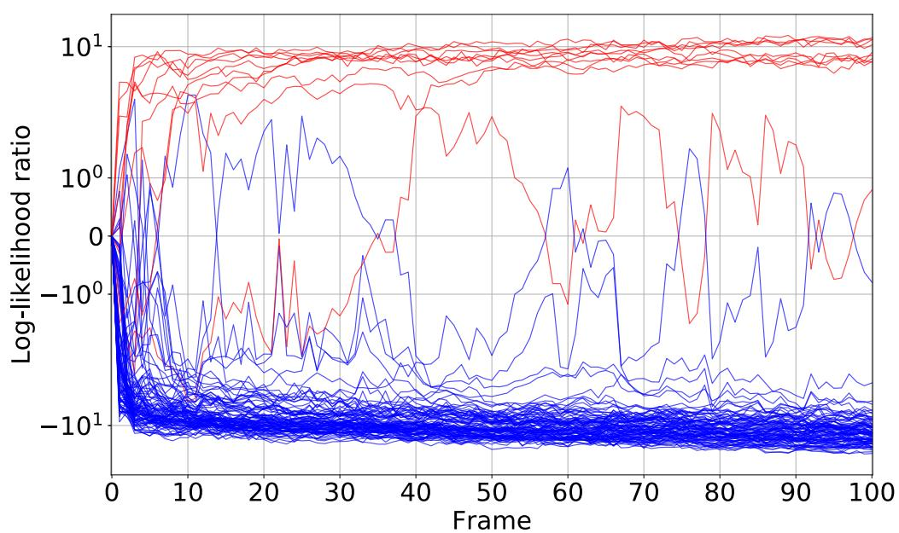  
Figure 10: Examples of LLR trajectories. Top: NMNIST-H. Bottom: NMNIST-100f. The red curves represent $\mathrm { m i n } _ { l } \{ \hat { \lambda } _ { y _ { i } l } \}$ , while the blue curves represent $\mathrm { m i n } _ { l } \{ \hat { \lambda } _ { k l } \}$ $( k \neq y _ { i } )$ . If the red curve reaches the threshold (necessarily positive), then the prediction is correct, while if the blue curve reaches the threshold, then the prediction is wrong. We plot ten different $i$ ’s randomly selected from the validation set. The red and blue curves are gradually separated as more frames are observed: evidence accumulation.

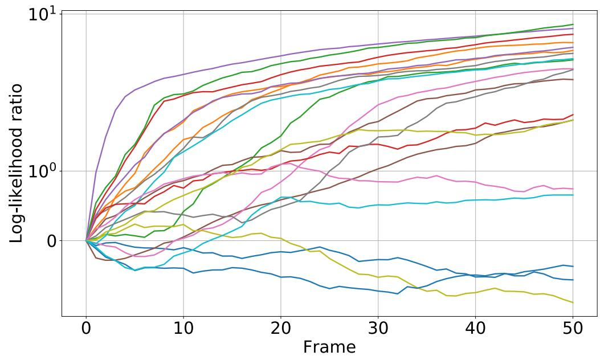

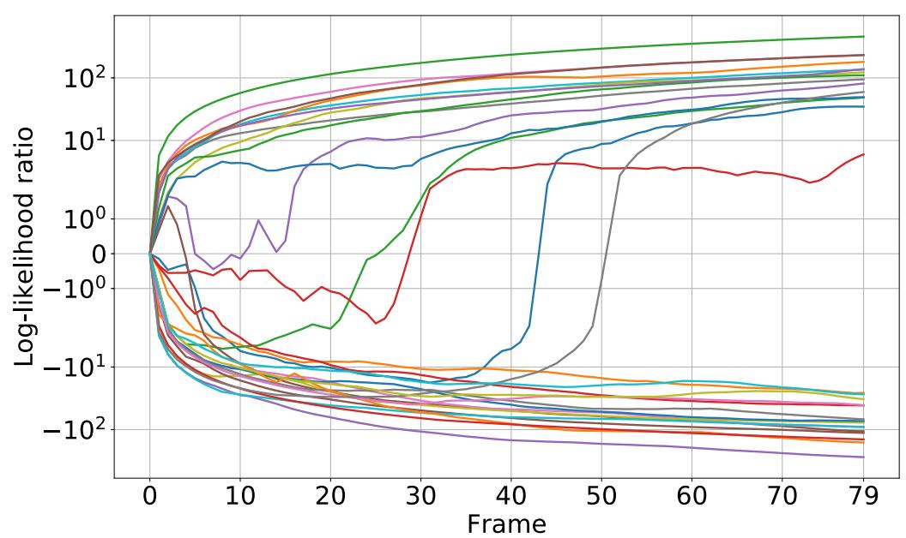  
Figure 11: Examples of LLR trajectories. Top: UCF101. Bottom: HMDB51. All curves are $\mathrm { m i n } _ { l } \{ \hat { \lambda } _ { y _ { i } l } \}$ , and the negative rows $\mathrm { m i n } _ { l } \{ \hat { \lambda } _ { k l } \}$ $( k \neq y _ { i } )$ are omitted for clarity. Therefore, all the curves should be in the upper half-plane (positive LLRs). We plot 20 and 30 different $i$ ’s randomly selected from the validation sets of UCF101 and HMDB51, respectively. Several curves gradually go upwards as more frames are observed: evidence accumulation.

# K NMNIST-H and NMNIST-100f

[17] propose an MNIST-based sequential dataset for early classification of time series: NMNIST; however, NMNIST is so simple that accuracy tends to saturate immediately and the performance comparison of models is difficult, especially in the early stage of sequential predictions. We thus create a more complex dataset, NMNIST-H, with higher noise density than NMNIST. Figure 12 is an example video of NMNIST-H. It is hard, if not impossible, for humans to classify the video within 10 frames.

NMNIST-100f is a more challenging dataset than NMNIST-H. Each video consists of 100 frames, which is 5 times longer than in NMNIST and NMNSIT-H. Figure 13 is an example video of NMNIST-100f. Because of the dense noise, classification is unrealistic for humans, while MSPRT-TANDEM attains approximately $90 \%$ accuracy with only 8 frames (see Figure 5).

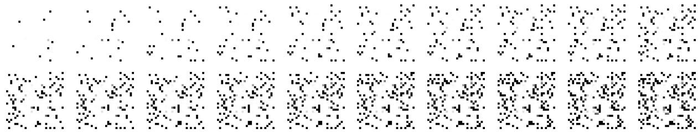  
Figure 12: NMNIST-H. The first frame is at the top left, and the last frame is at the bottom right. The original MNIST image ( $2 8 \times 2 8$ pixels) is gradually revealed (10 pixels per frame). The label of this example is 6. The mean image is given in Figure 14 (left).

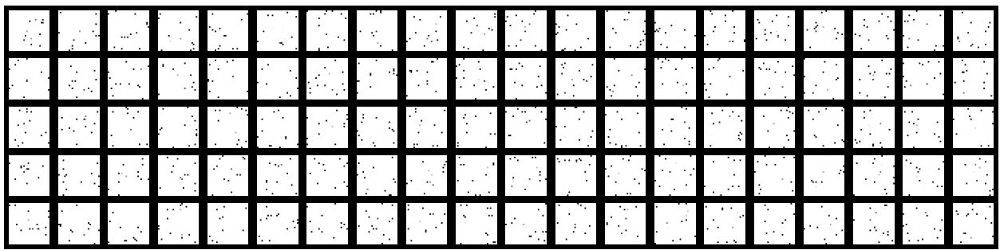  
Figure 13: NMNIST-100f. The first frame is at the top left, and the last frame is at the bottom right. An MNIST image $2 8 \times 2 8$ pixels) is filled with white pixels except for 15 randomly selected pixels. Unlike NMNIST-H, the number of original pixels (15) is fixed throughout all frames. The label of this example is 3. The mean image is given in Figure 14 (right).

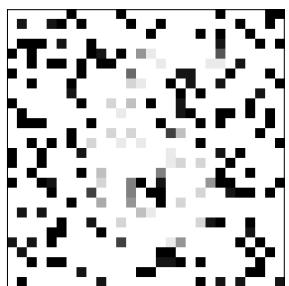

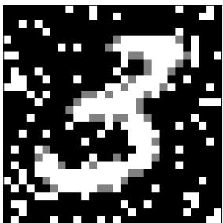  
Figure 14: Mean images of Figures 12 (left) and 13 (right).

# L Details of Statistical Tests

# L.1 Model Comparison: Figure 5

For an objective comparison, we conduct statistical tests: two-way ANOVA [21] followed by Tukey-Kramer multi-comparison test [82, 40]. In the tests, a small number of trials reduces test statistics, making it difficult to claim significance because the test statistic of the Tukey-Kramer test is proportional to $1 / \sqrt { ( 1 / n + 1 / m ) }$ , where $n$ and $m$ are trial numbers of two models to be compared. These statistical tests are standard, e.g., in biological science, in which variable trial numbers are inevitable in experiments. All the statistical tests are executed with a customized [141] script.

In the two-way ANOVA, the two factors are defined as the phase (early and late stages of the SAT curve) and model. The actual numbers of frames shown in Table 42 are chosen so that the compared models can use as similar frames as possible and thus depend only on the dataset. Note that EARLIEST cannot flexibly change the mean hitting time; thus, we include the results of EARLIEST to the groups with as close to the number of frames as possible.

The $p$ -values are summarized in Tables 43 to 47. The $p$ -values with asterisks are statistically significant: one, two and three asterisks show $p < 0 . 0 5$ , $p < 0 . 0 1$ , and $p < 0 . 0 0 1$ , respectively. Our results, especially in the late phase, are statistically significantly better than those in the early phase, confirming that accumulating evidence leads to better performance.

Table 42: Definition of the phases (in the number of frames).   

<table><tr><td></td><td colspan="2">Early phase</td><td colspan="2">Late phase</td></tr><tr><td></td><td>EARLIEST</td><td>All but EARLIEST</td><td>EARLIEST</td><td>All but EARLIEST</td></tr><tr><td>NMNIST-H</td><td>1.34</td><td>2</td><td>13.41</td><td>13</td></tr><tr><td>NMNIST-100f</td><td>13.41</td><td>19</td><td>99.99</td><td>100</td></tr><tr><td>UCF101</td><td>1.36</td><td>1</td><td>49.93</td><td>50</td></tr><tr><td>HMDB51</td><td>1.43</td><td>1</td><td>36.20</td><td>36</td></tr></table>

Table 43: $p$ -values from the Tukey-Kramer multi-comparison test conducted on NMNIST-100f.(Figure 2)   

<table><tr><td></td><td></td><td colspan="2">Logistic</td><td>LSEL</td></tr><tr><td></td><td></td><td>early</td><td>late</td><td>early</td></tr><tr><td>Logistic</td><td>late</td><td>***1E-07</td><td></td><td></td></tr><tr><td rowspan="2">LSEL</td><td>early</td><td>***1E-09</td><td>***1E-09</td><td></td></tr><tr><td>late</td><td>***1E-09</td><td>*2E-3</td><td>***1E-09</td></tr></table>

Table 44: $p$ -values from the Tukey-Kramer multi-comparison test conducted on NMNIST-H (Figure 5).   

<table><tr><td rowspan="2" colspan="2"></td><td colspan="2">MSPRT-TANDEM</td><td colspan="2">NP test</td><td colspan="2">LSTM-s</td><td colspan="2">LSTM-m</td><td>EARLIEST</td></tr><tr><td>early</td><td>late</td><td>early</td><td>late</td><td>early</td><td>late</td><td>early</td><td>late</td><td>early</td></tr><tr><td>MSPRT-TANDEM</td><td>late</td><td>***1E-07</td><td></td><td></td><td></td><td></td><td></td><td></td><td></td><td></td></tr><tr><td rowspan="2">NP test</td><td>early</td><td>***1E-07</td><td>***1E-07</td><td></td><td></td><td></td><td></td><td></td><td></td><td></td></tr><tr><td>late</td><td>***1E-07</td><td>***1E-07</td><td>***1E-07</td><td></td><td></td><td></td><td></td><td></td><td></td></tr><tr><td rowspan="2">LSTM-s</td><td>early</td><td>***1E-07</td><td>***1E-07</td><td>1.0</td><td>***1E-07</td><td></td><td></td><td></td><td></td><td></td></tr><tr><td>late</td><td>***1E-07</td><td>***1E-07</td><td>***1E-07</td><td>1.0</td><td>***1E-07</td><td></td><td></td><td></td><td></td></tr><tr><td rowspan="2">LSTM-m</td><td>early</td><td>***1E-07</td><td>***1E-07</td><td>1.0</td><td>***1E-07</td><td>1.0</td><td>***1E-07</td><td></td><td></td><td></td></tr><tr><td>late</td><td>***1E-07</td><td>***1E-07</td><td>***1E-07</td><td>1.0</td><td>***1E-07</td><td>1.0</td><td>***1E-07</td><td></td><td></td></tr><tr><td rowspan="2">EARLIEST</td><td>early</td><td>***1E-07</td><td>***1E-07</td><td>***1E-07</td><td>***1E-07</td><td>***1E-07</td><td>***1E-07</td><td>***1E-07</td><td>***1E-07</td><td></td></tr><tr><td>late</td><td>***1E-07</td><td>***1E-07</td><td>***1E-07</td><td>***1E-07</td><td>***1E-07</td><td>***1E-07</td><td>***1E-07</td><td>***1E-07</td><td>***1E-07</td></tr></table>

# L.2 Ablation Study: Figure 9

We also test the three conditions in the ablation study. We select one phase at the 20th frame to conduct the one-way ANOVA with one model factor: LSEL $^ +$ Multiplet loss, LSEL only, and Multiplet only. The $p$ -values are summarized in Table 48. The result shows that using both the LSEL and the multiplet loss is statistically significantly better than using either of the two losses.

Table 45: $p$ -values from the Tukey-Kramer multi-comparison test conducted on NMNIST-100f (Figure 5).   

<table><tr><td rowspan="2" colspan="2"></td><td colspan="2">MSPRT-TANDEM</td><td colspan="2">NP test</td><td colspan="2">LSTM-s</td><td colspan="2">LSTM-m</td><td>EARLIEST</td></tr><tr><td>early</td><td>late</td><td>early</td><td>late</td><td>early</td><td>late</td><td>early</td><td>late</td><td>early</td></tr><tr><td>MSPRT-TANDEM</td><td>late</td><td>***1E-07</td><td></td><td></td><td></td><td></td><td></td><td></td><td></td><td></td></tr><tr><td rowspan="2">NP test</td><td>early</td><td>***1E-07</td><td>***1E-07</td><td></td><td></td><td></td><td></td><td></td><td></td><td></td></tr><tr><td>late</td><td>***1E-07</td><td>1.0</td><td>***1E-07</td><td></td><td></td><td></td><td></td><td></td><td></td></tr><tr><td rowspan="2">LSTM-s</td><td>early</td><td>***1E-07</td><td>***1E-07</td><td>***1E-07</td><td>***1E-07</td><td></td><td></td><td></td><td></td><td></td></tr><tr><td>late</td><td>***1E-07</td><td>1.0</td><td>***1E-07</td><td>1.0</td><td>***1E-07</td><td></td><td></td><td></td><td></td></tr><tr><td rowspan="2">LSTM-m</td><td>early</td><td>***1E-07</td><td>***1E-07</td><td>***1E-07</td><td>***1E-07</td><td>1.0</td><td>***1E-07</td><td></td><td></td><td></td></tr><tr><td>late</td><td>***1E-07</td><td>1.0</td><td>***1E-07</td><td>1.0</td><td>***1E-07</td><td>1.0</td><td>***1E-07</td><td></td><td></td></tr><tr><td rowspan="2">EARLIEST</td><td>early</td><td>***1E-07</td><td>***1E-07</td><td>***1E-07</td><td>***1E-07</td><td>***1E-07</td><td>***1E-07</td><td>***1E-07</td><td>***1E-07</td><td></td></tr><tr><td>late</td><td>***7E-05</td><td>***1E-07</td><td>***1E-07</td><td>***1E-07</td><td>***1E-07</td><td>***1E-07</td><td>***1E-07</td><td>***1E-07</td><td>***1E-07</td></tr></table>

Table 46: $p$ -values from the Tukey-Kramer multi-comparison test conducted on UCF101 (Figure 5).   

<table><tr><td rowspan="2" colspan="2"></td><td colspan="2">MSPRT-TANDEM</td><td colspan="2">NP test</td><td colspan="2">LSTM-s</td><td colspan="2">LSTM-m</td><td>EARLIEST</td></tr><tr><td>early</td><td>late</td><td>early</td><td>late</td><td>early</td><td>late</td><td>early</td><td>late</td><td>early</td></tr><tr><td>MSPRT-TANDEM</td><td>late</td><td>***1E-07</td><td></td><td></td><td></td><td></td><td></td><td></td><td></td><td></td></tr><tr><td rowspan="2">NP test</td><td>early</td><td>1.0</td><td>***1E-07</td><td></td><td></td><td></td><td></td><td></td><td></td><td></td></tr><tr><td>late</td><td>***1E-07</td><td>1.0</td><td>***1E-07</td><td></td><td></td><td></td><td></td><td></td><td></td></tr><tr><td rowspan="2">LSTM-s</td><td>early</td><td>***1E-07</td><td>***1E-07</td><td>***1E-07</td><td>***1E-07</td><td></td><td></td><td></td><td></td><td></td></tr><tr><td>late</td><td>***1E-07</td><td>***1E-07</td><td>***1E-07</td><td>***1E-07</td><td>***1E-07</td><td></td><td></td><td></td><td></td></tr><tr><td rowspan="2">LSTM-m</td><td>early</td><td>***1E-07</td><td>***1E-07</td><td>***1E-07</td><td>***1E-07</td><td>1.0</td><td>***1E-07</td><td></td><td></td><td></td></tr><tr><td>late</td><td>***1E-07</td><td>***1E-07</td><td>***1E-07</td><td>***1E-07</td><td>***1E-07</td><td>*3E-03</td><td>***1E-07</td><td></td><td></td></tr><tr><td rowspan="2">EARLIEST</td><td>early</td><td>***1E-07</td><td>***1E-07</td><td>***1E-07</td><td>***1E-07</td><td>1E-01</td><td>***1E-07</td><td>*6E-03</td><td>***1E-07</td><td></td></tr><tr><td>late</td><td>***1E-07</td><td>***1E-07</td><td>***1E-07</td><td>***1E-07</td><td>***1E-07</td><td>***1E-07</td><td>***1E-07</td><td>***1E-07</td><td>***1E-07</td></tr></table>

Table 47: $p$ -values from the Tukey-Kramer multi-comparison test conducted on HMDB51 (Figure 5).   

<table><tr><td rowspan="2" colspan="2"></td><td colspan="2">MSPRT-TANDEM</td><td colspan="2">NP test</td><td colspan="2">LSTM-s</td><td colspan="2">LSTM-m</td><td>EARLIEST</td></tr><tr><td>early</td><td>late</td><td>early</td><td>late</td><td>early</td><td>late</td><td>early</td><td>late</td><td>early</td></tr><tr><td>MSPRT-TANDEM</td><td>late</td><td>***1E-07</td><td></td><td></td><td></td><td></td><td></td><td></td><td></td><td></td></tr><tr><td rowspan="2">NP test</td><td>early</td><td>1.0</td><td>***1E-07</td><td></td><td></td><td></td><td></td><td></td><td></td><td></td></tr><tr><td>late</td><td>***1E-07</td><td>0.2</td><td>***1E-07</td><td></td><td></td><td></td><td></td><td></td><td></td></tr><tr><td rowspan="2">LSTM-s</td><td>early</td><td>1.0</td><td>***1E-07</td><td>1.0</td><td>***1E-07</td><td></td><td></td><td></td><td></td><td></td></tr><tr><td>late</td><td>***1E-07</td><td>***2E-07</td><td>***1E-07</td><td>***2E-02</td><td>***1E-07</td><td></td><td></td><td></td><td></td></tr><tr><td rowspan="2">LSTM-m</td><td>early</td><td>1.0</td><td>***1E-07</td><td>1.0</td><td>***1E-07</td><td>1.0</td><td>***1E-07</td><td></td><td></td><td></td></tr><tr><td>late</td><td>***1E-07</td><td>***1E-07</td><td>***1E-07</td><td>***1E-04</td><td>***1E-07</td><td>1.0</td><td>***1E-07</td><td></td><td></td></tr><tr><td rowspan="2">EARLIEST</td><td>early</td><td>1.0</td><td>***1E-07</td><td>1.0</td><td>***1E-07</td><td>1.0</td><td>***1E-07</td><td>1.0</td><td>***1E-07</td><td></td></tr><tr><td>late</td><td>***1E-07</td><td>***1E-07</td><td>***1E-07</td><td>***1E-07</td><td>***1E-07</td><td>***1E-07</td><td>***1E-07</td><td>***7E-07</td><td>***1E-07</td></tr></table>

Table 48: Figure 9: $p$ -values from the Tukey-Kramer multi-comparison test conducted on the ablation test.   

<table><tr><td></td><td colspan="2">MSPRT-TANDEM</td></tr><tr><td></td><td>LSEL+Multiplet</td><td>LSEL only</td></tr><tr><td>LSEL only</td><td>***1E-09</td><td></td></tr><tr><td>Multiplet only</td><td>***2E-07</td><td>***1E-09</td></tr></table>

# M Supplementary Discussion

Interpretability. Interpretability of classification results is one of the important interests in early classification of time series [91, 22, 23, 24, 37]. MSPRT-TANDEM can use the LLR trajectory to visualize the prediction process (see Figures 2 (Right) and 10); a large gap of LLRs between two timestamps means that these timestamps are decisive.

Threshold matrix. In our experiment, we use single-valued threshold matrices for simplicity. General threshold matrices may enhance performance, especially when the dataset is class-imbalanced [135, 96, 125]. Tuning the threshold after training is referred to as thresholding, or threshold-moving [146, 8]. MSPRT-TANDEM has multiple thresholds in the matrix form, and thus it is an interesting future work to exploit such a matrix structure to attain higher accuracy.

How to determine threshold. A user can choose a threshold by evaluating the mean hitting time and accuracy on a dataset at hand (possibly the validation dataset, training dataset, or both). As mentioned in Section 3.4, we do not have to retrain the model (mentioned in Section 3.4). We can modify the threshold even after deployment, if necessary, to address domain shift. This flexibility is a huge advantage compared with other models that require additional training every time the user wants to control the speed-accuracy tradeoff [10].

# Supplementary references

[93] Microsoft Vision Model ResNet-50. https://pypi.org/project/microsoftvision/. Accessed: May 14, 2021. License: Unknown.   
[94] M. Abadi, A. Agarwal, P. Barham, E. Brevdo, Z. Chen, C. Citro, G. S. Corrado, A. Davis, J. Dean, M. Devin, S. Ghemawat, I. Goodfellow, A. Harp, G. Irving, M. Isard, Y. Jia, R. Jozefowicz, L. Kaiser, M. Kudlur, J. Levenberg, D. Mané, R. Monga, S. Moore, D. Murray, C. Olah, M. Schuster, J. Shlens, B. Steiner, I. Sutskever, K. Talwar, P. Tucker, V. Vanhoucke, V. Vasudevan, F. Viégas, O. Vinyals, P. Warden, M. Wattenberg, M. Wicke, Y. Yu, and X. Zheng. TensorFlow: Large-scale machine learning on heterogeneous systems, 2015. License: Apache License 2.0. Software available from tensorflow.org.   
[95] T. Akiba, S. Sano, T. Yanase, T. Ohta, and M. Koyama. Optuna: A next-generation hyperparameter optimization framework. In Proceedings of the 25th ACM SIGKDD International Conference on Knowledge Discovery and Data Mining, KDD ’19, page 2623–2631, New York, NY, USA, 2019. Association for Computing Machinery. License: MIT License.   
[96] A. Ali, S. M. Shamsuddin, A. L. Ralescu, et al. Classification with class imbalance problem: a review. Int. J. Advance Soft Compu. Appl, 7(3):176–204, 2015.   
[97] K. J. Arrow, D. Blackwell, and M. A. Girshick. Bayes and minimax solutions of sequential decision problems. Econometrica, Journal of the Econometric Society, pages 213–244, 1949.   
[98] J. Bergstra, R. Bardenet, Y. Bengio, and B. Kégl. Algorithms for hyper-parameter optimization. In J. Shawe-Taylor, R. Zemel, P. Bartlett, F. Pereira, and K. Q. Weinberger, editors, Advances in Neural Information Processing Systems, volume 24, pages 2546–2554. Curran Associates, Inc., 2011.   
[99] M. Buda, A. Maki, and M. A. Mazurowski. A systematic study of the class imbalance problem in convolutional neural networks. Neural Networks, 106:249–259, 2018.   
[100] H. Cai, C. Gan, T. Wang, Z. Zhang, and S. Han. Once-for-all: Train one network and specialize it for efficient deployment. In International Conference on Learning Representations, 2020.   
[101] Y. Cui, M. Jia, T.-Y. Lin, Y. Song, and S. Belongie. Class-balanced loss based on effective number of samples. In Proceedings of the IEEE/CVF Conference on Computer Vision and Pattern Recognition (CVPR), June 2019.   
[102] M. Dehghani, S. Gouws, O. Vinyals, J. Uszkoreit, and L. Kaiser. Universal transformers. In International Conference on Learning Representations, 2019.   
[103] J. Devlin, M.-W. Chang, K. Lee, and K. Toutanova. BERT: Pre-training of deep bidirectional transformers for language understanding. In Proceedings of the 2019 Conference of the North American Chapter of the Association for Computational Linguistics: Human Language Technologies, Volume 1 (Long and Short Papers), pages 4171–4186, Minneapolis, Minnesota, June 2019. Association for Computational Linguistics.   
[104] V. P. Dragalin, A. G. Tartakovsky, and V. V. Veeravalli. Multihypothesis sequential probability ratio tests. i. asymptotic optimality. IEEE Transactions on Information Theory, 45(7):2448–2461, November 1999.   
[105] A. F. Ebihara, T. Miyagawa, K. Sakurai, and H. Imaoka. Sequential density ratio estimation for simultaneous optimization of speed and accuracy. In International Conference on Learning Representations, 2021.   
[106] T. S. Ferguson. Mathematical statistics: A decision theoretic approach, volume 1. Academic press, 2014.   
[107] R. Fisher. Statistical methods for research workers. Edinburgh Oliver & Boyd, 1925.   
[108] T. Gangopadhyay, V. Ramanan, A. Akintayo, P. K. Boor, S. Sarkar, S. R. Chakravarthy, and S. Sarkar. 3d convolutional selective autoencoder for instability detection in combustion systems, 2021.   
[109] F. A. Gers and J. Schmidhuber. Recurrent nets that time and count. Proceedings of the IEEE-INNS-ENNS International Joint Conference on Neural Networks. IJCNN 2000. Neural Computing: New Challenges and Perspectives for the New Millennium, 3:189–194 vol.3, 2000.   
[110] M. F. Ghalwash and Z. Obradovic. Early classification of multivariate temporal observations by extraction of interpretable shapelets. BMC bioinformatics, 13(1):195, 2012.   
[111] M. F. Ghalwash, V. Radosavljevic, and Z. Obradovic. Extraction of interpretable multivariate patterns for early diagnostics. In 2013 IEEE 13th International Conference on Data Mining, pages 201–210, 2013.

[112] M. F. Ghalwash, V. Radosavljevic, and Z. Obradovic. Utilizing temporal patterns for estimating uncertainty in interpretable early decision making. In Proceedings of the 20th ACM SIGKDD International Conference on Knowledge Discovery and Data Mining, KDD ’14, page 402–411, New York, NY, USA, 2014. Association for Computing Machinery.   
[113] A. Ghodrati, B. E. Bejnordi, and A. Habibian. FrameExit: Conditional early exiting for efficient video recognition. In IEEE/CVF Conference on Computer Vision and Pattern Recognition (CVPR), June 2021.   
[114] G. Golubev and R. Khas’minskii. Sequential testing for several signals in gaussian white noise. Theory of Probability & Its Applications, 28(3):573–584, 1984.   
[115] A. Graves. Generating sequences with recurrent neural networks. arXiv preprint arXiv:1308.0850, 2013.   
[116] C. Guo, G. Pleiss, Y. Sun, and K. Q. Weinberger. On calibration of modern neural networks. In International Conference on Machine Learning, pages 1321–1330. PMLR, 2017.   
[117] A. Gupta, R. Pal, R. Mishra, H. P. Gupta, T. Dutta, and P. Hirani. Game theory based early classification of rivers using time series data. In 2019 IEEE 5th World Forum on Internet of Things (WF-IoT), pages 686–691, 2019.   
[118] M. U. Gutmann and A. Hyvärinen. Noise-contrastive estimation of unnormalized statistical models, with applications to natural image statistics. The journal of machine learning research, 13(1):307–361, 2012.   
[119] C. R. Harris, K. J. Millman, S. J. van der Walt, R. Gommers, P. Virtanen, D. Cournapeau, E. Wieser, J. Taylor, S. Berg, N. J. Smith, R. Kern, M. Picus, S. Hoyer, M. H. van Kerkwijk, M. Brett, A. Haldane, J. F. Del Río, M. Wiebe, P. Peterson, P. Gérard-Marchant, K. Sheppard, T. Reddy, W. Weckesser, H. Abbasi, C. Gohlke, and T. E. Oliphant. Array programming with NumPy. Nature, 585(7825):357–362, 09 2020. License: BSD 3-Clause "New" or "Revised" License.   
[120] T. Hartvigsen, C. Sen, X. Kong, and E. Rundensteiner. Adaptive-halting policy network for early classification. In Proceedings of the 25th ACM SIGKDD International Conference on Knowledge Discovery & Data Mining, KDD ’19, pages 101–110, New York, NY, USA, 2019. ACM.   
[121] N. Hatami and C. Chira. Classifiers with a reject option for early time-series classification. 2013 IEEE Symposium on Computational Intelligence and Ensemble Learning (CIEL), pages 9–16, 2013.   
[122] K. He, X. Zhang, S. Ren, and J. Sun. Deep residual learning for image recognition. 2016 IEEE Conference on Computer Vision and Pattern Recognition (CVPR), pages 770–778, 2016.   
[123] K. He, X. Zhang, S. Ren, and J. Sun. Identity mappings in deep residual networks. In Computer Vision - ECCV 2016 - 14th European Conference, Amsterdam, The Netherlands, October 11-14, 2016, Proceedings, Part IV, pages 630–645, 2016.   
[124] S. Hochreiter and J. Schmidhuber. Long short-term memory. Neural Comput., 9(8):1735–1780, Nov. 1997.   
[125] C. Hong, R. Ghosh, and S. Srinivasan. Dealing with class imbalance using thresholding. arXiv preprint arXiv:1607.02705, 2016.   
[126] Z. Huang, Z. Ye, S. Li, and R. Pan. Length adaptive recurrent model for text classification. In Proceedings of the 2017 ACM on Conference on Information and Knowledge Management, CIKM ’17, page 1019–1027, New York, NY, USA, 2017. Association for Computing Machinery.   
[127] T. Kanamori, S. Hido, and M. Sugiyama. A least-squares approach to direct importance estimation. Journal of Machine Learning Research, 10(Jul):1391–1445, 2009.   
[128] F. Karim, H. Darabi, S. Harford, S. Chen, and A. Sharabiani. A framework for accurate time series classification based on partial observation. In 2019 IEEE 15th International Conference on Automation Science and Engineering (CASE), pages 634–639, 2019.   
[129] Y. Kaya, S. Hong, and T. Dumitras. Shallow-Deep Networks: Understanding and mitigating network overthinking. In International Conference on Machine Learning, pages 3301–3310. PMLR, 2019.   
[130] H. Khan, L. Marcuse, and B. Yener. Deep density ratio estimation for change point detection. arXiv preprint arXiv:1905.09876, 2019.   
[131] D. P. Kingma and J. Ba. Adam: A method for stochastic optimization. arXiv preprint arXiv:1412.6980, 2014.

[132] C. Y. Kramer. Extension of multiple range tests to group means with unequal numbers of replications. Biometrics, 12(3):307–310, 1956.   
[133] S. Kullback and R. A. Leibler. On information and sufficiency. Ann. Math. Statist., 22(1):79–86, 03 1951.   
[134] Y. LeCun, C. Cortes, and C. Burges. Mnist handwritten digit database. ATT Labs [Online]. Available: http://yann. lecun. com/exdb/mnist, 2, 2010. License: Creative Commons Attribution-Share Alike 3.0 license.   
[135] R. Longadge and S. Dongre. Class imbalance problem in data mining review. arXiv preprint arXiv:1305.1707, 2013.   
[136] A. P. López-Monroy, F. A. González, M. Montes, H. J. Escalante, and T. Solorio. Early text classification using multi-resolution concept representations. In Proceedings of the 2018 Conference of the North American Chapter of the Association for Computational Linguistics: Human Language Technologies, Volume 1 (Long Papers), pages 1216–1225, 2018.   
[137] G. Lorden. Nearly-optimal sequential tests for finitely many parameter values. Annals of Statistics, 5:1–21, 01 1977.   
[138] I. Loshchilov and F. Hutter. Decoupled weight decay regularization. In International Conference on Learning Representations, 2019.   
[139] S. Ma, L. Sigal, and S. Sclaroff. Learning activity progression in lstms for activity detection and early detection. In 2016 IEEE Conference on Computer Vision and Pattern Recognition (CVPR), pages 1942–1950, 2016.   
[140] C. Martinez, E. Ramasso, G. Perrin, and M. Rombaut. Adaptive early classification of temporal sequences using deep reinforcement learning. Knowledge-Based Systems, 190:105290, February 2020.   
[141] MATLAB. version 9.3.0 (R2017b). The MathWorks Inc., Natick, Massachusetts, 2017.   
[142] A. McGovern, D. H. Rosendahl, R. A. Brown, and K. K. Droegemeier. Identifying predictive multidimensional time series motifs: an application to severe weather prediction. Data Mining and Knowledge Discovery, 22(1-2):232–258, 2011.   
[143] A. K. Menon, S. Jayasumana, A. S. Rawat, H. Jain, A. Veit, and S. Kumar. Long-tail learning via logit adjustment. In International Conference on Learning Representations, 2021.   
[144] U. Mori, A. Mendiburu, E. J. Keogh, and J. A. Lozano. Reliable early classification of time series based on discriminating the classes over time. Data Mining and Knowledge Discovery, 31:233–263, 04 2016.   
[145] A. Paszke, S. Gross, F. Massa, A. Lerer, J. Bradbury, G. Chanan, T. Killeen, Z. Lin, N. Gimelshein, L. Antiga, A. Desmaison, A. Kopf, E. Yang, Z. DeVito, M. Raison, A. Tejani, S. Chilamkurthy, B. Steiner, L. Fang, J. Bai, and S. Chintala. Pytorch: An imperative style, high-performance deep learning library. In Advances in Neural Information Processing Systems 32, pages 8024–8035. Curran Associates, Inc., 2019. License: https://github.com/pytorch/pytorch/blob/master/LICENSE.   
[146] M. D. Richard and R. P. Lippmann. Neural network classifiers estimate bayesian a posteriori probabilities. Neural computation, 3(4):461–483, 1991.   
[147] D. E. Rumelhart, G. E. Hinton, and R. J. Williams. Learning representations by back-propagating errors. Nature, 323(6088):533–536, 1986.   
[148] M. Rußwurm, S. Lefèvre, N. Courty, R. Emonet, M. Körner, and R. Tavenard. End-to-end learning for early classification of time series. CoRR, abs/1901.10681, 2019.   
[149] P. Schäfer and U. Leser. TEASER: Early and accurate time series classification. Data Mining and Knowledge Discovery, 34(5):1336–1362, 2020.   
[150] M. Sugiyama, T. Suzuki, S. Nakajima, H. Kashima, P. von Bünau, and M. Kawanabe. Direct importance estimation for covariate shift adaptation. Annals of the Institute of Statistical Mathematics, 60(4):699–746, 2008.   
[151] T. Suzuki, H. Kataoka, Y. Aoki, and Y. Satoh. Anticipating traffic accidents with adaptive loss and largescale incident db. In Proceedings of the IEEE Conference on Computer Vision and Pattern Recognition, pages 3521–3529, 2018.   
[152] A. G. Tartakovskij. Sequential composite hypothesis testing with dependent nonstationary observations. Probl. Inf. Transm., 17:18–28, 1981.

[153] A. Tartakovsky. Sequential methods in the theory of information systems, 1991.   
[154] A. Tartakovsky. Asymptotically optimal sequential tests for nonhomogeneous processes. Sequential analysis, 17(1):33–61, 1998.   
[155] A. Tartakovsky, I. Nikiforov, and M. Basseville. Sequential Analysis: Hypothesis Testing and Changepoint Detection. Chapman & Hall/CRC, 1st edition, 2014.   
[156] A. G. Tartakovsky. Asymptotic optimality of certain multihypothesis sequential tests: Non-i.i.d. case. Statistical Inference for Stochastic Processes, 1(3):265–295, 1998.   
[157] J. W. Tukey. Comparing individual means in the analysis of variance. Biometrics, 5 2:99–114, 1949.   
[158] A. Vaswani, N. Shazeer, N. Parmar, J. Uszkoreit, L. Jones, A. N. Gomez, L. u. Kaiser, and I. Polosukhin. Attention is all you need. In I. Guyon, U. V. Luxburg, S. Bengio, H. Wallach, R. Fergus, S. Vishwanathan, and R. Garnett, editors, Advances in Neural Information Processing Systems, volume 30, pages 5998–6008. Curran Associates, Inc., 2017.   
[159] N. Verdenskaya and A. Tartakovskii. Asymptotically optimal sequential testing of multiple hypotheses for nonhomogeneous gaussian processes in asymmetric case. Theory of Probability & Its Applications, 36(3):536–547, 1992.   
[160] P. Virtanen, R. Gommers, T. E. Oliphant, M. Haberland, T. Reddy, D. Cournapeau, E. Burovski, P. Peterson, W. Weckesser, J. Bright, S. J. van der Walt, M. Brett, J. Wilson, K. Jarrod Millman, N. Mayorov, A. R. J. Nelson, E. Jones, R. Kern, E. Larson, C. Carey, ˙I. Polat, Y. Feng, E. W. Moore, J. Vand erPlas, D. Laxalde, J. Perktold, R. Cimrman, I. Henriksen, E. A. Quintero, C. R. Harris, A. M. Archibald, A. H. Ribeiro, F. Pedregosa, P. van Mulbregt, and S. . . Contributors. SciPy 1.0: Fundamental Algorithms for Scientific Computing in Python. Nature Methods, 17:261–272, 2020. License: BSD 3-Clause "New" or "Revised" License.   
[161] A. Wald. Sequential tests of statistical hypotheses. Ann. Math. Statist., 16(2):117–186, 06 1945.   
[162] B. Wang, L. Huang, and M. Hoai. Active vision for early recognition of human actions. In Proceedings of the IEEE/CVF Conference on Computer Vision and Pattern Recognition (CVPR), June 2020.   
[163] W. Wang, C. Chen, W. Wang, P. Rai, and L. Carin. Earliness-aware deep convolutional networks for early time series classification. arXiv preprint arXiv:1611.04578, 2016.   
[164] Z. Xing, J. Pei, and P. S. Yu. Early classification on time series. Knowledge and Information Systems, 31(1):105–127, Apr. 2012.   
[165] Z. Xing, J. Pei, P. S. Yu, and K. Wang. Extracting interpretable features for early classification on time series. In Proceedings of the 11th SIAM International Conference on Data Mining, SDM 2011, pages 247–258. SIAM, 2011.   
[166] W. Zhou, C. Xu, T. Ge, J. McAuley, K. Xu, and F. Wei. BERT loses patience: Fast and robust inference with early exit. In Advances in Neural Information Processing Systems, 2020.