# Bootstrapping ViTs: Towards Liberating Vision Transformers from Pre-training

Haofei Zhang1,∗, Jiarui Duan1,∗, Mengqi Xue1, Jie Song1,†, Li Sun1, Mingli Song1,2 1Zhejiang University 2 Shanghai Institute for Advanced Study of Zhejiang University

# Abstract

Recently, vision Transformers (ViTs) are developing rapidly and starting to challenge the domination of convolutional neural networks (CNNs) in the realm of computer vision (CV). With the general-purpose Transformer architecture replacing the hard-coded inductive biases of convolution, ViTs have surpassed CNNs, especially in datasufficient circumstances. However, ViTs are prone to over-fit on small datasets and thus rely on large-scale pre-training, which expends enormous time. In this paper, we strive to liberate ViTs from pre-training by introducing CNNs’ inductive biases back to ViTs while preserving their network architectures for higher upper bound and setting up more suitable optimization objectives. To begin with, an agent CNN is designed based on the given ViT with inductive biases. Then a bootstrapping training algorithm is proposed to jointly optimize the agent and ViT with weight sharing, during which the ViT learns inductive biases from the intermediate features of the agent. Extensive experiments on CIFAR-10/100 and ImageNet-1k with limited training data have shown encouraging results that the inductive biases help ViTs converge significantly faster and outperform conventional CNNs with even fewer parameters. Our code is publicly available at https://github.com/ zhfeing/Bootstrapping-ViTs-pytorch.

# 1. Introduction

The great successes of the convolutional neural networks (CNNs) [21, 23, 29, 42] have liberated researchers from handcrafting visual features [14, 33]. By means of the inductive biases [10], i.e., focusing on the localized features and weight sharing, CNNs are potent tools for tackling visual recognition tasks [5, 21, 36]. Nevertheless, such biases have constrained their abilities towards building deeper and larger models, as they have ignored the long-range dependencies [15, 18].

In recent years, Transformers [46] have been proposed for replacing inductive biases with a general-

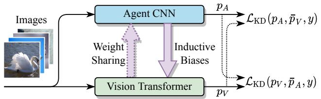  
Figure 1. Illustration of our proposed method for optimizing vision Transformers efficiently without pre-training. An agent CNN is constructed according to the network architecture of the ViT with shared weights, and the ViT learns inductive biases from intermediate features and predictions of the agent.

purpose network architecture in natural language processing (NLP). Exclusively relying on multi-head attention mechanisms (MHA), Transformers have the inborn capability to capture the global dependencies within language tokens and have become the de facto preferred data-driven models in NLP [2,17,35]. Inspired by this, a growing number of researchers have introduced the Transformer architecture into the realm of computer vision (CV) [4,18,45,56]. It turns out an encouraging discovery that vision Transformers (ViTs) outperform state-of-the-art (SOTA) CNNs by a large margin with a similar amount of parameters.

Despite the appealing achievements, ViTs suffer from poor performance, especially without adequate annotations or strong data augmentation strategies [8, 18, 45]. The reasons for this circumstance are two fold: on the one hand, the widely adopted multi-head self-attention mechanisms (MHSA) in ViTs have dense connections against convolution [11], which is hard to optimize without prior knowledge; on the other hand, Chen et al. [8] have illustrated that ViTs tend to converge to minima with sharp regions, usually related to limited generalization capability and overfitting problems [7, 25]. Therefore, the typical training scheme of Transformers in NLP [2, 17] relies on the large-scale pre-training and then fine-tuning for downstream tasks, which consume enormous GPU (TPU) time and energy [4, 18, 45]. For instance, Dosovitskiy et al. [18] spend thousands of TPU days to pre-train a ViT with 303M images. Spontaneously, it raises the following question: how can we optimize ViTs efficiently without pre-training.

To the best of our knowledge, existing approaches focused on the problem can be mainly divided into two parts. The first line of approaches attempts to bring inductive biases back into Transformers, such as sparse attention [6, 12, 27] and token aggregation [52]. Such heuristic modifications to ViTs will inevitably lead to the sophisticated tuning of plenty of hyperparameters. The second line of approaches [8, 24, 45] aims at constructing suitable training schemes for Transformers, which helps them converge with better generalization ability. In particular, Chen et al. [8] utilize the sharpness-aware minimizer (SAM) [20] to find smooth minima, while [24, 45] optimize a Transformer by distilling knowledge from a pre-trained teacher. Nonetheless, these methods still require pre-training on mid-sized datasets, such as ImageNet-1k [29], and how to efficiently train ViTs with relatively small datasets from scratch remains an open question.

Motivated by the distillation approaches [22, 24, 45] that utilize a teacher model to guide the optimization direction of the student, in this paper, we strive to make one step further towards optimizing ViTs with the help of an agent CNN, which also learns from scratch along with the ViT. Our goal is to inject the inductive biases from the agent CNN into the ViT without modifying its architecture and design a more friendly optimization process so that ViTs can be customized on small-scale datasets without pre-training.

To this end, we propose a novel optimization strategy for training vision Transformers in the bootstrapping form so that even without pre-training on mid-sized datasets or strong data augmentations, ViTs can still be competitive when lack of training data. Specifically, as shown in Fig. 1, we first propose an agent CNN designed corresponding to the given ViT, and with the inductive biases, the agent will converge faster than the ViT. Then we jointly optimize the ViT along with the agent in the mutual learning framework [55], where the intermediate features of the agent supervise the ViT with the inductive biases for fast convergence. In order to reduce the training burden, we further share the parameters of the ViT to the agent and propose a bootstrapping learning algorithm to update the shared parameters. We have conducted extensive experiments on CIFAR-10/100 datasets [28] and ImageNet-1k [29] under the lack-of-data settings. Experimental results demonstrate that: (1) our method has successfully injected the inductive biases to ViTs as they converge significantly faster than training from scratch and eventually surpass both the agents and SOTA CNNs; (2) the bootstrapping learning method can efficiently optimize the shared weights without the extra set of parameters.

Our contributions are summarized as three folds:

1. We propose agent CNNs constructed based on standard ViTs, for training ViTs efficiently with shared weights and inductive biases.

2. We propose a novel bootstrapping optimization algorithm to optimize the shared parameters.

3. Our experiments show that ViTs can outperform the SOTA CNNs even without pre-training by adopting both inductive biases and suitable optimizing goals.

# 2. Related Work

# 2.1. Vision Transformers

With the powerful self-attention mechanisms, the Transformer [46] has been the SOTA and preferred model in NLP [2, 3, 17]. Inspired by the impressive success of Transformers in NLP, researchers are starting to introduce Transformers for tackling CV tasks. ViT [18] is a groundbreaking work that utilizes the pure Transformer architecture for image classification and has achieved great successes. The variants of the ViT [9, 31, 45, 48, 52, 57] are further utilized for more complex CV tasks, e.g., semantic segmentation [40, 56] and object detection [4, 13]. However, ViTs rely on large-scale pre-training and have shown poor performance with limited training data. To address this problem, some approaches try to introduce inductive biases to ViTs with heuristic modification, e.g., sparse attention [6, 12, 27], token aggregation [52]. The others aim to propose novel training schemes tailored for Transformers [8, 24, 45]. Nonetheless, these methods still require pre-training on mid-scale datasets, such as ImageNet-1k. It still remains an open question of how to optimize ViTs efficiently without pre-training, especially on small-scale datasets. To resolve this problem, we strive to inject CNNs’ inductive biases into ViTs without modifications to the network architecture.

# 2.2. Knowledge Distillation

Knowledge distillation (KD) [22] is an effective model compression technique which the hidden knowledge of the teacher is transferred to the student by supervising with soft labels. To sufficiently transfer the knowledge, FitNets [37] additionally use intermediate features for supervision, and the following works [39, 44, 53] extract the deeper level of information in different aspects. More recently, mutual learning [55], a variant of KD, has attracted many interests as all the models (students) are learning from each other simultaneously. This practical learning strategy has been applied to person re-identification [19, 47], object detection [49], and face recognition [1,16]. Apart from the applications of mutual learning, some researchers focus on improving mutual learning by introducing more supervision like the intermediate features [50] or feature fusion [26]. Inspired by this, we propose utilizing an agent CNN optimized jointly with the ViT. The hard-coded inductive biases are transferred to the ViT under the mutual learning framework with adaptive intermediate feature supervision.

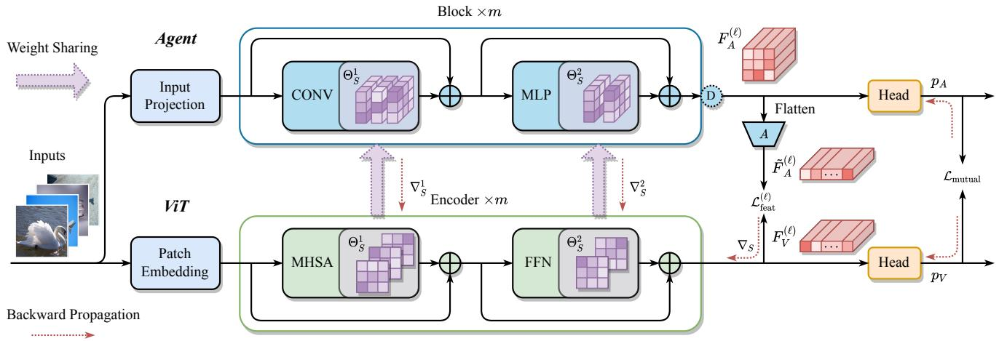  
Figure 2. Illustration of our proposed method for optimizing a vision Transformer along with an agent CNN from scratch. The agent CNN is constructed according to the ViT structure with inductive biases through generalized convolution (CONV) and configurable downsampling. The ViT learns agent’s inductive biases from adaptive intermediate supervision $\mathcal { L } _ { \mathrm { f e a t } } ^ { ( \ell ) }$ and soft labels ${ \mathcal { L } } _ { \mathrm { m u t u a l } }$ . Further, the weights of MHSA and FFN are shared to the agent CNN and trained by our proposed bootstrapping learning algorithm.

# 3. Method

In this section, we first introduce the preliminaries of CNNs and ViTs. Then, based on the relationship of convolution layers and MHSA layers, agent CNNs are proposed to help train ViTs. Finally, we delineate the bootstrapping optimization algorithm where the agent and ViT are jointly optimized without pre-training. The workflow of our method is demonstrated in Fig. 2.

# 3.1. Preliminaries

# 3.1.1 Convolution

Convolution is the central part of CNNs, which accepts a two-dimensional feature map. For the sake of future discussion, we formularize the forward propagation with a sequence of visual tokens $X = ( x _ { 1 } , \ldots , x _ { n } ) \in \mathbb { R } ^ { n \times d _ { \mathrm { i n } } }$ as its input, each of which is a $d _ { \mathrm { i n } }$ -dimensional embedded vector. Thus, the output sequence of convolution with kernel size $\left( k _ { h } , k _ { w } \right)$ is the sum of linear projection of $X$ :

$$
Y _ {C} = \sum_ {i = 1} ^ {N} \Phi_ {i} X W _ {i}, \tag {1}
$$

where $\Phi _ { i }$ is a constant sparse matrix representing the hardcoded inductive biases of localized dependencies, the size of receptive field $N = k _ { h } \times k _ { w }$ , and the projection matrix $W _ { i } \in \mathbb { R } ^ { d _ { \mathrm { i n } } \times d _ { \mathrm { o u t } } }$ is trainable1.

It is worth noting that the $1 \times 1$ convolution has the form of $Y = X W$ , which is equivalent to a fully connected (FC) layer with the same projection matrix $W$ .

# 3.1.2 MHSA

The multi-head self-attention mechanism (MHSA) in ViTs takes a sequence of visual tokens as its input and can also be formularized similar to Eq. (1):

$$
Y _ {M} = \sum_ {h = 1} ^ {H} \Psi_ {h} X W _ {h} ^ {V O}, \tag {2}
$$

where $H$ is the number of heads, $W _ { h } ^ { V O } = W _ { h } ^ { V } W _ { h } ^ { O }$ is the f, ction ), and $( W _ { h } ^ { \dot { V } } ~ \in ~ \mathbb { R } ^ { d \times d _ { k } }$ ∈ Rd×dk $W _ { h } ^ { O } \in \mathbb { R } ^ { d _ { k } \times d }$ $d = H d _ { k } ,$ $\Psi _ { h } \in \mathbb { R } ^ { n \times n }$ attention matrix computed based on the pair-wise similarity of linearly projected tokens.

# 3.2. Agent CNN

Inspired by the similarity of Eq. (1) and Eq. (2) that the convolution layer can be treated as a special case of MHSA layer with sparse relationship matrices $\Psi$ , we propose constructing an agent CNN based on a given ViT that will converge faster when trained from scratch.

# 3.2.1 Generalized Convolution

To begin with, we propose a generalized convolution layer in which the size of its receptive field $N$ equals to the head number coded i $H$ of a MHSActive biases med as CONV, with hard-: $\{ \tilde { \Phi } _ { h } \} _ { h = 1 } ^ { H }$

$$
Y _ {\text {C O N V}} = \sum_ {h = 1} ^ {H} \tilde {\Phi} _ {h} X W _ {h}, \tag {3}
$$

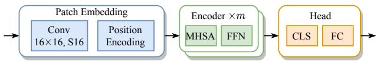  
(a) Network architecture of ViT

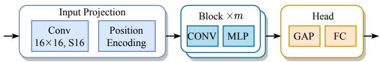

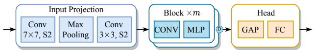  
(b) Network architecture of base agent CNN   
(c) Network architecture of res-like agent CNN   
Figure 3. Illustration of the architecture of the ViT and our proposed agent CNN with base and res-like configurations. The generalized convolution (CONV) substitutes for the MHSA, and the global average pooled feature replaces the CLS token in the ViT. Moreover, in the res-like agent, the feature pyramid is achieved by configurable down-sampling layers behind each block.

where $\tilde { \Phi } _ { 1 } , \ l . . . , \tilde { \Phi } _ { H } \in \mathbb { R } ^ { n \times n }$ are extracted from the set of hard-coded inductive biases √ $\big \{ \Phi _ { 1 } , \dots , \Phi _ { N ^ { \prime } } \big \}$ of the $\lceil { \sqrt { H } } \rceil \times$ $\lceil \sqrt { H } \rceil$ convolution $( N ^ { \prime } = \lceil \sqrt { H } \rceil ^ { 2 } )$ defined in Eq. (1).

# 3.2.2 Constructing Agent CNN

We start with a standard ViT model (in Fig. 3a) with $m$ encoder layers and finally build an agent CNN for introducing the inductive biases of CNNs. Fig. 3b illustrates a base agent CNN by simply replacing the MHSA layers of ViT with CONV layers, which has introduced sparsity and localized biases. Besides, the MLP in the agent are composed of two $1 \times 1$ convolution layers which are equivalent to the fully connected layers in the FFNs of Transformers.

Moreover, as many preferred CNNs share the feature pyramid architecture [21, 30, 38, 54] that the spacial size of feature maps shrunk as going deeper, we construct the final res-like agent CNN (in Fig. 3c) by: (1) introducing a ResNet-style input projection block which contains two convolution layers and one max-pooling layer, (2) adopting a configurable down-sample after each encoder layer.

With the hard-coded inductive biases, the agent can converge faster and with higher performance than training the corresponding ViT from scratch as shown in Fig. 5c.

Weight Sharing. Utilizing the homologous network architecture, our proposed agent accepts shared weights from the ViT model to reduce the training burden. Due to the equivalence of $1 \times 1$ convolution and FC layers, the FFNs in each encoder block of ViT can be directly shared by the agent. Furthermore, when shared with the output projection

$W _ { h } ^ { V O }$ of MHSA in Eq. (2), the CONV has the form of

$$
Y _ {\text {C O N V}} = \sum_ {h = 1} ^ {H} \tilde {\Phi} _ {h} X W _ {h} ^ {V O}. \tag {4}
$$

Let $y _ { c }$ and $\tilde { y } _ { c }$ be the $c$ -th token of the output of MHSA and shared CONV accordingly. With the assumption that the input sequences are the same, denoted by $X$ , the difference $y _ { \mathrm { { e r r } } } = y _ { c } - \tilde { y } _ { c }$ can be written as

$$
y _ {\text {e r r}} = \sum_ {h = 1} ^ {H} \left(\tilde {\phi} _ {h} - \psi_ {h}\right) X W _ {h} ^ {V O}, \tag {5}
$$

where $\tilde { \phi } _ { h }$ and $\psi _ { h }$ are the $c$ -th row of matrix $\tilde { \Phi } _ { h }$ and $\Psi _ { h }$ respectively. As there are no more than one non-zero element in $\tilde { \phi } _ { h }$ (proved in Appendix A), we can minimize the magnitude of $y _ { \mathrm { e r r } }$ by learning sparse and localized dependencies of matrix $\Psi _ { h }$ .

# 3.3. Bootstrapping Optimization

In this section, we describe how to jointly optimize the ViT and the agent by introducing the optimization objective and proposed training strategy.

# 3.3.1 Adaptive Intermediate Supervision

To inject the inductive biases of the agent into ViT without modifying ViT’s architecture, we propose the adaptive intermediate supervision where the adapted feature maps of the agent supervise the corresponding visual sequences of the ViT. Let F (ℓ)A $\overset { \cdot } { F } _ { A } ^ { ( \ell ) }$ and $F _ { V } ^ { ( \ell ) }$ denote the flattened feature maps and visual sequence of the $\ell$ -th encoder layer of the agent and ViT in respective. The adaptive intermediate loss of $\ell \cdot$ -th layer of the ViT and agent is defined as

$$
\mathcal {L} _ {\text {f e a t}} ^ {(\ell)} = \left\| \frac {\tilde {F} _ {A} ^ {(\ell)}}{\| \tilde {F} _ {A} ^ {(\ell)} \| _ {2}} - \frac {F _ {V} ^ {(\ell)}}{\| F _ {V} ^ {(\ell)} \| _ {2}} \right\| _ {2} ^ {2}, \tag {6}
$$

where $\tilde { { \cal F } } : = \mathrm { A d a p t } ( { \cal F } )$ is the adapted feature, obtained from sequence interpolation or 2-dimensional average pooling. We have compared the different adaptive approaches in Sec. 4.3.

Finally, the adaptive intermediate supervision is the sum of all assigned layers $\varLambda$ :

$$
\mathcal {L} _ {\text {f e a t}} = \sum_ {\ell \in \Lambda} \mathcal {L} _ {\text {f e a t}} ^ {(\ell)}. \tag {7}
$$

# 3.3.2 Optimization Objective

Except for intermediate supervision, we introduce the mutual learning framework [55] that the predicted probabilities

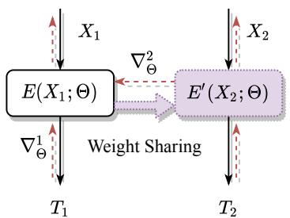  
(a) Bootstrapping Learning

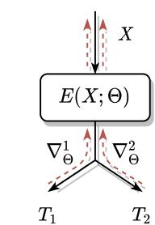  
(b) Multi-task Learning   
Figure 4. The relationship of our proposed bootstrapping learning and multi-task learning. Here, $T _ { 1 }$ and $T _ { 2 }$ are two different tasks (optimization objective).

by the ViT (denoted as $p _ { V }$ ) and the agent (denoted as $p _ { A }$ ) learn from each other as

$$
\mathcal {L} _ {\text {m u t u a l}} = \mathcal {L} _ {\mathrm {K D}} \left(p _ {V}, \bar {p} _ {A}, y; T\right) + \mathcal {L} _ {\mathrm {K D}} \left(p _ {A}, \bar {p} _ {V}, y; T\right), \tag {8}
$$

where $\bar { p }$ represents that the variable $p$ is treated as a constant vector, i.e., no gradient is computed with regard to the variables in the forward propagation paths, ${ \mathcal { L } } _ { \mathrm { K D } }$ is the knowledge distillation loss defined in [22] with temperature $T$ , and $y$ denotes the ground truth label of the input image.

Above all, the optimization objective is summarized as

$$
\mathcal {L} = \alpha \mathcal {L} _ {\text {f e a t}} + \beta \mathcal {L} _ {\text {m u t u a l}}, \tag {9}
$$

and $\alpha$ and $\beta$ are the weighting hyperparameters for balancing the two terms.

# 3.3.3 Bootstrapping Training Algorithm

The bootstrapping training algorithm is given in Algorithm 1 where gradients computed from each network are aligned and jointly update the shared weights. The gradient alignment function $\mathrm { A l i g n } ( \nabla _ { S } ^ { A } | \nabla _ { S } ^ { V } )$ modifies the negative gradient direction from the agent as [51].

Relationship with multi-task learning. It is worth pointing out that bootstrapping learning is different from multitask learning. As shown in Fig. 4, the multi-task model $E$ only accepts one input $X$ , while for bootstrapping learning, inputs to $E$ and $E ^ { \prime }$ are different. Moreover, the layers $E$ and $E ^ { \prime }$ in Fig. 4a shares the same weights $\Theta$ . In our case, as we constrain the difference between inputs of each encoder layer by Eq. (7) and when $\| y _ { \mathrm { e r r } } \|$ is small enough, the bootstrapping learning will degenerate to multi-task learning.

# 4. Experiments

# 4.1. Implementation

Datasets. Three widely-used image classification datasets are adopted to evaluate our proposed method as benchmarks, including CIFAR-10 [28], CIFAR-100 [28], and

Algorithm 1 Bootstrapping optimizer for training the shared weights in FFN and MHSA layers in the ViT.

Input: $\Theta _ { S }$ : the set of shared weights; $\Theta _ { V }$ , $\Theta _ { A }$ : the set of private weights in the ViT and agent respectively; $E _ { V } ^ { ( \ell ) } ( \cdot ; \Theta _ { S } , \Theta _ { V } )$ , $E _ { A } ^ { ( \ell ) } ( \cdot ; \Theta _ { S } , \Theta _ { A } )$ : the $\ell \cdot$ -th encoder layer of the ViT and agent respectively; $\lambda$ : learning rate.

1: while not converge do   
2: Compute the input feature map (sequence) $X _ { V }$ $X _ { V } , X _ { A }$ to the $\ell$ -th encoder layer from the input image   
3: $Y _ { V } \gets E _ { V } ^ { ( \ell ) } ( X _ { V } ; \mathsf { \bar { \Theta } } _ { S } , \Theta _ { V } )$   
4: $Y _ { A } \gets E _ { A } ^ { ( \ell ) } ( X _ { A } ; \Theta _ { S } , \Theta _ { A } )$   
5: Compute the gradients $\nabla _ { S } ^ { V }$ , $\nabla _ { P } ^ { V }$ w.r.t. $\Theta _ { S }$ and $\Theta _ { V }$ respectively ( $\Theta _ { A }$ keep as constant variables).   
6: Compute the gradients $\nabla _ { S } ^ { A }$ , $\nabla _ { P } ^ { A }$ w.r.t. $\Theta _ { S }$ and $\Theta _ { A }$ respectively ( $\Theta _ { V }$ keep as constant variables).   
7: $\boldsymbol { \Theta } _ { V } \gets \boldsymbol { \Theta } _ { V } - \lambda \boldsymbol { \nabla } _ { P } ^ { V }$ , $\Theta _ { A }  \Theta _ { A } - \lambda \nabla _ { P } ^ { A }$ # update private weights   
8: $\Theta _ { S } \gets \Theta _ { S } - \lambda / 2 \big ( \nabla _ { S } ^ { V } + \mathrm { A l i g n } \big ( \nabla _ { S } ^ { A } | \nabla _ { S } ^ { V } \big ) \big )$ # update shared weights in bootstrapping way   
9: end while

ImageNet-1k [29]. In particular, to simulate lack-of-data circumstances, $1 \%$ , 5%, and $10 \%$ labeled samples are randomly extracted from the training partition of the ImageNet dataset. Even though ViTs require strong data augmentations in previous approaches [18, 45, 48, 52], in our implementation, both CNNs and ViTs are only optimized with several simple augmentation methods, including random resized cropping and random horizontal flipping.

Vision Transformers. We follow the network architectures introduced in [18] and [45] with slight modifications to the head number and embedding dimensions. The detailed settings of ViTs are presented in Tab. 2, in which ViT-S is a relatively small model with 6 layers, and the ViT-B is the same as DeiT [45] with 12 layers.

Agent CNNs. The agents are constructed according to the given ViTs and thus share the same network settings as ViTs. Besides, detailed configurations of the base and reslike agents are described in Appendix E.

Training Details and Selection of Hyperparameters. We implement our method with Pytorch [34] framework. AdamW [32] is used to optimize ViTs and agent CNNs in both standalone and joint training schemes, with the learning rate of $1 0 ^ { - 3 }$ and the weight decay of $5 \times 1 0 ^ { - 2 }$ . However, conventional CNNs, such as ResNet [21] and EfficientNet [43], are optimized by SGD [41] with the learning rate of $5 \times 1 0 ^ { - 2 }$ and the weight decay of $5 \times 1 0 ^ { - 4 }$ . We train all the settings for 240 epochs with the batch size of

Table 1. Comparison results on CIFAR-10 and CIFAR-100. The top-1 accuracy, number of parameters, and FLOPs are reported separately. $^ { \ast } \dagger ^ { \ast }$ indicates that the initial weights of pre-trained ViT-B are acquired from the official repository of DeiT. The comparison settings are classified in the ‘Model’ column. The values in blue color indicates top-1 accuracy improvements compared with the corresponding ViT trained from scratch.   

<table><tr><td rowspan="2">Model</td><td rowspan="2">Method</td><td colspan="3">CIFAR-10</td><td colspan="3">CIFAR-100</td></tr><tr><td>Acc</td><td>#param.</td><td>FLOPs</td><td>Acc</td><td>#param.</td><td>FLOPs</td></tr><tr><td rowspan="4">CNNs</td><td>EfficientNet-B2</td><td>94.14</td><td>7.71M</td><td>0.70G</td><td>75.55</td><td>7.84M</td><td>0.70G</td></tr><tr><td>ResNet50</td><td>94.92</td><td>23.53M</td><td>4.14G</td><td>77.57</td><td>23.71M</td><td>4.14G</td></tr><tr><td>Agent-S</td><td>94.18</td><td>8.66M</td><td>3.37G</td><td>74.62</td><td>8.73M</td><td>3.37G</td></tr><tr><td>Agent-B</td><td>94.83</td><td>25.05M</td><td>9.46G</td><td>74.78</td><td>25.91M</td><td>9.46G</td></tr><tr><td rowspan="6">ViTs</td><td>ViT-S</td><td>87.32</td><td>6.28M</td><td>1.37G</td><td>61.25</td><td>6.30M</td><td>1.37G</td></tr><tr><td>ViT-S-SAM</td><td>87.77</td><td>6.28M</td><td>1.37G</td><td>62.60</td><td>6.30M</td><td>1.37G</td></tr><tr><td>ViT-S-Sparse</td><td>87.43</td><td>6.28M</td><td>1.37G</td><td>62.29</td><td>6.30M</td><td>1.37G</td></tr><tr><td>ViT-B</td><td>79.24</td><td>21.67M</td><td>4.62G</td><td>53.07</td><td>21.70M</td><td>4.62G</td></tr><tr><td>ViT-B-SAM</td><td>86.57</td><td>21.67M</td><td>4.62G</td><td>58.18</td><td>21.70M</td><td>4.62G</td></tr><tr><td>ViT-B-Sparse</td><td>83.87</td><td>21.67M</td><td>4.62G</td><td>57.22</td><td>21.70M</td><td>4.62G</td></tr><tr><td rowspan="2">Pre-trained ViTs</td><td>ViT-S</td><td>95.70</td><td>6.28M</td><td>1.37G</td><td>80.91</td><td>6.30M</td><td>1.37G</td></tr><tr><td>ViT-B†</td><td>97.17</td><td>21.67M</td><td>4.62G</td><td>84.95</td><td>21.70M</td><td>4.62G</td></tr><tr><td rowspan="4">Ours Joint</td><td>Agent-S</td><td>94.90</td><td>8.66M</td><td>3.37G</td><td>74.06</td><td>8.73M</td><td>3.37G</td></tr><tr><td>ViT-S</td><td>95.14 (+7.82)</td><td>6.28M</td><td>1.37G</td><td>76.19 (+14.94)</td><td>6.30M</td><td>1.37G</td></tr><tr><td>Agent-B</td><td>95.06</td><td>25.05M</td><td>9.46G</td><td>76.57</td><td>25.91M</td><td>9.46G</td></tr><tr><td>ViT-B</td><td>95.00 (+15.76)</td><td>21.67M</td><td>4.62G</td><td>77.83 (+24.76)</td><td>21.70M</td><td>4.62G</td></tr><tr><td rowspan="4">Ours Shared</td><td>Agent-S</td><td>93.22</td><td>-</td><td>-</td><td>74.06</td><td>-</td><td>-</td></tr><tr><td>ViT-S</td><td>93.72 (+6.40)</td><td>6.28M</td><td>1.37G</td><td>75.50 (+14.25)</td><td>6.30M</td><td>1.37G</td></tr><tr><td>Agent-B</td><td>92.66</td><td>-</td><td>-</td><td>74.11</td><td>-</td><td>-</td></tr><tr><td>ViT-B</td><td>93.34 (+14.10)</td><td>21.67M</td><td>4.62G</td><td>75.71 (+22.64)</td><td>21.70M</td><td>4.62G</td></tr></table>

Table 2. Detailed configurations of ViTs and agent CNNs.   

<table><tr><td></td><td>ViT-S</td><td>ViT-B</td><td>Agent-S</td><td>Agent-B</td></tr><tr><td>Layers (m)</td><td>6</td><td>12</td><td>6</td><td>12</td></tr><tr><td>Hidden Size (d)</td><td>288</td><td>384</td><td>288</td><td>384</td></tr><tr><td>Heads (H)</td><td>9</td><td>6</td><td>9</td><td>6</td></tr></table>

32 on two Nvidia Tesla A100 GPUs. The cosine annealing is adopted as the learning rate decay schedule.

There are several hyperparameters involved in our method, including $\alpha$ and $\beta$ in Eq. (9) and the temperature $T$ for knowledge distillation loss in Eq. (8). We set $\alpha = 1$ , $\beta = 1 0$ and $T = 4$ as default values and the sensitivity analysis is described in Sec. 4.5.

Finally, we set the intermediate feature supervisions decay linearly for preserving the capacity of the ViTs, and different decay strategies are compared in Sec. 4.3.

# 4.2. Experimental Results

We evaluate our proposed method with the following comparison settings:

• CNNs: the standalone agents and traditional CNNs, e.g., EfficientNet-B2 and ResNet50.   
• ViTs: the original ViTs and variants for training with high efficiency, e.g., ViT-Sparse [12] and ViT-SAM [8]. All of them are trained from scratch.   
• Pre-trained ViTs: vision Transformers which have been pre-trained on ImageNet-1k and then fine-tuned to evaluation datasets.   
• Ours Joint: the vision Transformers and the agent are jointly optimized without weight sharing.   
• Ours Shared: the vision Transformers and the agent are jointly optimized with weight sharing.

Performance on CIFAR Datasets. The comparison results on CIFAR-10/100 are shown in Tab. 1, where the top-1 accuracy, number of parameters, and FLOPs are presented for each setting. The discoveries are itemized as follows. (1) When the agent CNNs are trained alone, the performance can hardly surpass the traditional CNNs, even if

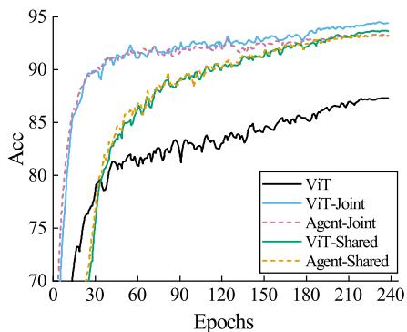  
(a) Accuracy learning curves on CIFAR-10.

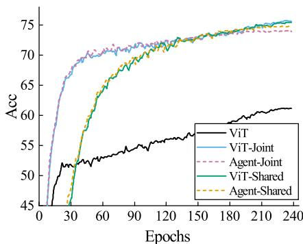  
(b) Accuracy learning curves on CIFAR-100.

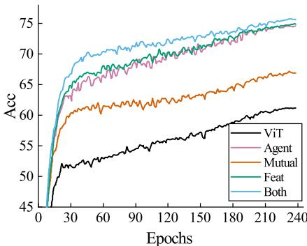  
(c) Ablation study on CIFAR-100.   
Figure 5. Accuracy learning curves of our proposed method and baseline settings on CIFAR-10 and CIFAR-100 datasets. Specifically, We compare the accuracy of training ViT from scratch and training jointly with the agent CNN. Here, ‘Shared’ and ‘Joint’ represent jointly training both models with and without weight sharing, respectively. Besides, we compare the results of the ablation study of loss terms in (c), where ‘Mutual’ means training with mutual knowledge distillation term ${ \mathcal { L } } _ { \mathrm { m u t u a l } }$ only, and ‘Feat’ denotes training with adaptive intermediate supervision ${ \mathcal { L } } _ { \mathrm { f e a t } }$ only. In addition, the curve of training the agent model alone is plotted as ‘Agent’.

most of the inductive biases are hard-coded into the agents. In Sec. 4.4, we discuss more about the choice of agents. (2) Without pre-training or strong data augmentations, the ViTs perform terribly due to the dense connection of MHSA layers. Although Chen et al. [8] have shown that ViTs can be optimized with SAM optimizer, librated from the pretraining on mid-scale datasets, such as ImageNet-1k, it may not be the best choice for small datasets like CIFAR. (3) Our proposed method has significantly outperformed the baseline settings, including the original ViTs and the variations. Particularly, ViT-S surpasses the original baseline by $7 . 8 2 \%$ on CIFAR-10 and $1 4 . 4 9 \%$ on CIFAR-100, which outperforms the agent and EfficientNet-B2 with fewer parameters. Besides, both the ViTs and agents have benefited from our proposed method; however, with the help of the global receptive field, ViTs perform better. (4) In the ‘Shared’ settings, the bootstrapping learning strategy has shown that the shared weights can be optimized robustly with a limited deterioration of accuracy. Such results are encouraging that the weights of ViTs can be directly transferred to a framework of hard-coded inductive biases so that ViTs can utilize the inductive biases without an extra set of parameters or sophisticated modifications.

Moreover, we plot the accuracy learning curves of our method along with the baseline settings in Fig. 5. It clearly illustrates that ViTs can converge as fast as CNNs and finally achieve the higher upper bound than CNNs’.

Performance on ImageNet. The comparison results on ImageNet-1k with different amounts of labeled images are shown in Tab. 3, where $5 \%$ , $10 \%$ , and $50 \%$ of the training images are randomly selected. The conclusions of the CIFAR-10/100 dataset still hold in the ImageNet. Particularly, the improvement of our method is prominent when

Table 3. Comparison results on ImageNet-1k with $5 \%$ , $10 \%$ , and $50 \%$ annotated samples.   

<table><tr><td>Method</td><td>5% images</td><td>10% images</td><td>50% images</td></tr><tr><td>ResNet50</td><td>35.43</td><td>50.86</td><td>70.05</td></tr><tr><td>Agent-B</td><td>35.28</td><td>47.46</td><td>68.13</td></tr><tr><td>ViT-B</td><td>16.60</td><td>28.11</td><td>63.40</td></tr><tr><td>ViT-B-SAM</td><td>16.67</td><td>28.66</td><td>64.37</td></tr><tr><td>ViT-B-Sparse</td><td>10.39</td><td>28.92</td><td>66.01</td></tr><tr><td>Ours-Joint</td><td>36.01 (+19.41)</td><td>49.73 (+21.62)</td><td>71.36 (+7.96)</td></tr><tr><td>Ours-Shared</td><td>33.06 (+16.46)</td><td>45.75 (+17.64)</td><td>66.48 (+3.08)</td></tr></table>

data is extremely scarce, while others have shown inconspicuous amelioration or even impairment.

# 4.3. Ablation Study

In this section, we go deep into our proposed method to figure out the function of loss terms (introduced in Sec. 3.3.2), the effects of different decay strategies (in Sec. 4.1), and adaptive functions (in Sec. 3.3.1). The results of ViT-S are reported on CIFAR-100 dataset.

# 4.3.1 Ablation of Loss Terms

As delineated in Sec. 3.3.2, the ultimate optimization objective has two terms: the adaptive intermediate supervision ${ \mathcal { L } } _ { \mathrm { f e a t } }$ and the mutual learning term ${ \mathcal { L } } _ { \mathrm { m u t u a l } }$ . We evaluate the joint learning settings when supervised with the two terms separately in Tab. 4, showing that both loss terms have contributed to the final result. Particularly, ${ \mathcal { L } } _ { \mathrm { f e a t } }$ boosts the accuracy by 13.69 percentage points. Additionally, learning curves are plotted in Fig. 5c for better illustration. We can observe that the ‘Feat’ term produces a more competi-

Table 4. Ablation Study of the joint learning ViT-S method on CIFAR-100. In the column of ‘Feat’, $\cdot _ { \checkmark }$ denotes using the default settings, ‘No Decay’ represents the weight $\beta$ of the ${ \mathcal { L } } _ { \mathrm { f e a t } }$ keep constant throughout the whole training process, and ‘AP-2D’ means using 2D average pooling as adaptive function in Eq. (6).   

<table><tr><td>Settings</td><td>Mutual</td><td>Feat</td><td>Acc</td><td>Training Time</td></tr><tr><td>Baseline</td><td>X</td><td>X</td><td>61.25</td><td>3.3h</td></tr><tr><td>KD Only</td><td>✓</td><td>X</td><td>67.16</td><td>3.6h</td></tr><tr><td rowspan="3">Feat Only</td><td>X</td><td>No Decay</td><td>73.59</td><td>3.8h</td></tr><tr><td>X</td><td>✓</td><td>74.94</td><td>3.8h</td></tr><tr><td>X</td><td>AP-2D</td><td>71.06</td><td>6.6h</td></tr><tr><td rowspan="2">Both</td><td>✓</td><td>No Decay</td><td>75.15</td><td>3.8h</td></tr><tr><td>✓</td><td>✓</td><td>76.19</td><td>3.8h</td></tr></table>

Table 5. Joint training results on CIFAR-100 when using the agent with different network architectures.   

<table><tr><td>Acc</td><td>Agent-S</td><td>ViT-S-Joint</td><td>Agent-S-Joint</td></tr><tr><td>Base</td><td>72.73</td><td>73.18</td><td>73.79</td></tr><tr><td>Res-like</td><td>74.78</td><td>76.19</td><td>74.06</td></tr></table>

tive result as it converges significantly faster than using the ‘Mutual’ term. Therefore, the supervision through the intermediate features has successfully injected the inductive biases into the ViT.

# 4.3.2 Ablation of Decay Strategy

The influence of the feature supervision decay strategy is shown in Tab. 4. Without the decay strategy, the performance has declined by $1 . 3 5 \%$ . It can be explained that the constant supervision with inductive biases has constrained the ViTs from learning the long-range dependencies, and consequently, impaired the upper-bound of ViTs.

# 4.3.3 Ablation of Adaptive Functions

We evaluate our method with two intermediate feature adaptive functions: 1D sequence interpolation (by default) and 2D average pooling. The comparison results are shown in Tab. 4, in which the sequence interpolation is superior to the average pooling.

# 4.4. The Choice of Agent CNNs

In Sec. 3.2.2, we have introduced agent CNNs with two different network architectures (base and res-like). Tab. 5 shows that the performances with the res-like configuration are uniformly better than the base agent.

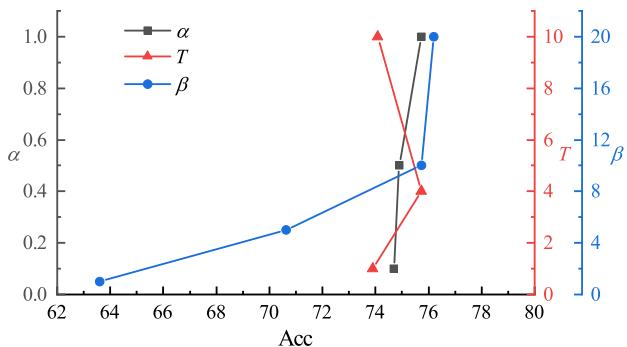  
Figure 6. Sensitivity analysis of hyperparameters. The results of bootstrapping learning the ViT-S are reported on CIFAR-100.

# 4.5. Sensitivity Analysis of Hyperparameters

The sensitivity analysis of the hyperparameters in our methods is illustrated in Fig. 6, including $\alpha$ , $\beta$ in Eq. (9), and $T$ in Eq. (8). It shows that our method is robust to the variation of $\alpha$ and $T$ . However, $\beta$ has a more significant influence, as the ViTs perform better when more inductive biases are used to supervise the ViTs.

# 5. Conclusion and Future Work

In this paper, we propose to dissolve optimizing vision Transformers (ViTs) efficiently without pre-training or strong data augmentations. Our goal is to introduce inductive biases from convolutional neural networks (CNNs) to ViTs while preserving the network architecture of ViTs for higher upper bound, and further setting up more suitable optimization objectives. To this end, we propose to optimize the ViT jointly with an agent CNN constructed corresponding to the network architecture of the ViT. The ViT learns inductive biases through adaptive intermediate supervision and predicted probabilities. Besides, a bootstrapping training algorithm is proposed to optimize both the ViT and agent with weight sharing. Extensive experiments have shown encouraging results that the inductive biases help ViTs converge significantly faster and outperform conventional CNNs with fewer parameters. In future work, we will extend our method beyond CNN-style inductive biases and introduce more interpretable features to ViTs.

Acknowledgements. This work is supported by Key Research and Development Program of Zhejiang Province (2020C01024), CCF-Baidu Open Fund (NO.2021PP15002000), National Natural Science Foundation of China (62106220, U20B2066), Ningbo Natural Science Foundation (2021J189), the Starry Night Science Fund of Zhejiang University Shanghai Institute for Advanced Study (Grant No. SN-ZJU-SIAS-001), and the Fundamental Research Funds for the Central Universities.

# References

[1] Samik Banerjee and Sukhendu Das. Mutual variation of information on transfer-cnn for face recognition with degraded probe samples. Neurocomputing, 310:299–315, 2018. 2   
[2] Tom B Brown, Benjamin Mann, Nick Ryder, Melanie Subbiah, Jared Kaplan, Prafulla Dhariwal, Arvind Neelakantan, Pranav Shyam, Girish Sastry, Amanda Askell, et al. Language models are few-shot learners. arXiv preprint arXiv:2005.14165, 2020. 1, 2   
[3] Tom B Brown, Benjamin Mann, Nick Ryder, Melanie Subbiah, Jared Kaplan, Prafulla Dhariwal, Arvind Neelakantan, Pranav Shyam, Girish Sastry, Amanda Askell, et al. Language models are few-shot learners. arXiv preprint arXiv:2005.14165, 2020. 2   
[4] Nicolas Carion, Francisco Massa, Gabriel Synnaeve, Nicolas Usunier, Alexander Kirillov, and Sergey Zagoruyko. Endto-end object detection with transformers. In ECCV, pages 213–229, Cham, 2020. Springer International Publishing. 1, 2   
[5] Liang-Chieh Chen, George Papandreou, Florian Schroff, and Hartwig Adam. Rethinking atrous convolution for semantic image segmentation. arXiv preprint arXiv:1706.05587, 2017. 1   
[6] Tianlong Chen, Yu Cheng, Zhe Gan, Lu Yuan, Lei Zhang, and Zhangyang Wang. Chasing sparsity in vision transformers: An end-to-end exploration. arXiv preprint arXiv:2106.04533, 2021. 2   
[7] Xiangning Chen and Cho-Jui Hsieh. Stabilizing differentiable architecture search via perturbation-based regularization. In ICML, pages 1554–1565. PMLR, 2020. 1   
[8] Xiangning Chen, Cho-Jui Hsieh, and Boqing Gong. When vision transformers outperform resnets without pretraining or strong data augmentations. arXiv preprint arXiv:2106.01548, 2021. 1, 2, 6, 7   
[9] Zhengsu Chen, Lingxi Xie, Jianwei Niu, Xuefeng Liu, Longhui Wei, and Qi Tian. Visformer: The vision-friendly transformer. arXiv preprint arXiv:2104.12533, 2021. 2   
[10] Nadav Cohen and Amnon Shashua. Inductive bias of deep convolutional networks through pooling geometry. arXiv preprint arXiv:1605.06743, 2016. 1   
[11] Jean-Baptiste Cordonnier, Andreas Loukas, and Martin Jaggi. On the relationship between self-attention and convolutional layers. arXiv preprint arXiv:1911.03584, 2019. 1   
[12] Gonc¸alo M Correia, Vlad Niculae, and Andre FT Mar- ´ tins. Adaptively sparse transformers. arXiv preprint arXiv:1909.00015, 2019. 2, 6   
[13] Zhigang Dai, Bolun Cai, Yugeng Lin, and Junying Chen. Up-detr: Unsupervised pre-training for object detection with transformers. In CVPR, pages 1601–1610, 2021. 2   
[14] Navneet Dalal and Bill Triggs. Histograms of oriented gradients for human detection. In CVPR, volume 1, pages 886– 893, 2005. 1   
[15] Stephane d’Ascoli, Hugo Touvron, Matthew Leavitt, Ari ´ Morcos, Giulio Biroli, and Levent Sagun. Convit: Improving vision transformers with soft convolutional inductive biases. arXiv preprint arXiv:2103.10697, 2021. 1

[16] Zhongying Deng, Xiaojiang Peng, Zhifeng Li, and Yu Qiao. Mutual component convolutional neural networks for heterogeneous face recognition. TIP, 28(6):3102–3114, 2019. 2   
[17] Jacob Devlin, Ming-Wei Chang, Kenton Lee, and Kristina Toutanova. Bert: Pre-training of deep bidirectional transformers for language understanding. arXiv preprint arXiv:1810.04805, 2018. 1, 2   
[18] Alexey Dosovitskiy, Lucas Beyer, Alexander Kolesnikov, Dirk Weissenborn, Xiaohua Zhai, Thomas Unterthiner, Mostafa Dehghani, Matthias Minderer, Georg Heigold, Sylvain Gelly, Jakob Uszkoreit, and Neil Houlsby. An image is worth 16x16 words: Transformers for image recognition at scale. In ICLR, 2021. 1, 2, 5   
[19] Xinyue Fan, Jia Zhang, and Yang Lin. Person reidentification based on mutual learning with embedded noise block. IEEE Access, 9:129229–129239, 2021. 2   
[20] Pierre Foret, Ariel Kleiner, Hossein Mobahi, and Behnam Neyshabur. Sharpness-aware minimization for efficiently improving generalization. arXiv preprint arXiv:2010.01412, 2020. 2   
[21] Kaiming He, Xiangyu Zhang, Shaoqing Ren, and Jian Sun. Deep residual learning for image recognition. In CVPR, pages 770–778, 2016. 1, 4, 5   
[22] Geoffrey Hinton, Oriol Vinyals, and Jeff Dean. Distilling the knowledge in a neural network. arXiv preprint arXiv:1503.02531, 2015. 2, 5   
[23] Gao Huang, Zhuang Liu, Laurens Van Der Maaten, and Kilian Q Weinberger. Densely connected convolutional networks. In CVPR, pages 4700–4708, 2017. 1   
[24] Xiaoqi Jiao, Yichun Yin, Lifeng Shang, Xin Jiang, Xiao Chen, Linlin Li, Fang Wang, and Qun Liu. Tinybert: Distilling bert for natural language understanding. arXiv preprint arXiv:1909.10351, 2019. 2   
[25] Nitish Shirish Keskar, Dheevatsa Mudigere, Jorge Nocedal, Mikhail Smelyanskiy, and Ping Tak Peter Tang. On largebatch training for deep learning: Generalization gap and sharp minima. arXiv preprint arXiv:1609.04836, 2016. 1   
[26] Jangho Kim, Minsung Hyun, Inseop Chung, and Nojun Kwak. Feature fusion for online mutual knowledge distillation. In ICPR, pages 4619–4625. IEEE, 2021. 2   
[27] Kyungmin Kim, Bichen Wu, Xiaoliang Dai, Peizhao Zhang, Zhicheng Yan, Peter Vajda, and Seon Joo Kim. Rethinking the self-attention in vision transformers. In CVPR, pages 3071–3075, 2021. 2   
[28] Alex Krizhevsky, Geoffrey Hinton, et al. Learning multiple layers of features from tiny images. 2009. 2, 5   
[29] Alex Krizhevsky, Ilya Sutskever, and Geoffrey E Hinton. Imagenet classification with deep convolutional neural networks. NIPS, 25:1097–1105, 2012. 1, 2, 5   
[30] Tsung-Yi Lin, Piotr Dollar, Ross Girshick, Kaiming He, ´ Bharath Hariharan, and Serge Belongie. Feature pyramid networks for object detection. In CVPR, pages 2117–2125, 2017. 4   
[31] Ze Liu, Yutong Lin, Yue Cao, Han Hu, Yixuan Wei, Zheng Zhang, Stephen Lin, and Baining Guo. Swin transformer: Hierarchical vision transformer using shifted windows. arXiv preprint arXiv:2103.14030, 2021. 2

[32] Ilya Loshchilov and Frank Hutter. Decoupled weight decay regularization. arXiv preprint arXiv:1711.05101, 2017. 5   
[33] David G Lowe. Distinctive image features from scaleinvariant keypoints. IJCV, 60(2):91–110, 2004. 1   
[34] Adam Paszke, Sam Gross, Francisco Massa, Adam Lerer, James Bradbury, Gregory Chanan, Trevor Killeen, Zeming Lin, Natalia Gimelshein, Luca Antiga, et al. Pytorch: An imperative style, high-performance deep learning library. Advances in neural information processing systems, 32:8026– 8037, 2019. 5   
[35] Alec Radford, Jeffrey Wu, Rewon Child, David Luan, Dario Amodei, and Ilya Sutskever. Language models are unsupervised multitask learners. OpenAI blog, 1(8):9, 2019. 1   
[36] Shaoqing Ren, Kaiming He, Ross Girshick, and Jian Sun. Faster r-cnn: Towards real-time object detection with region proposal networks. NIPS, 28:91–99, 2015. 1   
[37] Adriana Romero, Nicolas Ballas, Samira Ebrahimi Kahou, Antoine Chassang, Carlo Gatta, and Yoshua Bengio. Fitnets: Hints for thin deep nets. arXiv preprint arXiv:1412.6550, 2014. 2   
[38] Karen Simonyan and Andrew Zisserman. Very deep convolutional networks for large-scale image recognition. arXiv preprint arXiv:1409.1556, 2014. 4   
[39] Jie Song, Haofei Zhang, Xinchao Wang, Mengqi Xue, Ying Chen, Li Sun, Dacheng Tao, and Mingli Song. Tree-like decision distillation. In CVPR, pages 13488–13497, 2021. 2   
[40] Robin Strudel, Ricardo Garcia, Ivan Laptev, and Cordelia Schmid. Segmenter: Transformer for semantic segmentation. arXiv preprint arXiv:2105.05633, 2021. 2   
[41] Ilya Sutskever, James Martens, George Dahl, and Geoffrey Hinton. On the importance of initialization and momentum in deep learning. In ICML, pages 1139–1147. PMLR, 2013. 5   
[42] Christian Szegedy, Wei Liu, Yangqing Jia, Pierre Sermanet, Scott Reed, Dragomir Anguelov, Dumitru Erhan, Vincent Vanhoucke, and Andrew Rabinovich. Going deeper with convolutions. In CVPR, pages 1–9, 2015. 1   
[43] Mingxing Tan and Quoc Le. Efficientnet: Rethinking model scaling for convolutional neural networks. In ICML, pages 6105–6114. PMLR, 2019. 5   
[44] Yonglong Tian, Dilip Krishnan, and Phillip Isola. Contrastive representation distillation. arXiv preprint arXiv:1910.10699, 2019. 2   
[45] Hugo Touvron, Matthieu Cord, Matthijs Douze, Francisco Massa, Alexandre Sablayrolles, and Herve J ´ egou. Training ´ data-efficient image transformers and distillation through attention. arXiv preprint arXiv:2012.12877, 2020. 1, 2, 5   
[46] Ashish Vaswani, Noam Shazeer, Niki Parmar, Jakob Uszkoreit, Llion Jones, Aidan N Gomez, Łukasz Kaiser, and Illia Polosukhin. Attention is all you need. In I. Guyon, U. V. Luxburg, S. Bengio, H. Wallach, R. Fergus, S. Vishwanathan, and R. Garnett, editors, NeurIPS, volume 30. Curran Associates, Inc., 2017. 1, 2   
[47] Ziyang Wang, Dan Wei, Xiaoqiang Hu, and Yiping Luo. Human skeleton mutual learning for person re-identification. Neurocomputing, 388:309–323, 2020. 2

[48] Haiping Wu, Bin Xiao, Noel Codella, Mengchen Liu, Xiyang Dai, Lu Yuan, and Lei Zhang. Cvt: Introducing convolutions to vision transformers. arXiv preprint arXiv:2103.15808, 2021. 2, 5   
[49] Runmin Wu, Mengyang Feng, Wenlong Guan, Dong Wang, Huchuan Lu, and Errui Ding. A mutual learning method for salient object detection with intertwined multi-supervision. In CVPR, pages 8150–8159, 2019. 2   
[50] Anbang Yao and Dawei Sun. Knowledge transfer via dense cross-layer mutual-distillation. In ECCV, pages 294–311. Springer, 2020. 2   
[51] Tianhe Yu, Saurabh Kumar, Abhishek Gupta, Sergey Levine, Karol Hausman, and Chelsea Finn. Gradient surgery for multi-task learning. arXiv preprint arXiv:2001.06782, 2020. 5   
[52] Li Yuan, Yunpeng Chen, Tao Wang, Weihao Yu, Yujun Shi, Francis EH Tay, Jiashi Feng, and Shuicheng Yan. Tokensto-token vit: Training vision transformers from scratch on imagenet. arXiv preprint arXiv:2101.11986, 2021. 2, 5   
[53] Sergey Zagoruyko and Nikos Komodakis. Paying more attention to attention: Improving the performance of convolutional neural networks via attention transfer. arXiv preprint arXiv:1612.03928, 2016. 2   
[54] Sergey Zagoruyko and Nikos Komodakis. Wide residual networks. arXiv preprint arXiv:1605.07146, 2016. 4   
[55] Ying Zhang, Tao Xiang, Timothy M Hospedales, and Huchuan Lu. Deep mutual learning. In CVPR, pages 4320– 4328, 2018. 2, 4   
[56] Sixiao Zheng, Jiachen Lu, Hengshuang Zhao, Xiatian Zhu, Zekun Luo, Yabiao Wang, Yanwei Fu, Jianfeng Feng, Tao Xiang, Philip HS Torr, et al. Rethinking semantic segmentation from a sequence-to-sequence perspective with transformers. In CVPR, pages 6881–6890, 2021. 1, 2   
[57] Daquan Zhou, Bingyi Kang, Xiaojie Jin, Linjie Yang, Xiaochen Lian, Zihang Jiang, Qibin Hou, and Jiashi Feng. Deepvit: Towards deeper vision transformer. arXiv preprint arXiv:2103.11886, 2021. 2

# A. Convolution in Matrix Form

In this section, we formularize convolution in the matrix form consistent with MHSA. Let $F ^ { \mathrm { i n } } ~ \in ~ \mathbb { R } ^ { H \times W \times d _ { \mathrm { i n } } }$ denote a 2D input feature map to a $k _ { h } \times k _ { w }$ convolution layer. The receptive field $N$ of the convolution layer is defined as $N = k _ { h } \times k _ { w }$ . For the sake of simplicity, we assume that the input feature and the output feature share the same size, i.e., $F ^ { \mathrm { o u t } } \in \mathbb { R } ^ { H \times W \times d _ { \mathrm { o u t } } }$ , and the padding value of the convolution is set to zero. The output feature map at position $( h , w )$ only depends on the neighborhood $\Delta _ { h , w } = \{ ( h _ { i } , w _ { j } ) \} _ { ( i , j ) \in [ k _ { h } ] \times [ k _ { w } ] }$ of the input feature map:

$$
\boldsymbol {F} _ {h, w} ^ {\text {o u t}} = \sum_ {(i, j) \in [ k _ {h} ] \times [ k _ {w} ]} \Delta_ {h, w} \left[ \boldsymbol {F} ^ {\text {i n}} \right] _ {i, j} \boldsymbol {W} _ {i, j}, \tag {10}
$$

where operation $\Delta _ { h , w } [ \cdot ]$ denotes the selection of neighborhood of input 2D feature by the neighborhood indices, $W _ { i , j } \in \mathbb { R } ^ { d _ { \mathrm { i n } } \times \bar { d } _ { \mathrm { o u t } } }$ denotes the linear projection matrix, and $W \in \mathbb { R } ^ { k _ { h } \times k _ { w } \times d _ { \mathrm { i n } } \times d _ { \mathrm { o u t } } }$ is the parameter tensor of the convolution layer $\operatorname { C o n v } ( \because W )$ .

Similarly, as we flatten the input feature map to 1D visual sequence $X = { \mathrm { F l a t t e n } } ( F ^ { \mathrm { i n } } ) \in \mathbb { R } ^ { n \times d _ { \mathrm { i n } } }$ , $n = H W$ , the $q$ -th output visual token $y _ { q } \in \mathbb { R } ^ { d _ { \mathrm { o u t } } }$ can be calculated by

$$
y _ {q} = \sum_ {i = 1} ^ {| \Delta_ {q} |} \Delta_ {q} [ X ] _ {i} \boldsymbol {W} _ {i}, \tag {11}
$$

where $\Delta _ { q } = \{ p _ { 1 } , . . . , p _ { N } \}$ is the sequence of 1D coordinates according to flattened indices $\Delta _ { h , w } , \Delta _ { q } [ X ]$ is the extracted subsequence of $X$ , and $W _ { i }$ is the linear projection matrix corresponding to $W _ { i , j }$ in Eq. (10). Therefore, the output sequence $Y \in \mathbb { R } ^ { n \times d _ { \mathrm { o u t } } }$ is the stack of output tokens:

$$
Y = \left[ \begin{array}{c} y _ {1} \\ \vdots \\ y _ {n} \end{array} \right] = \sum_ {i = 1} ^ {N} \left[ \begin{array}{c} \Delta_ {1} [ X ] _ {i} \\ \vdots \\ \Delta_ {n} [ X ] _ {i} \end{array} \right] \boldsymbol {W} _ {i}. \tag {12}
$$

Here, we abuse some notations for further derivation by setting $\Delta _ { i } [ X ] = \left[ \Delta _ { 1 } [ X ] _ { i } ^ { \top } \quad \cdot \cdot \quad \Delta _ { n } [ X ] _ { i } ^ { \top } \right] ^ { \top }$ as the shift of input sequence and $W _ { i } : = W _ { i }$ . It is worth noting that $\Delta _ { q } [ X ] _ { i }$ is the selection of one input visual token and can be treated as a linear transformation matrix $\phi _ { q } ^ { ( i ) } \in \mathbb { R } ^ { 1 \times n }$ . Specifically,

$$
\phi_ {q, p} ^ {(i)} = \left\{ \begin{array}{l l} 1, & \text {i f} p = p _ {i} = \Delta_ {q} ^ {(i)}, \\ 0, & \text {o t h e r w i s e .} \end{array} \right. \tag {13}
$$

Hence, $\phi _ { q } ^ { ( i ) }$ has at most one non-zero element $( \phi _ { q } ^ { ( i ) } = \mathbf { 0 }$ when $p _ { i }$ is the zero padding index).

As such, the output sequence can be simplified as

$$
Y = \sum_ {i = 1} ^ {N} \Phi_ {i} X W _ {i}, \tag {14}
$$

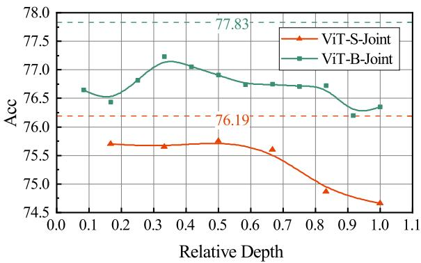  
Figure 7. Accuracy variation when the intermediate supervision at different layers is removed.

where

$$
\Phi_ {i} = \left[ \begin{array}{c} \phi_ {1} ^ {(i)} \\ \vdots \\ \phi_ {n} ^ {(i)} \end{array} \right] \tag {15}
$$

is the constant matrix with hard-coded inductive biases.

# B. Intermediate Supervision Analysis

In this section, we analyze the effects when the intermediate supervisions act upon different layers. Fig. 7 shows the top-1 accuracy variation on CIFAR-100 dataset when the supervision at relative depth is removed from the final loss. The dash lines represent the performance without removing supervision for any layer. For the small settings, the importance increases significantly as going deeper. However, the base model relies on both shallow and deep layers.

# C. Visualization of MHSA

The visualizations of learned self-attentions are shown in Tab. 8 and Tab. 9 for two randomly selected images from CIFAR-100. The heat maps of layer 2, 4, and 6 reveal that the inductive biases, such as sparsity and localized relationship, have been injected into ViTs, especially for shallow layers.

  
(a)

  
(b)   
Figure 8. Selected images from CIFAR-100 for visualization.

# D. Visualization of Intermediate Feature

The visualizations of intermediate features for both agent CNN and the ViT are shown in Tab. 10 and Tab. 11 for two different input images (Fig. 8a and Fig. 8b). As we can observe, (1) when trained independently, the CNNs tend to

Table 6. Network architectures of base agent CNNs.   

<table><tr><td>Layer</td><td>Agent-S</td><td>Agent-B</td></tr><tr><td>Input Projection</td><td>16×16 Conv, 288, S16</td><td>16×16 Conv, 384, S16</td></tr><tr><td>Blocks</td><td>[H9, CONV, 288] ×6 [1×1 Conv, 1152] ×6 [1×1 Conv, 288]</td><td>[H6, CONV, 384] ×12 [1×1 Conv, 1536] ×12 [1×1 Conv, 384]</td></tr><tr><td>Head</td><td colspan="2">Global Average Pooling FC</td></tr></table>

Table 7. Network architectures of res-like agent CNNs.   

<table><tr><td>Layer</td><td>Agent-S</td><td>Agent-B</td></tr><tr><td>Input Projection</td><td>7×7 Conv, 64, S22×2, Max Pooling, S23×3 Conv, 288, S2</td><td>7×7 Conv, 64, S22×2, Max Pooling, S23×3 Conv, 384, S2</td></tr><tr><td rowspan="5">Blocks</td><td>[H9, CONV, 288] ×1[1×1 Conv, 1152] ×1[1×1 Conv, 288]</td><td>[H6, CONV, 384] ×2[1×1 Conv, 1536] ×1[1×1 Conv, 384]</td></tr><tr><td>Down-sampling</td><td>Down-sampling</td></tr><tr><td>[H9, CONV, 288] ×1[1×1 Conv, 1152] ×1[1×1 Conv, 288]</td><td>[H6, CONV, 384] ×2[1×1 Conv, 1536] ×1[1×1 Conv, 384]</td></tr><tr><td>Down-sampling</td><td>Down-sampling</td></tr><tr><td>[H9, CONV,288] ×4[1×1 Conv, 1152] ×4[1×1 Conv, 288]</td><td>[H6, CONV, 384] ×8[1×1 Conv, 1536] ×8[1×1 Conv, 384]</td></tr><tr><td>Head</td><td colspan="2">Global Average PoolingFC</td></tr></table>

produce smooth features while ViTs tend to generate sharp features due to the global attention mechanism; (2) when optimized jointly, as the inductive biases have been injected into the ViTs, they tend to pay more attention to the real object, which is similar to CNNs, and thus more robust to the disturbances.

# E. Network Architecture of Agent CNNs

The network architectures of agent CNNs are given in Tab. 6 and Tab. 7, respectively for the base agent CNN and the res-like agent CNN. Here, ‘H9’ and ‘H6’ denotes generalized convolution with receptive field of 9 and 6 respectively. The input images are resized to $2 2 4 \times 2 2 4$ pixels for both agent CNNs and ViTs. In each block, the CONV layer replaces the MHSA layer in ViTs and the following MLP layer is composed of two $1 \times 1$ convolution layers. Finally, features from the global average pooling layer are fed into a fully connected (FC) layer for classification.

Table 8. Visualization of average attention for input Fig. 8a.   

<table><tr><td>Layer</td><td colspan="2">2</td><td colspan="2">4</td><td colspan="2">6</td></tr><tr><td rowspan="6">ViT-S</td><td colspan="2">-0.035</td><td colspan="2">-0.025</td><td colspan="2">-0.030</td></tr><tr><td colspan="2">-0.030</td><td colspan="2">-0.020</td><td colspan="2">-0.025</td></tr><tr><td colspan="2">-0.025</td><td colspan="2">-0.015</td><td colspan="2">-0.020</td></tr><tr><td colspan="2">-0.020</td><td colspan="2">-0.015</td><td colspan="2">-0.015</td></tr><tr><td colspan="2">-0.015</td><td colspan="2">-0.010</td><td colspan="2">-0.010</td></tr><tr><td colspan="2">-0.010</td><td colspan="2">-0.005</td><td colspan="2">-0.005</td></tr><tr><td rowspan="7">Joint ViT-S</td><td colspan="2">-0.14</td><td colspan="2">-0.10</td><td colspan="2">-0.08</td></tr><tr><td colspan="2">-0.12</td><td colspan="2">-0.08</td><td colspan="2">-0.07</td></tr><tr><td colspan="2">-0.10</td><td colspan="2">-0.06</td><td colspan="2">-0.06</td></tr><tr><td colspan="2">-0.08</td><td colspan="2">-0.04</td><td colspan="2">-0.05</td></tr><tr><td colspan="2">-0.06</td><td colspan="2">-0.04</td><td colspan="2">-0.04</td></tr><tr><td colspan="2">-0.04</td><td colspan="2">-0.02</td><td colspan="2">-0.03</td></tr><tr><td colspan="2">-0.02</td><td colspan="2">-0.01</td><td colspan="2">-0.02</td></tr></table>

Table 9. Visualization of average attention for input Fig. 8b.   

<table><tr><td>Layer</td><td colspan="2">2</td><td colspan="2">4</td><td colspan="2">6</td></tr><tr><td rowspan="8">ViT-S</td><td></td><td>0.06</td><td>-0.0200</td><td>-0.030</td><td></td><td></td></tr><tr><td></td><td>-0.05</td><td>-0.0175</td><td>-0.025</td><td></td><td></td></tr><tr><td></td><td>-0.04</td><td>-0.0150</td><td>-0.020</td><td></td><td></td></tr><tr><td></td><td>-0.03</td><td>-0.0125</td><td>-0.015</td><td></td><td></td></tr><tr><td></td><td>-0.02</td><td>-0.0100</td><td>-0.010</td><td></td><td></td></tr><tr><td></td><td>-0.01</td><td>-0.0075</td><td>-0.005</td><td></td><td></td></tr><tr><td></td><td>-0.01</td><td>-0.0050</td><td>-0.005</td><td></td><td></td></tr><tr><td></td><td>-0.01</td><td>-0.0025</td><td>-0.005</td><td></td><td></td></tr><tr><td rowspan="7">Joint ViT-S</td><td></td><td>0.16</td><td>-0.07</td><td>-0.08</td><td></td><td></td></tr><tr><td></td><td>-0.14</td><td>-0.06</td><td>-0.06</td><td></td><td></td></tr><tr><td></td><td>-0.12</td><td>-0.05</td><td>-0.06</td><td></td><td></td></tr><tr><td></td><td>-0.10</td><td>-0.04</td><td>-0.04</td><td></td><td></td></tr><tr><td></td><td>-0.08</td><td>-0.03</td><td>-0.04</td><td></td><td></td></tr><tr><td></td><td>-0.06</td><td>-0.02</td><td>-0.02</td><td></td><td></td></tr><tr><td></td><td>-0.04</td><td>-0.01</td><td>-0.02</td><td></td><td></td></tr></table>

Table 10. Visualization of intermediate features for input Fig. 8a. Please zoom for better view.   

<table><tr><td>Layer</td><td colspan="5">Agent-S</td><td colspan="5">ViT-S</td><td colspan="5">Agent-S-Joint</td><td colspan="5">ViT-S-Joint</td></tr><tr><td rowspan="7">2</td><td colspan="5">-1.0</td><td colspan="5">-0.8</td><td colspan="5">-1.0</td><td colspan="5">-1.0</td></tr><tr><td></td><td></td><td></td><td></td><td></td><td></td><td></td><td></td><td></td><td></td><td></td><td></td><td></td><td></td><td></td><td></td><td></td><td></td><td></td><td></td></tr><tr><td></td><td></td><td></td><td></td><td></td><td></td><td></td><td></td><td></td><td></td><td></td><td></td><td></td><td></td><td></td><td></td><td></td><td></td><td></td><td></td></tr><tr><td></td><td></td><td></td><td></td><td></td><td></td><td></td><td></td><td></td><td></td><td></td><td></td><td></td><td></td><td></td><td></td><td></td><td></td><td></td><td></td></tr><tr><td></td><td></td><td></td><td></td><td></td><td></td><td></td><td></td><td></td><td></td><td></td><td></td><td></td><td></td><td></td><td></td><td></td><td></td><td></td><td></td></tr><tr><td></td><td></td><td></td><td></td><td></td><td></td><td></td><td></td><td></td><td></td><td></td><td></td><td></td><td></td><td></td><td></td><td></td><td></td><td></td><td></td></tr><tr><td></td><td></td><td></td><td></td><td></td><td>0.0</td><td></td><td></td><td></td><td></td><td>0.0</td><td></td><td></td><td></td><td></td><td>0.0</td><td></td><td></td><td></td><td></td></tr><tr><td rowspan="9">4</td><td colspan="5">-1.0</td><td colspan="5">-0.8</td><td colspan="5">-1.0</td><td colspan="5">-1.0</td></tr><tr><td></td><td></td><td></td><td></td><td></td><td></td><td></td><td></td><td></td><td></td><td></td><td></td><td></td><td></td><td></td><td></td><td></td><td></td><td></td><td></td></tr><tr><td></td><td></td><td></td><td></td><td></td><td></td><td></td><td></td><td></td><td></td><td></td><td></td><td></td><td></td><td></td><td></td><td></td><td></td><td></td><td></td></tr><tr><td></td><td></td><td></td><td></td><td></td><td></td><td></td><td></td><td></td><td></td><td></td><td></td><td></td><td></td><td></td><td></td><td></td><td></td><td></td><td></td></tr><tr><td></td><td></td><td></td><td></td><td></td><td></td><td></td><td></td><td></td><td></td><td></td><td></td><td></td><td></td><td></td><td></td><td></td><td></td><td></td><td></td></tr><tr><td></td><td></td><td></td><td></td><td></td><td></td><td></td><td></td><td></td><td></td><td></td><td></td><td></td><td></td><td></td><td></td><td></td><td></td><td></td><td></td></tr><tr><td></td><td></td><td></td><td></td><td></td><td></td><td></td><td></td><td></td><td></td><td></td><td></td><td></td><td></td><td></td><td></td><td></td><td></td><td></td><td></td></tr><tr><td></td><td></td><td></td><td></td><td></td><td></td><td></td><td></td><td></td><td></td><td></td><td></td><td></td><td></td><td></td><td></td><td></td><td></td><td></td><td></td></tr><tr><td></td><td></td><td></td><td></td><td></td><td>0.0</td><td></td><td></td><td></td><td></td><td>0.0</td><td></td><td></td><td></td><td></td><td>0.0</td><td></td><td></td><td></td><td></td></tr><tr><td rowspan="6">6</td><td colspan="5">-1.0</td><td colspan="5">-0.8</td><td colspan="5">-1.0</td><td colspan="5">-1.0</td></tr><tr><td></td><td></td><td></td><td></td><td></td><td></td><td></td><td></td><td></td><td></td><td></td><td></td><td></td><td></td><td></td><td></td><td></td><td></td><td></td><td></td></tr><tr><td></td><td></td><td></td><td></td><td></td><td></td><td></td><td></td><td></td><td></td><td></td><td></td><td></td><td></td><td></td><td></td><td></td><td></td><td></td><td></td></tr><tr><td></td><td></td><td></td><td></td><td></td><td></td><td></td><td></td><td></td><td></td><td></td><td></td><td></td><td></td><td></td><td></td><td></td><td></td><td></td><td></td></tr><tr><td></td><td></td><td></td><td></td><td></td><td></td><td></td><td></td><td></td><td></td><td></td><td></td><td></td><td></td><td></td><td></td><td></td><td></td><td></td><td></td></tr><tr><td></td><td></td><td></td><td></td><td></td><td>0.0</td><td></td><td></td><td></td><td></td><td>0.0</td><td></td><td></td><td></td><td></td><td>0.0</td><td></td><td></td><td>0.0</td><td></td></tr></table>

Table 11. Visualization of intermediate features for input Fig. 8b. Please zoom for better view.   

<table><tr><td>Layer</td><td colspan="5">Agent-S</td><td colspan="5">ViT-S</td><td colspan="5">Agent-S-Joint</td><td colspan="5">ViT-S-Joint</td></tr><tr><td rowspan="6">2</td><td colspan="5">1.0</td><td colspan="5">1.0</td><td colspan="5">1.0</td><td colspan="5">1.0</td></tr><tr><td colspan="5">0.8</td><td colspan="5">0.8</td><td colspan="5">0.8</td><td colspan="5">0.8</td></tr><tr><td colspan="5">0.6</td><td colspan="5">0.6</td><td colspan="5">0.6</td><td colspan="5">0.6</td></tr><tr><td colspan="5">0.4</td><td colspan="5">0.4</td><td colspan="5">0.4</td><td colspan="5">0.4</td></tr><tr><td colspan="5">0.2</td><td colspan="5">0.2</td><td colspan="5">0.2</td><td colspan="5">0.2</td></tr><tr><td colspan="5">0.0</td><td colspan="5">0.0</td><td colspan="5">0.0</td><td colspan="5">0.0</td></tr><tr><td rowspan="6">4</td><td colspan="5">1.0</td><td colspan="5">1.0</td><td colspan="5">1.0</td><td colspan="5">1.0</td></tr><tr><td colspan="5">0.8</td><td colspan="5">0.8</td><td colspan="5">0.8</td><td colspan="5">0.8</td></tr><tr><td colspan="5">0.6</td><td colspan="5">0.6</td><td colspan="5">0.6</td><td colspan="2">0.6</td><td></td><td></td><td></td></tr><tr><td colspan="5">0.4</td><td colspan="5">0.4</td><td colspan="5">0.4</td><td colspan="2">0.4</td><td></td><td></td><td></td></tr><tr><td colspan="5">0.2</td><td colspan="5">0.2</td><td colspan="5">0.2</td><td colspan="2">0.2</td><td></td><td></td><td></td></tr><tr><td colspan="5">0.0</td><td colspan="5">0.0</td><td colspan="5">0.0</td><td colspan="2">0.0</td><td></td><td></td><td></td></tr><tr><td rowspan="6">6</td><td colspan="5">1.0</td><td colspan="5">1.0</td><td colspan="5">1.0</td><td colspan="5">1.0</td></tr><tr><td colspan="5">0.8</td><td colspan="5">0.8</td><td colspan="5">0.8</td><td colspan="2">0.8</td><td></td><td></td><td></td></tr><tr><td colspan="5">0.6</td><td colspan="5">0.6</td><td colspan="5">0.6</td><td colspan="2">0.6</td><td></td><td></td><td></td></tr><tr><td colspan="5">0.4</td><td colspan="5">0.4</td><td colspan="5">0.4</td><td colspan="2">0.4</td><td></td><td></td><td></td></tr><tr><td colspan="5">0.2</td><td colspan="5">0.2</td><td colspan="5">0.2</td><td colspan="2">02</td><td></td><td></td><td></td></tr><tr><td colspan="5">0.0</td><td colspan="5">0.0</td><td colspan="5">0.0</td><td colspan="2">0.0</td><td></td><td></td><td></td></tr></table>