# Adversarial Attack and Defense for Non-Parametric Two-Sample Tests

Xilie Xu * 1 Jingfeng Zhang * 2 Feng Liu 3 Masashi Sugiyama 2 4 Mohan Kankanhalli 1

# Abstract

Non-parametric two-sample tests (TSTs) that judge whether two sets of samples are drawn from the same distribution, have been widely used in the analysis of critical data. People tend to employ TSTs as trusted basic tools and rarely have any doubt about their reliability. This paper systematically uncovers the failure mode of non-parametric TSTs through adversarial attacks and then proposes corresponding defense strategies. First, we theoretically show that an adversary can upperbound the distributional shift which guarantees the attack’s invisibility. Furthermore, we theoretically find that the adversary can also degrade the lower bound of a TST’s test power, which enables us to iteratively minimize the test criterion in order to search for adversarial pairs. To enable TST-agnostic attacks, we propose an ensemble attack (EA) framework that jointly minimizes the different types of test criteria. Second, to robustify TSTs, we propose a max-min optimization that iteratively generates adversarial pairs to train the deep kernels. Extensive experiments on both simulated and real-world datasets validate the adversarial vulnerabilities of non-parametric TSTs and the effectiveness of our proposed defense. Source code is available at https://github.com/GodXuxilie/Robust-TST.git.

# 1. Introduction

Non-parametric two-sample tests (TSTs) that judge whether two sets of samples drawn from the same distribution have been widely used to analyze critical data in physics (Baldi et al., 2014), neurophysiology (Rasch et al., 2008), biol-

*Equal contribution 1School of Computing, National University of Singapore 2RIKEN Center for Advanced Intelligence Project (AIP) 3School of Mathematics and Statistics, The University of Melbourne 4Graduate School of Frontier Sciences, The University of Tokyo. Correspondence to: Jingfeng Zhang <jingfeng.zhang@riken.jp>.

Proceedings of the ${ { \it 3 9 } ^ { t h } }$ International Conference on Machine Learning, Baltimore, Maryland, USA, PMLR 162, 2022. Copyright 2022 by the author(s).

ogy (Borgwardt et al., 2006), etc. Compared with traditional methods (such as the t-test), non-parametric TSTs can relax the strong parametric assumption about the distributions being studied and are effective in complex domains (Gretton et al., 2009; 2012; Chwialkowski et al., 2015; Jitkrittum et al., 2016; Sutherland et al., 2017; Lopez-Paz & Oquab, 2016; Cheng & Cloninger, 2019; Liu et al., 2020a; 2021). Notably, the use of deep kernels (Liu et al., 2020a) flexibly empowers the non-parametric TSTs to learn even more complex distributions.

However, the adversarial robustness of non-parametric TSTs is rarely studied, despite its extensive studies for deep neural networks (DNNs). Studies of DNNs’ adversarial robustness (Madry et al., 2018) have enabled significant advances in defending against adversarial attacks (Szegedy et al., 2014), which can help enhance the security in various domains such as computer vision (Xie et al., 2017; Mahmood et al., 2021), natural language processing (Zhu et al., 2020; Yoo & Qi, 2021), recommendation system (Peng & Mine, 2020), etc. We therefore undertake this pioneer study on adversarial robustness of non-parametric TSTs, which uncovers the failure mode of non-parametric TSTs through adversarial attacks and facilitate an effective strategy for making TSTs reliable in critical applications (Baldi et al., 2014; Rasch et al., 2008; Borgwardt et al., 2006).

First, we theoretically show the adversary could upperbound the distributional shift and degrade the lower bound of a TST’s test power (details in Section 3.1). Given a benign pair $( S _ { \mathbb { P } } , S _ { \mathbb { Q } } )$ , in which $S _ { \mathbb { P } } = \{ x _ { i } \} _ { i = 1 } ^ { m } \sim { \mathbb P } ^ { m }$ and $S _ { \mathbb { Q } } = \{ y _ { j } \} _ { j = 1 } ^ { n } \sim \mathbb { Q } ^ { n }$ , an $\ell _ { \infty }$ -bounded adversary could generate the adversarial pair $( S _ { \mathbb { P } } , \tilde { S } _ { \mathbb { Q } } )$ . We will show in Proposition 1 that the maximum mean discrepancy (MMD) (Gretton et al., 2012) between the benign and adversarial pairs is upper-bounded, which guarantees imperceptible adversarial perturbations (Szegedy et al., 2014). Furthermore, we will show in Theorem 2 that the adversary can degrade the lower bound of a TST’s test power, which implies that a TST could wrongly determine $\mathbb { P } = \mathbb { Q }$ with a larger probability under adversarial attacks when $\mathbb { P } \neq \mathbb { Q }$ holds.

Then, we realize effective adversarial attacks against nonparametric TSTs (details in Section 3.2). We formulate an attack as a constraint optimization problem that minimizes a TST’s test criterion (Liu et al., 2020a) within the

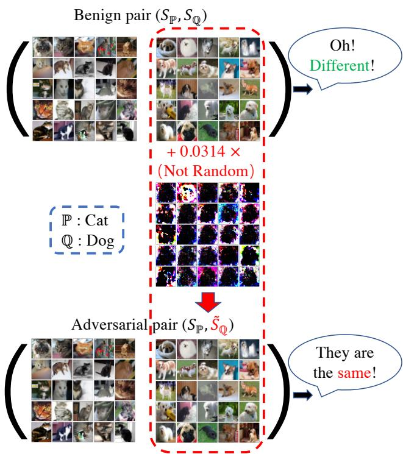  
Figure 1. An example of adversarial pair $( S _ { \mathbb { P } } , { \tilde { S } } _ { \mathbb { Q } } )$ generated by embedding an adversarial perturbation in the benign set $S _ { \mathbb { Q } }$ of the benign pair $( S _ { \mathbb { P } } , S _ { \mathbb { Q } } )$ . Experimental details are in Section 5.1.

$\ell _ { \infty }$ -bound of size $\epsilon$ on $S _ { \mathbb { Q } }$ . We utilize projected gradient descent (PGD) (Madry et al., 2018) to efficiently search the adversarial set ${ \tilde { S } } _ { \mathbb { Q } }$ and incorporate automatic schedule of the step size (Croce & Hein, 2020) to improve the optimization convergence. Moreover, we extend the attack beyond a specific TST to a generic TST-agnostic attack, namely, ensemble attack (EA). EA jointly minimizes a weighted sum of different test criteria, which can simultaneously fool various TSTs. For example, Figure 1 shows non-parametric TSTs can correctly differentiate the benign pair of “cats” and “dogs” (top) coming from the different distributions, but wrongly judge adversarial pairs (bottom) as belonging to the same distribution.

Second, to robustify the non-parametric TSTs, we study the corresponding defense approaches (details in Section 4). A straightforward defense seems to use an ensemble of TSTs. We find an ensemble of TSTs is sometimes effective against a specific attack targeting a certain type of TSTs but almost always fails under EA (see experiments in Section 5.1). Therefore, to effectively defend against adversarial attacks, we propose to adversarially learn the robust kernels. The defense is formulated as a max-min optimization that is similar in flavor to the adversarial training’s min-max formulation (Madry et al., 2018). For its realization, we iteratively generate adversarial pairs by minimizing the test criterion in the inner minimization and update kernel parameters by maximizing the test criterion on the adversarial pairs

in the outer maximization. We realize our defense using deep kernels that have achieved the state-of-the-art (SOTA) performance in non-parametric TSTs (Liu et al., 2020a).

Lastly, we empirically justify the proposed attacks and defenses (in Section 5). We evaluate the test power of many existing non-parametric TSTs (non-robust) and the robustkernel TST (robust) under the EA on simulated and realworld datasets, including complex synthetic distributions, high-energy physics data, and challenging images. Comprehensive experimental results validate that the existing nonparametric TSTs lack adversarial robustness; we can significantly improve the adversarial robustness of non-parametric TSTs through adversarially learning the deep kernels.

# 2. Non-Parametric Two-Sample Tests

In this section, we provide the preliminaries of nonparametric TSTs and provide discussions with the related studies in Appendix C.

# 2.1. Problem Formulation

Let $\mathcal { X } \subset \mathbb { R } ^ { d }$ and $\mathbb { P }$ , $\mathbb { Q }$ be Borel probability measures on $\mathcal { X }$ . A non-parametric TST $\mathcal { I } ( S _ { \mathbb { P } } , S _ { \mathbb { Q } } ) : \mathcal { X } ^ { m } \times \mathcal { X } ^ { n } \mapsto \{ 0 , 1 \}$ is used to distinguish between the null hypothesis $\mathcal { H } _ { 0 } : \mathbb { P } = \mathbb { Q }$ and the alternative hypothesis $\mathcal { H } _ { 1 } : \mathbb { P } \neq \mathbb { Q }$ , where $S _ { \mathbb { P } }$ and $S _ { \mathbb { Q } }$ are independent identically distributed (IID) samples of size $m$ and $n$ drawn from $\mathbb { P }$ and $\mathbb { Q }$ , respectively. A nonparametric TST constructs a mean embedding based on a kernel parameterized with $\theta$ for each distribution, and utilizes the differences in these embeddings as the test statistic for the hypothesis test. The judgement is made by comparing the test statistic $\mathcal { D } ( S _ { \mathbb { P } } , S _ { \mathbb { Q } } )$ with a particular threshold $r$ : if the threshold is exceeded, then the test rejects $\mathcal { H } _ { \mathrm { 0 } }$ . The test power (TP) of a non-parametric TST $\mathcal { I }$ is measured by the probability of correctly rejecting $\mathcal { H } _ { \mathrm { 0 } }$ when the alternative hypothesis is true, i.e., $\mathrm { T P } ( \mathcal { I } ) \ = \ \mathbb { E } _ { S _ { \mathbb { P } } \sim \mathbb { P } ^ { m } , S _ { \mathbb { Q } } \sim \mathbb { Q } ^ { n } } \big [ \mathbb { 1 } \big ( \mathcal { I } ( S _ { \mathbb { P } } , S _ { \mathbb { Q } } ) \ : = \ : 1 \big ) \big ]$ for a paritular $\mathbb { P } \neq \mathbb { Q }$ . A non-parametric TST optimizes its learnable parameters $\theta$ via maximizing its test criterion, thus approximately maximizing its test power.

# 2.2. Test Statistics

Here, we introduce a typical test statistic, maximum mean discrepancy (MMD) (Gretton et al., 2012), and leave other test statistics in Appendix D, such as tests based on Gaussian kernel mean embeddings at specific positions (Chwialkowski et al., 2015; Jitkrittum et al., 2016) and classifier two-sample tests (C2ST) (Lopez-Paz & Oquab, 2016; Cheng & Cloninger, 2019).

Definition 1 (Gretton et al. (2012)). Let $k : \mathcal { X } \times \mathcal { X } \to \mathbb { R }$ be a kernel of a reproducing kernel Hilbert space $\mathcal { H } _ { k }$ , with feature maps $k ( \cdot , x ) \in \mathcal { H } _ { k }$ . Let $X \sim \mathbb { P }$ and $Y \sim \mathbb { Q }$ , and

define the kernel mean embeddings $\mu _ { \mathbb { P } } = \mathbb { E } [ k ( \cdot , X ) ]$ and $\mu _ { \mathbb { Q } } = \mathbb { E } [ k ( \cdot , Y ) ]$ . Under mild integrability conditions,

$$
\begin{array}{l} \operatorname {M M D} (\mathbb {P}, \mathbb {Q}; \mathcal {H} _ {k}) = \sup  _ {f \in \mathcal {H}, \| f \| _ {\mathcal {H} _ {k}} \leq 1} | \mathbb {E} [ f (X) ] - \mathbb {E} [ f (Y) ] | \\ = \left\| \mu_ {\mathbb {P}} - \mu_ {\mathbb {Q}} \right\| _ {\mathcal {H} _ {k}}. \tag {1} \\ \end{array}
$$

For characteristic kernels, $\mathrm { M M D } ( \mathbb { P } , \mathbb { Q } ; \mathcal { H } _ { k } ) = 0$ if and only if $\mathbb { P } = \mathbb { Q }$ . Assuming $n = m$ , we can estimate MMD (Eq. (1)) using the $U$ -statistic estimator, which is unbiased for $\mathrm { M M D ^ { 2 } }$ and has nearly minimal variance among all unbiased estimators (Gretton et al., 2012):

$$
\widehat {\mathrm {M M D}} ^ {2} \left(S _ {\mathbb {P}}, S _ {\mathbb {Q}}; k\right) = \frac {1}{n (n - 1)} \sum_ {i \neq j} H _ {i j}, \tag {2}
$$

$$
H _ {i j} = k \left(x _ {i}, x _ {j}\right) + k \left(y _ {i}, y _ {j}\right) - k \left(x _ {i}, y _ {j}\right) - k \left(x _ {j}, y _ {i}\right),
$$

where $x _ { i } , x _ { j } \in S _ { \mathbb { P } }$ and $y _ { i } , y _ { j } \in S _ { \mathbb { Q } }$ .

In this paper, we investigate six types of non-parametric TSTs as follows since Liu et al. (2020a; 2021) have shown they are powerful on complex data.

• $\mathcal { D } ^ { ( \mathrm { G } ) } ( \cdot , \cdot ; k ^ { ( \mathrm { G } ) } ) = \widehat { \mathrm { M M D } } ^ { 2 } ( \cdot , \cdot ; k ^ { ( \mathrm { G } ) } )$ for tests based on MMD with Gaussian kernels (MMD-G) (Sutherland et al., 2017) with the learnable lengthscale $\sigma _ { \phi }$ , in which $\begin{array} { r } { k ^ { ( \mathrm { G } ) } ( x , y ) = \exp ( - \frac { 1 } { 2 \sigma _ { \phi } } \| x - y \| ^ { \bar { 2 } } ) } \end{array}$ .   
• $\mathcal { D } ^ { ( \mathrm { D } ) } ( \cdot , \cdot ; k ^ { ( \mathrm { D } ) } ) = \widehat { \mathrm { M M D } } ^ { 2 } ( \cdot , \cdot ; k ^ { ( \mathrm { D } ) } )$ for tests based on MMD with deep kernels (MMD-D) (Liu et al., 2020a). Note that $\begin{array} { r } { k ^ { \mathrm { ( D ) } } \bar { \mathbf { \Psi } } ( x , y ) = [ ( 1 - \gamma ) \exp ( - \frac { 1 } { 2 \sigma _ { \phi } } \| \phi ( x ) - \bar { \mathbf { \Psi } } } \end{array}$ $\begin{array} { r } { \phi ( y ) \| ^ { 2 } ) + \gamma ] \exp ( { - \frac { 1 } { 2 \sigma _ { q } } \| x - y \| ^ { 2 } } ) } \end{array}$ where $\gamma , \sigma _ { \phi } , \sigma _ { q }$ are the learnable parameters and $\phi ( \cdot )$ is a parameterized deep network to extract the features.   
• $\mathcal { D } ^ { ( \mathrm { { S } } ) } ( \cdot , \cdot )$ (Eq. (10)) for C2ST based on Sign (C2ST-S) (Lopez-Paz & Oquab, 2016). A classifier $f : \mathcal { X } $ $\mathbb { R }$ that outputs the classification probabilities is utilized by C2ST. Liu et al. (2020a) pointed out that the test statistic of C2ST-S is equivalent to MMD with kernel $k ^ { ( \mathrm { S } ) }$ , i.e., $\widehat { \boldsymbol { D } ^ { ( \mathrm { S } ) } ( \cdot , \cdot ) } = \widehat { \mathrm { M M D } } ^ { 2 } ( \cdot , \cdot ; k ^ { ( \mathrm { S } ) } )$ where $\begin{array} { r } { k ^ { \mathrm { ( S ) } } ( x , y ) = \frac { 1 } { 4 } \mathbb { 1 } ( f ( x ) > 0 ) \mathbb { 1 } ( f ( y ) > 0 ) } \end{array}$ .   
• $\mathcal { D } ^ { ( \mathrm { L } ) } \big ( \cdot , \cdot \big )$ (Eq. (11)) for C2ST-L (Cheng & Cloninger, 2019) that utilizes the discriminator’s measure of confidence. Its test statistic is also equivalent to MMD with kernel $k ^ { \mathrm { ( L ) } }$ (Liu et al., 2020a), i.e., $\begin{array} { r l } { \mathcal { D } ^ { \mathrm { ( L ) } } ( \cdot , \cdot ) = } \end{array}$ $\widehat { \mathrm { M M D } } ^ { 2 } ( \cdot , \cdot ; k ^ { ( \mathrm { L } ) } )$ where $k ^ { ( \mathrm { L } ) } ( x , y ) = f ( x ) f ( y )$ .   
• $D ^ { \mathrm { ( M E ) } } ( \cdot , \cdot )$ (Eq. (12)) for tests based on differences in Gaussian kernel mean embeddings at specific locations (Chwialkowski et al., 2015; Jitkrittum et al., 2016), namely Mean Embedding (ME).   
• $D ^ { ( \mathrm { S C F } ) } ( \cdot , \cdot )$ (Eq. (13)) for tests based on Gaussian kernel mean embeddings at a set of optimized frequency (Chwialkowski et al., 2015; Jitkrittum et al., 2016), namely Smooth Characteristic Functions (SCF).

# 2.3. Test Criterion

In this subsection, we introduce the test criteria for nonparametric TSTs based on MMD (Sutherland et al., 2017; Liu et al., 2020a; Lopez-Paz & Oquab, 2016; Cheng & Cloninger, 2019).

Theorem 1 (Asymptotics of MMD under $\mathcal { H } _ { 1 }$ (Serfling, 2009)). Under the alternative, $\mathcal { H } _ { 1 } : \mathbb { P } \neq \mathbb { Q }$ , the standard central limit theorem holds:

$$
\sqrt {n} \left(\widehat {\mathrm {M M D}} ^ {2} - \mathrm {M M D} ^ {2}\right)\rightarrow \mathcal {N} \left(0, \sigma_ {\mathcal {H} _ {1}} ^ {2}\right),
$$

$$
\sigma_ {\mathcal {H} _ {1}} ^ {2} = 4 \left(\mathbb {E} \left[ H _ {1 2} H _ {1 3} \right] - \mathbb {E} \left[ H _ {1 2} \right] ^ {2}\right),
$$

where $H _ { 1 2 } , H _ { 1 3 }$ refer to $H _ { i j }$ in Eq. (2).

Guided by the asymptotics of MMD (Theorem 1), the test power is estimated as follows:

$$
\Pr \left(n \widehat {\mathrm {M M D}} ^ {2} > r\right)\rightarrow \Phi \left(\frac {\sqrt {n} \mathrm {M M D} ^ {2}}{\sigma_ {\mathcal {H} _ {1}}} - \frac {r}{\sqrt {n} \sigma_ {\mathcal {H} _ {1}}}\right), \tag {3}
$$

where $\Phi$ is the cumulative distribution function (CDF) of standard normal distribution and $r$ is the rejection threshold approximately found via permutation testing (Dwass, 1957; Fernandez et al. ´ , 2008). This general method is usually considered best to estimate the null hypothesis: under $\mathcal { H } _ { \mathrm { 0 } }$ , samples from $\mathbb { P }$ and $\mathbb { Q }$ are interchangeable, and repeatedly re-computing the test statistic with samples randomly shuffled between $S _ { \mathbb { P } }$ and $S _ { \mathbb { Q } }$ estimates its null distribution.

For reasonably large $n$ , the test power is dominated by the first term of Eq. (3), and thus the TST yields the most powerful test by approximately maximizing the test criterion (Liu et al., 2020a)

$$
\mathcal {F} (\mathbb {P}, \mathbb {Q}; k) = \operatorname {M M D} ^ {2} (\mathbb {P}, \mathbb {Q}; k) / \sigma_ {\mathcal {H} _ {1}} (\mathbb {P}, \mathbb {Q}; k). \tag {4}
$$

Further, $\mathcal { F } ( \mathbb { P } , \mathbb { Q } ; k )$ can be empirically estimated with

$$
\hat {\mathcal {F}} \left(S _ {\mathbb {P}}, S _ {\mathbb {Q}}; k\right) = \frac {\widehat {\mathrm {M M D}} ^ {2} \left(S _ {\mathbb {P}} , S _ {\mathbb {Q}} ; k\right)}{\hat {\sigma} _ {\mathcal {H} _ {1} , \lambda} \left(S _ {\mathbb {P}} , S _ {\mathbb {Q}} ; k\right)}, \tag {5}
$$

where $\hat { \sigma } _ { \mathcal { H } _ { 1 } , \lambda } ^ { 2 }$ is a regularized estimator of $\sigma _ { \mathcal { H } _ { 1 } } ^ { 2 }$

$$
\hat {\sigma} _ {\mathcal {H} _ {1, \lambda}} ^ {2} = \frac {4}{n ^ {3}} \sum_ {i = 1} ^ {n} \left(\sum_ {j = 1} ^ {n} H _ {i j}\right) ^ {2} - \frac {4}{n ^ {4}} \left(\sum_ {i = 1} ^ {n} \sum_ {j = 1} ^ {n} H _ {i j}\right) ^ {2} + \lambda ,
$$

where $\lambda$ is a positive constant. The test criterion of the MMD test (e.g., MMD-G, MMD-D, C2ST-S and C2ST-L) is calculated based on its corresponding kernel. We let $\sigma _ { \theta } ^ { 2 }$ denote $\sigma _ { \mathcal { H } _ { 1 } } ^ { 2 } ( \mathbb { P } , \mathbb { Q } ; k _ { \theta } )$ , and analogously $\hat { \sigma } _ { \theta } ^ { 2 }$ denote $\hat { \sigma } _ { \mathcal { H } _ { 1 } , \lambda } ^ { 2 } ( \mathbb { P } , \mathbb { Q } ; k _ { \theta } )$ 1, for simplicity.

In addition, Chwialkowski et al. (2015) and Jitkrittum et al. (2016) analyzed that the test power of ME tests, and SCF tests can be approximately maximized by maximizing the

corresponding test criterion as well, i.e., $\hat { \mathcal { F } } ^ { ( \mathrm { M E } ) } ( S _ { \mathbb { P } } , S _ { \mathbb { Q } } )$ and $\hat { \mathcal { F } } ^ { ( \mathrm { S C F } ) } ( S _ { \mathbb { P } } , S _ { \mathbb { Q } } )$ (details in Appendix D).

To avoid notation clutter, we simply let $\theta$ represent all of the learnable parameters in a non-parametric TST. The optimized parameters of a TST are obtained as follows.

$$
\hat {\theta} \approx \underset {\theta} {\arg \max } \hat {\mathcal {F}} (S _ {\mathbb {P}} ^ {\mathrm {t r}}, S _ {\mathbb {Q}} ^ {\mathrm {t r}}; k _ {\theta}), \tag {6}
$$

where $( S _ { \mathbb { P } } ^ { \mathrm { t r } } , S _ { \mathbb { Q } } ^ { \mathrm { t r } } )$ is the training pair. Then, we conduct a hypothesis test based on $\mathcal { D } ( S _ { \mathbb { P } } ^ { \mathrm { t e } } , S _ { \mathbb { Q } } ^ { \mathrm { t e } } ; k _ { \widehat { \theta } } )$ , where $( S _ { \mathbb { P } } ^ { \mathrm { t e } } , S _ { \mathbb { Q } } ^ { \mathrm { t e } } )$ is the test pair.

# 3. Adversarial Attacks Against Non-Parametric TSTs

In this section, we first show the possible existence of adversarial attacks against a non-parametric TST. Then, we propose a method to generate adversarial test pairs that can fool a TST. To enable TST-agnostic attacks, we propose a unified attack framework, i.e., ensemble attack.

# 3.1. Theoretical Analysis

This section theoretically shows that there could exist adversarial attacks that can invisibly undermine a TST. We first lay out the needed assumptions on kernel functions.

Assumption 1. The possible kernel parameterized with $\theta \in \mathbb { R } ^ { \kappa }$ lies in Banach space. The set of possible kernel parameters $\Theta$ is bounded by $\mathrm { R _ { \Theta } }$ , i.e., $\Theta \subseteq \{ \theta \mid \| \theta \| \leq \mathrm { R } _ { \Theta } \}$ . We let $\bar { \Theta } _ { s } = \{ \theta \in \Theta \mid \sigma _ { \theta } ^ { 2 } \geq s ^ { 2 } > 0 \}$ in which $s$ is a positive constant.

Assumption 2. The kernel function $k _ { \theta }$ is uniformly bounded, i.e., $\begin{array} { r } { \operatorname* { s u p } _ { \theta \in \Theta } \operatorname* { s u p } _ { x \in \mathcal { X } } k _ { \theta } ( x , x ) \le \nu } \end{array}$ . We treat $\nu$ as a constant.

Assumption 3. The kernel function $k _ { \theta } ( x , y )$ satisfies the Lipschitz conditions as follows.

$$
\begin{array}{l} \left| k _ {\theta} (x, y) - k _ {\theta^ {\prime}} (x, y) \right| \leq L _ {1} \| \theta - \theta^ {\prime} \|; \\ \left| k _ {\theta} (x, y) - k _ {\theta} \left(x ^ {\prime}, y ^ {\prime}\right) \right| \leq L _ {2} \left(\left\| x - x ^ {\prime} \right\| + \left\| y - y ^ {\prime} \right\|\right), \\ \end{array}
$$

where $L _ { 1 }$ and $L _ { 2 }$ are positive constants.

We consider a potential risk that causes a malfunction of a non-parametric TST: an adversarial attacker that aims to deteriorate the TST’s test power, can craft an adversarial pair $( S _ { \mathbb { P } } , \tilde { S } _ { \mathbb { Q } } )$ as the input to the TST during the testing procedure, in which the two sets ${ \tilde { S } } _ { \mathbb { Q } }$ and $S _ { \mathbb { Q } }$ are nearly indistinguishable. We provide a detailed description of the attacker against non-parametric TSTs in Appendix F.

We define the $\epsilon$ -ball centered at $x \in \mathcal { X }$ as follows:

$$
\mathcal {B} _ {\epsilon} [ x ] = \{\tilde {x} \in \mathcal {X} \mid \| x - \tilde {x} \| _ {\infty} \leq \epsilon \}.
$$

Further, an $\ell _ { \infty }$ -bound of size $\epsilon$ on the set $S _ { \mathbb { Q } }$ is defined as

$$
\begin{array}{l} \mathcal {B} _ {\epsilon} [ S _ {\mathbb {Q}} ] = \left\{\tilde {S} _ {\mathbb {Q}} = \left\{\tilde {x} _ {i} \in \mathcal {X} \right\} _ {i = 1} ^ {n} \right. \mid \\ \tilde {x} _ {i} \in \mathcal {B} _ {\epsilon} [ x _ {i} ], \quad \forall x _ {i} \in S _ {\mathbb {Q}}, \tilde {x} _ {i} \in \tilde {S} _ {\mathbb {Q}} \}. \\ \end{array}
$$

Without loss of generality, we assume that the adversarial perturbation is $\ell _ { \infty }$ -bounded of size , i.e., $\tilde { S } _ { \mathbb { Q } } \in B _ { \epsilon } [ S _ { \mathbb { Q } } ]$ . We leave exploring the effects of other constraints that can bound the “human imperception” as the future work, such as Wasserstein-distance constraints (Wong et al., 2019).

Under $\ell _ { \infty }$ -bounded attacks, we conduct our theoretical analysis of distributional shift in the test pairs as follows.

Proposition 1. Under Assumptions 1 to 3, we use $n _ { \mathrm { t r } }$ samples to train a kernel $k _ { \theta }$ parameterized with $\theta$ and $n _ { \mathrm { t e } }$ samples to run a test of significance level $\alpha$ . Given the adversarial budget $\epsilon \geq 0$ , the benign pair $( S _ { \mathbb { P } } , S _ { \mathbb { Q } } )$ and the corresponding adversarial pair $( S _ { \mathbb { P } } , \tilde { S } _ { \mathbb { Q } } )$ where $\tilde { S } _ { \mathbb { Q } } \in B _ { \epsilon } [ S _ { \mathbb { Q } } ]$ , with the probability at least $1 - \delta$ , we have

$$
\begin{array}{l} \sup  _ {\theta} | \widehat {\mathrm {M M D}} ^ {2} (S _ {\mathbb {P}}, \tilde {S} _ {\mathbb {Q}}; k _ {\theta}) - \widehat {\mathrm {M M D}} ^ {2} (S _ {\mathbb {P}}, S _ {\mathbb {Q}}; k _ {\theta}) | \\ \leq \frac {8 L _ {2} \epsilon \sqrt {d}}{\sqrt {n _ {\mathrm {t e}}}} \sqrt {2 \log \frac {2}{\delta} + 2 \kappa \log (4 \mathrm {R} _ {\Theta} \sqrt {n _ {\mathrm {t e}}})} + \frac {8 L _ {1}}{\sqrt {n _ {\mathrm {t e}}}}. \\ \end{array}
$$

The proof is in Appendix B.1.

Remark 1. Proposition 1 shows that $\epsilon$ can control the upper bound of distributional shift measured by MMD between samples in the test pair. In other words, a small  can ensure the difference between $\widehat { \mathrm { M M D } } ^ { 2 } ( S _ { \mathbb { P } } , \tilde { S } _ { \mathbb { Q } } ; k _ { \theta } )$ and $\widehat { \mathrm { M M D } } ^ { 2 } ( S _ { \mathbb { P } } , S _ { \mathbb { Q } } ; k _ { \theta } )$ is numerically small. Therefore, an $\ell _ { \infty }$ - bounded adversary can make the adversarial perturbation imperceptible, thus guaranteeing the attack’s invisibility.

Next, we provide a lemma that theoretically analyzes the adversary’s influence on the estimated test criterion.

Lemma 1. In the setup of Proposition 1, with probability at least $1 - \delta$ , we have

$$
\begin{array}{l} \sup  _ {\theta \in \Theta_ {s}} | \hat {\mathcal {F}} (S _ {\mathbb {P}}, \tilde {S} _ {\mathbb {Q}}; k _ {\theta}) - \hat {\mathcal {F}} (S _ {\mathbb {P}}, S _ {\mathbb {Q}}; k _ {\theta}) | \\ = \mathcal {O} \bigg (\frac {\epsilon L _ {2} \sqrt {d \left(\log \frac {1}{\delta} + \kappa \log (\mathrm {R} _ {\Theta} \sqrt {n _ {\mathrm {t e}}})\right)} + L _ {1}}{s \sqrt {n _ {\mathrm {t e}}}} \bigg). \\ \end{array}
$$

The proof is in Appendix B.2.

Remark 2. Lemma 1 shows that, when $\epsilon > 0$ , a TST needs a larger number of test samples to facilitate the estimated test criterion on the adversarial test pair to converge to the estimated test criterion on the benign test pair. In other words, the estimated test criterion in adversarial settings $( \epsilon > 0 )$ ) could be lower than the estimated test criterion in benign settings for a particular $n _ { \mathrm { t e } }$ .

Since the test criterion dominates the test power, Lemma 1 motivates us to further theoretically analyze the adversary’s effects on the lower bound of a TST’s test power as follows.

Theorem 2. In the setup of Proposition 1, given $\hat { \theta } _ { n _ { \mathrm { t r } } } =$ arg maxθ∈Θ¯ Fˆ(kθ), $r ^ { ( n _ { \mathrm { t e } } ) }$ denoting the rejection threshold, $\mathcal { F } ^ { * } = \mathrm { s u p } _ { \theta \in \bar { \Theta } _ { s } } \mathcal { F } ( k _ { \theta } )$ , and constants $C _ { 1 } , C _ { 2 } , C _ { 3 }$ depending on $\nu , L _ { 1 } , \lambda , s , \mathrm { R _ { \Theta } }$ and $\kappa$ , with probability at least $1 - \delta$ , the test under adversarial attack has power

$$
\begin{array}{l} \Pr \left(n _ {\mathrm {t e}} \widehat {\mathrm {M M D}} ^ {2} \left(S _ {\mathbb {P}}, \tilde {S} _ {\mathbb {Q}}; k _ {\hat {\theta} _ {n _ {\mathrm {t r}}}}\right) > r ^ {\left(n _ {\mathrm {t e}}\right)}\right) \geq \Phi \left[ \sqrt {n _ {\mathrm {t e}}} \left(\mathcal {F} ^ {*} - \right. \right. \\ \left. \frac {C _ {1}}{\sqrt {n _ {\mathrm {t r}}}} \sqrt {\log \frac {\sqrt {n _ {\mathrm {t r}}}}{\delta}} - \frac {C _ {2} L _ {2} \epsilon \sqrt {d}}{\sqrt {n _ {\mathrm {t e}}}} \sqrt {\log \frac {\sqrt {n _ {\mathrm {t e}}}}{\delta}}\right) - C _ {3} \sqrt {\log \frac {1}{\alpha}} \biggr ]. \\ \end{array}
$$

The proof is in Appendix B.3.

Remark 3. Theorem 2 indicates that the lower bound of test power can become lower with the increase of the adversarial budget $\epsilon$ , the dimensionality of data $d$ and Lipschitz constant $L _ { 2 }$ of the kernel function, which implies that the test power of a TST could be further degraded in the adversarial setting. In other words, a non-parametric TST could wrongly accept $\mathcal { H } _ { \mathrm { 0 } }$ with a larger probability in the adversarial setting when $\mathbb { P } \neq \mathbb { Q }$ holds. Therefore, with the $\epsilon > 0$ being constrained within a reasonable range, there could exist an adversarial attack that can invisibly fool a non-parametric TST.

# 3.2. Generation of Adversarial Pairs

Formulation. Motivated by Theorem 1, a TST could output a wrong judgement on an adversarial pair $( S _ { \mathbb { P } } , \tilde { S } _ { \mathbb { Q } } )$ with a larger probability when the test criterion $\hat { \mathcal { F } } ( S _ { \mathbb { P } } , \tilde { S } _ { \mathbb { Q } } )$ becomes smaller. Therefore, to generate an adversarial pair against a non-parametric TST, we update ${ \tilde { S } } _ { \mathbb { Q } }$ via minimizing the test criterion $\hat { \mathcal { F } } ( S _ { \mathbb { P } } , \tilde { S } _ { \mathbb { Q } } )$ . We formulate adversarial attacks against a non-parametric TST $\mathcal { I }$ in the following:

$$
\tilde {S} _ {\mathbb {Q}} = \underset {\tilde {S} _ {\mathbb {Q}} \in \mathcal {B} _ {e} [ S _ {\mathbb {Q}} ]} {\arg \min } \hat {\mathcal {F}} ^ {(\mathcal {I})} \left(S _ {\mathbb {P}}, \tilde {S} _ {\mathbb {Q}}\right), \tag {7}
$$

where $\hat { \mathcal { F } } ^ { ( \mathcal { I } ) } ( \cdot , \cdot )$ is the test criterion, ${ \tilde { S } } _ { \mathbb { Q } }$ is constrained in an $\epsilon$ -ball centered at $S _ { \mathbb { Q } }$ .

Realization. We utilize PGD (Madry et al., 2018) to approximately solve the minimization problem of Eq. (7). Given a starting point S(0)Q , $S _ { \mathbb { Q } } ^ { ( 0 ) }$ step size $\rho > 0$ , iteration number $t \in \mathbb N$ , and the size of adversarial budget $\epsilon \geq 0$ , PGD works as follows:

$$
S _ {\mathbb {Q}} ^ {(t + 1)} = \left\{\Pi_ {\mathcal {B} _ {\epsilon} \left[ x _ {i} ^ {(0)} \right]} \left(x _ {i} ^ {(t)} - \rho \operatorname {s i g n} \left(\nabla_ {x _ {i} ^ {(t)}} \hat {\mathcal {F}} \left(S _ {\mathbb {P}}, S _ {\mathbb {Q}} ^ {(t)}\right)\right) \right] \right\} _ {i = 1} ^ {n},
$$

where x(0i $x _ { i } ^ { ( 0 ) } \in S _ { \mathbb { Q } } ^ { ( 0 ) } , x _ { i } ^ { ( t ) } \in S _ { \mathbb { Q } } ^ { ( t ) } , \Pi _ { \mathcal { B } _ { \epsilon } \left[ x ^ { ( 0 ) } \right] } ( \cdot )$ , x i S(t)Q is the projection function that projects the adversarial data back into the $\epsilon$ -ball centered at $x ^ { ( 0 ) }$ , and $\hat { \mathcal { F } } ( \cdot , \cdot )$ is a differentiable function.

# Algorithm 1 Ensemble Attack (EA)

1: Input: benign pair $( S _ { \mathbb { P } } , S _ { \mathbb { Q } } )$ , maximum PGD step $T$ adversarial budget $\epsilon$ , test criterion function set $\hat { \mathbb { F } }$ , weight set W, checkpoint $\mathbb { C } = \{ c _ { 0 } , \ldots , c _ { n } \}$   
2: Output: adversarial pair $( S _ { \mathbb { P } } , \tilde { S } _ { \mathbb { Q } } )$   
$S _ { \mathbb { Q } } ^ { ( 0 ) }  S _ { \mathbb { Q } }$ and $\rho  \epsilon$   
$\bar { S _ { \mathbb { Q } } ^ { ( 1 ) } } \gets \{ \Pi _ { \mathcal { B } _ { \epsilon } [ x _ { i } ^ { ( 0 ) } ] } ( x _ { i } ^ { ( 0 ) } - \rho \mathrm { s i g n } ( \nabla _ { x _ { i } ^ { ( 0 ) } } \ell ( S _ { \mathbb { P } } , S _ { \mathbb { Q } } ^ { ( 0 ) } ) ) ) \} _ { i = 1 } ^ { n }$   
5: $\ell _ { \mathrm { m i n } } \gets \operatorname* { m i n } \{ \ell ( S _ { \mathbb { P } } , S _ { \mathbb { Q } } ^ { ( 0 ) } ) , \ell ( S _ { \mathbb { P } } , S _ { \mathbb { Q } } ^ { ( 1 ) } ) \}$   
6: $\tilde { S } _ { \mathbb { Q } } \gets S _ { \mathbb { Q } } ^ { ( 0 ) }$ if $\ell _ { \mathrm { m i n } } \equiv \ell ( S _ { \mathbb { P } } , S _ { \mathbb { Q } } ^ { ( 0 ) } )$ else $\tilde { S } _ { \mathbb { Q } } \gets S _ { \mathbb { Q } } ^ { ( 1 ) }$   
7: for $t = 1$ to T − 1 do   
$S _ { \mathbb { Q } } ^ { ( t + 1 ) } \gets \{ \Pi _ { \mathcal { B } _ { \epsilon } [ x _ { i } ^ { ( 0 ) } ] } ( x _ { i } ^ { ( t ) } - \rho \mathrm { s i g n } ( \nabla _ { x _ { i } ^ { ( t ) } } \ell ( S _ { \mathbb { P } } , S _ { \mathbb { Q } } ^ { ( t ) } ) ) ) \} _ { i = 1 } ^ { n }$   
$\ell _ { \mathrm { m i n } } > \ell ( S _ { \mathbb { P } } , S _ { \mathbb { Q } } ^ { ( t + 1 ) } )$ then   
10: $\tilde { S } _ { \mathbb { Q } } \gets S _ { \mathbb { Q } } ^ { ( t + 1 ) }$ $\ell _ { \mathrm { m i n } }  \ell ( S _ { \mathbb { P } } , S _ { \mathbb { Q } } ^ { ( t + 1 ) } )$   
11: end if   
12: if $t \in \mathbb { C }$ then   
13: if Condition 1 or Condition 2 then   
14: ρ ← ρ/2 and S(t+1)Q ← S˜Q $\rho \gets \rho / 2$ $S _ { \mathbb { Q } } ^ { ( t + 1 ) }  \tilde { S } _ { \mathbb { Q } }$   
15: end if   
16: end if   
17: end for

Further, we introduce a strategy that automatically schedules the step size $\rho$ , which can improve the convergence of PGD (Croce & Hein, 2020). We start with step size $\bar { \rho } ^ { ( 0 ) } = \epsilon$ at iteration 0 and identify whether it is necessary to halve the current step size at checkpoints $c _ { 0 } , c _ { 1 } , \ldots , c _ { n }$ . We set two conditions:

$\begin{array} { r } { \sum _ { i = c _ { j - 1 } } ^ { c _ { j } - 1 } \mathbb { 1 } _ { \hat { \mathcal { F } } ( S _ { \mathbb { P } } , S _ { \mathbb { Q } } ^ { ( i + 1 ) } ) < \hat { \mathcal { F } } ( S _ { \mathbb { P } } , S _ { \mathbb { Q } } ^ { ( i ) } ) } < 0 . 7 5 \cdot ( c _ { j } - c _ { j - 1 } ) ; } \end{array}$   
2. $\rho ^ { ( c _ { j - 1 } ) } \equiv \rho ^ { ( c _ { j } ) }$ and $\hat { \mathcal { F } } _ { \operatorname* { m i n } } ^ { ( c _ { j - 1 } ) } \equiv \hat { \mathcal { F } } _ { \operatorname* { m i n } } ^ { ( c _ { j } ) }$ ,

where $\hat { \mathcal { F } } _ { \operatorname* { m i n } } ^ { ( t ) }$ is the lowest value of the test criterion found in the first $t$ iterations. If one of the conditions is triggered, then the step size at iteration $t = c _ { j }$ is halved and $\rho ^ { ( \bar { t } ) } = \rho ^ { ( c _ { j } ) } / 2$ for every $t \in \{ c _ { j } + 1 , \ldots , c _ { j + 1 } \}$ . If at a checkpoint $c$ , the step size gets halved, then we set $S _ { \mathbb { Q } } ^ { ( c + 1 ) }$ to the current ${ \tilde { S } } _ { \mathbb { Q } }$ .

# 3.3. TST-Agnostic Ensemble Attack

In practice, different TSTs have different formulations of the test criteria. To provide a generic TST-agnostic attack framework, we propose the ensemble attack (EA) that finds the adversarial set $ { \tilde { \boldsymbol { S } } } _ { \mathbb { Q } }$ as follows.

$$
\tilde {S} _ {\mathbb {Q}} = \underset {\tilde {S} _ {\mathbb {Q}} \in \mathcal {B} _ {\epsilon} [ S _ {\mathbb {Q}} ]} {\arg \min } \sum_ {w ^ {(\mathcal {I} _ {i})} \in \mathbb {W}, \hat {\mathcal {F}} ^ {(\mathcal {I} _ {i})} \in \hat {\mathbb {F}}} w ^ {(\mathcal {I} _ {i})} \hat {\mathcal {F}} ^ {(\mathcal {I} _ {i})} (S _ {\mathbb {P}}, \tilde {S} _ {\mathbb {Q}}),
$$

where $\mathbb { J } ~ = ~ \{ \mathcal { J } _ { 1 } , \mathcal { J } _ { 2 } , . . . , \mathcal { J } _ { n } \}$ a set of non-parametric TSTs, $\begin{array} { r c l } { \hat { \mathbb F } } & { = } & { \{ \hat { \mathcal F } ^ { ( \mathcal { I } _ { 1 } ) } , \hat { \mathcal F } ^ { ( \mathcal { I } _ { 2 } ) } , \dots , \hat { \mathcal F } ^ { ( \mathcal { I } _ { n } ) } \} } \end{array}$ is a set composed of the test criterion for each TST $\begin{array} { r l r } { \mathcal { I } _ { i } } & { { } \in } & { \mathbb { J } } \end{array}$

$\mathbb { W } ~ = ~ \{ w ^ { ( \mathcal { I } _ { 1 } ) } , w ^ { ( \mathcal { I } _ { 2 } ) } , \dots , w ^ { ( \mathcal { I } _ { n } ) } \}$ is a weight set, and $\sum _ { w } ( \mathcal { I } _ { i } ) _ { \in \mathbb { W } } w ^ { ( \mathcal { T } _ { i } ) } = 1$ . For notational simplicity, we let

$$
\ell (S_{\mathbb{P}},\tilde{S}_{\mathbb{Q}}) = \sum_{w^{(\mathcal{I}_{i})}\in \mathbb{W},\hat{\mathcal{F}}^{(\mathcal{I}_{i})}\in \hat{\mathbb{F}}}w^{(\mathcal{I}_{i})}\hat{\mathcal{F}}^{(\mathcal{I}_{i})}(S_{\mathbb{P}},\tilde{S}_{\mathbb{Q}}).
$$

We utilize “PGD with a dynamic schedule of step size $\rho ^ { \dagger }$ (see above) to realize EA. We summarize the realization of EA in Algorithm 1. Note that an adversarial attack against a TST $\mathcal { I }$ is the special case of EA when we set $w ^ { ( \mathcal { I } ) } = 1$ .

# 4. Defending Non-Parametric TSTs

In this section, to counteract the threats incurred by adversarial attacks, we propose defensive strategies to enhance the test power of non-parametric TSTs under attacks.

# 4.1. A Simple Ensemble as A Vanilla Defense

In machine learning, ensemble methods leverage various learning algorithms together to obtain better performance than could be obtained from any of the individual learning algorithms alone (Opitz & Maclin, 1999; Rokach, 2010). Therefore, a simple ensemble of different non-parametric TSTs could be a vanilla defense. Correspondingly, we let the test power of an ensemble of TSTs measure the probability of any non-parametric TST $\mathcal { I } _ { i } \in \mathbb { J }$ correctly rejecting $\mathcal { H } _ { 0 }$ when $\mathcal { H } _ { 1 }$ is true, i.e., for a particular $\mathbb { P } \neq \mathbb { Q }$ ,

$$
\mathrm {T P} (\mathbb {J}) = \mathbb {E} _ {S _ {\mathbb {P}} \sim \mathbb {P} ^ {m}, S _ {\mathbb {Q}} \sim \mathbb {Q} ^ {n}} [ \vee_ {\mathcal {J} _ {i} \in \mathbb {J}} \mathbb {1} (\mathcal {J} _ {i} (S _ {\mathbb {P}}, S _ {\mathbb {Q}}) = 1) ].
$$

However, this simple defense cannot effectively improve the test power of TSTs under EA. We empirically find that EA can significantly degrade the test power of an ensemble of different TSTs (see Table 1). Therefore, the ensemble of TSTs is no longer an effective defensive strategy.

# 4.2. Adversarially Learning Kernels for TSTs

To effectively enhance the robustness of non-parametric TSTs, we propose a general defense which employs adversarial learning (Madry et al., 2018) to obtain robust kernels for non-parametric TSTs. The learning objective of robust kernels is formulated as a max-min optimization:

$$
\hat {\theta} \approx \underset {\theta} {\arg \max } \underset {\tilde {S} _ {\mathbb {Q}} \in \mathcal {B} _ {\epsilon} [ S _ {\mathbb {Q}} ]} {\min } \hat {\mathcal {F}} (S _ {\mathbb {P}}, \tilde {S} _ {\mathbb {Q}}; k _ {\theta}). \tag {8}
$$

Eq. (8) is equivalent to a minimax optimization problem by simply flipping its inner minimization term and its outer maximization term simultaneously. Then, Danskin’s theorem (Danskin, 1966) can apply (Madry et al., 2018). Therefore, we can adversarially learn the deep kernels with one step minimizing the test criterion to find an adversarial pair and one step maximizing the test criterion on the adversarial pair w.r.t. the parameters $\theta$ .

# Algorithm 2 Adversarially Learning Deep Kernels

1: Input: benign pair $( S _ { \mathbb { P } } , S _ { \mathbb { Q } } )$ , maximum PGD step $T$ , adversarial budget $\epsilon$ , checkpoint $\mathbb { C } = \{ c _ { 0 } , \ldots , c _ { n } \}$ , deep ker nel k(RoD) p $k _ { \theta } ^ { \mathrm { ( R o D ) } }$ arameterized by $\theta$ , training epochs $E$ , learning rate $\eta$   
2: Output: parameters of robust deep kernel $\theta$   
3: for $e = 1$ to $E$ do   
4: $X $ minibatch from $S _ { \mathbb { P } }$ ; $Y \gets$ minibatch from $S _ { \mathbb { Q } }$   
5: Generate an adversarial pair $( X , { \tilde { Y } } )$ by Algorithm 1 with setting $\hat { \mathbb { F } } = \{ \hat { \mathcal { F } } ^ { ( \mathrm { R o D } ) } ( \cdot , \cdot ; k _ { \theta } ^ { ( \mathrm { R o D } ) } ) \}$   
6: $\theta \gets \theta + \eta \nabla _ { \theta } \hat { \mathcal { F } } ^ { ( \mathrm { R o D } ) } ( X , \tilde { Y } ; k _ { \theta } ^ { ( \mathrm { R o D } ) } )$   
7: end for

Robust deep kernels for TSTs (MMD-RoD). Since MMD-D (Liu et al., 2020a) has been validated as a superior non-parametric TST, our defense is based on the deep kernels, i.e., $\hat { \mathcal { F } } ^ { ( \mathrm { R o D } ) } ( \cdot , \cdot ; k _ { \theta } ^ { ( \mathrm { R o D } ) } ) = \hat { \mathcal { F } } ^ { ( \mathrm { D } ) } ( \cdot , \cdot ; k _ { \theta } ^ { ( \mathrm { R o D } ) } )$ ·; k(RoD)θ ) where $k _ { \theta } ^ { \mathrm { ( R o D ) } } = k _ { \theta } ^ { \mathrm { ( D ) } }$ . We let $\theta$ denote all the learnable parameters $( \gamma , \sigma _ { \phi } , \sigma _ { q }$ and the parameters of the DNN $\phi ( \cdot ) \big .$ ) for a robust deep kernel. We summarize the training procedure of adversarially learning deep kernels in Algorithm 2. The testing procedure of MMD-RoD exactly follows MMD-D (Liu et al., 2020a) and is introduced in Appendix E.3.

# 5. Experiments

In this section, we empirically uncover the adversarial vulnerabilities of non-parametric TSTs and demonstrate the efficacy of our proposed MMD-RoD in enhancing adversarial robustness of non-parametric TSTs.

# 5.1. Test Power Evaluated under Ensemble Attacks

We conduct six typical non-parametric TSTs (MMD-D, MMD-G, C2ST-S, C2ST-L, ME and SCF) under EA on five benchmark datasets—Blob (Gretton et al., 2012; Jitkrittum et al., 2016; Sutherland et al., 2017), highdimensional Gaussian mixture (HDGM) (Liu et al., 2020a), Higgs (Chwialkowski et al., 2015), MNIST (LeCun et al., 1998; Radford et al., 2015) and CIFAR-10 (Krizhevsky, 2009). $\mathbb { P }$ and $\mathbb { Q }$ of each dataset are illustrated in Appendix E.1. Note that $\mathbb { P } \neq \mathbb { Q }$ in each dataset. For Blob, HDGM and Higgs, we randomly sample a training pair $( S _ { \mathbb { P } } ^ { \mathrm { t r } }$ $S _ { \mathbb { Q } } ^ { \mathrm { t r } } )$ for learning a kernel once for each non-parametric TST. For MNIST and CIFAR-10, we select a subset of the available data as training data $S _ { \mathbb { P } } ^ { \mathrm { t r } }$ and $S _ { \mathbb { Q } } ^ { \mathrm { t r } }$ . The training settings (e.g., the structure of neural network and the optimizer) follow Liu et al. (2020a) and are illustrated in detail in Appendix E.2.

During the testing procedure, we randomly sample 100 new pairs $( S _ { \mathbb { P } } ^ { \mathrm { t e } } , S _ { \mathbb { Q } } ^ { \mathrm { t e } } )$ , disjoint from the training data, as the benign test pairs. We let $n _ { \mathrm { t r } }$ and $n _ { \mathrm { t e } }$ be large enough to

Table 1. We report the average test power of six typical non-parametric TSTs $\alpha = 0 . 0 5 )$ as well as Ensemble on five benchmark datasets in benign and adversarial settings, respectively. The lower the test power under attacks is, the more adversarially vulnerable is the TST.   

<table><tr><td>Datasets</td><td>ε</td><td>nte</td><td>EA</td><td>MMD-D</td><td>MMD-G</td><td>C2ST-S</td><td>C2ST-L</td><td>ME</td><td>SCF</td><td>Ensemble</td></tr><tr><td rowspan="2">Blob</td><td rowspan="2">0.05</td><td rowspan="2">100</td><td rowspan="2">×√</td><td>1.000±0.000</td><td>1.000±0.000</td><td>1.000±0.000</td><td>1.000±0.000</td><td>0.992±0.002</td><td>0.962±0.001</td><td>1.000±0.000</td></tr><tr><td>0.131±0.007</td><td>0.099±0.003</td><td>0.021±0.003</td><td>0.715±0.091</td><td>0.154±0.011</td><td>0.098±0.022</td><td>0.846±0.030</td></tr><tr><td rowspan="2">HDGM</td><td rowspan="2">0.05</td><td rowspan="2">3000</td><td rowspan="2">×√</td><td>1.000±0.000</td><td>1.000±0.000</td><td>1.000±0.000</td><td>1.000±0.000</td><td>1.000±0.002</td><td>0.942±0.013</td><td>1.000±0.000</td></tr><tr><td>0.259±0.009</td><td>0.081±0.003</td><td>0.105±0.000</td><td>0.090±0.000</td><td>0.500±0.025</td><td>0.006±0.000</td><td>0.734±0.078</td></tr><tr><td rowspan="2">Higgs</td><td rowspan="2">0.05</td><td rowspan="2">5000</td><td rowspan="2">×√</td><td>1.000±0.000</td><td>1.000±0.000</td><td>0.970±0.002</td><td>0.984±0.003</td><td>0.830±0.042</td><td>0.675±0.071</td><td>1.000±0.000</td></tr><tr><td>0.027±0.001</td><td>0.002±0.000</td><td>0.065±0.000</td><td>0.080±0.006</td><td>0.263±0.022</td><td>0.058±0.005</td><td>0.422±0.013</td></tr><tr><td rowspan="2">MNIST</td><td rowspan="2">0.05</td><td rowspan="2">500</td><td rowspan="2">×√</td><td>1.000±0.000</td><td>0.904±0.000</td><td>1.000±0.000</td><td>1.000±0.000</td><td>1.000±0.000</td><td>0.386±0.005</td><td>1.000±0.000</td></tr><tr><td>0.087±0.040</td><td>0.102±0.002</td><td>0.003±0.000</td><td>0.005±0.000</td><td>0.062±0.002</td><td>0.001±0.000</td><td>0.213±0.026</td></tr><tr><td rowspan="2">CIFAR-10</td><td rowspan="2">0.0314</td><td rowspan="2">500</td><td rowspan="2">×√</td><td>1.000±0.000</td><td>1.000±0.000</td><td>1.000±0.000</td><td>1.000±0.000</td><td>1.000±0.000</td><td>0.033±0.001</td><td>1.000±0.000</td></tr><tr><td>0.187±0.001</td><td>0.279±0.004</td><td>0.107±0.017</td><td>0.119±0.021</td><td>0.079±0.000</td><td>0.000±0.000</td><td>0.429±0.005</td></tr></table>

ensure TSTs can achieve a high test power in benign settings. EA is implemented on each benign test pair and generates the corresponding adversarial test pair as the input for TSTs. We illustrate experimental settings of permutation test in Appendix E.3. Note that we utilize the wild bootstrap process (Chwialkowski et al., 2014) (introduced in Appendix E.3) to resample the value of MMD for MMD-D and MMD-G (as well as MMD-RoD) since adversarial data are probably not IID. Wild bootstrap process guarantees that we can get correct p-values in non-IID/IID scenarios. We repeat the full process 10 times, and report the average test power (comparing $\mathbb { P }$ to $\mathbb { Q }$ ) of each non-parametric TST as well as an ensemble of these six typical TSTs (denoted as “Ensemble”) in Table 1. In addition, we confirm that these TSTs have reasonable Type I errors (comparing $\mathbb { P }$ to $\mathbb { P }$ ) in Appendix E.5.

EA minimizes a weighted sum of test criteria of six typical TSTs, i.e., $\hat { \mathbb { F } } = \{ \hat { \mathcal { F } } ^ { ( \breve { \mathrm { D } } ) } , \hat { \mathcal { F } } ^ { ( \mathrm { G } ) } , \hat { \mathcal { F } } ^ { ( \mathrm { S } ) } , \hat { \mathcal { F } } ^ { ( \mathrm { L } ) } , \hat { \mathcal { F } } ^ { ( \mathrm { M E } ) } , \hat { \mathcal { F } } ^ { ( \mathrm { \check { S } C F } ) } \}$ . Weight set W is manually set for each dataset and is summarized in Table 7 (Appendix E.4). For all datasets, $T = 5 0$ .  for each dataset is summarized in Table 1.

In Table 1, we implement EA in the white-box setting where we can obtain the non-parametric TST’s all information (e.g., the kernel parameters). Table 1 demonstrates that the test power of each particular non-parametric TST and even Ensemble are significantly deteriorated among all datasets. It empirically validates that many existing non-parametric TSTs suffer from severe adversarial vulnerabilities.

In addition, we surprisingly find that $\epsilon = 0 . 0 5$ is large enough to significantly degrade the test power on MNIST. In contrast, conventional adversarial attacks that aim to fool DNNs on MNIST need a larger adversarial budget $\epsilon$ which is up to 0.3 (Madry et al., 2018). It seems that nonparametric TSTs are more adversarially vulnerable than classifiers. However, this claim could be inaccurate for two reasons. First, attack target is different. We target to fool non-parametric TSTs that belong to hypothesis tests, while previous works aim to attack DNN-based classifiers. Second, measurement is different. We cannot fairly com-

pare the non-parametric TST’s test power to the classifier’s classification accuracy.

# 5.2. Adversarial Robustness of MMD-RoD

For hyperparameters of adversarially learning kernels, we keep $\epsilon$ same as the dataset-corresponding adversarial budget in Table 1, and set $T = 1$ for all datasets. Other training settings such as the structure of the neural network and the optimizer as well as the testing procedure of MMD-RoD exactly follow MMD-D (Liu et al., 2020a). We call an ensemble of six typical TSTs and MMD-RoD as “Ensemble+”. Here, EA is conducted based on the test criteria of TSTs in Ensemble+. As for W, we let $w ^ { \mathrm { ( R o D ) } }$ and $w ^ { \mathrm { ( D ) } }$ in this section be half of $w ^ { \mathrm { ( D ) } }$ in Section 5.1. Other attack settings (e.g., $n _ { \mathrm { t e } } , T , \epsilon )$ for each dataset follow Section 5.1. The Type I error of MMD-RoD is reported in Appendix E.5.

Table 2. Test power of MMD-RoD and Ensemble+.   

<table><tr><td></td><td>EA</td><td>Blob</td><td>HDGM</td><td>Higgs</td><td>MNIST</td><td>CIFAR-10</td></tr><tr><td rowspan="2">MMD-RoD</td><td>×</td><td>1.00±0.00</td><td>0.61±0.07</td><td>0.53±0.00</td><td>1.00±0.12</td><td>1.00±0.00</td></tr><tr><td>✓</td><td>0.19±0.06</td><td>0.00±0.01</td><td>0.23±0.02</td><td>0.98±0.00</td><td>0.91±0.00</td></tr><tr><td rowspan="2">Ensemble+</td><td>×</td><td>1.00±0.00</td><td>1.00±0.00</td><td>1.00±0.00</td><td>1.00±0.00</td><td>1.00±0.00</td></tr><tr><td>✓</td><td>0.89±0.01</td><td>0.73±0.08</td><td>0.54±0.04</td><td>0.98±0.00</td><td>0.95±0.00</td></tr></table>

Table 2 reports the test power of MMD-RoD and Ensemble+ in benign and adversarial settings. Table 2 shows that the test power of MMD-RoD and Ensemble+ under EA are significantly enhanced on most datasets such as MNIST and CIFAR-10, even without sacrificing test power in the benign setting. It validates robust deep kernels can improve adversarial robustness of non-parametric TSTs.

We surprisingly observe in Table 2 that benign test power of MMD-RoD on MNIST and CIFAR-10 remains high while the test power under attacks is significantly improved. This seems to conflict with the robustness-accuracy trade-off in conventional adversarial training (Zhang et al., 2019b). The main reason could be that the metric is different, i.e., test power for non-parametric TSTs v.s. classification accuracy for classifiers. Due to this difference, the trade-off between benign test power and adversarial robustness may not hold in the case of non-parametric TSTs. In addition, there are published papers (Yang et al., 2020a; Pang et al., 2022)

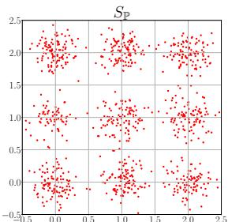

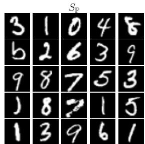

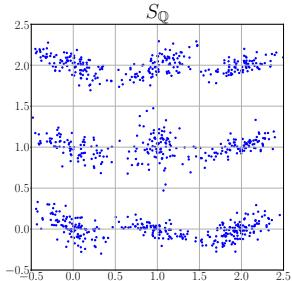

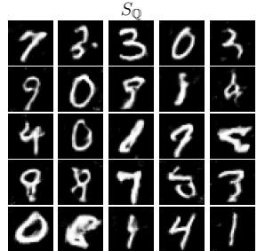

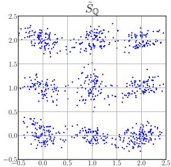  
(a) Blob

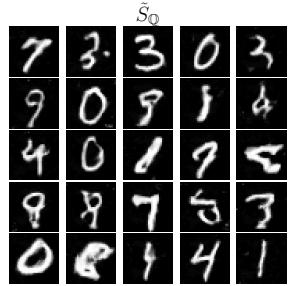  
(b) MNIST   
Figure 2. Visualization of adversarial test sets.

that claimed there should be no trade-off between benign accuracy and adversarial robustness.

MMD-RoD unexpectedly performs poorly on HDGM and Higgs, which has low test power in both benign and adversarial settings. The poor performance in the benign setting could be attributed to that the most adversarial training pairs can lead to the cross-over mixture problem (Zhang et al., 2020a), thus making the learning extremely difficult and even fail. The reason for the poor robustness could be that the number of training data is small since enhancing adversarial robustness needs more training data (Schmidt et al., 2018). Therefore, we believe that utilizing the style of friendly adversarial training (Zhang et al., 2020a) for learning kernels along with sampling more training data can further enhance the performance of MMD-RoD. We leave further improving MMD-RoD as future work.

# 5.3. Visualization of Adversarial Test Sets

We visualize benign test set $S _ { \mathbb { Q } }$ (middle) and the corresponding adversarial test set ${ \tilde { S } } _ { \mathbb { Q } }$ (bottom) on Blob and MNIST in Figure 2 as well as CIFAR-10 in Figure 1. The adversarial data are generated in the experiments illustrated in Section 5.1. Note that the benign test pair we choose to visualize can be correctly judged as samples drawn from

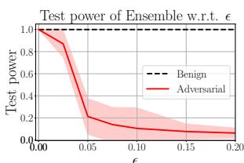

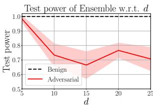

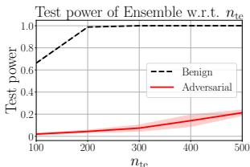

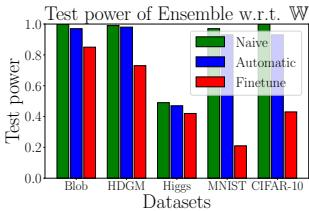  
Figure 3. Ablation studies on important hyperparameters.

different distributions by each TST in Ensemble, and its corresponding adversarial test pair can successfully fool Ensemble. Due to limited space, we visualize only a part of samples from each set. Figure 1-2 verify that the differences between $S _ { \mathbb { Q } }$ and ${ \tilde { S } } _ { \mathbb { Q } }$ is almost visually indistinguishable to humans, and meanwhile the distribution of $S _ { \mathbb { P } }$ is explicitly different from that of ${ \tilde { S } } _ { \mathbb { Q } }$ . Therefore, Figure 1-2 empirically validate that an $\ell _ { \infty }$ -bound can guarantee the invisibility of adversarial attacks.

# 5.4. Ablation Studies on Important Hyperparameters

In this subsection, we conduct ablation studies on important hyperparameters, including , d, $n _ { \mathrm { t e } }$ and W. Comprehensive results further validate non-parametric TSTs lack adversarial robustness.

Evaluation with different . We report the average test power of Ensemble under EA with $\epsilon \_ { \mathrm { ~ \in ~ } }$ $\{ 0 . 0 0 , 0 . 0 2 5 , 0 . 0 5 , 0 . 0 7 5 , 0 . 1 , 0 . 1 5 , 0 . 2 \}$ on MNIST. Other settings keep same as Section 5.1. The upper left panel of Figure 3 shows that the test power of Ensemble under EA (red solid line) becomes lower as $\epsilon$ increases, and is significantly lower than the test power evaluated in the benign setting (black dash line) over different $\epsilon$ , which is in line with the conclusion of Theorem 2.

Evaluation with different $d$ . We evaluate the test power of Ensemble under EA on HDGM with different $d \in$ $\{ 5 , 1 0 , 1 5 , 2 0 , 2 5 \}$ . The settings follow Section 5.1 except the dimensionality of Gaussian mixture. The upper right panel of Figure 3 shows that the test power in the adversarial setting (red solid line) decreases as $d$ rises and remains lower than benign test power (black dash line). However, with larger $d$ (e.g., $d > 1 5$ ) the test power under EA does not keep degrading and even rises. We believe it is due to that the weight set for EA with larger $d$ is set inappropriately. We discuss the reasons in detail in Appendix E.7.

Evaluation with different $n _ { \mathrm { t e } }$ . We evaluate the test power of Ensemble under EA on MNIST with different

$n _ { \mathrm { t e } } \in \{ 1 0 0 , 2 0 0 , 3 0 0 , 4 0 0 , 5 0 0 \}$ , and use the same settings as Section 5.1. The lower left panel of Figure 3 shows that the test power in the adversarial setting (red solid line) increases as $n _ { \mathrm { t e } }$ becomes larger, but the test power under EA is always severely deteriorated compared to benign test power (black dash line), which reflects that non-parametric TSTs lack adversarial robustness.

Evaluation with different W. We report the test power of Ensemble under EA with three weight strategies: 1) “Naive” (green pillar) denotes that we set $\begin{array} { r l } { \mathbb { W } } & { { } = } \end{array}$ $\{ 1 / 6 , 1 / 6 , 1 / 6 , 1 / 6 , 1 / 6 , 1 / 6 \} ; 2$ 2) “Automatic” (blue pillar) denotes that we use the softmax of test criterion for each test as W at each PGD iteration, i.e., $\begin{array} { r } { w ^ { ( \mathcal { T } _ { i } ) } = \frac { \exp ( \hat { \mathcal { F } } ^ { ( \mathcal { I } _ { i } ) } ) } { \sum _ { j = 1 } ^ { n } \exp ( \hat { \mathcal { F } } ^ { ( \mathcal { I } _ { j } ) } ) } } \end{array}$ Pnj=1 exp(Fˆ(Jj )) 3) “Finetune” (red pillar) denotes that we set manuallyfinetuned W for each dataset. The finetuned weight set is summarized in Appendix E.2. Other settings follow Section 5.1. The lower right panel of Figure 3 shows that the test power of Ensemble under EA can be severely deteriorated with an appropriate weight strategy.

# 5.5. Transferability of Adversarial Attacks

Further, we empirically demonstrate that our proposed EA against non-parametric TSTs has transferability.

Transferability between different types of nonparametric TSTs. We report test power of nonparametric TSTs under the adversarial attack against a certain type of TSTs on MNIST in Figure 4(a) and the test power of non-parametric TSTs under EA against a TST ensemble composed by leaving one TST out of Ensemble on MNIST in Figure 4(b). The experimental details and results are in Appendix E.6. Figure 4(a) shows that attacks against a certain type of TST sometimes can fool other types of TSTs. Figure 4(b) demonstrates that attacks against an ensemble of TSTs sometimes can successfully fool TSTs that are not included in the attack ensemble. Therefore, Figure 4 validates our proposed EA has transferability between different types of non-parametric TSTs.

Transferability between target and surrogate nonparametric TSTs. Here, we assume that the attacker cannot obtain the target non-parametric TST’s kernel parameters and training data, and it only knows the target nonparametric TST’s test criterion (including its kernel function). We generate adversarial pairs via EA based on an ensemble of surrogate non-parametric TSTs on MNIST (other attack configurations follow Section 5.1) and then report the average test power of target tests on these adversarial pairs in Table 3. Surrogate tests are trained on the training data with different random seeds. Table 3 shows that the test power of each target non-parametric TST and Ensemble are deteriorated under EA based on surrogate non-parametric

TSTs, which further validates that existing non-parametric TSTs are adversarially vulnerable.

Table 3. Transferability between target and surrogate nonparametric TSTs.   

<table><tr><td>MMD-D</td><td>MMD-G</td><td>C2ST-S</td><td>C2ST-L</td><td>ME</td><td>SCF</td><td>Ensemble</td></tr><tr><td>0.564±0.09</td><td>0.149±0.00</td><td>0.418±0.03</td><td>0.471±0.04</td><td>0.064±0.01</td><td>0.001±0.00</td><td>0.751±0.01</td></tr></table>

Transferability between different test sets drawn from P. We replace the set $S _ { \mathbb { P } }$ with $S _ { \mathbb { P } } ^ { \prime }$ where $S _ { \mathbb { P } } ^ { \prime }$ is drawn from the distribution $\mathbb { P }$ with different random seeds (i.e., $S _ { \mathbb { P } } \neq$ $S _ { \mathbb { P } } ^ { \prime } )$ . ${ \tilde { S } } _ { \mathbb { Q } }$ is generated by EA on the benign test pair $( S _ { \mathbb { P } } , S _ { \mathbb { Q } } )$ We report the average test power of non-parametric TSTs on $( S _ { \mathbb { P } } ^ { \prime } , \tilde { \tilde { S } } _ { \mathbb { Q } } )$ under EA on MNIST (details follow Section 5.1) in Table 4. Table 4 shows that EA still hurts the test power of non-parametric TSTs on $( S _ { \mathbb { P } } ^ { \prime } , \tilde { S } _ { \mathbb { Q } } )$ , and implies that EA has a good transferability property between different test sets drawn from $\mathbb { P }$ .

Table 4. Transferability between different test sets drawn form P.   

<table><tr><td>MMD-D</td><td>MMD-G</td><td>C2ST-S</td><td>C2ST-L</td><td>ME</td><td>SCF</td><td>Ensemble</td></tr><tr><td>0.166±0.05</td><td>0.201±0.00</td><td>0.013±0.00</td><td>0.018±0.00</td><td>0.270±0.03</td><td>0.017±0.01</td><td>0.486±0.04</td></tr></table>

# 6. Conclusions

This paper systematically studies adversarial robustness of non-parametric TSTs. We propose a generic ensemble attack framework which reveals non-parametric TSTs are adversarially vulnerable.To counteract these risks, we propose to adversarially learn kernels for non-parametric TSTs. We empirically show that SOTA non-parametric TSTs can fail catastrophically under adversarial attacks, and our proposed MMD-RoD can substantially enhance the adversarial robustness of non-parametric TSTs. We believe our work makes people aware of potential risks when they apply nonparametric TSTs to critical applications.

One of the limitations of our current work is that our proposed attack method is computationally heavy and userdependent, in that it needs very large GPU memory when $n _ { \mathrm { t e } }$ is too large and the weight set needs to be manually finetuned. Future research includes (a) how to fool nonparametric TSTs by perturbing fewer samples, (b) how to adaptively adjust the weight set at each PGD iteration.

# Acknowledgements

Jingfeng Zhang was supported by JST, ACT-X Grant Number JPMJAX21AF. Masashi Sugiyama was supported by JST AIP Acceleration Research Grant Number JP-MJCR20U3 and the Institute for AI and Beyond, UTokyo. Mohan Kankanhalli’s research is supported by the National Research Foundation, Singapore under its Strategic Capability Research Centres Funding Initiative. Any opinions, findings and conclusions or recommendations expressed in this material are those of the author(s) and do not reflect the views of National Research Foundation, Singapore.

# References

Alaifari, R., Alberti, G. S., and Gauksson, T. Adef: an iterative algorithm to construct adversarial deformations. In ICLR, 2019.   
Amsaleg, L., Bailey, J., Barbe, D., Erfani, S., Houle, M. E., Nguyen, V., and Radovanovic, M. The vulnerability of ´ learning to adversarial perturbation increases with intrinsic dimensionality. In 2017 IEEE Workshop on Information Forensics and Security (WIFS), pp. 1–6. IEEE, 2017.   
Andriushchenko, M., Croce, F., Flammarion, N., and Hein, M. Square attack: a query-efficient black-box adversarial attack via random search. In European Conference on Computer Vision, pp. 484–501. Springer, 2020.   
Athalye, A., Carlini, N., and Wagner, D. A. Obfuscated gradients give a false sense of security: Circumventing defenses to adversarial examples. In ICML, 2018.   
Baldi, P., Sadowski, P., and Whiteson, D. Searching for exotic particles in high-energy physics with deep learning. Nature communications, 5(1):1–9, 2014.   
Bhattacharjee, R. and Chaudhuri, K. When are nonparametric methods robust? In International Conference on Machine Learning, pp. 832–841. PMLR, 2020.   
Bhattacharjee, R. and Chaudhuri, K. Consistent nonparametric methods for maximizing robustness. Advances in Neural Information Processing Systems, 34, 2021.   
Biggio, B. and Roli, F. Wild patterns: Ten years after the rise of adversarial machine learning. Pattern Recognition, 84:317–331, 2018.   
Binkowski, M., Sutherland, D. J., Arbel, M., and Gret- ´ ton, A. Demystifying mmd gans. arXiv preprint arXiv:1801.01401, 2018.   
Borgwardt, K. M., Gretton, A., Rasch, M. J., Kriegel, H.-P., Scholkopf, B., and Smola, A. J. Integrating structured ¨ biological data by kernel maximum mean discrepancy. Bioinformatics, 22(14):e49–e57, 2006.   
Cai, Q., Liu, C., and Song, D. Curriculum adversarial training. In IJCAI, 2018.   
Carlini, N. and Wagner, D. A. Towards evaluating the robustness of neural networks. In Symposium on Security and Privacy (SP), 2017.   
Carmon, Y., Raghunathan, A., Schmidt, L., Liang, P., and Duchi, J. C. Unlabeled data improves adversarial robustness. In NeurIPS, 2019.

Chen, H. and Friedman, J. H. A new graph-based twosample test for multivariate and object data. Journal of the American statistical association, 112(517):397–409, 2017.   
Chen, H., Zhang, H., Boning, D. S., and Hsieh, C.-J. Robust decision trees against adversarial examples. In ICML, pp. 1122–1131, 2019.   
Chen, J., Jordan, M. I., and Wainwright, M. J. Hopskipjumpattack: A query-efficient decision-based attack. In 2020 ieee symposium on security and privacy (sp), pp. 1277–1294. IEEE, 2020.   
Chen, P.-Y., Sharma, Y., Zhang, H., Yi, J., and Hsieh, C.- J. Ead: elastic-net attacks to deep neural networks via adversarial examples. In Thirty-second AAAI conference on artificial intelligence, 2018.   
Chen, T., Zhang, Z., Liu, S., Chang, S., and Wang, Z. Robust overfitting may be mitigated by properly learned smoothening. In ICLR, 2021.   
Cheng, M., Le, T., Chen, P.-Y., Zhang, H., Yi, J., and Hsieh, C.-J. Query-efficient hard-label black-box attack: An optimization-based approach. In International Conference on Learning Representations, 2019. URL https: //openreview.net/forum?id=rJlk6iRqKX.   
Cheng, M., Singh, S., Chen, P. H., Chen, P.-Y., Liu, S., and Hsieh, C.-J. Sign-opt: A query-efficient hard-label adversarial attack. In International Conference on Learning Representations, 2020. URL https://openreview. net/forum?id $=$ SklTQCNtvS.   
Cheng, X. and Cloninger, A. Classification logit twosample testing by neural networks. arXiv preprint arXiv:1909.11298, 2019.   
Chwialkowski, K. P., Sejdinovic, D., and Gretton, A. A wild bootstrap for degenerate kernel tests. In Advances in neural information processing systems, pp. 3608–3616, 2014.   
Chwialkowski, K. P., Ramdas, A., Sejdinovic, D., and Gretton, A. Fast two-sample testing with analytic representations of probability measures. Advances in Neural Information Processing Systems, 28:1981–1989, 2015.   
Croce, F. and Hein, M. Reliable evaluation of adversarial robustness with an ensemble of diverse parameter-free attacks. In ICML, 2020.   
Croce, F., Andriushchenko, M., Sehwag, V., Debenedetti, E., Flammarion, N., Chiang, M., Mittal, P., and Hein, M. Robustbench: a standardized adversarial robustness benchmark. arXiv preprint arXiv:2010.09670, 2020.

Danskin, J. M. The theory of max-min, with applications. SIAM Journal on Applied Mathematics, 14(4):641–664, 1966.   
Ding, G. W., Sharma, Y., Lui, K. Y. C., and Huang, R. Mma training: Direct input space margin maximization through adversarial training. In ICLR, 2020.   
Dong, M., Li, Y., Wang, Y., and Xu, C. Adversarially robust neural architectures. arXiv preprint arXiv:2009.00902, 2020.   
Dwass, M. Modified randomization tests for nonparametric hypotheses. The Annals of Mathematical Statistics, pp. 181–187, 1957.   
Erdemir, E., Bickford, J., Melis, L., and Aydore, S. Adversarial robustness with non-uniform perturbations. In Beygelzimer, A., Dauphin, Y., Liang, P., and Vaughan, J. W. (eds.), Advances in Neural Information Processing Systems, 2021. URL https://openreview.net/ forum?id=oi08QWKs84.   
Fang, T., Lu, N., Niu, G., and Sugiyama, M. Rethinking importance weighting for deep learning under distribution shift. In NeurIPS, 2020a.   
Fang, Z., Lu, J., Liu, F., Xuan, J., and Zhang, G. Open set domain adaptation: Theoretical bound and algorithm. IEEE transactions on neural networks and learning systems, 2020b.   
Feinman, R., Curtin, R. R., Shintre, S., and Gardner, A. B. Detecting adversarial samples from artifacts. arXiv preprint arXiv:1703.00410, 2017.   
Fernandez, V. A., Gamero, M. J., and Garcia, J. M. A test for ´ the two-sample problem based on empirical characteristic functions. Computational statistics & data analysis, 52 (7):3730–3748, 2008.   
Gao, R., Xie, L., Xie, Y., and Xu, H. Robust hypothesis testing using wasserstein uncertainty sets. In NeurIPS, pp. 7913–7923, 2018.   
Gao, R., Liu, F., Zhang, J., Han, B., Liu, T., Niu, G., and Sugiyama, M. Maximum mean discrepancy test is aware of adversarial attacks. In International Conference on Machine Learning, pp. 3564–3575. PMLR, 2021.   
Ghoshdastidar, D., Gutzeit, M., Carpentier, A., and von Luxburg, U. Two-sample tests for large random graphs using network statistics. In Conference on Learning Theory, pp. 954–977. PMLR, 2017.   
Gong, M., Zhang, K., Liu, T., Tao, D., Glymour, C., and Scholkopf, B. Domain adaptation with conditional trans-¨ ferable components. In International conference on machine learning, pp. 2839–2848. PMLR, 2016.

Goodfellow, I. J., Shlens, J., and Szegedy, C. Explaining and harnessing adversarial examples. In ICLR, 2015.   
Gowal, S., Rebuffi, S.-A., Wiles, O., Stimberg, F., Calian, D. A., and Mann, T. A. Improving robustness using generated data. Advances in Neural Information Processing Systems, 34, 2021.   
Gretton, A., Fukumizu, K., Harchaoui, Z., and Sriperumbudur, B. K. A fast, consistent kernel two-sample test. In NIPS, volume 23, pp. 673–681, 2009.   
Gretton, A., Borgwardt, K. M., Rasch, M. J., Scholkopf, B., ¨ and Smola, A. A kernel two-sample test. The Journal of Machine Learning Research, 13(1):723–773, 2012.   
Grosse, K., Manoharan, P., Papernot, N., Backes, M., and McDaniel, P. On the (statistical) detection of adversarial examples. arXiv preprint arXiv:1702.06280, 2017.   
Gul, G. and Zoubir, A. M. Minimax robust hypothesis ¨ testing. IEEE Transactions on Information Theory, 63(9): 5572–5587, 2017.   
Hein, M. and Andriushchenko, M. Formal guarantees on the robustness of a classifier against adversarial manipulation. In NIPS, pp. 2263–2273, 2017.   
Hendrycks, D., Zhao, K., Basart, S., Steinhardt, J., and Song, D. Natural adversarial examples. In Proceedings of the IEEE/CVF Conference on Computer Vision and Pattern Recognition, pp. 15262–15271, 2021.   
Huber, P. J. Robust statistics, volume 523. John Wiley & Sons, 2004.   
Ilyas, A., Engstrom, L., Athalye, A., and Lin, J. Black-box adversarial attacks with limited queries and information. In International Conference on Machine Learning, pp. 2137–2146. PMLR, 2018.   
Jitkrittum, W., Szabo, Z., Chwialkowski, K. P., and Gretton, ´ A. Interpretable distribution features with maximum testing power. Advances in Neural Information Processing Systems, 29:181–189, 2016.   
Kanth Nakka, K. and Salzmann, M. Learning transferable adversarial perturbations. In Thirty-Fifth Conference on Neural Information Processing Systems, 2021.   
Kim, J., Lee, B.-K., and Ro, Y. M. Distilling robust and nonrobust features in adversarial examples by information bottleneck. Advances in Neural Information Processing Systems, 34, 2021.   
Kingma, D. P. and Ba, J. Adam: A method for stochastic optimization. In ICLR (Poster), 2015. URL http:// arxiv.org/abs/1412.6980.

Kirchler, M., Khorasani, S., Kloft, M., and Lippert, C. Twosample testing using deep learning. In International Conference on Artificial Intelligence and Statistics, pp. 1387– 1398. PMLR, 2020.   
Krizhevsky, A. Learning multiple layers of features from tiny images. Technical report, 2009.   
LeCun, Y., Bottou, L., Bengio, Y., and Haffner, P. Gradientbased learning applied to document recognition. Proceedings of the IEEE, 86(11):2278–2324, 1998.   
Leucht, A. and Neumann, M. H. Dependent wild bootstrap for degenerate u-and v-statistics. Journal of Multivariate Analysis, 117:257–280, 2013.   
Levy, B. C. Robust hypothesis testing with a relative entropy tolerance. IEEE Transactions on Information Theory, 55 (1):413–421, 2008.   
Li, S. and Wang, X. Fully distributed sequential hypothesis testing: Algorithms and asymptotic analyses. IEEE Transactions on Information Theory, 64(4):2742–2758, 2018.   
Liu, F., Lu, J., Han, B., Niu, G., Zhang, G., and Sugiyama, M. Butterfly: A panacea for all difficulties in wildly unsupervised domain adaptation. In NeurIPS LTS Workshop, 2019.   
Liu, F., Xu, W., Lu, J., Zhang, G., Gretton, A., and Sutherland, D. J. Learning deep kernels for non-parametric two-sample tests. In International Conference on Machine Learning, pp. 6316–6326. PMLR, 2020a.   
Liu, F., Zhang, G., and Lu, J. Multi-source heterogeneous unsupervised domain adaptation via fuzzy-relation neural networks. IEEE Transactions on Fuzzy Systems, 2020b.   
Liu, F., Xu, W., Lu, J., and Sutherland, D. J. Meta twosample testing: Learning kernels for testing with limited data. In Beygelzimer, A., Dauphin, Y., Liang, P., and Vaughan, J. W. (eds.), Advances in Neural Information Processing Systems, 2021. URL https: //openreview.net/forum?id=EUlAerrk47Y.   
Lopez-Paz, D. and Oquab, M. Revisiting classifier twosample tests. arXiv preprint arXiv:1610.06545, 2016.   
Madry, A., Makelov, A., Schmidt, L., Tsipras, D., and Vladu, A. Towards deep learning models resistant to adversarial attacks. In ICLR, 2018.   
Mahmood, K., Mahmood, R., and Van Dijk, M. On the robustness of vision transformers to adversarial examples. arXiv preprint arXiv:2104.02610, 2021.

Metzen, J. H., Genewein, T., Fischer, V., and Bischoff, B. On detecting adversarial perturbations. arXiv preprint arXiv:1702.04267, 2017.   
Moosavi-Dezfooli, S.-M., Fawzi, A., and Frossard, P. Deepfool: a simple and accurate method to fool deep neural networks. In Proceedings of the IEEE conference on computer vision and pattern recognition, pp. 2574–2582, 2016.   
Mopuri, K. R., Ganeshan, A., and Babu, R. V. Generalizable data-free objective for crafting universal adversarial perturbations. IEEE transactions on pattern analysis and machine intelligence, 41(10):2452–2465, 2018.   
Oneto, L., Donini, M., Luise, G., Ciliberto, C., Maurer, A., and Pontil, M. Exploiting mmd and sinkhorn divergences for fair and transferable representation learning. In NeurIPS, 2020.   
Opitz, D. and Maclin, R. Popular ensemble methods: An empirical study. Journal of artificial intelligence research, 11:169–198, 1999.   
Pang, T., Xu, K., Du, C., Chen, N., and Zhu, J. Improving adversarial robustness via promoting ensemble diversity. In ICML, 2019.   
Pang, T., Yang, X., Dong, Y., Su, H., and Zhu, J. Bag of tricks for adversarial training. ICLR, 2021.   
Pang, T., Lin, M., Yang, X., Zhu, J., and Yan, S. Robustness and accuracy could be reconcilable by (proper) definition. arXiv preprint arXiv:2202.10103, 2022.   
Papernot, N., McDaniel, P., Sinha, A., and Wellman, M. Towards the science of security and privacy in machine learning. arXiv:1611.03814, 2016.   
Paszke, A., Gross, S., Massa, F., Lerer, A., Bradbury, J., Chanan, G., Killeen, T., Lin, Z., Gimelshein, N., Antiga, L., et al. Pytorch: An imperative style, high-performance deep learning library. Advances in neural information processing systems, 32:8026–8037, 2019.   
Peng, S. and Mine, T. A robust hierarchical graph convolutional network model for collaborative filtering. arXiv preprint arXiv:2004.14734, 2020.   
Poggio, T. and Shelton, C. R. On the mathematical foundations of learning. American Mathematical Society, 39(1): 1–49, 2002.   
Qin, C., Martens, J., Gowal, S., Krishnan, D., Dvijotham, K., Fawzi, A., De, S., Stanforth, R., and Kohli, P. Adversarial robustness through local linearization. In NeurIPS, 2019.

Radford, A., Metz, L., and Chintala, S. Unsupervised representation learning with deep convolutional generative adversarial networks. arXiv preprint arXiv:1511.06434, 2015.   
Rahmati, A., Moosavi-Dezfooli, S.-M., Frossard, P., and Dai, H. Geoda: a geometric framework for black-box adversarial attacks. In Proceedings of the IEEE/CVF Conference on Computer Vision and Pattern Recognition, pp. 8446–8455, 2020.   
Rasch, M., Gretton, A., Murayama, Y., Maass, W., and Logothetis, N. Predicting spiking activity from local field potentials. Journal of Neurophysiology, 99:1461–1476, 2008.   
Rebuffi, S.-A., Gowal, S., Calian, D. A., Stimberg, F., Wiles, O., and Mann, T. A. Data augmentation can improve robustness. Advances in Neural Information Processing Systems, 34, 2021.   
Robey, A., Chamon, L., Pappas, G., Hassani, H., and Ribeiro, A. Adversarial robustness with semi-infinite constrained learning. Advances in Neural Information Processing Systems, 34, 2021.   
Rokach, L. Ensemble-based classifiers. Artificial intelligence review, 33(1):1–39, 2010.   
Sarkar, A., Sarkar, A., Gali, S., and Balasubramanian, V. N. Adversarial robustness without adversarial training: A teacher-guided curriculum learning approach. In Beygelzimer, A., Dauphin, Y., Liang, P., and Vaughan, J. W. (eds.), Advances in Neural Information Processing Systems, 2021. URL https://openreview.net/ forum?id=MqCzSKCQ1QB.   
Schmidt, L., Santurkar, S., Tsipras, D., Talwar, K., and Madry, A. Adversarially robust generalization requires more data. In NeurIPS, 2018.   
Sehwag, V., Wang, S., Mittal, P., and Jana, S. Hydra: Pruning adversarially robust neural networks. NeurIPS, 2020.   
Serfling, R. J. Approximation theorems of mathematical statistics, volume 162. John Wiley & Sons, 2009.   
Shafahi, A., Najibi, M., Ghiasi, M. A., Xu, Z., Dickerson, J., Studer, C., Davis, L. S., Taylor, G., and Goldstein, T. Adversarial training for free! In NeurIPS, 2019.   
Sitawarin, C. and Wagner, D. On the robustness of deep k-nearest neighbors. In 2019 IEEE Security and Privacy Workshops (SPW), pp. 1–7. IEEE, 2019.   
Song, C., He, K., Wang, L., and Hopcroft, J. E. Improving the generalization of adversarial training with domain adaptation. In International Conference on Learning

Representations, 2019. URL https://openreview. net/forum?id $=$ SyfIfnC5Ym.   
Sriramanan, G., Addepalli, S., Baburaj, A., and Babu, R. V. Guided adversarial attack for evaluating and enhancing adversarial defenses. arXiv preprint arXiv:2011.14969, 2020.   
Sriramanan, G., Addepalli, S., Baburaj, A., et al. Towards efficient and effective adversarial training. Advances in Neural Information Processing Systems, 34, 2021.   
Stojanov, P., Gong, M., Carbonell, J., and Zhang, K. Datadriven approach to multiple-source domain adaptation. In The 22nd International Conference on Artificial Intelligence and Statistics, pp. 3487–3496. PMLR, 2019.   
Sugiyama, M., Suzuki, T., Itoh, Y., Kanamori, T., and Kimura, M. Least-squares two-sample test. Neural networks, 24(7):735–751, 2011.   
Sutherland, D. J., Tung, H.-Y., Strathmann, H., De, S., Ramdas, A., Smola, A. J., and Gretton, A. Generative models and model criticism via optimized maximum mean discrepancy. In ICLR, 2017.   
Szegedy, C., Zaremba, W., Sutskever, I., Bruna, J., Erhan, D., Goodfellow, I., and Fergus, R. Intriguing properties of neural networks. In ICLR, 2014.   
Tramer, F., Kurakin, A., Papernot, N., Goodfellow, I. J., ` Boneh, D., and McDaniel, P. D. Ensemble adversarial training: Attacks and defenses. In ICLR, 2018.   
Wang, Q., Liu, F., Han, B., Liu, T., Gong, C., Niu, G., Zhou, M., and Sugiyama, M. Probabilistic margins for instance reweighting in adversarial training. In Beygelzimer, A., Dauphin, Y., Liang, P., and Vaughan, J. W. (eds.), Advances in Neural Information Processing Systems, 2021. URL https://openreview.net/forum? id=rg8gNkvs3u.   
Wang, Y., Jha, S., and Chaudhuri, K. Analyzing the robustness of nearest neighbors to adversarial examples. In International Conference on Machine Learning, pp. 5133–5142. PMLR, 2018.   
Wang, Y., Ma, X., Bailey, J., Yi, J., Zhou, B., and Gu, Q. On the convergence and robustness of adversarial training. In ICML, 2019.   
Wang, Y., Zou, D., Yi, J., Bailey, J., Ma, X., and Gu, Q. Improving adversarial robustness requires revisiting misclassified examples. In ICLR, 2020.   
Wong, E. and Kolter, J. Z. Provable defenses against adversarial examples via the convex outer adversarial polytope. In ICML, 2018.

Wong, E., Schmidt, F., and Kolter, Z. Wasserstein adversarial examples via projected sinkhorn iterations. In International Conference on Machine Learning, pp. 6808–6817. PMLR, 2019.   
Wong, E., Rice, L., and Kolter, J. Z. Fast is better than free: Revisiting adversarial training. In ICLR, 2020.   
Wu, D., Wang, Y., Xia, S.-T., Bailey, J., and Ma, X. Skip connections matter: On the transferability of adversarial examples generated with resnets. In International Conference on Learning Representations, 2020a.   
Wu, D., Xia, S.-T., and Wang, Y. Adversarial weight perturbation helps robust generalization. NeurIPS, 33, 2020b.   
Xiao, C., Zhu, J.-Y., Li, B., He, W., Liu, M., and Song, D. Spatially transformed adversarial examples. In International Conference on Learning Representations, 2018. URL https://openreview.net/forum? id $=$ HyydRMZC-.   
Xie, C., Wang, J., Zhang, Z., Zhou, Y., Xie, L., and Yuille, A. Adversarial examples for semantic segmentation and object detection. In Proceedings of the IEEE International Conference on Computer Vision, pp. 1369–1378, 2017.   
Xie, L., Gao, R., and Xie, Y. Robust hypothesis testing with wasserstein uncertainty sets. arXiv preprint arXiv:2105.14348, 2021.   
Yan, Z., Guo, Y., and Zhang, C. Deep defense: Training dnns with improved adversarial robustness. In NeurIPS, pp. 417–426, 2018.   
Yan, Z., Guo, Y., Liang, J., and Zhang, C. Policy-driven attack: Learning to query for hard-label black-box adversarial examples. In International Conference on Learning Representations, 2020.   
Yang, Y., Rashtchian, C., Wang, Y., and Chaudhuri, K. Adversarial examples for non-parametric methods: Attacks, defenses and large sample limits. arXiv preprint arXiv:1906.03310, 2019.   
Yang, Y., Rashtchian, C., Zhang, H., Salakhutdinov, R. R., and Chaudhuri, K. A closer look at accuracy vs. robustness. In NeurIPS, 2020a.   
Yang, Y.-Y., Rashtchian, C., Wang, Y., and Chaudhuri, K. Robustness for non-parametric classification: A generic attack and defense. In International Conference on Artificial Intelligence and Statistics, pp. 941–951. PMLR, 2020b.   
Yao, C., Bielik, P., TSANKOV, P., and Vechev, M. Automated discovery of adaptive attacks on adversarial defenses. In Beygelzimer, A., Dauphin, Y., Liang, P.,

and Vaughan, J. W. (eds.), Advances in Neural Information Processing Systems, 2021. URL https:// openreview.net/forum?id=nWz-Si-uTzt.   
Yoo, J. Y. and Qi, Y. Towards improving adversarial training of nlp models. arXiv preprint arXiv:2109.00544, 2021.   
Yu, Y., Gao, X., and Xu, C.-Z. Lafeat: Piercing through adversarial defenses with latent features. In Proceedings of the IEEE/CVF Conference on Computer Vision and Pattern Recognition, pp. 5735–5745, 2021.   
Zhang, D., Zhang, T., Lu, Y., Zhu, Z., and Dong, B. You only propagate once: Accelerating adversarial training via maximal principle. In NeurIPS, 2019a.   
Zhang, H., Yu, Y., Jiao, J., Xing, E. P., Ghaoui, L. E., and Jordan, M. I. Theoretically principled trade-off between robustness and accuracy. In ICML, 2019b.   
Zhang, J., Xu, X., Han, B., Niu, G., Cui, L., Sugiyama, M., and Kankanhalli, M. Attacks which do not kill training make adversarial learning stronger. In ICML, 2020a.   
Zhang, J., Zhu, J., Niu, G., Han, B., Sugiyama, M., and Kankanhalli, M. Geometry-aware instance-reweighted adversarial training. In ICLR, 2021.   
Zhang, T., Yamane, I., Lu, N., and Sugiyama, M. A onestep approach to covariate shift adaptation. In Asian Conference on Machine Learning, pp. 65–80. PMLR, 2020b.   
Zhang, Y., Liu, F., Fang, Z., Yuan, B., Zhang, G., and Lu, J. Clarinet: A one-step approach towards budget-friendly unsupervised domain adaptation. In IJCAI, pp. 2526– 2532, 2020c. URL https://doi.org/10.24963/ ijcai.2020/350.   
Zheng, T., Chen, C., and Ren, K. Distributionally adversarial attack. In Proceedings of the AAAI Conference on Artificial Intelligence, volume 33, pp. 2253–2260, 2019.   
Zhu, C., Cheng, Y., Gan, Z., Sun, S., Goldstein, T., and Liu, J. Freelb: Enhanced adversarial training for natural language understanding. In ICLR, 2020.   
Zou, D., Frei, S., and Gu, Q. Provable robustness of adversarial training for learning halfspaces with noise. In ICML, pp. 13002–13011, 2021. URL http://proceedings.mlr.press/v139/ zou21a.html.

# A. Notation Table

Table 5. A notation table in convenience for viewing.   

<table><tr><td>Notation</td><td>Description</td></tr><tr><td>J</td><td>The non-parametric TST</td></tr><tr><td>J</td><td>The set of non-parametric TSTs</td></tr><tr><td>H0</td><td>The null hypothesis</td></tr><tr><td>H1</td><td>The alternative hypothesis</td></tr><tr><td>α</td><td>The significance level</td></tr><tr><td>r</td><td>The rejection threshold</td></tr><tr><td>TP</td><td>The measurement function for the test power</td></tr><tr><td>D</td><td>The test statistic function</td></tr><tr><td>F</td><td>The test criterion function</td></tr><tr><td>F</td><td>The set of test criterion functions</td></tr><tr><td>d</td><td>The dimensionality of data</td></tr><tr><td>X</td><td>The data feature space⊂Rd</td></tr><tr><td>P</td><td>The Borel probability measure on X</td></tr><tr><td>Q</td><td>The Borel probability measure on X</td></tr><tr><td>Pm</td><td>The joint probability distribution Pm= m×P×...×P</td></tr><tr><td>Qn</td><td>The joint probability distribution Qn= Q×Q×...×Q</td></tr><tr><td>SP</td><td>The set SP={xi}m i=1~Pm</td></tr><tr><td>SQ</td><td>The set SQ={yi}n i=1~Qn</td></tr><tr><td>ntr</td><td>The number of training samples drawn from a particular distribution</td></tr><tr><td>nte</td><td>The number of testing samples drawn from a particular distribution</td></tr><tr><td>k</td><td>The kernel function</td></tr><tr><td>θ</td><td>The kernel parameter</td></tr><tr><td>κ</td><td>The dimensionality of the kernel parameter</td></tr><tr><td>Θ</td><td>The set of kernel parameters</td></tr><tr><td>Rθ</td><td>A positive constant that bounds the kernel parameter θ∈Θ</td></tr><tr><td>s</td><td>A positive constant used in defining Θs</td></tr><tr><td>Θs</td><td>A set of kernel parameters Θs = {θ∈Θ | σ2θ≥s2&gt;0}</td></tr><tr><td>ν</td><td>A constant that uniformly bounds the kernel function</td></tr><tr><td>L1</td><td>Lipschitz constant of the kernel function</td></tr><tr><td>L2</td><td>Lipschitz constant of the kernel function</td></tr><tr><td>λ</td><td>A constant∈(0,1) used in calculating σH1,λ (in Eq. (5))</td></tr><tr><td>SQ</td><td>The adversarial data corresponding to SQ</td></tr><tr><td>ε</td><td>The size of adversarial budget</td></tr><tr><td>T</td><td>The maximum PGD step</td></tr><tr><td>ρ</td><td>The step size</td></tr><tr><td>w</td><td>The weight for the test criterion function</td></tr><tr><td>W</td><td>The weight set</td></tr><tr><td>C</td><td>The checkpoint set</td></tr><tr><td>E</td><td>The number of training epoch</td></tr><tr><td>η</td><td>The learning rate of the optimizer</td></tr><tr><td>f</td><td>A classifier that outputs classification probabilities</td></tr><tr><td>φ</td><td>A neural network</td></tr><tr><td>γ</td><td>A learnable parameter in the deep kernel</td></tr><tr><td>σφ</td><td>A learnable parameter in the deep kernel</td></tr><tr><td>G</td><td>The number of test locations</td></tr><tr><td>V</td><td>The set of test locations</td></tr></table>

# B. Theoretical Analysis

All the proofs are inspired by Liu et al. (2020a).

# B.1. Uniform Convergence Results

These results, on the uniform convergence of $\widehat { \mathrm { M M D } } ^ { 2 } ( S _ { \mathbb { P } } , \tilde { S } _ { \mathbb { Q } } ; k _ { \theta } )$ and $\hat { \sigma } _ { \mathcal { H } _ { 1 } , \lambda } ^ { 2 } ( S _ { \mathbb { P } } , \tilde { S } _ { \mathbb { Q } } ; k _ { \theta } )$ , were used in the proof of Theorem 2.

Proposition 1 (Restated). Under Assumptions 1 to 3, we use $n _ { \mathrm { t r } }$ samples to train a kernel $k _ { \theta }$ parameterized with $\theta$ and $n _ { \mathrm { t e } }$ samples to run a test of significance level $\alpha$ . Given adversarial budget $\epsilon \geq 0$ , the benign pair $( S _ { \mathbb { P } } , S _ { \mathbb { Q } } )$ and the corresponding adversarial pair $( S _ { \mathbb { P } } , { \tilde { S } } _ { \mathbb { Q } } )$ where $\tilde { S } _ { \mathbb { Q } } \in B _ { \epsilon } [ S _ { \mathbb { Q } } ]$ , with the probability at least $1 - \delta$ , we have

$$
\sup _ {\theta} | \widehat {\mathrm {M M D}} ^ {2} (S _ {\mathbb {P}}, \tilde {S} _ {\mathbb {Q}}; k _ {\theta}) - \widehat {\mathrm {M M D}} ^ {2} (S _ {\mathbb {P}}, S _ {\mathbb {Q}}; k _ {\theta}) | \leq \frac {8 L _ {2} \epsilon \sqrt {d}}{\sqrt {n _ {\mathrm {t e}}}} \sqrt {2 \log \frac {2}{\delta} + 2 \kappa \log (4 \mathrm {R} _ {\Theta} \sqrt {n _ {\mathrm {t e}}})} + \frac {8 L _ {1}}{\sqrt {n _ {\mathrm {t e}}}}.
$$

Proof of Proposition 1. We study the random error function

$$
\Delta (\theta) = \widehat {\mathrm {M M D}} ^ {2} (S _ {\mathbb {P}}, \tilde {S} _ {\mathbb {Q}}; k _ {\theta}) - \widehat {\mathrm {M M D}} ^ {2} (S _ {\mathbb {P}}, S _ {\mathbb {Q}}; k _ {\theta}).
$$

First, we choose $P$ points $\{ \theta _ { i } \} _ { i = 1 } ^ { P }$ such that any $\theta _ { i } \in \Theta$ and $\operatorname* { m i n } _ { i } \left\| \theta - \theta _ { i } \right\| \leq q$ ; Assumption 1 ensures this is possible with at most $P = ( 4 \mathrm { R } _ { \Theta } / q ) ^ { \kappa }$ points (Poggio & Shelton, 2002).

We define $\tilde { H } _ { i j } = k ( x _ { i } , x _ { j } ) + k ( \tilde { y } _ { i } , \tilde { y } _ { j } ) - k ( x _ { i } , \tilde { y } _ { j } ) - k ( x _ { j } , \tilde { y } _ { i } )$ where $x _ { i } , x _ { j } \in S _ { \mathbb { P } }$ and $\tilde { y } _ { i } , \tilde { y } _ { j } \in \tilde { S } _ { \mathbb { Q } }$ . Note that $\tilde { y } _ { i } = y _ { i } + \zeta _ { i }$ for any $y _ { i } \in S _ { \mathbb { Q } }$ and $\tilde { y } _ { i } \in \tilde { S } _ { \mathbb { Q } }$ where $\zeta _ { i }$ is an adversarial perturbation under an $\ell _ { \infty }$ -bound of size $\epsilon$ . Correspondingly, $\begin{array} { r } { \widehat { \mathrm { M M D } } ^ { 2 } ( S _ { \mathbb { P } } , \tilde { S } _ { \mathbb { Q } } ; k _ { \theta } ) = \frac { 1 } { n ( n - 1 ) } \sum _ { i \neq j } \tilde { H } _ { i j } } \end{array}$ . Via Assumption 3 we know that $| \tilde { H } _ { i j } - H _ { i j } | \le 4 L _ { 2 } \epsilon \sqrt { d }$ .

Because $\tilde { S } _ { \mathbb { Q } } ~ \in ~ { \cal B } _ { \epsilon } [ S _ { \mathbb { Q } } ]$ , it holds that $| \tilde { H } _ { i j } - H _ { i j } | \to 0$ when $\epsilon  0$ . Therefore, we have $\mathbb { E } \Delta \  \ 0$ . Recall that MMD \ (SP, SQ; kθ) = n $\begin{array} { r } { \widehat { \mathrm { M M D } } ^ { 2 } ( S _ { \mathbb { P } } , S _ { \mathbb { Q } } ; k _ { \theta } ) = \frac { 1 } { n ( n - 1 ) } \sum _ { i \neq j } H _ { i j } } \end{array}$ . If we replace $( x _ { 1 } , y _ { 1 } )$ with $( x _ { 1 } ^ { \prime } , y _ { 1 } ^ { \prime } )$ , we can obtain $\widehat { \mathrm { M M D } ^ { \prime } } ^ { 2 } ( S _ { \mathbb { P } } , S _ { \mathbb { Q } } ; k _ { \theta } ) =$ $\begin{array} { r } { \frac { 1 } { n ( n - 1 ) } \sum _ { i \neq j } F _ { i j } } \end{array}$ and $\begin{array} { r } { \widehat { \mathrm { M M D ^ { \prime } } } ^ { 2 } ( S _ { \mathbb { P } } , \tilde { S } _ { \mathbb { Q } } ; k _ { \theta } ) = \frac { 1 } { n ( n - 1 ) } \sum _ { i \neq j } \tilde { F } _ { i j } } \end{array}$ , where $F$ (or $\tilde { F }$ ) agrees with $H$ (or $\tilde { H }$ ) except when $i$ or $j$ is 1. Then, we have

$$
\begin{array}{l} \left. \left| \widehat {\mathrm {M M D}} ^ {2} \left(S _ {\mathbb {P}}, \tilde {S} _ {\mathbb {Q}}; k _ {\theta}\right) - \widehat {\mathrm {M M D}} ^ {2} \left(S _ {\mathbb {P}}, S _ {\mathbb {Q}}; k _ {\theta}\right) - \left(\widehat {\mathrm {M M D}} ^ {\prime 2} \left(S _ {\mathbb {P}}, \tilde {S} _ {\mathbb {Q}}; k _ {\theta}\right) - \widehat {\mathrm {M M D}} ^ {\prime 2} \left(S _ {\mathbb {P}}, S _ {\mathbb {Q}}; k _ {\theta}\right)\right) \right| \right. \\ \leq \frac {1}{n (n - 1)} \left| \sum_ {i > 1} \left(\tilde {H} _ {i 1} - H _ {i 1} - \left(\tilde {F} _ {i 1} - F _ {i 1}\right)\right) + \sum_ {j > 1} \left(\tilde {H} _ {1 j} - H _ {1 j} - \left(\tilde {F} _ {1 j} - F _ {1 j}\right)\right) \right| \\ \leq \frac {1}{n (n - 1)} \left(\sum_ {i > 1} | \tilde {H} _ {i 1} - H _ {i 1} | + \sum_ {i > 1} | (\tilde {F} _ {i 1} - F _ {i 1}) | + \sum_ {j > 1} | \tilde {H} _ {1 j} - H _ {1 j} | + \sum_ {j > 1} | \tilde {F} _ {1 j} - F _ {1 j} |\right) \\ \leq \frac {1 6 L _ {2} \epsilon \sqrt {d}}{n}. \\ \end{array}
$$

Using McDiarmid’s inequality for each $\Delta ( \theta _ { i } )$ and a union bound, we then obtain that with probability at least $1 - \delta$

$$
\max  _ {i \in \{1, 2, \dots , P \}} \Delta (\theta) \leq \frac {1 6 L _ {2} \epsilon \sqrt {d}}{\sqrt {2 n}} \sqrt {\log \frac {2 P}{\delta}} \leq \frac {8 L _ {2} \epsilon \sqrt {d}}{\sqrt {n}} \sqrt {2 \log \frac {2}{\delta} + 2 \kappa \log \frac {4 \mathrm {R} _ {\Theta}}{q}}.
$$

Via Assumption 3, for any two $\theta , \theta ^ { \prime } \in \Theta$ , we also have

$$
\begin{array}{l} \left| \widehat {\mathrm {M M D}} ^ {2} \left(S _ {\mathbb {P}}, \tilde {S} _ {\mathbb {Q}}; k _ {\theta}\right) - \widehat {\mathrm {M M D}} ^ {2} \left(S _ {\mathbb {P}}, \tilde {S} _ {\mathbb {Q}}; k _ {\theta^ {\prime}}\right) \right| \leq \frac {1}{n (n - 1)} \sum_ {i \neq j} \left| \tilde {H} _ {i j} ^ {(\theta)} - \tilde {H} _ {i j} ^ {(\theta^ {\prime})} \right| \\ \leq \frac {1}{n (n - 1)} \sum_ {i \neq j} 4 L _ {1} \| \theta - \theta^ {\prime} \| = 4 L _ {1} \| \theta - \theta^ {\prime} \| \leq 4 L _ {1} q. \\ \end{array}
$$

Similarly, $\bigl | \widehat { \mathrm { M M D } } ^ { 2 } ( S _ { \mathbb { P } } , S _ { \mathbb { Q } } ; k _ { \theta } ) - \widehat { \mathrm { M M D } } ^ { 2 } ( S _ { \mathbb { P } } , S _ { \mathbb { Q } } ; k _ { \theta ^ { \prime } } ) \bigr | \leq 4 L _ { 1 } q .$

Combining these two results, we know that with probability at least $1 - \delta$ ,

$$
\sup  _ {\theta} | \Delta (\theta) | \leq \max  _ {i \in \{1, 2, \dots , P \}} \Delta (\theta) + 8 L _ {1} q \leq \frac {8 L _ {2} \epsilon \sqrt {d}}{\sqrt {n}} \sqrt {2 \log \frac {2}{\delta} + 2 \kappa \log \frac {4 R _ {\Theta}}{q}} + 8 L _ {1} q.
$$

Since the adversary perturbs benign test pairs, we let $n = n _ { \mathrm { t e } }$ and $\begin{array} { r } { q = \frac { 1 } { \sqrt { n _ { \mathrm { t e } } } } } \end{array}$ , thus yielding the desired results.

Proposition 2. Under Assumptions 1 to 3, we use $n _ { \mathrm { t r } }$ samples to train a kernel $k _ { \theta }$ parameterized with $\theta$ and $n _ { \mathrm { t e } }$ samples to run a test of significance level $\alpha$ . Given adversarial budget $\epsilon \geq 0$ , the benign pair $( S _ { \mathbb { P } } , S _ { \mathbb { Q } } )$ and the corresponding adversarial pair $( { \bar { S } } _ { \mathbb { P } } , { \tilde { S } } _ { \mathbb { Q } } )$ where $\tilde { S } _ { \mathbb { Q } } \in B _ { \epsilon } [ S _ { \mathbb { Q } } ]$ , with the probability at least $1 - \delta$ , we have

$$
\sup _ {\theta} | \hat {\sigma} _ {\mathcal {H} _ {1}, \lambda} ^ {2} (S _ {\mathbb {P}}, \tilde {S} _ {\mathbb {Q}}; k _ {\theta}) - \hat {\sigma} _ {\mathcal {H} _ {1}, \lambda} ^ {2} (S _ {\mathbb {P}}, S _ {\mathbb {Q}}; k _ {\theta}) | \leq \frac {1 0 2 4 \nu L _ {2} \epsilon \sqrt {d}}{\sqrt {n _ {\mathrm {t e}}}} \sqrt {2 \log \frac {2}{\delta} + 2 \kappa \log (4 \mathrm {R} _ {\Theta} \sqrt {n _ {\mathrm {t e}}})} + \frac {5 1 2 L _ {1} \nu}{\sqrt {n _ {\mathrm {t e}}}}.
$$

Proof of Propositon 2. We study the random error function

$$
\Delta (\theta) = \hat {\sigma} _ {\mathcal {H} _ {1}, \lambda} ^ {2} (S _ {\mathbb {P}}, \tilde {S} _ {\mathbb {Q}}; k _ {\theta}) - \hat {\sigma} _ {\mathcal {H} _ {1}, \lambda} ^ {2} (S _ {\mathbb {P}}, S _ {\mathbb {Q}}; k _ {\theta}).
$$

$\begin{array} { r l } & { \mathrm { N o t e ~ t h a t ~ } \hat { \sigma } _ { \mathcal { H } _ { 1 } , \lambda } ^ { 2 } ( S _ { \mathbb { P } } , S _ { \mathbb { Q } } ; k _ { \theta } ) \ = \ \frac { 4 } { n ^ { 3 } } \sum _ { i = 1 } ^ { n } \bigg ( \sum _ { j = 1 } ^ { n } H _ { i j } \bigg ) ^ { 2 } - \frac { 4 } { n ^ { 4 } } \bigg ( \sum _ { i = 1 } ^ { n } \sum _ { j = 1 } ^ { n } H _ { i j } \bigg ) ^ { 2 } + \lambda , \ \mathrm { a n } } \\ & { \frac { 4 } { n ^ { 3 } } \sum _ { i = 1 } ^ { n } \bigg ( \sum _ { j = 1 } ^ { n } \tilde { H } _ { i j } \bigg ) ^ { 2 } - \frac { 4 } { n ^ { 4 } } \bigg ( \sum _ { i = 1 } ^ { n } \sum _ { j = 1 } ^ { n } \tilde { H } _ { i j } \bigg ) ^ { 2 } + \lambda . } \end{array}$ d $\hat { \sigma } _ { \mathcal { H } _ { 1 } , \lambda } ^ { 2 } ( S _ { \mathbb { P } } , \tilde { S } _ { \mathbb { Q } } ; k _ { \theta } ) \ =$

Because $\tilde { S } _ { \mathbb { Q } } \in B _ { \epsilon } [ S _ { \mathbb { Q } } ]$ , it holds that $| \tilde { H } _ { i j } - H _ { i j } | \to 0$ when $\epsilon \to 0$ . Therefore, we have $\mathbb { E } \Delta  0$

If we replace $( x _ { 1 } , y _ { 1 } )$ with $( x _ { 1 } \prime , y _ { 1 } \prime )$ , we can obtain σˆ02H1,λ(SP, SQ; kθ) = 4n3 Pni=1  Pnj=1 Fij2 − $\begin{array} { r } { \frac { 4 } { n ^ { 4 } } \bigg ( \sum _ { i = 1 } ^ { n } \sum _ { j = 1 } ^ { n } F _ { i j } \bigg ) ^ { 2 } + \lambda } \end{array}$ and $\begin{array} { r } { \hat { \sigma ^ { \prime } } _ { \mathcal { H } _ { 1 } , \lambda } ^ { 2 } ( S _ { \mathbb { P } } , \tilde { S } _ { \mathbb { Q } } ; k _ { \theta } ) = \frac { 4 } { n ^ { 3 } } \sum _ { i = 1 } ^ { n } \bigg ( \sum _ { j = 1 } ^ { n } \tilde { F } _ { i j } \bigg ) ^ { 2 } - \frac { 4 } { n ^ { 4 } } \bigg ( \sum _ { i = 1 } ^ { n } \sum _ { j = 1 } ^ { n } \tilde { F } _ { i j } \bigg ) ^ { 2 } + \lambda } \end{array}$ , where $F$ (or $\tilde { F }$ ) agrees with $H$ (or $\tilde { H }$ ) except when $i$ or $j$ is 1. Via Assumption 2, we have $| H _ { i j } | \le 4 \nu$ . Then, we have

$$
\begin{array}{l} | \hat {\sigma} _ {\mathcal {H} _ {1}, \lambda} ^ {2} (S _ {\mathbb {P}}, \tilde {S} _ {\mathbb {Q}}; k _ {\theta}) - \hat {\sigma} _ {\mathcal {H} _ {1}, \lambda} ^ {2} (S _ {\mathbb {P}}, S _ {\mathbb {Q}}; k _ {\theta}) - (\hat {\sigma^ {\prime}} _ {\mathcal {H} _ {1}, \lambda} ^ {2} (S _ {\mathbb {P}}, \tilde {S} _ {\mathbb {Q}}; k _ {\theta}) - \hat {\sigma^ {\prime}} _ {\mathcal {H} _ {1}, \lambda} ^ {2} (S _ {\mathbb {P}}, S _ {\mathbb {Q}}; k _ {\theta})) | \\ \leq \frac {4}{n ^ {3}} \left| \sum_ {i = 1} ^ {n} \left[ \left(\sum_ {j = 1} ^ {n} \tilde {H} _ {i j}\right) ^ {2} - \left(\sum_ {j = 1} ^ {n} H _ {i j}\right) ^ {2} - \left(\sum_ {j = 1} ^ {n} \tilde {F} _ {i j}\right) ^ {2} + \left(\sum_ {j = 1} ^ {n} F _ {i j}\right) ^ {2} \right] \right| \\ + \frac {4}{n ^ {4}} \left| \left[ \left(\sum_ {i = 1} ^ {n} \sum_ {j = 1} ^ {n} \tilde {H} _ {i j}\right) ^ {2} - \left(\sum_ {i = 1} ^ {n} \sum_ {j = 1} ^ {n} H _ {i j}\right) ^ {2} - \left(\sum_ {i = 1} ^ {n} \sum_ {j = 1} ^ {n} \tilde {F} _ {i j}\right) ^ {2} + \left(\sum_ {i = 1} ^ {n} \sum_ {j = 1} ^ {n} F _ {i j}\right) ^ {2} \right] \right| \\ \leq \frac {4}{n ^ {3}} \left| \sum_ {i = 1} ^ {n} \left[ \left(\sum_ {j = 1} ^ {n} \tilde {H} _ {i j} - \sum_ {j = 1} ^ {n} \tilde {F} _ {i j}\right) \left(\sum_ {j = 1} ^ {n} \tilde {H} _ {i j} + \sum_ {j = 1} ^ {n} \tilde {F} _ {i j}\right) - \left(\sum_ {j = 1} ^ {n} H _ {i j} - \sum_ {j = 1} ^ {n} F _ {i j}\right) \left(\sum_ {j = 1} ^ {n} H _ {i j} + \sum_ {j = 1} ^ {n} F _ {i j}\right) \right] \right| \\ + \frac {4}{n ^ {4}} \left| \left(\sum_ {i j} \tilde {H} _ {i j} - \sum_ {i j} \tilde {F} _ {i j}\right) \left(\sum_ {i j} \tilde {H} _ {i j} + \sum_ {i j} \tilde {F} _ {i j}\right) - \left(\sum_ {i j} H _ {i j} - \sum_ {i j} F _ {i j}\right) \left(\sum_ {i j} H _ {i j} + \sum_ {i j} F _ {i j}\right) \right| \\ \leq \frac {4}{n ^ {3}} \left| \left(\sum_ {j = 1} ^ {n} \tilde {H} _ {1 j} - \sum_ {j = 1} ^ {n} \tilde {F} _ {1 j}\right) \left(\sum_ {j = 1} ^ {n} \tilde {H} _ {1 j} + \sum_ {j = 1} ^ {n} \tilde {F} _ {1 j}\right) + \sum_ {i > 1} \left(\tilde {H} _ {i 1} - \tilde {F} _ {i 1}\right) \left(\sum_ {j = 1} ^ {n} \tilde {H} _ {i j} + \sum_ {j = 1} ^ {n} \tilde {F} _ {i j}\right) \right. \\ \left. - \left(\sum_ {j = 1} ^ {n} H _ {1 j} - \sum_ {j = 1} ^ {n} F _ {1 j}\right) \left(\sum_ {j = 1} ^ {n} H _ {1 j} + \sum_ {j = 1} ^ {n} F _ {1 j}\right) - \sum_ {i > 1} \left(H _ {i 1} - F _ {i 1}\right) \left(\sum_ {j = 1} ^ {n} H _ {i j} + \sum_ {j = 1} ^ {n} F _ {i j}\right) \right| \\ + \frac {4}{n ^ {4}} \left| \sum_ {i j} \tilde {H} _ {i j} - \sum_ {i j} \tilde {F} _ {i j} \right| \cdot \left| \sum_ {i j} \tilde {H} _ {i j} + \sum_ {i j} \tilde {F} _ {i j} - \left(\sum_ {i j} H _ {i j} + \sum_ {i j} F _ {i j}\right) \right| \\ \end{array}
$$

$$
\begin{array}{l} + \frac {4}{n ^ {4}} \left| \sum_ {i j} H _ {i j} + \sum_ {i j} F _ {i j} \right| \cdot \left| \sum_ {i j} \tilde {H} _ {i j} - \sum_ {i j} \tilde {F} _ {i j} - \left(\sum_ {i j} H _ {i j} - \sum_ {i j} F _ {i j}\right) \right| \\ \leq \frac {4}{n ^ {3}} \left(\left| \sum_ {j = 1} ^ {n} \tilde {H} _ {1 j} - \sum_ {j = 1} ^ {n} \tilde {F} _ {1 j} \right| \cdot \left| \sum_ {j = 1} ^ {n} \tilde {H} _ {1 j} + \sum_ {j = 1} ^ {n} \tilde {F} _ {1 j} - \left(\sum_ {j = 1} ^ {n} H _ {1 j} + \sum_ {j = 1} ^ {n} F _ {1 j}\right) \right| \right. \\ + \left| \sum_ {j = 1} ^ {n} \tilde {H} _ {1 j} + \sum_ {j = 1} ^ {n} \tilde {F} _ {1 j} \right| \cdot \left| \sum_ {j = 1} ^ {n} \tilde {H} _ {1 j} - \sum_ {j = 1} ^ {n} \tilde {F} _ {1 j} - \left(\sum_ {j = 1} ^ {n} H _ {1 j} - \sum_ {j = 1} ^ {n} F _ {1 j}\right) \right| \\ + \frac {4}{n ^ {3}} \sum_ {i > 1} \left(\left| \tilde {H} _ {i 1} - \tilde {F} _ {i 1} \right| \cdot \left| \sum_ {j = 1} ^ {n} \tilde {H} _ {i j} + \sum_ {j = 1} ^ {n} \tilde {F} _ {i j} - \left(\sum_ {j = 1} ^ {n} H _ {i j} + \sum_ {j = 1} ^ {n} F _ {i j}\right) \right|\right. \\ + \left| \sum_ {j = 1} ^ {n} H _ {i j} + \sum_ {j = 1} ^ {n} F _ {i j} \right| \cdot \left| \tilde {H} _ {i 1} - \tilde {F} _ {i 1} - \left(H _ {i 1} - F _ {i 1}\right) \right| \\ + \frac {4}{n ^ {4}} \cdot 2 (2 n - 1) \cdot 4 \nu \cdot \left(n ^ {2} \cdot 4 L _ {2} \epsilon \sqrt {d} + n ^ {2} \cdot 4 L _ {2} \epsilon \sqrt {d}\right) \\ + \frac {4}{n ^ {4}} \cdot \left(n ^ {2} \cdot 4 \nu + n ^ {2} \cdot 4 \nu\right) \cdot \left((2 n - 1) \cdot 4 L _ {2} \epsilon \sqrt {d} + (2 n - 1) \cdot 4 L _ {2} \epsilon \sqrt {d}\right) \\ \leq \frac {4}{n ^ {3}} \cdot (n \cdot 4 \nu + n \cdot 4 \nu) \cdot (n \cdot 4 L _ {2} \epsilon \sqrt {d} + n \cdot 4 L _ {2} \epsilon \sqrt {d}) + \frac {4}{n ^ {3}} \cdot (n \cdot 4 \nu + n \cdot 4 \nu) \cdot (n \cdot 4 L _ {2} \epsilon \sqrt {d} + n \cdot 4 L _ {2} \epsilon \sqrt {d}) \\ + \frac {4}{n ^ {3}} \cdot (n - 1) \cdot \left(8 \nu \cdot \left(n \cdot 4 L _ {2} \epsilon \sqrt {d} + n \cdot 4 L _ {2} \epsilon \sqrt {d}\right) + \left(n \cdot 4 \nu + n \cdot 4 \nu\right) \cdot \left(4 L _ {2} \epsilon \sqrt {d} + 4 L _ {2} \epsilon \sqrt {d}\right)\right) \\ + \frac {5 1 2 (2 n - 1)}{n ^ {2}} \nu L _ {2} \epsilon \sqrt {d} \\ \leq \frac {1 0 2 4 (2 n - 1)}{n ^ {2}} \nu L _ {2} \epsilon \sqrt {d} \leq \frac {2 0 4 8 \nu L _ {2} \epsilon \sqrt {d}}{n}. \\ \end{array}
$$

Using McDiarmid’s inequality for each $\Delta ( \theta _ { i } )$ and a union bound, we then obtain that with probability at least $1 - \delta$

$$
\max  _ {i \in \{1, 2, \dots , P \}} \Delta (\theta) \leq \frac {2 0 4 8 \nu L _ {2} \epsilon \sqrt {d}}{\sqrt {2 n}} \sqrt {\log \frac {2 P}{\delta}} \leq \frac {1 0 2 4 \nu L _ {2} \epsilon \sqrt {d}}{\sqrt {n}} \sqrt {2 \log \frac {2}{\delta} + 2 \kappa \log \frac {4 \mathrm {R} _ {\Theta}}{q}}.
$$

According to Lemma 19 in Liu et al. (2020a), for any two $\theta , \theta ^ { \prime } \in \Theta$ , we have

$$
\left. \right.\left| \hat {\sigma} _ {\mathcal {H} _ {1}, \lambda} ^ {2} \left(S _ {\mathbb {P}}, S _ {\mathbb {Q}}; k _ {\theta}\right) - \hat {\sigma} _ {\mathcal {H} _ {1}, \lambda} ^ {2} \left(S _ {\mathbb {P}}, S _ {\mathbb {Q}}; k _ {\theta^ {\prime}}\right)\right| \leq 2 5 6 L _ {1} \nu \| \theta - \theta^ {\prime} \| \leq 2 5 6 L _ {1} \nu q.
$$

Similarly, $\begin{array} { r } { | \hat { \sigma } _ { \mathcal { H } _ { 1 } , \lambda } ^ { 2 } ( S _ { \mathbb { P } } , \tilde { S } _ { \mathbb { Q } } ; k _ { \theta } ) - \hat { \sigma } _ { \mathcal { H } _ { 1 } , \lambda } ^ { 2 } ( S _ { \mathbb { P } } , \tilde { S } _ { \mathbb { Q } } ; k _ { \theta ^ { \prime } } ) | \leq 2 5 6 L _ { 1 } \nu q . } \end{array}$

Combining these two results, we know that with probability at least $1 - \delta$

$$
\sup _ {\theta} | \Delta (\theta) | \leq \max _ {i \in \{1, 2, \dots , P \}} \Delta (\theta) + 5 1 2 L _ {1} \nu q \leq \frac {1 0 2 4 \nu L _ {2} \epsilon \sqrt {d}}{\sqrt {n}} \sqrt {2 \log \frac {2}{\delta} + 2 \kappa \log \frac {4 R _ {\Theta}}{q}} + 5 1 2 L _ {1} \nu q.
$$

Since the adversary perturbs benign test pairs, we let $n = n _ { \mathrm { t e } }$ and $\begin{array} { r } { q = \frac { 1 } { \sqrt { n _ { \mathrm { t e } } } } } \end{array}$ , thus yielding the desired results.

# B.2. Proof of Lemma 1

Lemma 1 (Restated). Under Assumptions 1 to 3, we use $n _ { \mathrm { t r } }$ samples to train a kernel $k _ { \theta }$ parameterized with $\theta$ and $n _ { \mathrm { t e } }$ samples to run a test of significance level $\alpha$ . Given adversarial budget $\epsilon \geq 0$ , the benign pair $( S _ { \mathbb { P } } , S _ { \mathbb { Q } } )$ and the corresponding adversarial pair $( S _ { \mathbb { P } } , \tilde { S } _ { \mathbb { Q } } )$ where $\tilde { S } _ { \mathbb { Q } } \in B _ { \epsilon } [ S _ { \mathbb { Q } } ]$ , with the probability at least $1 - \delta$ , we have

$$
\begin{array}{l} \sup  _ {\theta \in \hat {\Theta} _ {s}} | \hat {\mathcal {F}} (S _ {\mathbb {P}}, \tilde {S} _ {\mathbb {Q}}; k _ {\theta}) - \hat {\mathcal {F}} (S _ {\mathbb {P}}, S _ {\mathbb {Q}}; k _ {\theta}) | \\ \leq \frac {L _ {2} \epsilon \sqrt {d}}{\sqrt {n _ {\mathrm {t e}}}} \left[ \frac {8}{s} + \frac {2 0 4 8 \nu^ {2}}{s ^ {3}} \right] \sqrt {2 \log \frac {2}{\delta} + 2 \kappa \log (4 \mathrm {R} _ {\Theta} \sqrt {n _ {\mathrm {t e}}})} + \left[ \frac {8 L _ {1}}{s \sqrt {n _ {\mathrm {t e}}}} + \frac {1 0 2 4 L _ {1} \nu}{s ^ {3} \sqrt {n _ {\mathrm {t e}}}} \right] := \tilde {\xi}, \\ \end{array}
$$

and by treating $\nu$ as a constant, we have

$$
\sup _ {\theta \in \bar {\Theta} _ {s}} | \hat {\mathcal {F}} (S _ {\mathbb {P}}, \tilde {S} _ {\mathbb {Q}}; k _ {\theta}) - \hat {\mathcal {F}} (S _ {\mathbb {P}}, S _ {\mathbb {Q}}; k _ {\theta}) | = \mathcal {O} \bigg (\frac {\epsilon L _ {2} \sqrt {d \big (\log \frac {1}{\delta} + \kappa \log (\mathrm {R} _ {\Theta} \sqrt {n _ {\mathrm {t e}}}) \big)} + L _ {1}}{s \sqrt {n _ {\mathrm {t e}}}} \bigg).
$$

Proof of Lemma 1. Using Proposition 1 and 2, we have

$$
\begin{array}{l} \sup  _ {\theta \in \bar {\Theta} _ {s}} | \hat {\mathcal {F}} (S _ {\mathbb {P}}, \tilde {S} _ {\mathbb {Q}}; k _ {\theta}) - \hat {\mathcal {F}} (S _ {\mathbb {P}}, S _ {\mathbb {Q}}; k _ {\theta}) | \\ = \sup  _ {\theta \in \tilde {\Theta} _ {s}} | \frac {\widehat {\mathrm {M M D}} ^ {2} (S _ {\mathbb {P}} , \tilde {S} _ {\mathbb {Q}} ; k _ {\theta})}{\hat {\sigma} _ {\mathcal {H} _ {1} , \lambda} (S _ {\mathbb {P}} , \tilde {S} _ {\mathbb {Q}} ; k _ {\theta})} - \frac {\widehat {\mathrm {M M D}} ^ {2} (S _ {\mathbb {P}} , S _ {\mathbb {Q}} ; k _ {\theta})}{\hat {\sigma} _ {\mathcal {H} _ {1} , \lambda} (S _ {\mathbb {P}} , S _ {\mathbb {Q}} ; k _ {\theta})} | \\ \leq \left| \frac {\widehat {\mathrm {M M D}} ^ {2} (S _ {\mathbb {P}} , \tilde {S} _ {\mathbb {Q}} ; k _ {\theta})}{\hat {\sigma} _ {\mathcal {H} _ {1} , \lambda} (S _ {\mathbb {P}} , \tilde {S} _ {\mathbb {Q}} ; k _ {\theta})} - \frac {\widehat {\mathrm {M M D}} ^ {2} (S _ {\mathbb {P}} , S _ {\mathbb {Q}} ; k _ {\theta})}{\hat {\sigma} _ {\mathcal {H} _ {1} , \lambda} (S _ {\mathbb {P}} , \tilde {S} _ {\mathbb {Q}} ; k _ {\theta})} \right| + \left| \frac {\widehat {\mathrm {M M D}} ^ {2} (S _ {\mathbb {P}} , S _ {\mathbb {Q}} ; k _ {\theta})}{\hat {\sigma} _ {\mathcal {H} _ {1} , \lambda} (S _ {\mathbb {P}} , \tilde {S} _ {\mathbb {Q}} ; k _ {\theta})} - \frac {\widehat {\mathrm {M M D}} ^ {2} (S _ {\mathbb {P}} , S _ {\mathbb {Q}}; k _ {\theta})}{\hat {\sigma} _ {\mathcal {H} _ {1} , \lambda} (S _ {\mathbb {P}} , S _ {\mathbb {Q}} ; k _ {\theta})} \right| \\ = \frac {1}{\left| \hat {\sigma} _ {\mathcal {H} _ {1 , \lambda}} \left(S _ {\mathbb {P}} , \tilde {S} _ {\mathbb {Q}} ; k _ {\theta}\right) \right|} \cdot \left| \widehat {\mathrm {M M D}} ^ {2} \left(S _ {\mathbb {P}}, \tilde {S} _ {\mathbb {Q}} ; k _ {\theta}\right) - \widehat {\mathrm {M M D}} ^ {2} \left(S _ {\mathbb {P}}, S _ {\mathbb {Q}} ; k _ {\theta}\right) \right| \\ + \frac {\left| \widehat {\mathrm {M M D}} ^ {2} \left(S _ {\mathbb {P}} , S _ {\mathbb {Q}} ; k _ {\theta}\right) \right| \cdot \left| \hat {\sigma} _ {\mathcal {H} _ {1} , \lambda} ^ {2} \left(S _ {\mathbb {P}} , \tilde {S} _ {\mathbb {Q}} ; k _ {\theta}\right) - \hat {\sigma} _ {\mathcal {H} _ {1} , \lambda} ^ {2} \left(S _ {\mathbb {P}} , S _ {\mathbb {Q}} ; k _ {\theta}\right) \right|}{\left| \hat {\sigma} _ {\mathcal {H} _ {1} , \lambda} \left(S _ {\mathbb {P}} , S _ {\mathbb {Q}} ; k _ {\theta}\right) \right| \cdot \left| \hat {\sigma} _ {\mathcal {H} _ {1} , \lambda} \left(S _ {\mathbb {P}} , \tilde {S} _ {\mathbb {Q}} ; k _ {\theta}\right) \right| \cdot \left| \left(\hat {\sigma} _ {\mathcal {H} _ {1} , \lambda} \left(S _ {\mathbb {P}} , \tilde {S} _ {\mathbb {Q}} ; k _ {\theta}\right) + \hat {\sigma} _ {\mathcal {H} _ {1} , \lambda} \left(S _ {\mathbb {P}} , S _ {\mathbb {Q}} ; k _ {\theta}\right)\right) \right|} \\ \leq \frac {1}{s} \left| \widehat {\mathrm {M M D}} ^ {2} \left(S _ {\mathbb {P}}, \tilde {S} _ {\mathbb {Q}}; k _ {\theta}\right) - \widehat {\mathrm {M M D}} ^ {2} \left(S _ {\mathbb {P}}, S _ {\mathbb {Q}}; k _ {\theta}\right) \right| + \frac {4 \nu}{2 s ^ {3}} \left| \hat {\sigma} _ {\mathcal {H} _ {1}, \lambda} ^ {2} \left(S _ {\mathbb {P}}, \tilde {S} _ {\mathbb {Q}}; k _ {\theta}\right) - \hat {\sigma} _ {\mathcal {H} _ {1}, \lambda} ^ {2} \left(S _ {\mathbb {P}}, S _ {\mathbb {Q}}; k _ {\theta}\right) \right| \\ = \frac {1}{s} (\frac {8 L _ {2} \epsilon \sqrt {d}}{\sqrt {n _ {\mathrm {t e}}}} \sqrt {2 \log \frac {2}{\delta} + 2 \kappa \log (4 \mathrm {R} _ {\Theta} \sqrt {n _ {\mathrm {t e}}})} + \frac {8 L _ {1}}{\sqrt {n _ {\mathrm {t e}}}}) + \frac {2 \nu}{s ^ {3}} (\frac {1 0 2 4 \nu L _ {2} \epsilon \sqrt {d}}{\sqrt {n _ {\mathrm {t e}}}} \sqrt {2 \log \frac {2}{\delta} + 2 \kappa \log (4 \mathrm {R} _ {\Theta} \sqrt {n _ {\mathrm {t e}}})} + \frac {5 1 2 L _ {1} \nu}{\sqrt {n _ {\mathrm {t e}}}}) \\ = \left[ \frac {8 L _ {2} \epsilon \sqrt {d}}{s \sqrt {n _ {\mathrm {t e}}}} + \frac {2 0 4 8 \nu^ {2} L _ {2} \epsilon \sqrt {d}}{s ^ {3} \sqrt {n _ {\mathrm {t e}}}} \right] \sqrt {2 \log \frac {2}{\delta} + 2 \kappa \log (4 \mathrm {R} _ {\Theta} \sqrt {n _ {\mathrm {t e}}})} + \left[ \frac {8 L _ {1}}{s \sqrt {n _ {\mathrm {t e}}}} + \frac {1 0 2 4 L _ {1} \nu}{s ^ {3} \sqrt {n _ {\mathrm {t e}}}} \right]. \\ \end{array}
$$

# B.3. Proof of Theorem 2

Before providing the proof of Theorem 2, we need the following lemma. We let $\mathcal { F } ( k _ { \theta } )$ refer to $\mathcal { F } ( S _ { \mathbb { P } } , S _ { \mathbb { Q } } ; k _ { \theta } )$ , and analogously $\scriptstyle { \hat { \mathcal { F } } } ( k _ { \theta } )$ refer to $\hat { \mathcal { F } } ( S _ { \mathbb { P } } , S _ { \mathbb { Q } } ; k _ { \theta } )$ , for simplicity.

Lemma 2 (Liu et al. (2020a)). Under Assumptions 1 to 3, we use $n _ { \mathrm { t r } }$ samples to train a kernel $k _ { \theta }$ parameterized with $\theta$ and $n _ { \mathrm { t e } }$ samples to run a test of significance level $\alpha$ . With probability at least $1 - \delta$ , we have

$$
\begin{array}{l} \sup  _ {\theta \in \overline {{\Theta}} _ {s}} | \hat {\mathcal {F}} (S _ {\mathbb {P}}, S _ {\mathbb {Q}}; k _ {\theta}) - \mathcal {F} (S _ {\mathbb {P}}, S _ {\mathbb {Q}}; k _ {\theta}) | \\ \leq \frac {2 \nu}{s ^ {3}} \lambda + \frac {1}{\sqrt {n _ {\mathrm {t r}}}} \left[ \frac {8 \nu}{s} + \frac {1 7 9 2 \nu}{s ^ {2} s} \right] \sqrt {2 \log \frac {2}{\delta} + 2 \kappa \log (4 \mathrm {R} _ {\Theta} \sqrt {n _ {\mathrm {t r}}})} + \left[ \frac {8}{s \sqrt {n _ {\mathrm {t r}}}} + \frac {2 0 4 8 \nu^ {2}}{\sqrt {n _ {\mathrm {t r}}} s ^ {2} s} \right] L _ {1} + \frac {4 6 0 8 \nu^ {3}}{s ^ {2} n _ {\mathrm {t r}} s} := \xi . \\ \end{array}
$$

Then, we provide the proof of Theorem 2.

Theorem 2 (Restated). In the setup of Proposition 1, given $\hat { \theta } _ { n _ { \mathrm { t r } } } = \arg \operatorname* { m a x } _ { \theta \in \bar { \Theta } _ { s } } \hat { \mathcal { F } } ( k _ { \theta } )$ , $r ^ { ( n _ { \mathrm { t e } } ) }$ denoting the rejection threshold, $\mathcal { F } ^ { * } = \mathrm { s u p } _ { \theta \in \bar { \Theta } _ { s } } \mathcal { F } ( k _ { \theta } )$ , and constants $C _ { 1 } , C _ { 2 } , C _ { 3 }$ depending on $\nu , L _ { 1 } , \lambda , s , \mathrm { R _ { \Theta } }$ and $\kappa$ , with probability at least $1 - \delta$ , the test under adversarial attack has power

$$
\operatorname * {P r} (n _ {\mathrm {t e}} \widehat {\mathrm {M M D}} ^ {2} (S _ {\mathbb {P}}, \tilde {S} _ {\mathbb {Q}}; k _ {\hat {\theta} _ {n _ {\mathrm {t r}}}}) > r ^ {(n _ {\mathrm {t e}})}) \geq \Phi \bigg [ \sqrt {n _ {\mathrm {t e}}} \bigg (\mathcal {F} ^ {*} - \frac {C _ {1}}{\sqrt {n _ {\mathrm {t r}}}} \sqrt {\log \frac {\sqrt {n _ {\mathrm {t r}}}}{\delta}} - \frac {C _ {2} L _ {2} \epsilon \sqrt {d}}{\sqrt {n _ {\mathrm {t e}}}} \sqrt {\log \frac {\sqrt {n _ {\mathrm {t e}}}}{\delta}} \bigg) - C _ {3} \sqrt {\log \frac {1}{\alpha}} \bigg ].
$$

Proof of Theorem 2. Letting $\theta ^ { * } = \arg \operatorname* { m a x } _ { { } } \mathcal { F } ( k _ { \theta } )$ $\mathcal { F } ( k _ { \theta } )$ , we know that $\hat { \mathcal { F } } ( S _ { \mathbb { P } } , S _ { \mathbb { Q } } ; k _ { \hat { \theta } _ { n _ { \mathrm { t r } } } } ) \ge \hat { \mathcal { F } } ( S _ { \mathbb { P } } , S _ { \mathbb { Q } } ; k _ { \theta ^ { * } } )$ because $\hat { \theta } _ { n _ { \mathrm { t r } } }$ maximizes $\hat { \mathcal { F } }$ . Using Lemma 1 and 2 , in the adversarial setting, we can obtain

$$
\mathcal {F} (S _ {\mathbb {P}}, \tilde {S} _ {\mathbb {Q}}; k _ {\hat {\theta} _ {n _ {\mathrm {t r}}}}) \geq \hat {\mathcal {F}} (S _ {\mathbb {P}}, \tilde {S} _ {\mathbb {Q}}; k _ {\hat {\theta} _ {n _ {\mathrm {t r}}}}) - \xi \geq (\hat {\mathcal {F}} (S _ {\mathbb {P}}, S _ {\mathbb {Q}}; k _ {\hat {\theta} _ {n _ {\mathrm {t r}}}}) - \tilde {\xi}) - \xi \geq \hat {\mathcal {F}} (S _ {\mathbb {P}}, S _ {\mathbb {Q}}; k _ {\theta^ {*}}) - \xi - \tilde {\xi}
$$

$$
\geq \left(\mathcal {F} \left(S _ {\mathbb {P}}, S _ {\mathbb {Q}}; k _ {\theta^ {*}}\right) - \xi\right) - \xi - \tilde {\xi} = \mathcal {F} ^ {*} - 2 \xi - \tilde {\xi}. \tag {9}
$$

Corollary 11 of Gretton et al. (2012) implies that $r ^ { ( n _ { \mathrm { t e } } ) } \leq 4 \nu \sqrt { \log ( \alpha ^ { - 1 } ) n _ { \mathrm { t e } } }$ no matter the choice of $\theta$ . According to Theorem 1 and Eq. (9), with probability at least $1 - \delta$ , the test in adversarial settings has power

$$
\begin{array}{l} \mathrm {P r} \left[ n _ {\mathrm {t e}} \widehat {\mathrm {M M D}} ^ {2} (S _ {\mathbb {P}}, \tilde {S} _ {\mathbb {Q}}; k _ {\hat {\theta} _ {n _ {\mathrm {t r}}}}) > r ^ {(n _ {\mathrm {t e}})} \right] \\ = \operatorname * {P r} \left[ n _ {\mathrm {t r}} \frac {\widehat {\mathrm {M M D} ^ {2}} (S _ {\mathbb {P}} , \tilde {S} _ {\mathbb {Q}} ; k _ {\hat {\theta} _ {n _ {\mathrm {t r}}}}) - \mathrm {M M D} ^ {2} (S _ {\mathbb {P}} , \tilde {S} _ {\mathbb {Q}} ; k _ {\hat {\theta} _ {n _ {\mathrm {t r}}}})}{\sigma_ {\mathcal {H} _ {1}} (S _ {\mathbb {P}} , \tilde {S} _ {\mathbb {Q}} ; k _ {\hat {\theta} _ {n _ {\mathrm {t r}}}})} > \frac {r ^ {(n _ {\mathrm {t e}})}}{\sqrt {n _ {\mathrm {t e}}} \sigma_ {\mathcal {H} _ {1}} (S _ {\mathbb {P}} , \tilde {S} _ {\mathbb {Q}} ; k _ {\hat {\theta} _ {n _ {\mathrm {t r}}}})} - \frac {\sqrt {n _ {\mathrm {t e}}} \mathrm {M M D} ^ {2} (S _ {\mathbb {P}} , \tilde {S} _ {\mathbb {Q}} ; k _ {\hat {\theta} _ {n _ {\mathrm {t r}}}})}{\sigma_ {\mathcal {H} _ {1}} (S _ {\mathbb {P}} , \tilde {S} _ {\mathbb {Q}} ; k _ {\hat {\theta} _ {{n _ {\mathrm {t r}}}}})} \right] \\ \rightarrow \Phi \left[ \sqrt {n _ {\mathrm {t e}}} \mathcal {F} (S _ {\mathbb {P}}, \tilde {S} _ {\mathbb {Q}}; k _ {\hat {\theta} _ {n _ {\mathrm {t e}}}}) - \frac {r ^ {(n _ {\mathrm {t e}})}}{\sqrt {n _ {\mathrm {t e}}} \sigma_ {\mathcal {H} _ {1}} (S _ {\mathbb {P}} , \tilde {S} _ {\mathbb {Q}} ; k _ {\hat {\theta} _ {n _ {\mathrm {t r}}}})} \right] \\ \geq \Phi \left[ \sqrt {n _ {\mathrm {t e}}} (\mathcal {F} ^ {*} - 2 \xi - \tilde {\xi}) - \frac {r ^ {(n _ {\mathrm {t e}})}}{s \sqrt {n _ {\mathrm {t e}}}} \right] \\ \geq \Phi \bigg [ \sqrt {n _ {\mathrm {t e}}} \bigg (\mathcal {F} ^ {*} - \frac {C _ {1}}{\sqrt {n _ {\mathrm {t r}}}} \sqrt {\log \frac {\sqrt {n _ {\mathrm {t r}}}}{\delta}} - \frac {C _ {2} L _ {2} \epsilon \sqrt {d}}{\sqrt {n _ {\mathrm {t e}}}} \sqrt {\log \frac {\sqrt {n _ {\mathrm {t e}}}}{\delta}} \bigg) - C _ {3} \sqrt {\log \frac {1}{\alpha}} \bigg ], \\ \end{array}
$$

where $C _ { 1 } , C _ { 2 } , C _ { 3 }$ are constants depending on $\nu , L _ { 1 } , \kappa , \mathrm { R } _ { \Theta } , \lambda$ and $s$

# C. Related Works

In this section, we discuss the differences between our work and the related studies.

Two-sample tests. TST is a premier statistical method to judge whether two sets of data come from the same distribution. Classical TSTs such as t-test and Kolmogorov-Smirnov test require strong assumptions on the distributions being studied and are only efficient when applied to one-dimensional data. Non-parametric TSTs, relaxing the distributional assumptions and being able to handling complex distributions, have been applied to a wide of real-world domains (Gretton et al., 2009; Sugiyama et al., 2011; Gretton et al., 2012; Sutherland et al., 2017; Chen & Friedman, 2017; Ghoshdastidar et al., 2017; Li & Wang, 2018; Kirchler et al., 2020; Chwialkowski et al., 2015; Jitkrittum et al., 2016; Lopez-Paz & Oquab, 2016; Cheng & Cloninger, 2019; Liu et al., 2020a; 2021). These tests have also allowed applications in various machine learning problems such as domain adaptation, covariate shift, label-noise learning, generative modeling, fairness and causal discovery (Binkowski et al. ´ , 2018; Zhang et al., 2020b; Fang et al., 2020a; Gong et al., 2016; Fang et al., 2020b; Liu et al., 2019; Zhang et al., 2020c; Liu et al., 2020b; Stojanov et al., 2019; Lopez-Paz & Oquab, 2016; Oneto et al., 2020). However, people rarely doubt the reliability of non-parametric TSTs. In other words, adversarial robustness of non-parametric TSTs is barely studied. In this paper, we leverage our proposed adversarial attack to disclose the failure mode of non-parametric TSTs and propose an effective strategy to make TSTs reliable in analyzing critical data.

Robust hypothesis tests. Previous robust hypothesis tests are composite tests where the null and the alternative hypotheses include a family of distributions, to obtain the reliable estimation of the underlying distributions when there exists outliers in training dataset. These robust tests introduce various uncertainty sets for the distributions under the null and the alternative hypotheses such as $\epsilon$ -contamination sets (Huber, 2004) and sets centered around the empirical distribution defined via Kullback-Leibler divergence (Levy, 2008; Gul & Zoubir ¨ , 2017) or Wasserstein metric (Gao et al., 2018; Xie et al., 2021). In comparison, our study discloses a premier hypothesis testing method (i.e., non-parametric TSTs) is non-robust against adversarial attacks during the testing procedure. Further, we develop a novel defense—robust deep kernels for TSTs, to enhance adversarial robustness of non-parametric TSTs at the testing time.

Adversarial attacks and defenses. There is a bunch of studies on adversarial attacks (Szegedy et al., 2014; Goodfellow et al., 2015; Moosavi-Dezfooli et al., 2016; Papernot et al., 2016; Carlini & Wagner, 2017; Chen et al., 2018; Ilyas et al., 2018; Athalye et al., 2018; Cheng et al., 2019; Xiao et al., 2018; Zheng et al., 2019; Wong et al., 2019; Mopuri et al., 2018; Alaifari et al., 2019; Sriramanan et al., 2020; Cheng et al., 2020; Chen et al., 2020; Rahmati et al., 2020; Yan et al., 2020; Croce & Hein, 2020; Wu et al., 2020b;a; Andriushchenko et al., 2020; Croce et al., 2020; Yu et al., 2021; Yao et al., 2021;

Hendrycks et al., 2021; Kanth Nakka & Salzmann, 2021) and defenses (Madry et al., 2018; Cai et al., 2018; Yan et al., 2018; Wang et al., 2019; Song et al., 2019; Tramer et al.` , 2018; Wong & Kolter, 2018; Shafahi et al., 2019; Pang et al., 2019; Carmon et al., 2019; Wang et al., 2020; Ding et al., 2020; Wu et al., 2020b; Dong et al., 2020; Wong et al., 2020; Sehwag et al., 2020; Zhang et al., 2019a; Qin et al., 2019; Zhang et al., 2019b; 2020a; 2021; Sriramanan et al., 2020; 2021; Robey et al., 2021; Zou et al., 2021; Kim et al., 2021; Wang et al., 2021; Sarkar et al., 2021; Pang et al., 2021; Chen et al., 2021; Erdemir et al., 2021; Gowal et al., 2021; Rebuffi et al., 2021) in the parametric settings, especially focusing on DNNs. On the other hand, studies on robustness of non-parametric classifiers (e.g., nearest neighbors, decision trees, random forests and kernel classifiers) are gaining a growing attention (Amsaleg et al., 2017; Hein & Andriushchenko, 2017; Wang et al., 2018; Chen et al., 2019; Sitawarin & Wagner, 2019; Yang et al., 2019; 2020b; Bhattacharjee & Chaudhuri, 2020; 2021) as well. In contrast, our study focuses on adversarial robustness of non-parametric TSTs, which belongs to the field of hypothesis test rather than classification problems.

Statistical adversarial data detection. Non-parametric TSTs have been applied to judge if upcoming data contains adversarial data that is statistically different from benign data distribution (Metzen et al., 2017; Feinman et al., 2017; Grosse et al., 2017; Gao et al., 2021). These works focus on utilizing statistical methods (e.g., TSTs) to distinguish adversarial data against DNNs from benign data. Compared to these works, our work investigates TST itself. We disclose the adversarial vulnerabilities of non-parametric TSTs through adversarial attacks and further propose effective defensive strategies to make non-parametric TSTs reliable.

# D. Non-Parametric Two-Sample Tests

We provide an introduction to the typical non-parametric TSTs in this section.

# D.1. Test Statistics

C2ST-S (Lopez-Paz & Oquab, 2016) Classifier-based two-sample test (C2ST) utilizes a classifier $f : \mathcal { X }  \mathbb { R }$ that outputs the classification probabilities. C2ST trains $f$ via maximizing the classification accuracy, and then makes judgements on the test pairs. C2ST-S is based on the sign of classification probabilities. The test statistic of C2ST-S proposed in Lopez-Paz & Oquab (2016) is

$$
\mathcal {D} ^ {(S)} \left(S _ {\mathbb {P}}, S _ {\mathbb {Q}}\right) = \frac {1}{2 n} \sum_ {x _ {i} \in S _ {\mathbb {P}}} \mathbb {1} \left(f \left(x _ {i}\right) > 0\right) + \frac {1}{2 n} \sum_ {y _ {i} \in S _ {\mathbb {Q}}} \mathbb {1} \left(f \left(y _ {i}\right) <   0\right). \tag {10}
$$

Further, Liu et al. (2020a) pointed out that ${ \mathcal { D } } ^ { ( \mathrm { S } ) } ( S _ { \mathbb { P } } , S _ { \mathbb { Q } } )$ is equivalent to $\widehat { \mathrm { M M D } } ^ { 2 } ( S _ { \mathbb { P } } , S _ { \mathbb { Q } } ; k ^ { ( \mathrm { S } ) } ) .$ .

C2ST-L (Cheng & Cloninger, 2019) C2ST-L utilizes the classification confidence given by $f$ instead of only accessing the sign of $f$ ’s output. Letting $f : \mathcal { X } \to \mathbb { R }$ be a classifier that outputs classification probabilities, the test statistic of C2ST-L proposed in Cheng & Cloninger (2019) is

$$
\mathcal {D} ^ {(\mathrm {L})} \left(S _ {\mathbb {P}}, S _ {\mathbb {Q}}\right) = \frac {1}{n} \sum_ {x _ {i} \in S _ {\mathbb {P}}} f \left(x _ {i}\right) - \frac {1}{n} \sum_ {y _ {i} \in S _ {\mathbb {Q}}} f \left(y _ {i}\right). \tag {11}
$$

Similar to C2ST-S, Liu et al. (2020a) also pointed out that ${ \mathcal { D } } ^ { ( \mathrm { L } ) } ( S _ { \mathbb { P } } , S _ { \mathbb { Q } } )$ is equivalent to $\widehat { \mathrm { M M D } } ^ { 2 } ( S _ { \mathbb { P } } , S _ { \mathbb { Q } } ; k ^ { ( \mathrm { L } ) } ) .$

ME (Chwialkowski et al., 2015; Jitkrittum et al., 2016). Given a positive definite kernel $k : \mathcal { X } \times \mathcal { X } \to \mathbb { R }$ and a set of $G$ test locations $\mathcal { V } = \{ v _ { i } \} _ { i = 1 } ^ { G }$ , the test statistic of ME is

$$
\mathcal {D} ^ {(\mathrm {M E})} \left(S _ {\mathbb {P}}, S _ {\mathbb {Q}}\right) = n \bar {z} _ {n} ^ {\top} S _ {n} ^ {- 1} \bar {z} _ {n}, \tag {12}
$$

where $\textstyle { \bar { z } } _ { n } = { \frac { 1 } { n } } \sum _ { i = 1 } ^ { n } z _ { i }$ $\begin{array} { r } { \bar { z } _ { n } = \frac { 1 } { n } \sum _ { i = 1 } ^ { n } z _ { i } , S _ { n } = \frac { 1 } { n - 1 } \sum _ { i = 1 } ^ { n } ( z _ { i } - \bar { z } _ { n } ) ( z _ { i } - \bar { z } _ { n } ) ^ { \top } } \end{array}$ , and $z _ { i } = ( k ( x _ { i } , v _ { j } ) - k ( y _ { i } , v _ { j } ) ) _ { j = 1 } ^ { G } \in \mathbb { R } ^ { G } .$

SCF (Chwialkowski et al., 2015; Jitkrittum et al., 2016). Given a positive definite kernel $k : \mathcal { X } \times \mathcal { X } \to \mathbb { R }$ and a set of $G$ test locations $\mathcal { V } = \{ v _ { i } \} _ { i = 1 } ^ { G }$ , the test statistic of SCF is

$$
\mathcal {D} ^ {\left(\mathrm {S C F}\right)} \left(S _ {\mathbb {P}}, S _ {\mathbb {Q}}\right) = n \bar {z} _ {n} ^ {\top} S _ {n} ^ {- 1} \bar {z} _ {n}, \tag {13}
$$

where $\begin{array} { r l r } { \bar { z } _ { n } } & { { } = } & { \frac { 1 } { n } \sum _ { i = 1 } ^ { n } z _ { i } } \end{array}$ , $\begin{array} { r l r } { S _ { n } } & { { } = } & { \frac { 1 } { n - 1 } \sum _ { i = 1 } ^ { n } ( z _ { i } ~ - ~ \bar { z } _ { n } ) ( z _ { i } ~ - ~ \bar { z } _ { n } ) ^ { \intercal } } \end{array}$ , and $\begin{array} { r l r } { z _ { i } } & { { } = } & { \left[ \hat { h } ( x _ { i } ) \sin { ( x _ { i } ^ { \top } v _ { j } ) } \right. - } \end{array}$ $\hat { h } ( y _ { i } ) \sin { ( y _ { i } ^ { \top } v _ { j } ) } , \hat { h } ( x _ { i } ) \cos { ( x _ { i } ^ { \top } v _ { j } ) } - \hat { h } ( y _ { i } ) \cos { ( y _ { i } ^ { \top } v _ { j } ) } ] _ { j = 1 } ^ { G }$ . $\begin{array} { r } { \hat { h } ( x ) = \int _ { \mathbb { R } ^ { d } } \exp ( - i u x ) l ( u ) d u } \end{array}$ is the Fourier transform of $l ( x )$ , and $h : \mathbb { R } ^ { d }  \mathbb { R }$ is an analytic translation-invariant kernel.

# D.2. Test Criterion

For C2ST-S and C2ST-L, Lopez-Paz & Oquab (2016) and Cheng & Cloninger (2019) proposed to maximize $f$ ’s classification accuracy, but it cannot directly maximize the test power (Liu et al., 2020a). In this paper, therefore, we take $\hat { \mathcal { F } } ^ { ( \mathrm { S } ) } ( S _ { \mathbb { P } } , S _ { \mathbb { Q } } ) =$ $\widehat { \frac { \mathrm { M M D } } { \hat { \sigma } _ { \mathcal { H } _ { 1 } , \lambda } ( S _ { \mathbb { P } } , S _ { \mathbb { Q } } ; k ^ { ( \mathrm { S } ) } ) } }$ and $\begin{array} { r } { \hat { \mathcal { F } } ^ { ( \mathrm { L } ) } ( S _ { \mathbb { P } } , S _ { \mathbb { Q } } ) = \widehat { \frac { \mathrm { M M D } } { \hat { \sigma } _ { \mathcal { H } _ { 1 } , \lambda } ( S _ { \mathbb { P } } , S _ { \mathbb { Q } } ; k ^ { ( \mathrm { L } ) } ) } } } \end{array}$ as the test criterion for C2ST-S and C2ST-L, respectively. To make $\hat { \mathcal { F } } ^ { ( \mathrm { S } ) }$ differentiable, we modify the kernel for C2ST-S as follows:

$$
k ^ {(\mathrm {S})} (x, y) = \frac {1}{1 6} \left(\frac {f (x)}{| f (x) |} + 1\right) \left(\frac {f (y)}{| f (y) |} + 1\right). \tag {14}
$$

For ME and SCF tests, Chwialkowski et al. (2015) and Jitkrittum et al. (2016) theoretically pointed out that maximizing ${ \mathcal { D } } ^ { ( \mathrm { M E } ) } ( S _ { \mathbb { P } } , S _ { \mathbb { Q } } )$ and ${ \mathcal { D } } ^ { ( \mathrm { S C F } ) } ( S _ { \mathbb { P } } , S _ { \mathbb { Q } } )$ can maximize the test power of ME and SCF, respectively. Therefore, $\hat { \mathcal { F } } ^ { ( \mathrm { M E } ) } ( \cdot , \cdot ) \stackrel { = } { = }$ $\mathcal { D } ^ { ( \mathrm { M E } ) } ( \cdot , \cdot )$ and $\hat { \mathcal { F } } ^ { ( \mathrm { S C F } ) } ( \cdot , \cdot ) = \mathcal { D } ^ { ( \mathrm { S C F } ) } ( \cdot , \cdot )$ .

# E. Experimental Details and Results

# E.1. Datasets

In this section, we introduce the distribution $\mathbb { P }$ and $\mathbb { Q }$ of each dataset.

Blob. Blob is often used to validate two-sample test methods (Gretton et al., 2012; Jitkrittum et al., 2016; Sutherland et al., 2017). We show the specifications of $\mathbb { P }$ and $\mathbb { Q }$ of Blob in Table 6.

High-dimensional Gaussian mixture. High-dimensional Gaussian mixture (HDGM) was utilized as a benchmark dataset in Liu et al. (2020a). HDGM can be regarded as high-dimensional Blob which contains two modes with the same variance and different covariance. We show the specifications of $\mathbb { P }$ and $\mathbb { Q }$ of HDGM in Table 6.

We set $d = 1 0$ for experiments on HDGM in Section 5.1 and 5.2. In section 5.4, we conduct experiments on HDGM with different $d \in \{ 5 , 1 0 , 1 5 , 2 0 , 2 5 \}$ . In practice, the scale of data from HDGM is roughly betwen $- 4 . 3 7$ and 4.70. The adversarial budget we set in the experiments $\epsilon = 0 . 0 5$ ) on HDGM is small enough.

Table 6. Specifications of $\mathbb { P }$ and $\mathbb { Q }$ of synthetic datasets. $\mu _ { 1 } ^ { b } = [ 0 , 0 ] , \mu _ { 2 } ^ { b } = [ 0 , 1 ] , \mu _ { 3 } ^ { b } = [ 0 , 2 ] , . . . , \mu _ { 8 } ^ { b } = [ 2 , 1 ] , \mu _ { 9 } ^ { b } = [ 2 , 2 ]$ $\mu _ { 9 } ^ { b } = [ 2 , 2 ]$ . $\mu _ { 1 } ^ { h } =$ $\mathbf { 0 } _ { d } , \mu _ { 2 } ^ { h } = \mathbf { \bar { 0 } } . 5 \times \mathbf { 1 } _ { d }$ where $\mathbf { 1 } _ { d }$ is an identity matrix with size $d$ . $\Delta _ { i } ^ { b } = - 0 . 0 2 - 0 . 0 0 2 \times ( i - 1 )$ if $i < 5$ and $\Delta _ { i } ^ { b } = 0 . 0 2 + 0 . 0 0 2 \times ( i - 6 )$ if $i > 5$ . if $i = 5$ , $\Delta _ { i } ^ { b } = 0$ . $\Delta _ { 1 } ^ { h }$ and $\Delta _ { 2 } ^ { h }$ are set to 0.5 and -0.5, respectively.

<table><tr><td>Datasets</td><td>P</td><td>Q</td></tr><tr><td>Blob</td><td>∑i=19N(μib, 0.03 × I2)</td><td>∑i=19N(μb, [0.03 Δib 0.03])</td></tr><tr><td>HDGM</td><td>∑i=12N(μih, Id)</td><td>∑i=12N(μh, [1 Δih 0d-2 Δih 1 0d-2 0d-2 0d-2 0d-2 0d-2 0d-2 0d-2 0d-2 0d-2 0d-2 0d-2 0d-2 0d-2 0d-2 0d-2 0d-2 0d-2 0d-2 0d-2 0d-2 0d-</td></tr></table>

Higgs. For the experiments on Higgs, we compare the jet $\Phi$ -momenta distribution $Q = 4$ ) of the background process, P, which lacks Higgs bosons, to the corresponding distribution $\mathbb { Q }$ for the process that produces Higgs bosons, following Chwialkowski et al. (2015). Higgs dataset can be downloaded from UCI Machine Learning Repository. In practice, the scale of data from Higgs is betwen $- 1 . 7 4$ and 1.74. The adversarial budget we set in the experiments $\epsilon = 0 . 0 5$ ) on Higgs is small enough.

MNIST. For the experiments on MNIST, we compare true MNIST images drawn from MNIST dataset (LeCun et al., 1998) (regarded as the distribution $\mathbb { P }$ ) to fake MNIST images generated from a pretrained deep convolutional generative

adversarial network (DCGAN) (Radford et al., 2015) (regarded as the distribution $\mathbb { Q }$ ). Samples drawn from $\mathbb { Q }$ can be generated by implementing dcgan.py.

CIFAR-10. For the experiments on CIFAR-10, we compare samples drawn from the class “cat” (regarded as the distribution P) to samples drawn from the class “dog” (regarded as the distribution $\mathbb { Q }$ ) in CIFAR-10 dataset (Krizhevsky, 2009). CIFAR-10 dataset can be downloaded via PyTorch (Paszke et al., 2019).

# E.2. Training Settings

We conduct all experiments on Python 3.8 (PyTorch 1.1) with NVIDIA RTX A50000 GPUs. We run MMD-D, MMD-G, C2ST-S, C2ST-L, ME and SCF using the GitHub code provided by Liu et al. (2020a) and implement MMD-RoD by ourselves. Following Lopez-Paz & Oquab (2016), we use a deep neural network $f$ as the classifier in C2ST-S and C2ST-L, and train $f$ by minimizing cross-entropy loss. The neural network structure $\phi$ in MMD-D and MMD-RoD has the same architecture with feature extractor in $f$ , i.e., $f = g \circ \phi$ where $g$ is composed of two fully-connected layers and outputs the classification probabilities. For MNIST and CIFAR-10, we normalize the raw data into the scale $[ - 1 , 1 ]$ .

For Blob, HDGM and Higgs, $\phi$ is a five-layer fully-connected neural network. The number of neurons in hidden and output layers of $\phi$ are set to 50 for Blob, $3 \times d$ for HDGM and 20 for Higgs, where $d$ is the dimensionality of samples. For MNIST and CIFAR-10, $\phi$ is a convolutional neural network (CNN) that contains four convolutional layers and one fully-connected layer. The structure of the CNN exactly follows Liu et al. (2020a).

We use Adam optimizer (Kingma & Ba, 2015) to optimize (1) parameters of $f$ in C2ST-S and C2ST-L, (2) parameters of $\phi$ in MMD-D and MMD-RoD and (3) kernel lengthscale in MMD-G. We set drop-out rate to zero when training C2ST-S, C2ST-L, MMD-D and MMD-RoD on all datasets. We set the number of training samples $n _ { \mathrm { t r } }$ to 100 for Blob, 3, 000 for HDGM, 5, 000 for Higgs, 500 for MNIST and CIFAR-10.

For ME and SCF, we follow (Chwialkowski et al., 2015) and set $J = 1 0$ for Higgs. For other datasets, we set $J = 5$ .

For C2ST-S and C2ST-L, we set batchsize to 128 for Blob, HDGM and Higgs, and 100 for MNIST and CIFAR-10. We set the number of training epochs to $9 0 0 0 \times n ^ { t e }$ /batchsize for Blob, 1, 000 for HDGM and Higgs, 2, 000 for MNIST and CIFAR-10. We set learning rate to 0.001 for Blob, HDGM and Higgs, and 0.0002 for MNIST and CIFAR-10.

For MMD-D, we use full batch (i.e., all samples) to train MMD-D and MMD-RoD for Blob, HDGM and Higgs. We use mini-batch (batchsize is 100) to train MMD-D and MMD-RoD for MNIST and CIFAR-10. We set the number of training epochs to 2, 000 for Blob, HDGM, Higgs and MNIST, and 1, 000 for CIFAR-10. We set learning rate to 0.0005 for Blob and Higgs, 0.00001 for HDGM, 0.001 for MNIST and 0.0002 for CIFAR-10.

For MMD-RoD, we keep $\epsilon$ for each dataset same as that in Table 1 and set $T$ to 1 for all datasets. We set learning rate to 0.0005 for MNIST. Other training settings of MMD-RoD keep same as that of MMD-D.

# E.3. Testing Procedure

We use permutation test to compute p-values of MMD-D, MMD-G, C2ST-S, C2ST-L and MMD-RoD. We set $\alpha$ to 0.05 and the iteration number of permutation test to 100 for all experiments. In addition, we utilize the wild bootstrap process (Chwialkowski et al., 2014) to resample the value of MMD for MMD-D, MMD-G and MMD-RoD since the adversarial data are probably not IID. The wild bootstrap can ensure that we obtain correct p-values in non-IID/IID scenarios (Chwialkowski et al., 2014).

Wild bootstrap process. Following Leucht & Neumann (2013) and Chwialkowski et al. (2014), we utilize the following wild bootstrap process:

$$
W _ {t} = e ^ {- 1 / l} W _ {t - 1} + \sqrt {1 - e ^ {- 2 / l}} \tau_ {t}, \tag {15}
$$

where $W _ { 0 } , \tau _ { 0 } , . . . , \tau _ { t }$ are independent standard normal random variables. In all experiments, we set $l = 0 . 5$ .

We summarize the permutation test with wild bootstrap process for non-parametric TSTs based on MMD in Algorithm 3.

Algorithm 3 Testing with $k _ { \theta }$ on $S _ { \mathbb { P } }$ and $S _ { \mathbb { Q } }$   
1: Input: input pair $(S_{\mathbb{P}}, S_{\mathbb{Q}})$ , kernel $k_{\theta}$ parameterized with $\theta$ , iteration number of permutation test $n_{\mathrm{perm}}$ 2: Output: est, p-value: $\frac{1}{n_{\mathrm{perm}}} \sum_{i=1}^{n_{\mathrm{perm}}} \mathbb{1}(\text{perm}_i > \text{est})$ 3: est $\leftarrow \widehat{\mathrm{MMD}}^2(S_{\mathbb{P}}, S_{\mathbb{Q}}; k_{\theta})$ 4: for $i = 1$ to $n_{\mathrm{perm}}$ do  
5: Generate $\{W_i^{\mathbb{P}}\}_{i=1}^{n_{\mathrm{te}}}$ and $\{W_i^{\mathbb{Q}}\}_{i=1}^{n_{\mathrm{te}}}$ using Eq. (15)  
6: $\{\tilde{W}_i^{\mathbb{P}}\}_{i=1}^{n_{\mathrm{te}}} \gets \{W_i^{\mathbb{P}}\}_{i=1}^{n_{\mathrm{te}}} - \frac{1}{n_{\mathrm{te}}} \sum_{i=1}^{n_{\mathrm{te}}} W_i^{\mathbb{P}}$ 7: $\{\tilde{W}_i^{\mathbb{Q}}\}_{i=1}^{n_{\mathrm{te}}} \gets \{W_i^{\mathbb{Q}}\}_{i=1}^{n_{\mathrm{te}}} - \frac{1}{n_{\mathrm{te}}} \sum_{i=1}^{n_{\mathrm{te}}} W_i^{\mathbb{Q}}$ 8: perm_i $\gets \frac{1}{n_{\mathrm{te}}(n_{\mathrm{te}} - 1)} \sum_{i,j} H_{ij} \tilde{W}_i^{\mathbb{P}} \tilde{W}_j^{\mathbb{Q}}$ 9: end for

# E.4. Weight Set Configurations

Observed from the lower right panel of Figure 3, we empirically find that an appropriate weight set is critical to the performance of EA. We finetune the weight set by increasing the weight of the TST that is difficult to be successfully fooled. Table 7 summarizes the manually-finetuned weight of MMD-D, MMD-G, C2ST-S, C2ST-L, ME and SCF for each dataset.

Table 7. The manually-finetuned weight set of EA for each dataset.   

<table><tr><td>Datasets</td><td>W</td></tr><tr><td>Blob</td><td>{5/29, 1/29, 1/29, 20/29, 1/29}</td></tr><tr><td>HDGM</td><td>{25/79, 1/79, 1/79, 50/79, 1/79}</td></tr><tr><td>Higgs</td><td>{3/98, 45/98, 4/98, 3/98, 40/98, 3/98}</td></tr><tr><td>MNIST</td><td>{1/109, 45/109, 1/109, 1/109, 60/109, 1/109}</td></tr><tr><td>CIFAR-10</td><td>{1/80, 50/80, 4/80, 4/80, 20/80, 1/80}</td></tr></table>

# E.5. Type I Errors

The Type I error of a TST measures the probability of rejecting $\mathcal { H } _ { \mathrm { 0 } }$ when $\mathcal { H } _ { \mathrm { 0 } }$ is true. If the Type I error was much higher than $\alpha$ , this TST would always reject the null hypothesis, which invalidates this TST (Chwialkowski et al., 2014). Therefore, a reasonable Type I error of a TST should not be much higher than $\alpha$ .

Type I Errors of six typical non-parametric TSTs. We report the Type I error of typical non-parametric TSTs on each dataset in Table 8. As for the experimental configurations, the only difference from settings in Section 5.1 is that the training pairs and test pairs are composed of samples drawn from the same distribution $\mathbb { P }$ . Table 8 shows that these six typical non-parametric TSTs have reasonable Type I errors in benign settings.

Table 8. We report the Type I error of six typical non-parametric TSTs $\alpha = 0 . 0 5$ ) on five benchmark datasets.   

<table><tr><td>Datasets</td><td>nte</td><td>MMD-D</td><td>MMD-G</td><td>C2ST-S</td><td>C2ST-L</td><td>ME</td><td>SCF</td></tr><tr><td>Blob</td><td>100</td><td>0.056±0.000</td><td>0.056±0.000</td><td>0.049±0.000</td><td>0.051±0.000</td><td>0.051±0.000</td><td>0.042±0.000</td></tr><tr><td>HDGM</td><td>3000</td><td>0.057±0.000</td><td>0.048±0.000</td><td>0.056±0.000</td><td>0.040±0.000</td><td>0.050±0.000</td><td>0.041±0.000</td></tr><tr><td>Higgs</td><td>5000</td><td>0.058±0.000</td><td>0.043±0.000</td><td>0.040±0.001</td><td>0.045±0.001</td><td>0.043±0.000</td><td>0.029±0.000</td></tr><tr><td>MNIST</td><td>500</td><td>0.026±0.000</td><td>0.009±0.000</td><td>0.030±0.000</td><td>0.038±0.000</td><td>0.026±0.000</td><td>0.010±0.000</td></tr><tr><td>CIFAR-10</td><td>500</td><td>0.032±0.000</td><td>0.001±0.000</td><td>0.000±0.000</td><td>0.003±0.000</td><td>0.001±0.000</td><td>0.000±0.000</td></tr></table>

Type I error of MMD-RoD. We report the Type I error of MMD-RoD in Table 9. The training pairs and test pairs are composed of samples drawn from the same distribution P. The training settings and testing procedure of MMD-RoD exactly follow Section 5.2. Table 9 shows that the Type I error of MMD-RoD maintains reasonable in benign settings.

Table 9. The Type I error of MMD-RoD.   

<table><tr><td>Blob</td><td>HDGM</td><td>Higgs</td><td>MNIST</td><td>CIFAR-10</td></tr><tr><td>0.049±0.004</td><td>0.056±0.000</td><td>0.030±0.001</td><td>0.002±0.000</td><td>0.000±0.000</td></tr></table>

# E.6. Transferability between Different Types of Non-Parametric TSTs

We report the test power of non-parametric TSTs under the adversarial attack against a certain type of TSTs on MNIST in Figure 4(a). The experimental settings are kept the same as in Section 5.1 except W. We set $\overset { \vartriangle } { \boldsymbol { w } } ^ { ( \mathcal { I } ) } = 1$ for the attack implemented on benign test pairs in each row of Figure 4(a) where $\mathcal { I }$ is the target non-parametric TST (corresponding to the ordinate). Figure 4(a) shows that a specific attack against a certain type of TST sometimes can fool other types of TSTs.

Therefore, an ensemble of TSTs is sometimes effective against a specific attack against a certain type of TST. For example, an ensemble of C2ST-S and C2ST-L could still be vulnerable against the attack against C2ST-S since the test power of C2ST-S and C2ST-L are simultaneously degraded under the attack against C2ST-S (see the third row of Figure 4(a)). However, an ensemble of those six typical non-parametric TSTs can defend the attack against C2ST-S since MMD-D, MMD-G and ME all have a high test power under the attack against C2ST-S (see the third row of Figure 4(a)).

However, an ensemble of TSTs is no longer an effective defense under EA. Compared to the attack against a particular type of TST, our proposed EA that jointly minimizes a weighted sum of different test criteria can significantly degrades the test power of different TSTs simultaneously (empirically validated in Section 5.1).

In addition, we further show the test power of non-parametric TSTs under EA against a TST ensemble composed by leaving one TST (corresponding to the ordinate) out of Ensemble on MNIST in Figure 4(b). The experimental settings follow Section 5.1 except W. In each row of Figure 4(b), we set the weight of the TST (corresponding to the ordinate) that is needed to be left out to 0; we then normalize the weights of leftover TSTs in Ensemble to [0, 1] according to the original weight set summarized in Table 7, so that the weight sum is 1. Figure 4(b) demonstrates that attacks against an ensemble of TSTs sometimes can successfully fool TSTs that are not included in the attack ensemble.

All in all, Figure 4 validates that our proposed EA has transferability between different types of non-parametric TSTs, and it further validates that existing non-parametric TSTs lack adversarial robustness.

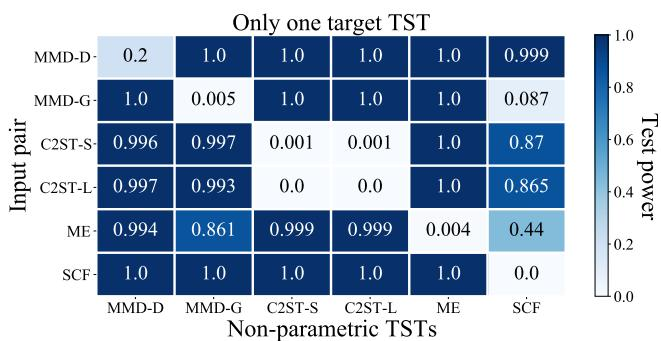  
(a)

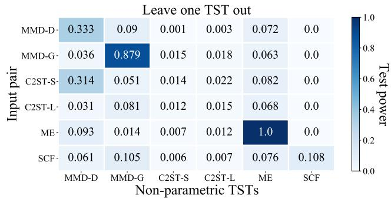  
(b)   
Figure 4. In Figure 4(a), each number represents the test power of the non-parametric TST corresponding to its abscissa on adversarial test pairs generated by the attack against the target TST corresponding to its ordinate. In Figure 4(b), each number represents the test power of the non-parametric TST corresponding to the abscissa on adversarial test pairs generated by the attack against Ensemble except the TST corresponding to its ordinate.

# E.7. Discussions about the Situation When $d$ is Larger

In this section, we discuss the reason for the phenomenon where the test power of Ensemble under EA does not continue to decrease with larger $d$ (e.g., $d > 1 5$ ), which is shown in the upper right of Figure 3. We demonstrate the test power of each particular non-parametric TST and Ensemble under EA with different $d$ in Table 10. Table 10 shows that, with the increasing of $d$ , the test power of most TSTs (e.g., MMD-D, MMD-G) becomes lower. However, the ME test seems to be difficult to be successfully fooled with larger $d$ , especially $d > 1 5$ . We believe that upweighting the test criterion of ME (i.e., enlarging

$w ^ { ( M E ) }$ ) during conducting EA on HDGM with larger $d$ could make EA further hurt the test power of ME and Ensemble.

Table 10. We report the average test power of six typical non-parametric TSTs $\alpha = 0 . 0 5$ ) as well as Ensemble under EA on HDGM with different $d \in \{ 5 , 1 0 , 1 5 , 2 0 , 2 5 \}$ .   

<table><tr><td>d</td><td>MMD-D</td><td>MMD-G</td><td>C2ST-S</td><td>C2ST-L</td><td>ME</td><td>SCF</td><td>Ensemble</td></tr><tr><td>5</td><td>0.289±0.019</td><td>0.613±0.029</td><td>0.123±0.017</td><td>0.597±0.137</td><td>0.885±0.080</td><td>0.297±0.003</td><td>0.983±0.023</td></tr><tr><td>10</td><td>0.259±0.009</td><td>0.081±0.003</td><td>0.105±0.000</td><td>0.090±0.000</td><td>0.500±0.025</td><td>0.006±0.000</td><td>0.734±0.078</td></tr><tr><td>15</td><td>0.094±0.002</td><td>0.063±0.000</td><td>0.079±0.000</td><td>0.086±0.000</td><td>0.655±0.000</td><td>0.003±0.000</td><td>0.665±0.093</td></tr><tr><td>20</td><td>0.008±0.000</td><td>0.014±0.000</td><td>0.067±0.000</td><td>0.051±0.000</td><td>0.696±0.000</td><td>0.006±0.000</td><td>0.765±0.051</td></tr><tr><td>25</td><td>0.000±0.000</td><td>0.000±0.000</td><td>0.009±0.000</td><td>0.000±0.000</td><td>0.762±0.000</td><td>0.000±0.000</td><td>0.707±0.081</td></tr></table>

# E.8. Extensive Experiments about Adversarially Learning Kernels for TSTs

Here, we study a different adversarial learning objective for obtaining robust kernels that minimizes a weighted sum of benign and adversarial loss (Goodfellow et al., 2015; Zhang et al., 2019b), which is formulated as follows.

$$
\hat {\theta} \approx \underset {\theta} {\arg \max } (\beta \cdot \hat {\mathcal {F}} (S _ {\mathbb {P}}, S _ {\mathbb {Q}}; k _ {\theta}) + (1 - \beta) \cdot \hat {\mathcal {F}} (S _ {\mathbb {P}}, \tilde {S} _ {\mathbb {Q}}; k _ {\theta})), \tag {16}
$$

where the adversarial set ${ \tilde { S } } _ { \mathbb { Q } }$ is generated using Eq. (7) and $0 \leq \beta \leq 1$ is a constant. Note that Eq. (8) is a special case of Eq. (16) when we set $\beta = 0$ .

We call non-parametric TSTs with robust deep kernels obtained by Eq. (16) as “MMD-RoD∗”. The training algorithm of MMD-RoD∗ is almost same as Algorithm 2 expect that the Line 6 in Algorithm 2 is replaced with $\theta  \theta + \eta \nabla _ { \theta } ( \beta \cdot$ $\hat { \mathcal { F } } ( S _ { \mathbb { P } } , S _ { \mathbb { Q } } ; k _ { \theta } ) + ( 1 - \beta ) \cdot \hat { \mathcal { F } } ( S _ { \mathbb { P } } , \tilde { S } _ { \mathbb { Q } } ; \overline { { k _ { \theta } } } ) )$ .

We conduct experiments to evaluate the adversarial robustness of MMD-RoD∗. We set $\beta = 0 . 5$ and denote the ensemble of six typical non-parametric TSTs and MMD-RoD∗ as “Ensemble∗”. Other settings of training, attack and testing procedure exactly follow Section 5.2. We report the test power of MMD-RoD∗ and Ensemble∗ in Table 11.

Table 11. Test power of MMD-RoD∗ and Ensemble∗.   

<table><tr><td></td><td>EA</td><td>Blob</td><td>HDGM</td><td>Higgs</td><td>MNIST</td><td>CIFAR-10</td></tr><tr><td rowspan="2">MMD-RoD*</td><td>×</td><td>1.00±0.04</td><td>1.00±0.02</td><td>0.52±0.00</td><td>1.00±0.12</td><td>1.00±0.00</td></tr><tr><td>✓</td><td>0.13±0.06</td><td>0.01±0.00</td><td>0.19±0.02</td><td>0.86±0.00</td><td>0.84±0.01</td></tr><tr><td rowspan="2">Ensemble*</td><td>×</td><td>1.00±0.00</td><td>1.00±0.00</td><td>1.00±0.00</td><td>1.00±0.00</td><td>1.00±0.00</td></tr><tr><td>✓</td><td>0.85±0.01</td><td>0.74±0.02</td><td>0.54±0.04</td><td>0.89±0.00</td><td>0.88±0.00</td></tr></table>

Compared to MMD-RoD (in Table 2), we find MMD-RoD∗ that incorporates benign training pairs into adversarially learning kernels improves the test power in benign settings (especially on HDGM), but obtains the lower test power in adversarial settings among all datasets. Therefore, we recommend utilizing only adversarial training pairs for adversarially learning deep kernels.

# F. Description of Attackers against Non-Parametric TSTs

In this section, we provide a detailed description of the attacker against non-parametric TSTs from four perspectives “goal, knowledge, capability, strategy” (Biggio & Roli, 2018).

• Goal. The attacker aims to make a target non-parametric TST incorrectly judge two sets of data are drawn from the same distribution during the test procedure, when in reality these two sets of data are drawn from different distributions.   
• Knowledge. Depending on the assumptions made on the attacker’s knowledge, we have different attack scenarios.

– Perfect-knowledge white-box attacks. The attacker is assumed to know everything about the target non-parametric TST, such as the target non-parametric TST’s test criterion function and kernel parameters.

– Limited-knowledge gray-box attacks. The attacker has part of the target non-parametric TST’s knowledge. For example, the attacker knows the target non-parametric TST’s test criterion function, but does not know its kernel parameters and training data.

– Zero-knowledge black-box attacks. The attacker does not have any knowledge about the target non-parametric TST. The attacker can only query the non-parametric TST in a black-box manner and then obtain the judgement on the test pairs.

• Capability. The attacker can only manipulate test data, and the malicious perturbations should be human-imperceptible.   
• Strategy. The attacker searches for adversarial sets via minimizing the target non-parametric TST’s test criterion under data manipulation constraints.