# EyePAD++: A Distillation-based approach for joint Eye Authentication and Presentation Attack Detection using Periocular Images

Prithviraj Dhar1, Amit Kumar2, Kirsten Kaplan 2, Khushi Gupta2, Rakesh Ranjan2, Rama Chellappa1 1Johns Hopkins University, 2Reality Labs, Meta

{pdhar1,rchella4}@jhu.edu, {akumar14,kkaplan,khushigupa,rakeshr}@fb.com

# Abstract

A practical eye authentication (EA) system targeted for edge devices needs to perform authentication and be robust to presentation attacks, all while remaining compute and latency efficient. However, existing eye-based frameworks a) perform authentication and Presentation Attack Detection (PAD) independently and b) involve significant pre-processing steps to extract the iris region. Here, we introduce a joint framework for EA and PAD using periocular images. While a deep Multitask Learning (MTL) network can perform both the tasks, MTL suffers from the forgetting effect since the training datasets for EA and PAD are disjoint. To overcome this, we propose Eye Authentication with PAD (EyePAD), a distillation-based method that trains a single network for EA and PAD while reducing the effect of forgetting. To further improve the EA performance, we introduce a novel approach called EyePAD++ that includes training an MTL network on both EA and PAD data, while distilling the ‘versatility’ of the EyePAD network through an additional distillation step. Our proposed methods outperform the SOTA in PAD and obtain near-SOTA performance in eye-to-eye verification, without any pre-processing. We also demonstrate the efficacy of EyePAD and $E y e P A D + +$ in user-to-user verification with PAD across network backbones and image quality.

# 1. Introduction

Eye Authentication (EA) using irises has been widely used for biometric authentication. With the current advancements in head-mounted technology, eye-based authentication is likely to become an essential part of authenticating users against their wearable devices. While highly accurate, EA systems are also vulnerable to ’Presentation Attacks’ (PA) [14, 47]. These attacks seek to fool the authentication system by presenting artificial eye images, such as printed iris images of an individual [5, 16], or cosmetic contacts [21]. While researchers have proposed methods to train networks that achieve SOTA performance in either

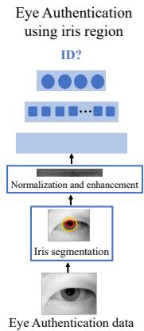

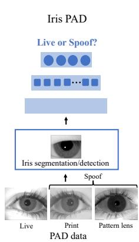

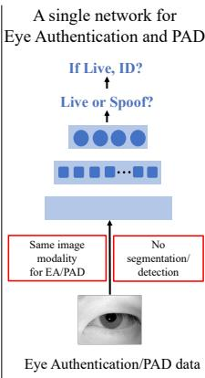  
Figure 1. EA pipelines segment out the iris region from the periocular image and normalize the iris image before feeding it to the network. Segmentation/detection is also used in most PAD pipelines. We train a single network for both EA and PAD without any pre-processing steps, using the entire periocular image.

EA or PAD, a practical eye-based biometric system that can be used on edge devices must be able to perform both of these tasks accurately and simultaneously, with low latency and in an energy efficient manner. Therefore, in this work we propose strategies to develop a single deep network for both EA and PAD using periocular images.

One of the key steps in EA is pre-processing. Most EA frameworks [45, 53] use an auxiliary segmentation network to extract the iris region from the periocular image. The iris is then unwrapped into a rectangular image and is fed to the eye authentication system. This geometric normalization step was first proposed in [7]. Pre-processing is also an important step in iris PAD pipelines that requires another segmentation network [14, 47], or a third party iris detection software [38, 41]. Such pre-processing steps potentially make the EA and PAD pipelines computationally expensive, making it impractical to embed these biometric systems on edge devices with limited computational resources. We investigate and propose techniques to perform EA and PAD using the entire periocular image without any active pre-processing. In doing so, we adhere to our goal of using a single network in a truer sense.

For a given subject, irises of left and right eyes demonstrate different textural patterns. In most of the existing works in EA [45, 53], the CNN models are trained on the left irises for classification. During evaluation, a right iris is verified against the right irises of the same or other subjects. We refer to this evaluation method as ‘eye-to-eye verification’. However, a more practical protocol would be to perform user-to-user verification, i.e. consider both left and right eyes of a given test subject (query user) and verify it against one or more pairs of left-right irises of same or different user (i.e. gallery user). To this end, we propose a new evaluation protocol to match the the left-right pair of a query user with that of a gallery user.

We consider the problem of EA and PAD as a disjoint multitask learning problem because the authentication task presumes real images, which is why the current datasets for EA do not include PAD labels. A possible single-network solution is to train a deep multitask network for both tasks, alternately training the EA and PAD branches with their respective dataset each iteration (as done in [37]). However, several works [18, 22, 27] have shown that Multitask Learning (MTL) frameworks for disjoint tasks demonstrate forgetting effect (see Sec. 3). Hence, we propose two novel knowledge distillation-based techniques called Eye-PAD and EyePAD++ to incrementally learn EA and PAD tasks, while minimizing the forgetting effect. In summary, we make the following contributions in this work:

1. We propose a user-to-user verification protocol that can be used to authenticate one query user against one or many samples of a gallery user. This is more practical than the existing protocol for eye-to-eye verification.   
2. To the best of our knowledge, we are the first to explore the problem of EA and PAD using a single network. We introduce a new metric called Overall False Rejection Rate (OFRR) to evaluate the performance of the entire system (EA and PAD), using only authentication data.   
3. We propose a distillation-based method called Eye Authentication with Presentation Attack Detection (Eye-PAD) for jointly performing EA and PAD. To further improve the verification performance, we propose Eye-$\mathrm { P A D + + }$ . EyePAD++ inherits the versatility of the Eye-PAD network through distillation and combines it with the specificity of multitask learning. EyePAD $^ { + + }$ consistently outperforms the existing baselines for MTL, in terms of OFRR. We show the efficacy of Eye-PAD and EyePAD++ across different network backbones (Densenet121 [20], MobilenetV3 [19] and HRnet64 [44]), and image quality degradation (blur and noise). Additionally, we apply our methods to jointly perform eye-to-eye verification and PAD, following the commonly used train-test protocols. Although the current SOTA approaches use pre-processing, our proposed

Table 1. Pre-processing steps in recent EA/PAD frameworks   

<table><tr><td>Method</td><td>EA</td><td>PAD</td><td>Pre-processing</td></tr><tr><td>IrisCode [29]</td><td>✓</td><td>✗</td><td>Segmentation, geometric normalization</td></tr><tr><td>Ordinal [42]</td><td>✓</td><td>✗</td><td>Segmentation, geometric normalization</td></tr><tr><td>UniNet [53]</td><td>✓</td><td>✗</td><td>Segmentation, geometric normalization</td></tr><tr><td>DRFnet [45]</td><td>✓</td><td>✗</td><td>Segmentation, geometric normalization</td></tr><tr><td>[35]</td><td>✗</td><td>✓</td><td>Segmentation, geometric normalization</td></tr><tr><td>[14]</td><td>✗</td><td>✓</td><td>Segmentation, geometric normalization</td></tr><tr><td>[33]</td><td>✗</td><td>✓</td><td>Cropping</td></tr><tr><td>DensePAD [47]</td><td>✗</td><td>✓</td><td>Segmentation, geometric normalization</td></tr><tr><td>[17]</td><td>✗</td><td>✓</td><td>Segmentation with UIST [38]</td></tr><tr><td>D-net-PAD [41]</td><td>✗</td><td>✓</td><td>Detection with VeriEye</td></tr><tr><td>[3]</td><td>✗</td><td>✓</td><td>Detection with [2]</td></tr><tr><td>PBS, A-PBS [11]</td><td>✗</td><td>✓</td><td>None</td></tr><tr><td>EyePAD (ours)</td><td>✓</td><td>✓</td><td>None</td></tr><tr><td>EyePAD++ (ours)</td><td>✓</td><td>✓</td><td>None</td></tr></table>

methods outperform the existing SOTA in PAD task, and obtain comparable user-to-user verification performance without any pre-processing.

# 2. Related work

Eye authentication using irises: Daugman [6, 7] introduced the first automated system for EA by applying Gabor Filters to the normalized image for generating spatial barcode-like features (IrisCode). More recently, several works have proposed using deep features for EA. [12] proposed DeepIrisNet, the first deep learning-based framework for generalized EA, followed by [13, 32, 43]. [53] presents UniNet, that consists of two components: one for generating discriminative features (FeatNet) and the other for segmenting the iris and non-iris region (MaskNet). Both of these components accept the normalized iris images that also requires segmentation. [45] uses dilated convolution kernels for training CNNs for EA. [51] presents an encoderdecoder pipeline to extract multi-level iris features and use an attention module to combine the multi-level features.

Eye-based Presentation Attack Detection: PAD in periocular images has received significant attention from the deep learning community in the past few years [3, 11, 31, 33, 41, 47]. [25, 46] propose fusing handcrafted and CNN features to detect PA. [10] fuses the features from different layers in a deep network extracted for normalized iris images for PAD. [41, 47] show that DenseNet architecture helps to achieve high PAD accuracy. [17] proposes dividing the iris region into overlapping patches and training CNNs using these patches. [3] introduces an attention guided mechanism to improve PAD accuracy. [11] introduces a binary pixel-wise supervision with self attention to help the network to find patch-based cues and achieve high performance in PAD.

All of the EA algorithms use the normalization process proposed in [7] that requires iris segmentation. Similarly, most PAD algorithms also use auxiliary pre-processing steps such as iris detection/segmentation. A brief summary of

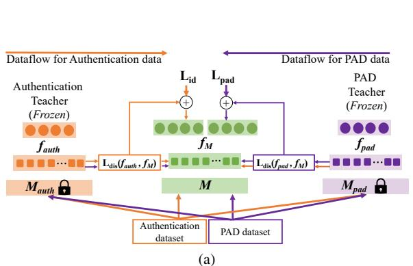

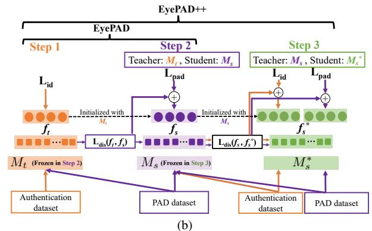  
Figure 2. (a) Baseline: Multitask Learning with multi-teacher distillation (MTMT) [26] (b) Proposed approach Step 1: We train $M _ { t }$ for EA, Step 2 (EyePAD): We initialize $M _ { s }$ using $M _ { t }$ and train it for PAD, while distilling EA information from $M _ { t }$ . (c) Step 3 (EyePAD++): We initialize an MTL network $M _ { s } ^ { * }$ with the trained $M _ { s }$ and train it to perform both EA and PAD, while distilling the ‘versatility’ of $M _ { s }$ . EyePAD $^ { + + }$ outperforms the MTMT [26] baseline in jointly performing EA and PAD in most of the problem settings.

the preprocessing steps in EA and PAD is given in Table 1. Disjoint Multitask Learning and Knowledge Distillation: Disjoint multitask learning (MTL) is the process of training a network to perform multiple tasks using data samples that have labels for either of the tasks, but not for all the tasks. Training a single network for EA and PAD is a disjoint MTL task because EA datasets do not include PAD labels. One solution is to follow the existing disjoint multitask learning strategies [24, 28, 37] and update each branch of the network alternately. However, it is well known [22, 27] that alternating training suffers from the forgetting effect [27] and degrades performance in multitask learning. Knowledge Distillation (KD) [15] has been commonly used to reduce forgetting in continual learning [9, 27, 39, 40, 52]. Inspired by this, [22, 26] employ featurelevel KD for multitasking. In [22], KD is used to distill the information from the network from a previous iteration $i - 1$ that was updated for task A (teacher), while training it to perform task B in the current iteration $i$ (student). However, in this scenario, the teacher network is not fully trained in the initial few iterations and thus the distillation step may not help preserve task A information. Similar to [22], we propose strategies employing feature-level KD for disjoint multitasking (EA and PAD). But, unlike [22], we ensure that the teacher network in our proposed methods is fully trained in one or more tasks.

# 3. Proposed approach

Our objective is to build a single network that is proficient in performing two disjoint tasks: EA and PAD. We intend to build this framework for edge devices with limited on-device compute. Thus, we exclude any pre-processing step for detecting or segmenting the iris region and use the entire periocular image as input. Mutitask Learning (MTL) is a possible approach in this scenario. Most of the MTL methods for disjoint tasks [37] alternately feed the data from different tasks. However, as shown in [22], MTL demonstrates the forgetting effect. Consider an MTL network with

shared backbone and different heads designed to perform two tasks A and B. Suppose that the training batches for task A and B are fed to this MTL network alternately. Here, the weights of the shared backbone modified by the gradients corresponding to the loss for task A in iteration i, may be rewritten in the next iteration $( i + 1 )$ by the gradients corresponding to the loss for task B. This may lead to forgetting of task A.Therefore, instead of MTL, we propose to use knowledge distillation to learn both tasks through a single network. Here, we intend to first train a teacher network $M _ { t }$ for EA, following which we train a student network $M _ { s }$ for PAD, while distilling the authentication information from $M _ { t }$ to $M _ { s }$ to minimize the forgetting effect.

# 3.1. Eye Authentication with Presentation Attack Detection (EyePAD) and EyePAD++

We now explain the steps in our proposed methods: Eye-PAD and EyePAD $^ { + + }$ (Fig. 2b):

Step 1: We train the teacher network $M _ { t }$ using periocular images from the EA dataset to perform EA. Similar to [45], we use triplet loss to train $M _ { t }$ . We first extract features $f _ { i }$ for all the images using the penultimate layer of $M _ { t }$ . To select the $n ^ { t h }$ triplet in a given batch, we randomly select an anchor feature $f _ { a } ^ { ( n ) }$ belonging to category $C$ . After that, we select the hardest positive feature $f _ { p o s } ^ { ( n ) }$ and the hardest negative feature $f _ { n e g } ^ { ( n ) }$ as follows:

$$
f _ {p o s} ^ {(n)} = \operatorname * {a r g m a x} _ {i \in C, i \neq a} (\left\| f _ {i} ^ {(n)} - f _ {a} ^ {(n)} \right\| ^ {2}), f _ {n e g} ^ {(n)} = \operatorname * {a r g m i n} _ {i \notin C} (\left\| f _ {i} ^ {(n)} - f _ {a} ^ {(n)} \right\| ^ {2})
$$

Then we compute the triplet loss $L _ { i d }$ for the entire batch (of size $N$ ) as:

$$
\begin{array}{l} L _ {i d} = \frac {1}{N} \sum_ {n = 1} ^ {n = N} \max  \left(\| f _ {\text {p o s}} ^ {(n)} - f _ {a} ^ {(n)} \| ^ {2} - \| f _ {\text {n e g}} ^ {(n)} - f _ {a} ^ {(n)} \| ^ {2} + \alpha , 0\right) \\ \text {w h e r e} \alpha \text {d e n o t e s t h e d i s t a n c e m a r g i n .} \end{array} \tag {1}
$$

Step 2 (Feature-level knowledge distillation - EyePAD): We initialize a student network $M _ { s }$ using $M _ { t }$ , and train it for PAD. Let $I$ be an image from the PAD dataset. $I$ is fed to

both $M _ { t }$ and $M _ { s }$ , to obtain features $f _ { t }$ and $f _ { s }$ , extracted using the penultimate layer of the corresponding networks. To constrain $M _ { s }$ to process an eye image like $M _ { t }$ , we employ feature-level KD and minimize the cosine distance between $f _ { t }$ and $f _ { s }$ using the proposed distillation loss $L _ { d i s }$ .

$$
L _ {d i s} \left(f _ {s}, f _ {t}\right) = 1 - \frac {f _ {s} \cdot f _ {t}}{\| f _ {s} \| \| f _ {t} \|}. \tag {2}
$$

Our application of feature-level KD is inspired by [40]. Note that we do not apply KD on the output scores as done in [27], since eye-based matching protocols like [45] use the features from the penultimate layer (and not the output score vector). Additionally, we would like $M _ { s }$ to classify a given image as live (also referred to as ‘real’ or ‘bona-fide’) or spoof using $L _ { p a d }$ , which is a standard cross-entropy classification loss. Combining these constraints, we train $M _ { s }$ using the multitask classification loss $L _ { m u l t i }$ as

$$
L _ {\text {m u l t i}} = L _ {\text {p a d}} + \lambda_ {1} L _ {\text {d i s}}, \tag {3}
$$

where $\lambda _ { 1 }$ is used to weight $L _ { d i s }$ . In this step, the teacher $M _ { t }$ remains frozen. To evaluate the verification performance, we use features extracted from the penultimate layer of the trained $M _ { s }$ for the test EA data and perform user-to-user verification. We feed the test PAD data to $M _ { s }$ and evaluate its performance in live/spoof classification. We find that the student network $M _ { s }$ obtained from EyePAD is a versatile network that is effective for both EA and PAD. However, compared to $M _ { t }$ (that was only trained for EA), $M _ { s }$ obtains slightly lower verification performance. We hypothesize that $M _ { s }$ demonstrates this drop in performance because it was never trained for EA. Therefore, we introduce an additional step to train an MTL network (initialized with $M _ { s }$ ) while distilling the versatility of the EyePAD student to this network (Fig. 2b).

Step 3 $\mathbf { ( E y e P A D { + + } }$ ): We initialize a new student network $M _ { s } ^ { * }$ using $M _ { s }$ . $M _ { s } ^ { * }$ is trained for both EA and PAD in an MTL fashion. Following the commonly used strategies for disjoint multitasking [37], the batches from EA and PAD data are alternated after every iteration. To reduce forgetting, we additionally constrain $M _ { s } ^ { * }$ to mimic $M _ { s }$ , which acts as its teacher, using the same knowledge distillation used in step 2. We feed the training image to both $M _ { s }$ and $M _ { s } ^ { * }$ and obtain features $f _ { s }$ and $f _ { s } ^ { * }$ respectively. $M _ { s }$ remains frozen in this step. We use them to compute $L _ { d i s }$ as:

$$
L _ {d i s} \left(f _ {s}, f _ {s} ^ {*}\right) = 1 - \frac {f _ {s} \cdot f _ {s} ^ {*}}{\| f _ {s} \| \| f _ {s} ^ {*} \|}. \tag {4}
$$

When authentication data is fed to $M _ { s } ^ { * }$ (say, during iteration i), we compute Lidmu $i ,$ $L _ { m u l t i } ^ { i d }$ lti as follows:

$$
L _ {\text {m u l t i}} ^ {i d} = L _ {i d} + \lambda_ {2} L _ {\text {d i s}} \tag {5}
$$

Here, $L _ { i d }$ is the triplet loss from Eq. 1. When PAD data is fed to M ∗s (during iteration i + 1), we compute Lpadmult $M _ { s } ^ { * }$ $i + 1$ $L _ { m u l t i } ^ { p a d }$ i as:

$$
L _ {\text {m u l t i}} ^ {\text {p a d}} = L _ {\text {p a d}} + \lambda_ {2} L _ {\text {d i s}} \tag {6}
$$

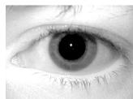  
(a)

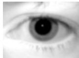  
(b)

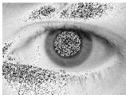  
(c)   
Figure 3. We perform train and test our networks on (a) the original (clean) datasets, (b) their blurred and (c) their noisy versions.

where $L _ { p a d }$ is a standard classification loss used in step 2 of EyePAD. Thus, $L _ { m u l t i } ^ { i d }$ i nd Lpadmult a $L _ { m u l t i } ^ { p a d }$ muli are alternately used to optimize $M _ { s } ^ { * }$ . For inference, we use the trained $M _ { s } ^ { * }$ for user-to-user verification and PAD. Hyperparameter details for EyePAD and EyePAD $^ { + + }$ are provided in the supplementary material.

# 4. Experiments

# 4.1. Baseline methods

Single task networks: To estimate the standard user-touser verification (EA) and PAD performance, we test the ‘EA only’ and ‘PAD only’ networks. The ‘EA only’ network is the teacher network $M _ { t }$ used in Step 1 of EyePAD.

Multitask Learning (MTL): We train a multitask network for EA and PAD by alternately feeding EA and PAD batches (see step 3 of EyePAD $^ { + + }$ ) and alternately optimizing using $L _ { p a d }$ (Sec. 3.1) and $L _ { i d }$ (Eq. 1).

Multi-teacher Multitasking (MTMT) [26]: MTMT [26] is a recently proposed multitask framework that combines MTL with multi-teacher knowledge distillation. MTMT has been shown to outperform MTL and other SOTA multitask methods such as GradNorm [4]. Here, single task networks are first trained in specific tasks. An MTL network $M$ is then trained for multiple tasks, while information from the single task networks is distilled into $M$ . A key difference between MTMT and EyePAD++ is that MTMT enforces distillation from multiple task-specific teachers whereas EyePAD++ includes distillation from a single teacher that is proficient in performing multiple tasks. We implement MTMT as one of our baselines for joint EA and PAD (Fig. 2a). Firstly, we train two single task models: $M _ { a u t h }$ for EA and $M _ { p a d }$ for PAD, and then distill information from them while training a student MTL network $M$ . We use the same feature-level distillation used in EyePAD (Step 2) and EyePAD++. A given image is fed to $M _ { a u t h }$ , $M$ , and $M _ { p a d }$ , generating features from the penultimate layers $f _ { a u t h }$ , $f _ { M }$ and $f _ { p a d }$ , respectively. $L _ { d i s }$ then constrains $f _ { M }$ to be closer to $f _ { a u t h }$ and $f _ { p a d }$ . $M _ { a u t h }$ and $M _ { p a d }$ remain frozen in this step. We alternately feed the training batches for EA and PAD. So, when EA data is forwarded to $M _ { a u t h }$ , $M _ { p a d }$ , M , we optimize $M$ using $L _ { m t m t } ^ { i d }$ .

$$
L _ {m t m t} ^ {i d} = L _ {i d} + \lambda_ {a u t h} L _ {d i s} \left(f _ {a u t h}, f _ {M}\right) + \lambda_ {p a d} L _ {d i s} \left(f _ {p a d}, f _ {M}\right) \tag {7}
$$

Here $L _ { i d }$ is the triplet loss defined in Eq.1. $\lambda _ { a u t h } , \lambda _ { p a d }$ denote the distillation weights from teacher $M _ { a u t h }$ and $M _ { p a d }$ ,

Table 2. Statistics for datasets used for EA with PAD   

<table><tr><td></td><td colspan="2">User-to-user verification (EA)</td><td colspan="2">PAD</td></tr><tr><td></td><td>Data</td><td># images</td><td>Data</td><td># images</td></tr><tr><td>Train</td><td>206 users from ND-Iris-0405</td><td>7949</td><td>Train split of CU-LivDet (2013,2015,2017), ND-LivDet (2013,2015,2017)</td><td>14600</td></tr><tr><td>Test</td><td>150 users from ND-Iris-0405</td><td>4231 (2925 query, 1306 gallery)</td><td>Test split of CU-LivDet (2013,2015,2017)</td><td>7532</td></tr></table>

respectivoptimize $M$ Simusing $L _ { m t m t } ^ { p i d }$ when PAD data is forwarded, we.

$$
L _ {m t m t} ^ {p a d} = L _ {p a d} + \lambda_ {a u t h} L _ {d i s} \left(f _ {a u t h}, f _ {M}\right) + \lambda_ {p a d} L _ {d i s} \left(f _ {p a d}, f _ {M}\right) \tag {8}
$$

Here $L _ { p a d }$ is standard classification loss for live/spoof classification. We provide the hyperparameter information for MTMT [26] in the supplementary material.

# 4.2. Datasets and network architectures used

We summarize the datasets used in our work in Table 2.

EA dataset: We use the ND-Iris-0405 [1, 34] dataset, used widely for eye authentication using irises. The dataset consists of 356 users that are divided into two subsets: $U _ { t r a i n }$ (randomly selected 206 users) and $U _ { t e s t }$ (remaining 150 users). Using the distinct left and right eye images for the users in $U _ { t r a i n }$ gives us 412 $( 2 0 6 \times 2 )$ categories, which we use to train models for EA. For a given user $u$ in $U _ { t e s t }$ , we select 10 left and 10 right eye images to build the query set $q _ { u }$ . Similarly, we select 5 left and 5 right eye images to build the gallery set $g _ { u }$ for user $u$ . Repeating this for all the users in $U _ { t e s t }$ , we obtain the query set $Q \ = \ \{ q _ { u } , \forall u \ \in \ U _ { t e s t } \}$ and gallery set $G = \{ g _ { u } , \forall u \in U _ { t e s t } \}$ . To enable other researchers replicate our experiments, we provide the train and test splits in the supplementary material.

PAD dataset: For PAD training data, we combine the official training splits of CU-LivDet and ND-LivDet from the LivDet challenges in 2013[49], 2015[50], and 2017[48]. We build the PAD test dataset by combining the official test splits of the CU LivDet dataset from the 2013, 2015 and 2017 challenges. CU-LivDet consists of three categories: Live, patterned lens and printed images. ND-LivDet consists of two categories: Live and patterned lens.

Image quality degradation: The datasets we use in this work are academic datasets [1, 48–50] with high quality images (Fig. 3a). However, real-world authentication on edge devices rely on small sensors which capture low-resolution images. Also, environmental conditions like lighting may further degrade the image quality. Therefore, in addition to using the original datasets, we also perform experiments by degrading the datasets (separately): (i) Blur: We add Gaussian blur with a random kernel size between 1 and 5 to the training images, and add blur with kernel size of 5 to the test images (Fig. 3b). (ii) Noise: We add Additive White Gaussian Noise with a standard deviation $\sigma = 3 . 0$ (Fig. 3c).

Protocol 1 User to User verification (1 Query, $K$ Gallery)   
1: Required: Model $M$ , Query dataset $Q$ , Gallery dataset $G$ 2: Initialize: Similarity dictionary $S = []$ 3: Initialize: Left and right Query dictionary $Q_L, Q_R$ 4: for Query user $q_A$ in $Q$ and Gallery user $g_B$ in $G$ do  
5: Left query $q_A^{(L)} \gets \text{RandomSelect}(q_A, 1, \text{Left})$ 6: Right query $q_A^{(R)} \gets \text{RandomSelect}(q_A, 1, \text{Right})$ 7: $g_{B,1}^{(L)}, g_{B,2}^{(L)} \dots g_{B,K}^{(L)} \gets \text{RandomSelect}(g_B, K, \text{Left})$ 8: $g_{B,1}^{(R)}, g_{B,2}^{(R)} \dots g_{B,K}^{(R)} \gets \text{RandomSelect}(g_B, K, \text{Right})$ 9: $Q_L[q_A] = q_A^{(L)}, Q_R[q_A] = q_A^{(R)}$ 10: Left query feature $f_{q_A}^{(L)} = M(q_A^{(L)})$ 11: Right query feature $f_{q_A}^{(R)} = M(q_A^{(R)})$ 12: Left and right gallery features $f_{g_B}^{(L)}, f_{g_B}^{(R)} = \frac{1}{K} \sum_{k=1}^{k=K} M(g_{B,k}^{(L)}, \frac{1}{K} \sum_{k=1}^{k=K} M(g_{B,k}^{(R)})$ 13: Compute similarity $s(q_A, g_B) = \frac{1}{2} (\text{Similarity}(f_{q_A}^{(L)}, f_{g_B}^{(L)}) + \text{Similarity}(f_{q_A}^{(R)}, f_{g_B}^{(R)}))$ 14: $S[q_A, g_B] \gets s(q_A, g_B)$ 15: end for  
16: TAR, FAR, threshold = ROC(S, EA Ground Truth)  
17: $t_{auth} = \text{threshold at FAR} = 10^{-3}$

Networks used: We implement our proposed methods and baselines using the Densenet121 backbone [20]. This is motivated by this architecture repeatedly demonstrating high PAD performance [11, 41, 47]. To demonstrate the generalizability of EyePAD and EyePAD $^ { + + }$ , we repeat our experiments using the HRnet64 [44] and MobilenetV3 [19].

# 4.3. User to user verification protocol

Most experiments in EA [45, 53] train the model on the left irises of all the users and evaluate them in terms of the eyeto-eye verification accuracy for the right irises. However, in a real-world authentication system, the gallery will most likely have both left and right eye images (instead of only right eye images) for an authorized user, and thus both left and right query images can be used for verification. Moreover, it is more practical to authenticate a user using both eyes, as opposed to only the right eye. Hence, we propose matching one pair of left-right eyes (query) to $K$ pairs of left-right eyes (gallery). We provide the detailed user-touser verification protocol in Protocol 1. To match query user A $\left( q _ { A } \right)$ and gallery user B $\left( g _ { B } \right)$ , we first randomly select one left eye and one right eye image from $q _ { A }$ . Then, we select $K$ left eye and $K$ right eye images from $g _ { B }$ . After that, we feed the left and right query images to a model $M$ and compute their respective features $f _ { q _ { A } } ^ { ( L ) } , f _ { q _ { A } } ^ { ( R ) }$ . For gallery user B, we compute the features for the $K$ left eye images using $M$ and average them to compute a single feature $\overset { \cdot } { f } _ { g B } ^ { ( L ) }$ (Line 12 of Protocol 1). In the same way, we compute the average feature $f _ { g _ { B } } ^ { ( R ) }$ by for the right eye gallery

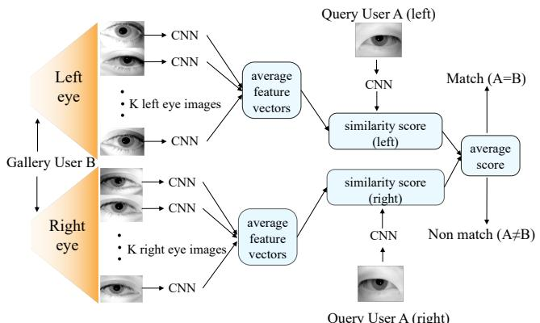  
Figure 4. User-to-user verification: Verifying query user A $( q _ { A } )$ against gallery user B $( g _ { B } )$ with $K$ pairs for gallery user B.

Protocol 2 Computing OFRR   
1: Required: Model $M$ , Query dataset $Q$ , Gallery dataset $G$ 2: Required: Similarity dictionary $S$ from Protocol 1  
3: Required: Query dictionaries $Q_{L}, Q_{R}$ from Protocol 1  
4: Required: Similarity threshold $t_{auth}$ from Protocol 1  
5: Required: PAD threshold $t_{pad}$ for SAR=5%  
6: Initialize: Spoof rejects $X_{spoof} = 0$ , EA rejects $X_{auth} = 0$ 7: for Query user $q_{A}$ , gallery user $g_{A}$ in $Q$ , $G$ do  
8: $q_{A}^{(L)} \gets Q_{L}[q_{A}], q_{A}^{(R)} \gets Q_{R}[q_{A}]$ 9: Left query PAD logit $o_{q_{A}}^{(L)} = M(q_{A}^{(L)})$ 10: Right query PAD logit $o_{q_{A}}^{(R)} = M(q_{A}^{(R)})$ 11: if $o_{q_{A}}^{(L)} > t_{pad}$ or $o_{q_{A}}^{(R)} > t_{pad}$ then  
12: $X_{spoof} = X_{spoof} + 1 //$ falsely rejected as spoof  
13: else  
14: if $S[q_{A}, g_{A}] < t_{auth}$ then  
15: $X_{auth} = X_{auth} + 1 //$ falsely rejected as non-match  
16: end if  
17: end if  
18: end for  
19: Overall false rejection rate $\mathrm{OFRR} = (X_{spoof} + X_{auth}) / |Q|$

image. We then compute the similarity between query user $A$ and gallery user $B$ as :

$$
s \left(q _ {A}, g _ {B}\right) = \frac {1}{2} \left(\frac {f _ {g _ {B}} ^ {(L)} \cdot f _ {q _ {A}} ^ {(L)}}{\| f _ {g _ {B}} ^ {(L)} \| \| f _ {q _ {A}} ^ {(L)} \|} + \frac {f _ {g _ {B}} ^ {(R)} \cdot f _ {q _ {A}} ^ {(R)}}{\| f _ {g _ {B}} ^ {(R)} \| \| f _ {q _ {A}} ^ {(R)} \|}\right) \tag {9}
$$

Based on the similarity threshold, a match/non-match is predicted (Fig. 4).

# 4.4. Metrics for EA and PAD

Performing the similarity computation (Eq. 9) for every possible pairs from $( Q , G )$ and varying the similarity threshold for deciding match/non-match, we compute the ROC curve and report the True Acceptance Rates (TARs) at $\mathrm { F A R = 1 0 ^ { - 4 } }$ $\mathrm { F A R { = } 1 0 ^ { - 4 } , 1 0 ^ { - 3 } , 1 0 ^ { - 2 } }$ . In the biometrics literature [8, 30, 36], it is common to use several gallery samples in authentication. But, for authentication on edge devices, the number of gallery samples that can be used depends on the storage capacity of the edge device. Therefore, for evaluat-

ing the EA performance of a given model, we use one query left-right pair and $K = 1 / 2 / 5$ gallery left-right pair(s) for verification.

PAD performance is evaluated with four commonly used metrics: (i) True Detection Rate (TDR) at a False Detection Rate of 0.002, (ii) Attack Presentation Classifier Error Rate (APCER), that is the fraction of spoof samples misclassified as Live, (iii) Bonafide Presentation Classifier Error Rate (BPCER), that is the fraction of live samples misclassified as spoof, (iv) Half Total Error Rate (HTER), the average of APCER and BPCER. Following the protocol in [48], we use a threshold of 0.5 for computing APCER and BPCER.

While these metrics gauge either the EA or PAD performance, they cannot jointly evaluate PAD and EA. Hence, we define a new metric in the next subsection.

# 4.4.1 Overall False Reject Rate (OFRR)

We evaluate EA performance on the test EA data (ND-Iris-0405) and the PAD performance on the test subset of CU-LivDet datasets from the 2013, 2015 and 2017 challenges. An ideal metric must measure PAD and EA performance simultaneously on a single dataset. Such a metric must measure: How often does the model reject true users from accessing the system? A true user in the EA dataset can be falsely rejected as: (1) ‘Spoof’ by the PAD pipeline, or (2) ‘Non-match’ by the user-to-user verification pipeline. In this regard, we introduce a new metric called Overall False Rejection Rate (OFRR) for true query users in the EA test subset. The steps for computing the OFRR of true users are summarized in Protocol 2. To determine OFRR, we must first set thresholds for the rates at which PAD misclassifies spoof as live (i.e. Spoof Acceptance Rate or SAR) and EA falsely accepts non-match pairs (FAR). The PAD threshold $t _ { p a d }$ is computed as the point where $S A R { = } 5 \%$ when PAD test data is fed to the model. Similarly, when EA test data is fed to the model, the similarity threshold $t _ { a u t h }$ is computed as the point where the user-to-user verification results in $\mathrm { F A R } { = } 1 0 ^ { - 3 }$ . After computing $t _ { p a d }$ and $t _ { a u t h }$ , we feed the EA test data to the model again. We then compute the number of query users falsely rejected as spoof $( X _ { s p o o f } )$ using $t _ { p a d }$ . Here, we reject a query user if at least one of the associated eye images is classified as spoof (Line 12 in Protocol 2). For those query users classified as live, we verify them for EA against matching gallery users, using our user-touser verification protocol (Fig 4). We compute the number of query users that are falsely rejected as non-match $X _ { a u t h }$ using $t _ { a u t h }$ . Finally, we compute the Overall False Reject Rate (OFRR) as

$$
\mathrm {O F R R} = \frac {X _ {\text {s p o o f}} + X _ {\text {a u t h}}}{| Q |} \tag {10}
$$

$| Q | =$ total number of query users in the EA test dataset, which, in our case, is 150 (Sec. 4.2). Ideally, an authentication system for EA and PAD must have a lower OFRR.

Table 3. EA and PAD with Densenet121 trained and evaluated on (top) original, (middle) blurred, (bottom) Noisy data: For user-touser verification, we report $\Gamma \mathrm { A R } @ \mathrm { F A R } { = } 1 0 ^ { - 4 }$ , $1 0 ^ { - 3 }$ , $1 0 ^ { - 2 }$ . For PAD, we report TDR@FDR=0.002 and APCER, BPCER, HTER. OFRR jointly measures EA and PAD performance on ND-Iris-0405. EyePAD++ obtains the lowest OFRR. Bold: Best, Underlined: Second best   

<table><tr><td></td><td colspan="12">User-to-user verification results on ND-Iris-0405 (EA)</td><td colspan="4">PAD results on CU-LivDet</td></tr><tr><td></td><td colspan="4">1 Query 1 Gallery</td><td colspan="4">1 Query 2 Gallery</td><td colspan="4">1 Query 5 Gallery</td><td colspan="4"></td></tr><tr><td>Method</td><td>OFRR(↓)</td><td>10-4</td><td>10-3</td><td>10-2</td><td>OFRR(↓)</td><td>10-4</td><td>10-3</td><td>10-2</td><td>OFRR(↓)</td><td>10-4</td><td>10-3</td><td>10-2</td><td>TDR(↑)</td><td>APCER</td><td>BPCER</td><td>HTER(↓)</td></tr><tr><td>EA only</td><td>-</td><td>0.886</td><td>0.958</td><td>0.996</td><td>-</td><td>0.891</td><td>0.954</td><td>0.994</td><td>-</td><td>0.921</td><td>0.979</td><td>0.997</td><td>-</td><td>-</td><td>-</td><td>-</td></tr><tr><td>PAD only</td><td>-</td><td>-</td><td>-</td><td>-</td><td>-</td><td>-</td><td>-</td><td>-</td><td>-</td><td>-</td><td>-</td><td>-</td><td>0.971</td><td>0.026</td><td>0.003</td><td>0.015</td></tr><tr><td>MTL</td><td>0.100</td><td>0.693</td><td>0.905</td><td>0.988</td><td>0.074</td><td>0.803</td><td>0.943</td><td>0.986</td><td>0.052</td><td>0.850</td><td>0.956</td><td>0.990</td><td>0.950</td><td>0.036</td><td>0.004</td><td>0.020</td></tr><tr><td>MTMT [26]</td><td>0.087</td><td>0.919</td><td>0.963</td><td>0.992</td><td>0.068</td><td>0.872</td><td>0.950</td><td>0.989</td><td>0.052</td><td>0.816</td><td>0.923</td><td>0.986</td><td>0.945</td><td>0.051</td><td>0.003</td><td>0.027</td></tr><tr><td>EyePAD</td><td>0.079</td><td>0.843</td><td>0.926</td><td>0.993</td><td>0.046</td><td>0.887</td><td>0.961</td><td>0.997</td><td>0.060</td><td>0.922</td><td>0.952</td><td>0.995</td><td>0.947</td><td>0.036</td><td>0.014</td><td>0.025</td></tr><tr><td>EyePAD++</td><td>0.072</td><td>0.901</td><td>0.952</td><td>0.990</td><td>0.055</td><td>0.906</td><td>0.966</td><td>0.997</td><td>0.043</td><td>0.929</td><td>0.983</td><td>0.996</td><td>0.951</td><td>0.034</td><td>0.012</td><td>0.023</td></tr><tr><td>EA only</td><td>-</td><td>0.832</td><td>0.916</td><td>0.979</td><td>-</td><td>0.867</td><td>0.943</td><td>0.985</td><td>-</td><td>0.909</td><td>0.966</td><td>0.992</td><td>-</td><td>-</td><td>-</td><td>-</td></tr><tr><td>PAD only</td><td>-</td><td>-</td><td>-</td><td>-</td><td>-</td><td>-</td><td>-</td><td>-</td><td>-</td><td>-</td><td>-</td><td>-</td><td>0.844</td><td>0.073</td><td>0.032</td><td>0.053</td></tr><tr><td>MTL</td><td>0.244</td><td>0.745</td><td>0.871</td><td>0.974</td><td>0.209</td><td>0.801</td><td>0.910</td><td>0.989</td><td>0.199</td><td>0.834</td><td>0.930</td><td>0.994</td><td>0.702</td><td>0.136</td><td>0.034</td><td>0.085</td></tr><tr><td>MTMT [26]</td><td>0.236</td><td>0.753</td><td>0.894</td><td>0.974</td><td>0.213</td><td>0.841</td><td>0.921</td><td>0.986</td><td>0.189</td><td>0.822</td><td>0.946</td><td>0.993</td><td>0.576</td><td>0.047</td><td>0.095</td><td>0.071</td></tr><tr><td>EyePAD</td><td>0.231</td><td>0.757</td><td>0.876</td><td>0.979</td><td>0.204</td><td>0.796</td><td>0.933</td><td>0.974</td><td>0.196</td><td>0.813</td><td>0.949</td><td>0.987</td><td>0.738</td><td>0.129</td><td>0.024</td><td>0.077</td></tr><tr><td>EyePAD++</td><td>0.201</td><td>0.830</td><td>0.916</td><td>0.988</td><td>0.188</td><td>0.854</td><td>0.947</td><td>0.986</td><td>0.192</td><td>0.889</td><td>0.944</td><td>0.987</td><td>0.693</td><td>0.137</td><td>0.029</td><td>0.083</td></tr><tr><td>EA only</td><td>-</td><td>0.760</td><td>0.901</td><td>0.980</td><td>-</td><td>0.860</td><td>0.929</td><td>0.984</td><td>-</td><td>0.897</td><td>0.958</td><td>0.992</td><td>-</td><td>-</td><td>-</td><td>-</td></tr><tr><td>PAD only</td><td>-</td><td>-</td><td>-</td><td>-</td><td>-</td><td>-</td><td>-</td><td>-</td><td>-</td><td>-</td><td>-</td><td>-</td><td>0.918</td><td>0.063</td><td>0.004</td><td>0.034</td></tr><tr><td>MTL</td><td>0.184</td><td>0.768</td><td>0.891</td><td>0.981</td><td>0.170</td><td>0.819</td><td>0.927</td><td>0.993</td><td>0.152</td><td>0.865</td><td>0.956</td><td>0.993</td><td>0.879</td><td>0.082</td><td>0.011</td><td>0.046</td></tr><tr><td>MTMT [26]</td><td>0.168</td><td>0.777</td><td>0.891</td><td>0.979</td><td>0.144</td><td>0.851</td><td>0.927</td><td>0.990</td><td>0.105</td><td>0.869</td><td>0.961</td><td>0.993</td><td>0.883</td><td>0.104</td><td>0.009</td><td>0.057</td></tr><tr><td>EyePAD</td><td>0.162</td><td>0.718</td><td>0.852</td><td>0.976</td><td>0.128</td><td>0.757</td><td>0.891</td><td>0.984</td><td>0.094</td><td>0.824</td><td>0.922</td><td>0.991</td><td>0.931</td><td>0.058</td><td>0.005</td><td>0.032</td></tr><tr><td>EyePAD++</td><td>0.144</td><td>0.777</td><td>0.882</td><td>0.979</td><td>0.111</td><td>0.797</td><td>0.919</td><td>0.983</td><td>0.082</td><td>0.878</td><td>0.948</td><td>0.991</td><td>0.926</td><td>0.065</td><td>0.007</td><td>0.036</td></tr></table>

Table 4. EA and PAD with HRnet64, trained and evaluated on the (top) original, (middle) blurred, (bottom) noisy (AWGN $\sigma { = } 3 . 0$ ) data: For user-to-user verification, we report $\scriptstyle \mathrm { T A R } @ \mathrm { F A R } = 1 0 ^ { - 4 }$ , $1 0 ^ { - 3 }$ , $1 0 ^ { - 2 }$ . For PAD, we report T $\mathrm { \Delta T R } @ \mathrm { \mathrm { F D R } } { = } 0 . 0 0 2$ and HTER. EyePAD++ generally obtains the lowest OFRR. Bold: Best, Underlined: Second best. Results with 1 and 2 gallery pairs are provided in the supplementary material.   

<table><tr><td></td><td colspan="4">EA</td><td colspan="2">PAD</td></tr><tr><td></td><td colspan="4">1 Query 5 Gallery</td><td colspan="2"></td></tr><tr><td>Method</td><td>OFRR(↓)</td><td>10-4</td><td>10-3</td><td>10-2</td><td>TDR(↑)</td><td>HTER(↓)</td></tr><tr><td>EA only</td><td>-</td><td>0.919</td><td>0.983</td><td>0.996</td><td>-</td><td>-</td></tr><tr><td>PAD only</td><td>-</td><td>-</td><td>-</td><td>-</td><td>0.962</td><td>0.026</td></tr><tr><td>MTL</td><td>0.113</td><td>0.815</td><td>0.930</td><td>0.977</td><td>0.921</td><td>0.029</td></tr><tr><td>MTMT [26]</td><td>0.068</td><td>0.891</td><td>0.945</td><td>0.984</td><td>0.959</td><td>0.017</td></tr><tr><td>EyePAD</td><td>0.034</td><td>0.898</td><td>0.968</td><td>0.995</td><td>0.934</td><td>0.029</td></tr><tr><td>EyePAD++</td><td>0.031</td><td>0.926</td><td>0.976</td><td>0.997</td><td>0.915</td><td>0.031</td></tr><tr><td>EA only</td><td>-</td><td>0.911</td><td>0.968</td><td>0.992</td><td>-</td><td>-</td></tr><tr><td>PAD only</td><td>-</td><td>-</td><td>-</td><td>-</td><td>0.801</td><td>0.058</td></tr><tr><td>MTL</td><td>0.293</td><td>0.638</td><td>0.801</td><td>0.924</td><td>0.737</td><td>0.186</td></tr><tr><td>MTMT [26]</td><td>0.129</td><td>0.904</td><td>0.963</td><td>0.994</td><td>0.646</td><td>0.086</td></tr><tr><td>EyePAD</td><td>0.132</td><td>0.902</td><td>0.960</td><td>0.993</td><td>0.766</td><td>0.062</td></tr><tr><td>EyePAD++</td><td>0.118</td><td>0.915</td><td>0.971</td><td>0.989</td><td>0.655</td><td>0.067</td></tr><tr><td>EA only</td><td>-</td><td>0.837</td><td>0.952</td><td>0.992</td><td>-</td><td>-</td></tr><tr><td>PAD only</td><td>-</td><td>-</td><td>-</td><td>-</td><td>0.942</td><td>0.029</td></tr><tr><td>MTL</td><td>0.236</td><td>0.587</td><td>0.787</td><td>0.940</td><td>0.899</td><td>0.045</td></tr><tr><td>MTMT [26]</td><td>0.114</td><td>0.824</td><td>0.916</td><td>0.975</td><td>0.894</td><td>0.034</td></tr><tr><td>EyePAD</td><td>0.091</td><td>0.800</td><td>0.916</td><td>0.986</td><td>0.914</td><td>0.033</td></tr><tr><td>EyePAD++</td><td>0.093</td><td>0.840</td><td>0.937</td><td>0.989</td><td>0.887</td><td>0.036</td></tr></table>

The user-to user verification and OFRR protocols are run consecutively, and depend on random samples of left and right images of query and gallery users as shown in Protocols 1 (Lines 5,6,7,8) and 2 (Lines 2, 3). Hence, we compute these metrics ten times and report the average.

Table 5. EA and PAD with MobilenetV3, trained and evaluated on the (top) original, (middle) blurred, (bottom) noisy (AWGN $\sigma { = } 3 . 0$ ) data: For user-to-user verification, we report $\mathrm { T A R } @ \mathrm { F A R } = 1 0 ^ { - 4 }$ , $1 0 ^ { - 3 }$ , $1 0 ^ { - 2 }$ . For PAD, we report T $\operatorname { D R } @ \operatorname { F D R } = 0 . 0 0 2$ and HTER. EyePAD++ generally obtains the lowest OFRR. Bold: Best, Underlined: Second best. Results with 1 and 2 gallery pairs are provided in the supplementary material.   

<table><tr><td></td><td colspan="4">EA</td><td colspan="2">PAD</td></tr><tr><td></td><td colspan="4">1 Query 5 Gallery</td><td colspan="2"></td></tr><tr><td>Method</td><td>OFRR(↓)</td><td>10-4</td><td>10-3</td><td>10-2</td><td>TDR(↑)</td><td>HTER(↓)</td></tr><tr><td>EA only</td><td>-</td><td>0.898</td><td>0.952</td><td>0.995</td><td>-</td><td>-</td></tr><tr><td>PAD only</td><td>-</td><td>-</td><td>-</td><td>-</td><td>0.925</td><td>0.029</td></tr><tr><td>MTL</td><td>0.110</td><td>0.872</td><td>0.933</td><td>0.985</td><td>0.884</td><td>0.039</td></tr><tr><td>MTMT [26]</td><td>0.126</td><td>0.859</td><td>0.933</td><td>0.987</td><td>0.793</td><td>0.042</td></tr><tr><td>EyePAD</td><td>0.114</td><td>0.887</td><td>0.947</td><td>0.991</td><td>0.859</td><td>0.040</td></tr><tr><td>EyePAD++</td><td>0.085</td><td>0.901</td><td>0.962</td><td>0.990</td><td>0.883</td><td>0.032</td></tr><tr><td>EA only</td><td>-</td><td>0.846</td><td>0.921</td><td>0.989</td><td>-</td><td>-</td></tr><tr><td>PAD only</td><td>-</td><td>-</td><td>-</td><td>-</td><td>0.581</td><td>0.117</td></tr><tr><td>MTL</td><td>0.483</td><td>0.744</td><td>0.855</td><td>0.942</td><td>0.556</td><td>0.128</td></tr><tr><td>MTMT [26]</td><td>0.464</td><td>0.769</td><td>0.913</td><td>0.963</td><td>0.502</td><td>0.137</td></tr><tr><td>EyePAD</td><td>0.447</td><td>0.711</td><td>0.866</td><td>0.956</td><td>0.589</td><td>0.121</td></tr><tr><td>EyePAD++</td><td>0.332</td><td>0.861</td><td>0.938</td><td>0.983</td><td>0.552</td><td>0.133</td></tr><tr><td>EA only</td><td>-</td><td>0.817</td><td>0.944</td><td>0.985</td><td>-</td><td>-</td></tr><tr><td>PAD only</td><td>-</td><td>-</td><td>-</td><td>-</td><td>0.831</td><td>0.041</td></tr><tr><td>MTL</td><td>0.173</td><td>0.761</td><td>0.908</td><td>0.974</td><td>0.762</td><td>0.064</td></tr><tr><td>MTMT [26]</td><td>0.162</td><td>0.777</td><td>0.906</td><td>0.977</td><td>0.730</td><td>0.059</td></tr><tr><td>EyePAD</td><td>0.209</td><td>0.801</td><td>0.927</td><td>0.980</td><td>0.712</td><td>0.065</td></tr><tr><td>EyePAD++</td><td>0.137</td><td>0.811</td><td>0.912</td><td>0.990</td><td>0.730</td><td>0.080</td></tr></table>

# 4.5. Results

EA and PAD with Densenet backbone: We perform the EA and PAD experiments using the Densenet121 backbone for the original datasets and degraded datasets (Table 3). EyePA $\Pi { + + }$ obtains the lowest OFRR in most

of the the problem settings. Moreover, EyePAD++ obtains higher user-to-user verification performance than existing multitasking baselines at most FARs. This demonstrates the advantage of the additional distillation step combined with MTL. The PAD performance demonstrated by EyePAD++ is also comparable to that of other multitasking baselines.

# EA and PAD with HRnet64 and MobilenetV3 backbone:

To demonstrate the generalizability of our proposed methods, we repeat the same experiments with the HRnet64[44] backbone (Table 4). However, training a Densenet or HRnet64 model is computationally expensive. So, we also perform the same experiment with the MobilenetV3 [19] backbone, that is much more computationally efficient than Densenet (Table 5). More detailed results with 1 or 2 gallery pairs are provided in the supplementary material. Once again we find that $E y e P A D + +$ obtains lower OFRR than MTL and MTMT[26]. The superiority of EyePAD++ with MobilenetV3 indicates that $_ \mathrm { E y e P A D + + }$ can be used for performing EA and PAD on compute engines with low capacity that are available on edge devices.

Eye-to-eye verification with PAD: To compare our proposed methods with current SOTA in PAD and EA, we perform eye-to-eye verification with PAD. Here, for EA, we follow [45, 53] and use the first 25 left eye images of every user in the ND-Iris-0405 dataset [1] for training. We use the first 10 right eye images of the users for testing. For evaluating EA, we use the same eye-to-eye verification in [45, 53]. For PAD, we follow [11, 41] and only use the official train and test split of the CU-LivDet-2017 dataset. We perform this experiment with Densenet121. While training and testing our methods and baselines (Sec. 4.1), we exclude preprocessing. Fig. 5 shows the ROC curves for EA and PAD obtained by all the methods. From Table 6, we infer that EyePAD and $E y e P A D + +$ achieve better PAD performance (i.e. TDR @ FDR=0.002) than the current SOTA PAD algorithms, without any pre-processing. Moreover, $E y e P A D + +$ achieves higher EA performance (TAR at $F A R { = } 1 0 ^ { - 3 }$ ) than the comparable baselines (i.e. EA only network, MTL and MTMT). The EA performance for EyePAD and EyePAD $^ { + + }$ is comparable to but slightly lower than that of the SOTA [45, 53], with a difference of less than $4 \%$ . We believe that this is difference is due to excluding pre-processing steps for limiting computational cost.

EyePAD++ v/s MTMT [26]: Both EyePAD $^ { + + }$ and MTMT combine MTL with feature-level KD. However, the student MTL network in MTMT does not inherit the ‘versatility’ through distillation since its teachers are single-task models that are not versatile. On the other hand, EyePAD $^ { + + }$ uses distillation from a single versatile teacher $( M _ { s } )$ , that is proficient in both the tasks. As a result, the student network

Table 6. Eye-to-eye verification $\mathrm { T A R } @ \mathrm { F A R } = 1 0 ^ { - 3 }$ and Equal Error Rate) and PAD performance $\mathrm { T D R } @ \mathrm { F D R } { = } 0 . 0 0 2$ ). $^ \dag =$ Use preprocessing (Segmentation/detection)   

<table><tr><td></td><td colspan="2">EA</td><td colspan="4">PAD</td></tr><tr><td>Method</td><td>TAR(↑)</td><td>EER</td><td>TDR(↑)</td><td>APCER</td><td>BPCER</td><td>HTER</td></tr><tr><td>IrisCode† [29]</td><td>0.967</td><td>1.88</td><td>-</td><td>-</td><td>-</td><td>-</td></tr><tr><td>Ordinal† [42]</td><td>0.968</td><td>1.74</td><td>-</td><td>-</td><td>-</td><td>-</td></tr><tr><td>UniNet† [53]</td><td>0.971</td><td>1.40</td><td>-</td><td>-</td><td>-</td><td>-</td></tr><tr><td>DRFnet† [45]</td><td>0.977</td><td>1.30</td><td>-</td><td>-</td><td>-</td><td>-</td></tr><tr><td>Winner of [48]†</td><td>-</td><td>-</td><td>-</td><td>13.39</td><td>0.89</td><td>7.10</td></tr><tr><td>SpoofNet† [23]</td><td>-</td><td>-</td><td>-</td><td>33.00</td><td>0.00</td><td>16.50</td></tr><tr><td>Meta-fusion† [25]</td><td>-</td><td>-</td><td>-</td><td>18.66</td><td>0.24</td><td>9.45</td></tr><tr><td>D-net-PAD† [41]</td><td>-</td><td>-</td><td>92.05</td><td>5.78</td><td>0.94</td><td>3.36</td></tr><tr><td>PBS [11]</td><td>-</td><td>-</td><td>94.02</td><td>8.97</td><td>0.0</td><td>4.48</td></tr><tr><td>A-PBS [11]</td><td>-</td><td>-</td><td>92.35</td><td>6.16</td><td>0.81</td><td>3.48</td></tr><tr><td>EA only</td><td>0.936</td><td>1.48</td><td>-</td><td>-</td><td>-</td><td>-</td></tr><tr><td>PAD only</td><td>-</td><td>-</td><td>94.02</td><td>5.96</td><td>0.02</td><td>2.99</td></tr><tr><td>MTL</td><td>0.891</td><td>1.88</td><td>92.70</td><td>9.03</td><td>0.00</td><td>4.52</td></tr><tr><td>MTMT [26]</td><td>0.933</td><td>1.54</td><td>95.51</td><td>7.54</td><td>0.00</td><td>3.77</td></tr><tr><td>EyePAD</td><td>0.898</td><td>1.89</td><td>96.29</td><td>5.68</td><td>0.00</td><td>2.84</td></tr><tr><td>EyePAD++</td><td>0.941</td><td>1.30</td><td>95.99</td><td>7.29</td><td>0.00</td><td>3.65</td></tr></table>

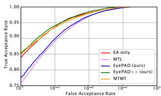  
(a) Eye-to-eye verification

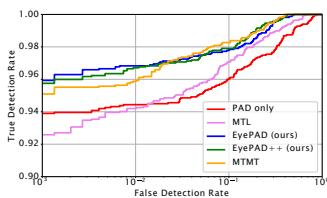  
(b) PAD   
Figure 5. ROC curves for (a)EA performance on ND-Iris-0405 (b) PAD performance on CU-LivDet

$M _ { s } ^ { * }$ in EyePAD $^ { + + }$ inherits the versatility of its teacher network $M _ { s }$ through distillation. This enables EyePAD $^ { + + }$ t o outperform [26] in almost all of problem settings (Tables 3,4,5,6). Thus, for training an MTL network with distillation, we show that using a single teacher proficient in both the tasks is better than using two teachers proficient in single tasks in our disjoint multitasking problem.

# 5. Conclusion

In this work, we propose two knowledge distillation-based frameworks: EyePAD and EyePAD $^ { + + }$ for joint EA and PAD tasks. For evaluating EA, we present a new userto-user verification protocol and introduce a new metric to jointly measure user-to-user verification and PAD. Our proposed methods outperform the existing baselines (MTL and MTMT) in most of the problem settings. We evaluate our methods using different network backbones and multiple image quality degradation. Additionally, we evaluate our methods to perform eye-to-eye verification with PAD (following previous work). Although we do not use any preprocessing, EyePAD and EyePAD++ outperform the SOTA in PAD and obtain eye-to-eye verification performance that is comparable to SOTA EA algorithms.

# Acknowledgement

This work was done when the first author was an intern at Meta. This research is partially supported by a MURI from the Army Research Office under the Grant No. W911NF-17-1-0304. This is part of the collaboration between US DOD, UK MOD and UK Engineering and Physical Research Council (EPSRC) under the Multidisciplinary University Research Initiative.

# References

[1] Kevin W Bowyer and Patrick J Flynn. The ND-IRIS-0405 iris image dataset. arXiv preprint arXiv:1606.04853, 2016. 5, 8, 11   
[2] Cunjian Chen and Arun Ross. A multi-task convolutional neural network for joint iris detection and presentation attack detection. In 2018 IEEE Winter Applications of Computer Vision Workshops (WACVW), pages 44–51. IEEE, 2018. 2   
[3] Cunjian Chen and Arun Ross. An explainable attentionguided iris presentation attack detector. In WACV (Workshops), pages 97–106, 2021. 2   
[4] Zhao Chen, Vijay Badrinarayanan, Chen-Yu Lee, and Andrew Rabinovich. Gradnorm: Gradient normalization for adaptive loss balancing in deep multitask networks. In International Conference on Machine Learning, pages 794–803. PMLR, 2018. 4   
[5] Adam Czajka. Database of iris printouts and its application: Development of liveness detection method for iris recognition. In 2013 18th International Conference on Methods & Models in Automation & Robotics (MMAR), pages 28–33. IEEE, 2013. 1   
[6] John Daugman. How iris recognition works. In The essential guide to image processing, pages 715–739. Elsevier, 2009. 2   
[7] John G Daugman. High confidence visual recognition of persons by a test of statistical independence. IEEE transactions on pattern analysis and machine intelligence, 15(11):1148– 1161, 1993. 1, 2   
[8] P Dhar, C Castillo, and R Chellappa. On measuring the iconicity of a face. In 2019 IEEE Winter Conference on Applications of Computer Vision (WACV), pages 2137–2145. IEEE, 2019. 6   
[9] Prithviraj Dhar, Rajat Vikram Singh, Kuan-Chuan Peng, Ziyan Wu, and Rama Chellappa. Learning without memorizing. In Proceedings of the IEEE/CVF Conference on Computer Vision and Pattern Recognition, pages 5138–5146, 2019. 3   
[10] Meiling Fang, Naser Damer, Fadi Boutros, Florian Kirchbuchner, and Arjan Kuijper. Deep learning multi-layer fusion for an accurate iris presentation attack detection. In 2020 IEEE 23rd International Conference on Information Fusion (FUSION), pages 1–8. IEEE, 2020. 2   
[11] Meiling Fang, Naser Damer, Fadi Boutros, Florian Kirchbuchner, and Arjan Kuijper. Iris presentation attack detection by attention-based and deep pixel-wise binary supervision network. In 2021 IEEE International Joint Conference on Biometrics (IJCB), pages 1–8. IEEE, 2021. 2, 5, 8   
[12] Abhishek Gangwar and Akanksha Joshi. Deepirisnet: Deep iris representation with applications in iris recognition and

cross-sensor iris recognition. In 2016 IEEE international conference on image processing (ICIP), pages 2301–2305. IEEE, 2016. 2   
[13] Fei He, Ye Han, Han Wang, Jinchao Ji, Yuanning Liu, and Zhiqiang Ma. Deep learning architecture for iris recognition based on optimal gabor filters and deep belief network. Journal of Electronic Imaging, 26(2):023005, 2017. 2   
[14] Lingxiao He, Haiqing Li, Fei Liu, Nianfeng Liu, Zhenan Sun, and Zhaofeng He. Multi-patch convolution neural network for iris liveness detection. In 2016 IEEE 8th International Conference on Biometrics Theory, Applications and Systems (BTAS), pages 1–7. IEEE, 2016. 1, 2   
[15] Geoffrey Hinton, Oriol Vinyals, and Jeffrey Dean. Distilling the knowledge in a neural network. In NIPS Deep Learning and Representation Learning Workshop, 2015. 3   
[16] Steven Hoffman, Renu Sharma, and Arun Ross. Convolutional neural networks for iris presentation attack detection: Toward cross-dataset and cross-sensor generalization. In Proceedings of the IEEE Conference on Computer Vision and Pattern Recognition Workshops, pages 1620–1628, 2018. 1   
[17] Steven Hoffman, Renu Sharma, and Arun Ross. Iris $^ +$ ocular: Generalized iris presentation attack detection using multiple convolutional neural networks. In 2019 International Conference on Biometrics (ICB), pages 1–8. IEEE, 2019. 2   
[18] Yan Hong, Li Niu, Jianfu Zhang, and Liqing Zhang. Beyond without forgetting: Multi-task learning for classification with disjoint datasets. In 2020 IEEE International Conference on Multimedia and Expo (ICME), pages 1–6. IEEE, 2020. 2   
[19] Andrew Howard, Mark Sandler, Grace Chu, Liang-Chieh Chen, Bo Chen, Mingxing Tan, Weijun Wang, Yukun Zhu, Ruoming Pang, Vijay Vasudevan, et al. Searching for mobilenetv3. In Proceedings of the IEEE/CVF International Conference on Computer Vision, pages 1314–1324, 2019. 2, 5, 8, 12   
[20] Gao Huang, Zhuang Liu, Laurens Van Der Maaten, and Kilian Q Weinberger. Densely connected convolutional networks. In Proceedings of the IEEE conference on computer vision and pattern recognition, pages 4700–4708, 2017. 2, 5   
[21] Ken Hughes and Kevin W Bowyer. Detection of contactlens-based iris biometric spoofs using stereo imaging. In 2013 46th Hawaii International Conference on System Sciences, pages 1763–1772. IEEE, 2013. 1   
[22] Dong-Jin Kim, Jinsoo Choi, Tae-Hyun Oh, Youngjin Yoon, and In So Kweon. Disjoint multi-task learning between heterogeneous human-centric tasks. In 2018 IEEE Winter Conference on Applications of Computer Vision (WACV), pages 1699–1708. IEEE, 2018. 2, 3   
[23] Gabriela Y Kimura, Diego R Lucio, Alceu S Britto Jr, and David Menotti. Cnn hyperparameter tuning applied to iris liveness detection. arXiv preprint arXiv:2003.00833, 2020. 8   
[24] Iasonas Kokkinos. Ubernet: Training a universal convolutional neural network for low-, mid-, and high-level vision using diverse datasets and limited memory. In Proceedings of the IEEE conference on computer vision and pattern recognition, pages 6129–6138, 2017. 3   
[25] Andrey Kuehlkamp, Allan Pinto, Anderson Rocha, Kevin W Bowyer, and Adam Czajka. Ensemble of multi-view learning

classifiers for cross-domain iris presentation attack detection. IEEE Transactions on Information Forensics and Security, 14(6):1419–1431, 2018. 2, 8   
[26] Wei-Hong Li and Hakan Bilen. Knowledge distillation for multi-task learning. In European Conference on Computer Vision, pages 163–176. Springer, 2020. 3, 4, 5, 7, 8, 12, 13   
[27] Zhizhong Li and Derek Hoiem. Learning without forgetting. IEEE transactions on pattern analysis and machine intelligence, 40(12):2935–2947, 2017. 2, 3, 4   
[28] An-An Liu, Yu-Ting Su, Wei-Zhi Nie, and Mohan Kankanhalli. Hierarchical clustering multi-task learning for joint human action grouping and recognition. IEEE transactions on pattern analysis and machine intelligence, 39(1):102–114, 2016. 3   
[29] Libor Masek et al. Recognition of human iris patterns for biometric identification. PhD thesis, Citeseer, 2003. 2, 8   
[30] B Maze, J Adams, J A Duncan, N Kalka, T Miller, C Otto, A K Jain, W T Niggel, J Anderson, J Cheney, et al. IARPA janus benchmark-c: Face dataset and protocol. In 2018 International Conference on Biometrics (ICB), pages 158–165. IEEE, 2018. 6   
[31] David Menotti, Giovani Chiachia, Allan Pinto, William Robson Schwartz, Helio Pedrini, Alexandre Xavier Falcao, and Anderson Rocha. Deep representations for iris, face, and fingerprint spoofing detection. IEEE Transactions on Information Forensics and Security, 10(4):864–879, 2015. 2   
[32] Kien Nguyen, Clinton Fookes, Arun Ross, and Sridha Sridharan. Iris recognition with off-the-shelf cnn features: A deep learning perspective. IEEE Access, 6:18848–18855, 2017. 2   
[33] Federico Pala and Bir Bhanu. Iris liveness detection by relative distance comparisons. In Proceedings of the IEEE Conference on Computer Vision and Pattern Recognition Workshops, pages 162–169, 2017. 2   
[34] P Jonathon Phillips, W Todd Scruggs, Alice J O’Toole, Patrick J Flynn, Kevin W Bowyer, Cathy L Schott, and Matthew Sharpe. Frvt 2006 and ice 2006 large-scale experimental results. IEEE transactions on pattern analysis and machine intelligence, 32(5):831–846, 2009. 5   
[35] Ramachandra Raghavendra, Kiran B Raja, and Christoph Busch. Contlensnet: Robust iris contact lens detection using deep convolutional neural networks. In 2017 IEEE Winter Conference on Applications of Computer Vision (WACV), pages 1160–1167. IEEE, 2017. 2   
[36] R Ranjan, A Bansal, J Zheng, H Xu, J Gleason, B Lu, A Nanduri, J-C Chen, C D Castillo, and R Chellappa. A fast and accurate system for face detection, identification, and verification. IEEE Transactions on Biometrics, Behavior, and Identity Science, 1(2):82–96, 2019. 6   
[37] R Ranjan, S Sankaranarayanan, C D Castillo, and R Chellappa. An all-in-one convolutional neural network for face analysis. In 2017 12th IEEE International Conference on Automatic Face & Gesture Recognition (FG 2017), pages 17–24. IEEE, 2017. 2, 3, 4   
[38] Christian Rathgeb, Andreas Uhl, Peter Wild, and Heinz Hofbauer. Design decisions for an iris recognition sdk. In Handbook of iris recognition, pages 359–396. Springer, 2016. 1, 2   
[39] Sylvestre-Alvise Rebuffi, Alexander Kolesnikov, Georg

Sperl, and Christoph H Lampert. iCaRL: Incremental classifier and representation learning. In Proc. CVPR, 2017. 3   
[40] Adriana Romero, Nicolas Ballas, Samira Ebrahimi Kahou, Antoine Chassang, Carlo Gatta, and Yoshua Bengio. Fitnets: Hints for thin deep nets. ICLR 2015, 2015. 3, 4   
[41] Renu Sharma and Arun Ross. D-netpad: An explainable and interpretable iris presentation attack detector. In 2020 IEEE International Joint Conference on Biometrics (IJCB), pages 1–10. IEEE, 2020. 1, 2, 5, 8   
[42] Zhenan Sun and Tieniu Tan. Ordinal measures for iris recognition. IEEE Transactions on pattern analysis and machine intelligence, 31(12):2211–2226, 2008. 2, 8   
[43] Xingqiang Tang, Jiangtao Xie, and Peihua Li. Deep convolutional features for iris recognition. In Chinese conference on biometric recognition, pages 391–400. Springer, 2017. 2   
[44] Jingdong Wang, Ke Sun, Tianheng Cheng, Borui Jiang, Chaorui Deng, Yang Zhao, Dong Liu, Yadong Mu, Mingkui Tan, Xinggang Wang, et al. Deep high-resolution representation learning for visual recognition. IEEE transactions on pattern analysis and machine intelligence, 2020. 2, 5, 8, 11   
[45] Kuo Wang and Ajay Kumar. Toward more accurate iris recognition using dilated residual features. IEEE Transactions on Information Forensics and Security, 14(12):3233– 3245, 2019. 1, 2, 3, 4, 5, 8   
[46] Daksha Yadav, Naman Kohli, Akshay Agarwal, Mayank Vatsa, Richa Singh, and Afzel Noore. Fusion of handcrafted and deep learning features for large-scale multiple iris presentation attack detection. In Proceedings of the IEEE Conference on Computer Vision and Pattern Recognition Workshops, pages 572–579, 2018. 2   
[47] Daksha Yadav, Naman Kohli, Mayank Vatsa, Richa Singh, and Afzel Noore. Detecting textured contact lens in uncontrolled environment using densepad. In Proceedings of the IEEE/CVF Conference on Computer Vision and Pattern Recognition Workshops, pages 0–0, 2019. 1, 2, 5   
[48] David Yambay, Benedict Becker, Naman Kohli, Daksha Yadav, Adam Czajka, Kevin W Bowyer, Stephanie Schuckers, Richa Singh, Mayank Vatsa, Afzel Noore, et al. Livdet iris 2017—iris liveness detection competition 2017. In 2017 IEEE International Joint Conference on Biometrics (IJCB), pages 733–741. IEEE, 2017. 5, 6, 8   
[49] David Yambay, James S. Doyle, Kevin W. Bowyer, Adam Czajka, and Stephanie Schuckers. Livdet-iris 2013 - iris liveness detection competition 2013. In IEEE International Joint Conference on Biometrics, pages 1–8, 2014. 5   
[50] David Yambay, Brian Walczak, Stephanie Schuckers, and Adam Czajka. Livdet-iris 2015 - iris liveness detection competition 2015. In 2017 IEEE International Conference on Identity, Security and Behavior Analysis (ISBA), pages 1–6, 2017. 5   
[51] Kai Yang, Zihao Xu, and Jingjing Fei. Dualsanet: Dual spatial attention network for iris recognition. In Proceedings of the IEEE/CVF Winter Conference on Applications of Computer Vision, pages 889–897, 2021. 2   
[52] Sergey Zagoruyko and Nikos Komodakis. Paying more attention to attention: Improving the performance of convolutional neural networks via attention transfer. In ICLR, 2017. 3   
[53] Zijing Zhao and Ajay Kumar. Towards more accurate iris

recognition using deeply learned spatially corresponding features. In Proceedings of the IEEE international conference on computer vision, pages 3809–3818, 2017. 1, 2, 5, 8

# Supplementary material

In this supplementary material, we provide the following information:

Section A1: Train and test split for user-to-user verification.

Section A2: Hyperparameters for EyePAD and EyePAD++.

Section A3: Detailed results with HRnet and MobilenetV3 backbones.

Section A4: Ablation experiments for $\lambda _ { 1 }$ (EyePAD).

Section A5: Hyperparameters for baseline methods.

# A1. Train and test splits for ND-Iris-0405 dataset [1]

In section 4.2 of the main paper, we mention that we randomly split the users into two subsets: $U _ { t r a i n }$ (for training) and $U _ { t e s t }$ (for evaluation). All the images for users in the training split are used for training. Here, we provide the train and test split to enable researchers reproduce our protocol.

<table><tr><td>Train user IDs: &#x27;04200&#x27; &#x27;04203&#x27; &#x27;04214&#x27; &#x27;04233&#x27; &#x27;04239&#x27; &#x27;04261&#x27; &#x27;04265&#x27; &#x27;04267&#x27; &#x27;04284&#x27; &#x27;04286&#x27; &#x27;04288&#x27; &#x27;04302&#x27; &#x27;04309&#x27; &#x27;04313&#x27; &#x27;04320&#x27; &#x27;04327&#x27; &#x27;04336&#x27; &#x27;04339&#x27; &#x27;04349&#x27; &#x27;04351&#x27; &#x27;04361&#x27; &#x27;04370&#x27; &#x27;04378&#x27; &#x27;04379&#x27; &#x27;04382&#x27; &#x27;04387&#x27; &#x27;04394&#x27; &#x27;04395&#x27; &#x27;04397&#x27; &#x27;04400&#x27; &#x27;04407&#x27; &#x27;04408&#x27; &#x27;04409&#x27; &#x27;04418&#x27; &#x27;04419&#x27; &#x27;04429&#x27; &#x27;04430&#x27; &#x27;04434&#x27; &#x27;04435&#x27; &#x27;04436&#x27; &#x27;04440&#x27; &#x27;04446&#x27; &#x27;04447&#x27; &#x27;04453&#x27; &#x27;04460&#x27; &#x27;04471&#x27; &#x27;04472&#x27; &#x27;04475&#x27; &#x27;04476&#x27; &#x27;04477&#x27; &#x27;04479&#x27; &#x27;04481&#x27; &#x27;04482&#x27; &#x27;04485&#x27; &#x27;04495&#x27; &#x27;04496&#x27; &#x27;04502&#x27; &#x27;04504&#x27; &#x27;04505&#x27; &#x27;04506&#x27; &#x27;04511&#x27; &#x27;04512&#x27; &#x27;04514&#x27; &#x27;04530&#x27; &#x27;04535&#x27; &#x27;04542&#x27; &#x27;04553&#x27; &#x27;04560&#x27; &#x27;04575&#x27; &#x27;04577&#x27; &#x27;04578&#x27; &#x27;04581&#x27; &#x27;04587&#x27; &#x27;04588&#x27; &#x27;04589&#x27; &#x27;04593&#x27; &#x27;04596&#x27; &#x27;04597&#x27; &#x27;04598&#x27; &#x27;04603&#x27; &#x27;04605&#x27; &#x27;04609&#x27; &#x27;04613&#x27; &#x27;04615&#x27; &#x27;04622&#x27; &#x27;04626&#x27; &#x27;04628&#x27; &#x27;04629&#x27; &#x27;04632&#x27; &#x27;04633&#x27; &#x27;04634&#x27; &#x27;04644&#x27; &#x27;04647&#x27; &#x27;04653&#x27; &#x27;04670&#x27; &#x27;04684&#x27; &#x27;04687&#x27; &#x27;04691&#x27; &#x27;04692&#x27; &#x27;04695&#x27; &#x27;04699&#x27; &#x27;04701&#x27; &#x27;04702&#x27; &#x27;04703&#x27; &#x27;04712&#x27; &#x27;04715&#x27; &#x27;04716&#x27; &#x27;04720&#x27; &#x27;04721&#x27; &#x27;04725&#x27; &#x27;04729&#x27; &#x27;04734&#x27; &#x27;04736&#x27; &#x27;04737&#x27; &#x27;04738&#x27; &#x27;04742&#x27; &#x27;04744&#x27; &#x27;04745&#x27; &#x27;04747&#x27; &#x27;04748&#x27; &#x27;04751&#x27; &#x27;04756&#x27; &#x27;04757&#x27; &#x27;04758&#x27; &#x27;04763&#x27; &#x27;04765&#x27; &#x27;04768&#x27; &#x27;04772&#x27; &#x27;04773&#x27; &#x27;04774&#x27; &#x27;04776&#x27; &#x27;04777&#x27; &#x27;04778&#x27; &#x27;04782&#x27; &#x27;04783&#x27; &#x27;04785&#x27; &#x27;04787&#x27; &#x27;04790&#x27; &#x27;04792&#x27; &#x27;04794&#x27; &#x27;04797&#x27; &#x27;04801&#x27; &#x27;04802&#x27; &#x27;04803&#x27; &#x27;04813&#x27; &#x27;04815&#x27; &#x27;04816&#x27; &#x27;04818&#x27; &#x27;04831&#x27; &#x27;04832&#x27; &#x27;04839&#x27; &#x27;04840&#x27; &#x27;04841&#x27; &#x27;04843&#x27; &#x27;04846&#x27; &#x27;04847&#x27; &#x27;04850&#x27; &#x27;04854&#x27; &#x27;04857&#x27; &#x27;04858&#x27; &#x27;04859&#x27; &#x27;04861&#x27; &#x27;04863&#x27; &#x27;04864&#x27; &#x27;04866&#x27; &#x27;04867&#x27; &#x27;04869&#x27; &#x27;04870&#x27; &#x27;04871&#x27; &#x27;04872&#x27; &#x27;04873&#x27; &#x27;04876&#x27; &#x27;04877&#x27; &#x27;04878&#x27; &#x27;04879&#x27; &#x27;04880&#x27; &#x27;04882&#x27; &#x27;04883&#x27; &#x27;04884&#x27; &#x27;04886&#x27; &#x27;04888&#x27; &#x27;04890&#x27; &#x27;04891&#x27; &#x27;04892&#x27; &#x27;04894&#x27; &#x27;04897&#x27; &#x27;04898&#x27; &#x27;04899&#x27; &#x27;04901&#x27; &#x27;04905&#x27; &#x27;04908&#x27; &#x27;04909&#x27; &#x27;04910&#x27; &#x27;04911&#x27;</td></tr></table>

‘04912’ ‘04914’ ‘04915’ ‘04919’ ‘04920’ ‘04922’ ‘04923’ ‘04928’ ‘04930’ ‘04931’ ‘04932’ ‘04934’

<table><tr><td>Test user IDs:‘02463’‘04201’‘04202’‘04213’‘04217’</td></tr><tr><td>‘04221’‘04225’‘04273’‘04285’‘04297’‘04300’‘04301’</td></tr><tr><td>‘04311’‘04312’‘04314’‘04319’‘04322’‘04324’‘04334’</td></tr><tr><td>‘04338’‘04341’‘04343’‘04344’‘04347’‘04350’‘04372’</td></tr><tr><td>‘04385’‘04388’‘04404’‘04423’‘04427’‘04444’‘04449’</td></tr><tr><td>‘04451’‘04456’‘04459’‘04461’‘04463’‘04470’‘04473’</td></tr><tr><td>‘04488’‘04493’‘04507’‘04509’‘04513’‘04519’‘04531’</td></tr><tr><td>‘04537’‘04556’‘04557’‘04569’‘04580’‘04585’‘04595’</td></tr><tr><td>‘04600’‘04612’‘04621’‘04631’‘04641’‘04662’‘04664’</td></tr><tr><td>‘04667’‘04673’‘04675’‘04681’‘04682’‘04683’‘04689’</td></tr><tr><td>‘04693’‘04697’‘04705’‘04708’‘04709’‘04711’‘04714’</td></tr><tr><td>‘04719’‘04722’‘04724’‘04726’‘04727’‘04728’‘04730’</td></tr><tr><td>‘04731’‘04732’‘04733’‘04743’‘04746’‘04749’‘04754’</td></tr><tr><td>‘04760’‘04762’‘04767’‘04770’‘04775’‘04784’‘04786’</td></tr><tr><td>‘04796’‘04798’‘04806’‘04810’‘04811’‘04812’‘04821’</td></tr><tr><td>‘04822’‘04823’‘04827’‘04829’‘04830’‘04833’‘04838’</td></tr><tr><td>‘04842’‘04848’‘04849’‘04851’‘04853’‘04855’‘04856’</td></tr><tr><td>‘04860’‘04862’‘04865’‘04868’‘04874’‘04875’‘04881’</td></tr><tr><td>‘04885’‘04887’‘04889’‘04893’‘04895’‘04896’‘04900’</td></tr><tr><td>‘04902’‘04903’‘04904’‘04906’‘04907’‘04913’‘04916’</td></tr><tr><td>‘04917’‘04918’‘04921’‘04924’‘04925’‘04926’‘04927’</td></tr><tr><td>‘04929’‘04933’‘04935’‘04936’</td></tr></table>

It is also mentioned in the main paper that the images for the test users are then randomly divided into query and gallery sets. We provide the images in the query and gallery sets in query set.txt and gallery set.txt, respectively. These files are provided here. We also provide a readme file (README.txt) for the readers’ convenience, wherein we provide information about the left/right labels.

# A2. Training details for EyePAD, EyePAD++

We train all the models in our work with a batch size of 64 in our experiments, for 100 epochs. We use data augmentation such as random horizontal flip, random rotation (30 degrees) and random jitter. The detailed hyperparameter information for training models for user-to-user verification with PAD is provided in Table A3.

While training Densenet121 network for eye-to-eye verification with PAD, we use $\lambda _ { 1 } ~ = ~ 2 . 0$ (for EyePAD) and $\lambda _ { 2 } = 2 . 0$ (for EyePAD++). All the other parameters used in this experiment are same as those mentioned in the first row of Table A3.

# A3. Detailed results

# A3.1. EA and PAD with HRnet64

In Table A1, we provide the full version of Table 4 from the main paper, where we present results with HRnet64 [44]. Here, we report the user-to-user verification performance

Table A1. EA and PAD with HRnet64 trained and evaluated on (top) original, (middle) blurred, (bottom) Noisy data: For user-to-user verification, we report TAR $\Omega \operatorname { F A R = 1 0 } ^ { - 4 }$ , $1 0 ^ { - 3 }$ , $1 0 ^ { - 2 }$ . For PAD, we report TDR@FDR=0.002 and APCER, BPCER, HTER. OFRR jointly measures EA and PAD performance on ND-Iris-0405. EyePAD++ obtains the lowest OFRR in most scenarios. Bold: Best, Underlined: Second best.   

<table><tr><td></td><td colspan="12">User-to-user verification results on ND-Iris-0405 (EA)</td><td colspan="4">PAD results on CU-LivDet</td></tr><tr><td></td><td colspan="4">1 Query 1 Gallery</td><td colspan="4">1 Query 2 Gallery</td><td colspan="4">1 Query 5 Gallery</td><td colspan="4"></td></tr><tr><td>Method</td><td>OFRR(↓)</td><td>10-4</td><td>10-3</td><td>10-2</td><td>OFRR(↓)</td><td>10-4</td><td>10-3</td><td>10-2</td><td>OFRR(↓)</td><td>10-4</td><td>10-3</td><td>10-2</td><td>TDR(↑)</td><td>APCER</td><td>BPCER</td><td>HTER(↓)</td></tr><tr><td>EA only</td><td>-</td><td>0.861</td><td>0.950</td><td>0.990</td><td>-</td><td>0.875</td><td>0.961</td><td>0.994</td><td>-</td><td>0.919</td><td>0.983</td><td>0.996</td><td>-</td><td>-</td><td>-</td><td>-</td></tr><tr><td>PAD only</td><td>-</td><td>-</td><td>-</td><td>-</td><td>-</td><td>-</td><td>-</td><td>-</td><td>-</td><td>-</td><td>-</td><td>-</td><td>0.962</td><td>0.051</td><td>0.00</td><td>0.026</td></tr><tr><td>MTL</td><td>0.209</td><td>0.682</td><td>0.819</td><td>0.949</td><td>0.156</td><td>0.734</td><td>0.866</td><td>0.962</td><td>0.113</td><td>0.815</td><td>0.930</td><td>0.977</td><td>0.921</td><td>0.053</td><td>0.005</td><td>0.029</td></tr><tr><td>MTMT [26]</td><td>0.132</td><td>0.777</td><td>0.881</td><td>0.970</td><td>0.091</td><td>0.840</td><td>0.917</td><td>0.971</td><td>0.068</td><td>0.891</td><td>0.945</td><td>0.984</td><td>0.959</td><td>0.033</td><td>0.001</td><td>0.017</td></tr><tr><td>EyePAD</td><td>0.094</td><td>0.804</td><td>0.909</td><td>0.985</td><td>0.060</td><td>0.864</td><td>0.942</td><td>0.993</td><td>0.034</td><td>0.898</td><td>0.968</td><td>0.995</td><td>0.934</td><td>0.044</td><td>0.014</td><td>0.029</td></tr><tr><td>EyePAD++</td><td>0.062</td><td>0.865</td><td>0.942</td><td>0.996</td><td>0.048</td><td>0.898</td><td>0.959</td><td>0.993</td><td>0.031</td><td>0.926</td><td>0.976</td><td>0.997</td><td>0.915</td><td>0.041</td><td>0.021</td><td>0.031</td></tr><tr><td>EA only</td><td>-</td><td>0.829</td><td>0.913</td><td>0.978</td><td>-</td><td>0.838</td><td>0.944</td><td>0.988</td><td>-</td><td>0.911</td><td>0.968</td><td>0.992</td><td>-</td><td>-</td><td>-</td><td>-</td></tr><tr><td>PAD only</td><td>-</td><td>-</td><td>-</td><td>-</td><td>-</td><td>-</td><td>-</td><td>-</td><td>-</td><td>-</td><td>-</td><td>-</td><td>0.801</td><td>0.089</td><td>0.026</td><td>0.058</td></tr><tr><td>MTL</td><td>0.430</td><td>0.503</td><td>0.650</td><td>0.851</td><td>0.377</td><td>0.509</td><td>0.719</td><td>0.868</td><td>0.293</td><td>0.638</td><td>0.801</td><td>0.924</td><td>0.737</td><td>0.040</td><td>0.331</td><td>0.186</td></tr><tr><td>MTMT [26]</td><td>0.188</td><td>0.768</td><td>0.898</td><td>0.973</td><td>0.165</td><td>0.846</td><td>0.932</td><td>0.990</td><td>0.129</td><td>0.904</td><td>0.963</td><td>0.994</td><td>0.646</td><td>0.125</td><td>0.046</td><td>0.086</td></tr><tr><td>EyePAD</td><td>0.180</td><td>0.805</td><td>0.897</td><td>0.970</td><td>0.137</td><td>0.877</td><td>0.932</td><td>0.989</td><td>0.132</td><td>0.902</td><td>0.960</td><td>0.993</td><td>0.766</td><td>0.115</td><td>0.008</td><td>0.062</td></tr><tr><td>EyePAD++</td><td>0.174</td><td>0.830</td><td>0.911</td><td>0.983</td><td>0.158</td><td>0.869</td><td>0.950</td><td>0.988</td><td>0.118</td><td>0.915</td><td>0.971</td><td>0.989</td><td>0.655</td><td>0.109</td><td>0.025</td><td>0.067</td></tr><tr><td>EA only</td><td>-</td><td>0.733</td><td>0.893</td><td>0.984</td><td>-</td><td>0.749</td><td>0.924</td><td>0.990</td><td>-</td><td>0.837</td><td>0.952</td><td>0.992</td><td>-</td><td>-</td><td>-</td><td>-</td></tr><tr><td>PAD only</td><td>-</td><td>-</td><td>-</td><td>-</td><td>-</td><td>-</td><td>-</td><td>-</td><td>-</td><td>-</td><td>-</td><td>-</td><td>0.942</td><td>0.049</td><td>0.008</td><td>0.029</td></tr><tr><td>MTL</td><td>0.338</td><td>0.451</td><td>0.678</td><td>0.856</td><td>0.279</td><td>0.481</td><td>0.737</td><td>0.908</td><td>0.236</td><td>0.587</td><td>0.787</td><td>0.940</td><td>0.899</td><td>0.085</td><td>0.004</td><td>0.045</td></tr><tr><td>MTMT [26]</td><td>0.184</td><td>0.675</td><td>0.846</td><td>0.944</td><td>0.168</td><td>0.721</td><td>0.862</td><td>0.961</td><td>0.114</td><td>0.824</td><td>0.916</td><td>0.975</td><td>0.894</td><td>0.048</td><td>0.020</td><td>0.034</td></tr><tr><td>EyePAD</td><td>0.161</td><td>0.656</td><td>0.848</td><td>0.964</td><td>0.125</td><td>0.718</td><td>0.886</td><td>0.984</td><td>0.091</td><td>0.800</td><td>0.916</td><td>0.986</td><td>0.914</td><td>0.060</td><td>0.006</td><td>0.033</td></tr><tr><td>EyePAD++</td><td>0.157</td><td>0.729</td><td>0.869</td><td>0.976</td><td>0.114</td><td>0.781</td><td>0.916</td><td>0.988</td><td>0.093</td><td>0.840</td><td>0.937</td><td>0.989</td><td>0.887</td><td>0.061</td><td>0.010</td><td>0.036</td></tr></table>

Table A2. EA and PAD with MobilenetV3 trained and evaluated on (top) original, (middle) blurred, (bottom) Noisy data: For user-touser verification, we report $\mathrm { T A R } @ \mathrm { F A R } = 1 0 ^ { - 4 }$ , $1 0 ^ { - 3 }$ , $1 0 ^ { - 2 }$ . For PAD, we report $\Gamma \mathrm { D R } @ \mathrm { F D R } { = } 0 . 0 0 2$ and APCER, BPCER, HTER. OFRR jointly measures EA and PAD performance on ND-Iris-0405. EyePAD++ obtains the lowest OFRR. Bold: Best, Underlined: Second best.   

<table><tr><td></td><td colspan="12">User-to-user verification results on ND-Iris-0405 (EA)</td><td colspan="4">PAD results on CU-LivDet</td></tr><tr><td></td><td colspan="4">1 Query 1 Gallery</td><td colspan="4">1 Query 2 Gallery</td><td colspan="4">1 Query 5 Gallery</td><td colspan="4"></td></tr><tr><td>Method</td><td>OFRR(↓)</td><td>10-4</td><td>10-3</td><td>10-2</td><td>OFRR(↓)</td><td>10-4</td><td>10-3</td><td>10-2</td><td>OFRR(↓)</td><td>10-4</td><td>10-3</td><td>10-2</td><td>TDR(↑)</td><td>APCER</td><td>BPCER</td><td>HTER(↓)</td></tr><tr><td>EA only</td><td>-</td><td>0.824</td><td>0.923</td><td>0.989</td><td>-</td><td>0.863</td><td>0.943</td><td>0.987</td><td>-</td><td>0.898</td><td>0.952</td><td>0.995</td><td>-</td><td>-</td><td>-</td><td>-</td></tr><tr><td>PAD only</td><td>-</td><td>-</td><td>-</td><td>-</td><td>-</td><td>-</td><td>-</td><td>-</td><td>-</td><td>-</td><td>-</td><td>-</td><td>0.925</td><td>0.048</td><td>0.010</td><td>0.029</td></tr><tr><td>MTL</td><td>0.180</td><td>0.739</td><td>0.856</td><td>0.958</td><td>0.142</td><td>0.792</td><td>0.895</td><td>0.970</td><td>0.110</td><td>0.872</td><td>0.933</td><td>0.985</td><td>0.884</td><td>0.025</td><td>0.053</td><td>0.039</td></tr><tr><td>MTMT [26]</td><td>0.193</td><td>0.751</td><td>0.871</td><td>0.973</td><td>0.144</td><td>0.817</td><td>0.917</td><td>0.977</td><td>0.126</td><td>0.859</td><td>0.933</td><td>0.987</td><td>0.793</td><td>0.073</td><td>0.011</td><td>0.042</td></tr><tr><td>EyePAD</td><td>0.160</td><td>0.769</td><td>0.893</td><td>0.972</td><td>0.142</td><td>0.838</td><td>0.919</td><td>0.985</td><td>0.114</td><td>0.887</td><td>0.947</td><td>0.991</td><td>0.859</td><td>0.046</td><td>0.034</td><td>0.040</td></tr><tr><td>EyePAD++</td><td>0.140</td><td>0.819</td><td>0.904</td><td>0.981</td><td>0.117</td><td>0.863</td><td>0.934</td><td>0.992</td><td>0.085</td><td>0.901</td><td>0.962</td><td>0.990</td><td>0.883</td><td>0.041</td><td>0.022</td><td>0.032</td></tr><tr><td>EA only</td><td>-</td><td>0.889</td><td>0.953</td><td>0.993</td><td>-</td><td>0.853</td><td>0.929</td><td>0.992</td><td>-</td><td>0.846</td><td>0.921</td><td>0.989</td><td>-</td><td>-</td><td>-</td><td>-</td></tr><tr><td>PAD only</td><td>-</td><td>-</td><td>-</td><td>-</td><td>-</td><td>-</td><td>-</td><td>-</td><td>-</td><td>-</td><td>-</td><td>-</td><td>0.581</td><td>0.155</td><td>0.078</td><td>0.117</td></tr><tr><td>MTL</td><td>0.564</td><td>0.585</td><td>0.734</td><td>0.871</td><td>0.533</td><td>0.619</td><td>0.798</td><td>0.927</td><td>0.483</td><td>0.744</td><td>0.855</td><td>0.942</td><td>0.556</td><td>0.133</td><td>0.122</td><td>0.128</td></tr><tr><td>MTMT [26]</td><td>0.524</td><td>0.642</td><td>0.819</td><td>0.939</td><td>0.477</td><td>0.726</td><td>0.905</td><td>0.965</td><td>0.464</td><td>0.769</td><td>0.913</td><td>0.963</td><td>0.502</td><td>0.227</td><td>0.046</td><td>0.137</td></tr><tr><td>EyePAD</td><td>0.562</td><td>0.537</td><td>0.715</td><td>0.915</td><td>0.486</td><td>0.618</td><td>0.810</td><td>0.952</td><td>0.447</td><td>0.711</td><td>0.866</td><td>0.956</td><td>0.589</td><td>0.144</td><td>0.097</td><td>0.121</td></tr><tr><td>EyePAD++</td><td>0.385</td><td>0.768</td><td>0.874</td><td>0.956</td><td>0.372</td><td>0.792</td><td>0.913</td><td>0.970</td><td>0.332</td><td>0.861</td><td>0.938</td><td>0.983</td><td>0.552</td><td>0.092</td><td>0.173</td><td>0.133</td></tr><tr><td>EA only</td><td>-</td><td>0.756</td><td>0.872</td><td>0.977</td><td>-</td><td>0.795</td><td>0.912</td><td>0.982</td><td>-</td><td>0.817</td><td>0.944</td><td>0.985</td><td>-</td><td>-</td><td>-</td><td>-</td></tr><tr><td>PAD only</td><td>-</td><td>-</td><td>-</td><td>-</td><td>-</td><td>-</td><td>-</td><td>-</td><td>-</td><td>-</td><td>-</td><td>-</td><td>0.831</td><td>0.079</td><td>0.003</td><td>0.041</td></tr><tr><td>MTL</td><td>0.263</td><td>0.643</td><td>0.799</td><td>0.949</td><td>0.217</td><td>0.682</td><td>0.870</td><td>0.976</td><td>0.173</td><td>0.761</td><td>0.908</td><td>0.974</td><td>0.762</td><td>0.062</td><td>0.065</td><td>0.064</td></tr><tr><td>MTMT [26]</td><td>0.285</td><td>0.549</td><td>0.766</td><td>0.928</td><td>0.185</td><td>0.705</td><td>0.868</td><td>0.968</td><td>0.162</td><td>0.777</td><td>0.906</td><td>0.977</td><td>0.730</td><td>0.049</td><td>0.069</td><td>0.059</td></tr><tr><td>EyePAD</td><td>0.262</td><td>0.722</td><td>0.847</td><td>0.958</td><td>0.227</td><td>0.779</td><td>0.880</td><td>0.974</td><td>0.209</td><td>0.801</td><td>0.927</td><td>0.980</td><td>0.712</td><td>0.083</td><td>0.047</td><td>0.065</td></tr><tr><td>EyePAD++</td><td>0.254</td><td>0.660</td><td>0.786</td><td>0.947</td><td>0.180</td><td>0.733</td><td>0.868</td><td>0.975</td><td>0.137</td><td>0.811</td><td>0.912</td><td>0.990</td><td>0.730</td><td>0.033</td><td>0.126</td><td>0.080</td></tr></table>

with $K = 1 , 2 , 5$ gallery pairs. In most of the scenarios, $E y e P A D + +$ outperforms the existing baselines in terms of the OFRR score.

# A3.2. EA and PAD with MobilenetV3

In Table A2, we provide the full version of Table 5 from the main paper, where we present results with MobilenetV3 [19]. Here, we report the user-to-user verification performance with $K = 1 , 2 , 5$ gallery pairs. EyePAD++ outperforms the existing baselines in terms of the OFRR score, in

all the problem settings.

# A4. Ablation study: Effect of $\lambda _ { 1 }$ in EyePAD

The hyperparameter $\lambda _ { 1 }$ is used to weight the feature-level distillation loss $L _ { d i s }$ (Eq 2 of the main paper). $L _ { d i s }$ is used to preserve the EA information, while student $M _ { s }$ (initialized with $M _ { t }$ ) is trained for PAD. Using Densenet121 and the original (clean) EA and PAD datasets, we analyze the effect of $\lambda _ { 1 }$ on user-to-user verification perfor-

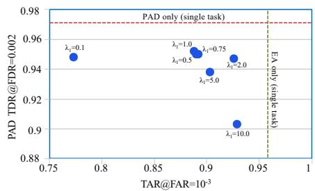  
(a) 1 query 1 gallery

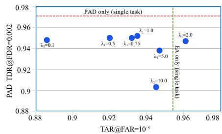  
(b) 1 query 2 gallery

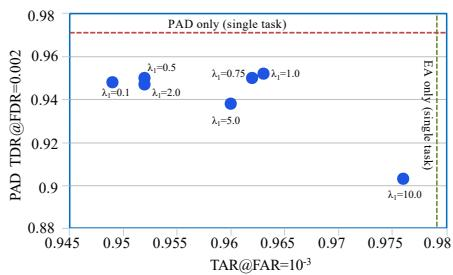  
(c) 1 query 5 gallery   
Figure A1. PAD performance (TDR@FDR=0.002) v/s User-to-user verification performance $\mathrm { ( T A R \ @ F A R = 1 0 ^ { - 3 } } )$ ) obtained by the EyePAD student network, for different values of $\lambda _ { 1 }$ .

Table A3. Hyperparameter information for EyePAD and Eye-$\mathrm { P A D + + }$ .   

<table><tr><td>Backbone</td><td>Dataset</td><td>λ1</td><td>λ2</td><td>Optimizer</td><td>LR</td><td>γ</td><td>Decay after</td></tr><tr><td>Densenet121</td><td>Original</td><td>2.0</td><td>0.75</td><td>Adam</td><td>10-4</td><td>0.5</td><td>12</td></tr><tr><td>Densenet121</td><td>Blurred</td><td>1.0</td><td>2.0</td><td>Adam</td><td>10-4</td><td>0.5</td><td>12</td></tr><tr><td>Densenet121</td><td>Noisy</td><td>1.0</td><td>2.0</td><td>Adam</td><td>10-4</td><td>0.5</td><td>12</td></tr><tr><td>HRnet64</td><td>Original</td><td>2.0</td><td>2.0</td><td>Adam</td><td>10-4</td><td>0.5</td><td>12</td></tr><tr><td>HRnet64</td><td>Blurred</td><td>5.0</td><td>2.0</td><td>Adam</td><td>10-4</td><td>0.5</td><td>12</td></tr><tr><td>HRnet64</td><td>Noisy</td><td>2.0</td><td>5.0</td><td>Adam</td><td>10-4</td><td>0.5</td><td>12</td></tr><tr><td>MobilenetV3</td><td>Original</td><td>1.0</td><td>0.75</td><td>SGD</td><td>10-1</td><td>0.1</td><td>15</td></tr><tr><td>MobilenetV3</td><td>Blurred</td><td>1.0</td><td>0.75</td><td>SGD</td><td>10-1</td><td>0.1</td><td>15</td></tr><tr><td>MobilenetV3</td><td>Noisy</td><td>5.0</td><td>2.0</td><td>SGD</td><td>10-1</td><td>0.1</td><td>15</td></tr></table>

Table A4. Hyperparameter information for MTMT [26].   

<table><tr><td>Backbone</td><td>Dataset</td><td>λauth</td><td>λpad</td><td>Optimizer</td><td>LR</td><td>γ</td><td>Decay after</td></tr><tr><td>Densenet121</td><td>Original</td><td>1.0</td><td>1.0</td><td>Adam</td><td>10-4</td><td>0.5</td><td>12</td></tr><tr><td>Densenet121</td><td>Blurred</td><td>0.75</td><td>0.75</td><td>Adam</td><td>10-4</td><td>0.5</td><td>12</td></tr><tr><td>Densenet121</td><td>Noisy</td><td>0.5</td><td>0.75</td><td>Adam</td><td>10-4</td><td>0.5</td><td>12</td></tr><tr><td>HRnet64</td><td>Original</td><td>1.0</td><td>1.0</td><td>Adam</td><td>10-4</td><td>0.5</td><td>12</td></tr><tr><td>HRnet64</td><td>Blurred</td><td>0.75</td><td>0.75</td><td>Adam</td><td>10-4</td><td>0.5</td><td>12</td></tr><tr><td>HRnet64</td><td>Noisy</td><td>2.0</td><td>2.0</td><td>Adam</td><td>10-4</td><td>0.5</td><td>12</td></tr><tr><td>MobilenetV3</td><td>Original</td><td>1.0</td><td>2.0</td><td>SGD</td><td>10-1</td><td>0.1</td><td>15</td></tr><tr><td>MobilenetV3</td><td>Blurred</td><td>1.0</td><td>1.0</td><td>SGD</td><td>10-1</td><td>0.1</td><td>15</td></tr><tr><td>MobilenetV3</td><td>Noisy</td><td>0.1</td><td>0.1</td><td>SGD</td><td>10-1</td><td>0.1</td><td>15</td></tr></table>

mance and PAD performance. We perform experiments with $\lambda _ { 1 } = [ 0 . 1 , 0 . 5 , 0 . 7 5 , 1 . 0 , 2 . 0 , 5 . 0 , 1 0 . 0 ]$ and present the corresponding results in Fig. A1. We find that in general, when $\lambda _ { 1 }$ increases, the user to user verification performance improves and the PAD performance gets degraded. This is expected because a higher value for $\lambda _ { 1 }$ enforces $M _ { s }$ to preserve authentication and restrics it from learning PADspecific features. However, we do not find any such trend with respect to parameter $\lambda _ { 2 }$ .

# A5. Training details for baselines

For training the MTL baseline for user-to-user or eye-to-eye verification with PAD, we use the same parameter values mentioned in Table A3, except for $\lambda _ { 1 } , \lambda _ { 2 }$ . The hyperparameters used for training MTMT [26] are provided in Table A4. While training MTMT [26] for eye-to-eye verification

with PAD (using Densenet121 and the original dataset), we use $\lambda _ { a u t h } = 1 . 0$ and $\lambda _ { p a d } = 1 . 0$ . The rest of the hyperparameters are same as those mentioned in the first row of Table A4.